# 概要設計: 配車アプリ（ride-hailing-app-demo）

状態: 回答反映済み（再実行） · 更新: 2026-11-04 · 第 3 段階（全 4 段階）

## 再実行（2026-11-04: 品質チェーンの再実行、第 2 段階の 3 回目・4 回目の再実行、この段への指摘 18 件）

この段の初めての再実行。きっかけは三つある。

1. 品質チェーンの再実行（2026-11-03、コミット `896be5c`）。設計の連鎖が返した課題への利用者の回答（`docs/quality-chain-answers.md`）を反映した。この段に関わるのは、招待制（FR-01 版 3、FR-48 版 2）、押さえの結果が分からないとき（FR-05 版 3、FR-12 版 4）、T_request_max でのシステムの取り消し（FR-08 版 2）、位置の受信の記録（FR-17 版 2）、確認コードを両方向の確かめに使う（FR-26 版 2）、失敗と分かった後のやり直しは新しいキー（FR-30 版 4、FR-50 版 4）、位置は場所で行う四つの操作だけ（FR-39 版 3）、CI が通った時刻とデモの回の開け閉め（FR-41 版 3・4）、記録した位置で示す苦情の調べ（FR-45 版 2）、NFR-25 版 3、SLI-03 版 2、SLI-05 版 2、NFR-07 版 3。この段の品質チェーンへの課題 1〜3 とレビューの課題 1 にも答えが出た。
2. 第 2 段階の 3 回目の再実行（FND-19〜26・28・29・44・49 の受け入れ。運用のジョブ、経路ごとの上限 T_route_long、期間の終わりを毎日の処理が決める、URL の公開）と 4 回目の再実行（招待制で DEC-21 の流れの優先と地図の取り置きを外した、DEC-30 で確認コードを両方向の確かめに使う、DEC-04 の T_request_max）。第 1 段階は FND-27 を受け入れ、PC-06 を足した。
3. この段への指摘 FND-30〜43・45〜48（`reviews/2026-11-03-high-level-design.md`。中 7 件、軽微 11 件）。18 件すべてを受け入れた。

| 変わった項目 | 何が変わったか | きっかけ |
|---|---|---|
| IFC-01、IFC-06、IFC-23、IFC-28、DAT-01、DAT-02、DAT-18、DEC-43、DEC-55 | 乗客の登録（`POST /api/v1/auth/signup`）を外した。設定の符号の入口を `POST /api/v1/auth/setup` にして乗客とドライバーで使う。管理の API に乗客のアカウントの作成と符号の出し直しを足し、符号は設定の後も出し直せる（409 SETUP_ALREADY_DONE を外した。パスワードの再設定を兼ね、ほかのセッションを終える）。`GET /api/v1/config` は地図のブラウザの鍵をログインしたセッションにだけ返す。アカウントの作成の回数の制限を外し、設定の符号の IP ごとの制限を足し、ログインはアカウントと IP の組で止める | FR-01 版 3、FR-48 版 2、第 2 段階の DEC-20 版 4・DEC-21 版 5、FND-44（第 2 段階） |
| IFC-02、IFC-13、DAT-06、DAT-13、DEC-48、DEC-52、状態遷移図 | 手配の押さえの結果を三つに分けた（定まった断り、Stripe が実行しなかったか届かなかったもの、分からないもの）。429 と届かなかったときは 503 PAYMENTS_UNAVAILABLE で、キーの最初の結果にしない。分からないときは T_hold_wait まで確かめ、間に合わなければ手配をやめて押さえは確かめを続ける（取り消しの応答は 202 HOLD_RELEASE_PENDING）。5xx の後は起きていないと確かめてから新しいキーで試す | FR-05 版 3、FND-30・31・38 |
| IFC-02、IFC-03、DAT-07、DAT-08、DEC-39、DEC-52 | 保留の降車場所の変更を取り消せる（`POST …/destination-changes/{destinationChangeId}/cancel`。dch_）。保留の間に乗車が終わったら変更を取りやめ、古い押さえと変更の前の料金で確定する。変更の前後の降車場所を位置の参照で持つ | FR-12 版 4、FND-33・46 |
| IFC-02、IFC-03、IFC-08、DAT-06、DAT-07、DEC-45、DEC-51 | 手配から T_request_max を過ぎた許諾のない依頼を、見回り（サービスが消えた後は毎日の処理）がシステムの取り消しとして終え、押さえを解放し、配信で知らせる | FR-08 版 2、第 2 段階の DEC-04 版 3・DEC-37 版 4 |
| 支払いの状態、IFC-02、IFC-06、IFC-08 | 支払いの状態に release_checking と unpaid_checking を足して 13 値にした。返金に失敗した後は新しい返金の要求。確かめ中の返金があるあいだは 409 REFUND_IN_PROGRESS | FND-32・34、FR-30 版 4、FR-50 版 4 |
| IFC-03、IFC-24、IFC-08、DEC-51 | 運転の開始は担当のドライバーのアカウントだけ。乗客の画面の乗車中はサーバーの記録した運転の開始からだけ示し、乗る前の案内を出す | FR-26 版 2、第 2 段階の DEC-30 版 2 |
| IFC-24、IFC-25、IFC-26、IFC-27、PassengerRide | 不在で終えたときの請求、キャンセル料と不在の料金の請求の失敗、請求した額（charge）を乗客の画面に示す。確かめ中と未払いからも評価の画面に行ける。画面の点灯の解放と経路がないときを描いた | FND-45・47 |
| IFC-08、stream.asyncapi.yaml | 流れの優先を持たない。仕様書を IFC-08 とそろえた（見出し、401 と 429、ride.live の頻度、stream.closing の理由） | 第 2 段階の DEC-21 版 5、FND-40 |
| IFC-09、app-logs.asyncapi.yaml、DEC-44 | auth.* と stream.* を足し、account_kind を participant、staff、test にし、必須の欄と「書かない」を DEC-44 とそろえた | FND-41 |
| IFC-10、IFC-11、IFC-12、IFC-19、IFC-21、DAT-24、DAT-26、DEC-53 | 運用のコマンドを運用のジョブで動かし、手順はデータベースの資格情報を持たない。期間の終わりは毎日の処理が決める。配備の記録の持ち主を ELM-05 にし、CI が通った時刻とデモの回の開け閉めを足した。end-system で Stripe のサンドボックスを消す | 第 2 段階の DEC-27・34・36・37（3 回目と 4 回目）、FR-41 版 3・4 |
| IFC-19、DEC-54 | 一つ目の規則の条件を 5xx（急ぐ）と 429（5 分で 30 件、急がない）に分けた | FND-37 |
| DEC-50、IFC-02、IFC-03 | 乗車の終了と降車場所の変更の確定は、サーバーが T_route_long（20 秒）、ブラウザが 25 秒 | 第 2 段階の DEC-33 版 3 |
| DAT-07〜09、IFC-06、IFC-28 | 位置は場所で行う四つの操作だけで、得られなければ印。苦情の調べは記録した位置（履歴の四つの操作と、T_log_retention の間の受信の記録）で示す | FR-17 版 2、FR-39 版 3、FR-45 版 2 |
| 測定点、DAT-21・25 | SLI-03 は毎日の処理が記録から確かめ直す（デモの回の開け閉めは配備の記録から）。SLI-05 と NFR-25 の数え方を品質チェーンの版にそろえ、NFR-24 の経路の表を足した | SLI-03 版 2、SLI-05 版 2、NFR-25 版 3、FND-35 |
| DEC-38、DEC-47、仕様書 9 件 | エラーの拡張の欄と 202 の本文、ログインのない操作の 403、単数の資源、ID と時刻の形、一覧の形、クッキー、X-App-Version、仮の値の印、x-functions を、仕様書と共通の約束事でそろえた | FND-42・43 |
| データの表、DEC-53 | ELM-05 が持ち主のモジュールを通して書く実体と操作を一覧にした | FND-39 |
| トレースの表、IFC の functions | IFC の functions からトレースの表の IFC の列を作り直した。FR-15 を IFC-02・03 に足した | FND-48 |
| DEC-38〜55 | 案の名前と選んだ案の書き方をそろえた（選んだ案の文を一つ目の案の名前に、退けた案の名前を案の名前に。意味は変わらない） | この段の確かめ |

質問 6 の回答で、保留の降車場所の変更は乗車の終了で取りやめる形（FND-33 の二つ目の案）を確認した。質問 7（前提 4 件）は何も選ばれず、推定のまま。

インタフェースは 29 件、データの実体は 29 件、決定は DEC-38〜55 の 18 件で、どれも数は変わらない。全体の形（一つのサーバー、SSE、Turso、運用のジョブ）も変えていない。

後の段への影響: 第 4 段階（`high-level-design-to-detailed-design`）はまだ動いていない。第 4 段階は、ELM-04 の認証のモジュール（設定の符号）、配車のモジュール（T_request_max、hold_checking、保留の変更）、お金のモジュール（キーの表と試みの番号、支払いの状態の 13 値）、ELM-05 の運用のコマンドと期間の終わり、ELM-01 の手配と迎車の画面を、この版の IFC と DAT から設計する。

## 要約

インタフェースは 29 件ある。内訳は HTTP 15 件（自分のもの 7、外部 8）、イベント 4 件（自分のもの 2、外部 2）、バッチ 3 件、画面 7 件。仕様書は OpenAPI 7 件と AsyncAPI 2 件（`ifc/specs/`）。端から端の流れは、CUJ ごとに 17 件、主な設計を動かす要求ごとに 8 件の図で描いた。データの実体は 29 件で、どれも持ち主は一つ。共通の約束事は 13 件の決定（DEC-38〜50）にした。エラーは RFC 9457 の形に変わらない符号とトレース ID を足し、状態を変える要求にはすべて冪等キーを付け、URL に個人情報を入れない。ほかに、配信の出どころ（DEC-51）、押さえの結果が分からないとき（DEC-52）、毎日の処理の結果と運用のコマンド（DEC-53）、知らせと一つ目の規則（DEC-54）、回数の制限（DEC-55）を決めた。アカウントは運営・サポート担当が参加者にだけ作り（招待制）、乗客もドライバーも設定の符号でパスワードを決める。

時刻のしきい値を持つ目標はどれも、ふつうの流れが収まる。NFR-02（5 秒）は直列の区間の予算の和が 3.45〜3.65 秒になる。ただし携帯の回線の区間の値は入力になく仮の値なので、最初のデモの前に実機 2 台で SLI-02 を測ることを関門にする（DEC-51）。NFR-25（10 秒）は最悪 9.2 秒で、余りは 0.8 秒しかない（10 秒の内に結果のない乗車も超えたと数える）。NFR-24（3 秒）は最悪 2.85 秒（場所の候補の位置は 2.15 秒）、NFR-06（8:30）は 07:35 ごろ、NFR-33（5 分）は最悪 102 秒。経路の上限は、乗車の終了と降車場所の変更の確定だけ T_route_long（20 秒）で、要求の中の最悪（15.05 秒と 13.05 秒）より長い。一方で、この規模（PC-05）では、NFR-01 と NFR-02 の許容される失敗の件数は 28 日で 1 件ほどかそれ未満、NFR-03 でも一回の回で 9〜11 回しかない。そのため失敗したときの流れは、エラーバジェットに収めるのではなく 1 件ずつ振り返る（EBP-01 の最後の規則）。

再実行（2026-11-04）で、この段への指摘 18 件（中 7 件）をすべて受け入れ、品質チェーンの再実行と第 2 段階の 3 回目・4 回目の再実行に追随した。第 2 段階と第 1 段階への未解決の指摘はなく、この段から出した指摘もない。品質チェーンへの課題はすべて決着した。要合意の項目は、設計上の値（タイムアウト、回数の制限、セッションの長さ、T_hold_wait、T_op_stale、一つ目の規則の条件）、押さえの結果が分からないときの扱い（DEC-52）、SLI-02 の実機の関門（DEC-51）。

## 入力

| 出どころ | 得たもの |
|---|---|
| `docs/design/2-architecture.md`、`elm/`、`dec/` | 要素 23 件（コンポーネント 7）、決定 37 件、5 つのビュー、通し確認。とくに DEC-03（SSE）、DEC-08（トランザクション）、DEC-09（条件付きの書き込み）、DEC-12（お金の操作のキーの表と確かめ中）、DEC-15（座標の表）、DEC-16（URL の決まり）、DEC-17・35（知らせとアラート）、DEC-20（認証）、DEC-21（上限）、DEC-22（地図）、DEC-33（T_route、T_db）、DEC-37（閉じる前と終える前の確かめ）。第 2 段階が「第 3 段階で決める」とした点（確かめ中にするまでの時間、一つ目の規則の条件の形、操作キーの保持、トレース ID の見出しの形、URL の決まりの共通の約束事、毎日の処理の処理ごとの上限） |
| `docs/design/drv/`、`design-context.yaml`、`1-architecture-drivers.md` | 設計を動かす要求 32 件（主なもの 16 件）、技術制約 TC-01〜14、PC-01〜05（規模）、TEAM-01。今の構造はない（すべて新設） |
| `docs/design/fnd/` | この段への未解決の指摘はない。第 2 段階への未解決の指摘 FND-19〜26（中 3 件）と第 1 段階への FND-27（`reviews/2026-11-03-architecture-2.md`）。レビューの質問 1・2 の答え（デモの URL を発表、ブログ、動画で示し、デモの回の最中や前にも示す） |
| `docs/quality/fr/` | FR 54 件（廃止の FR-35 を除く）の受け入れ基準 200 件。トレースの対象 |
| `docs/quality/sli/`、`nfr/`、`ebp/EBP-01` | SLI-01〜05 の測定点と数え方。時刻のしきい値を持つ NFR-02・03（SLO）と NFR-24・25・06・33（監視と確かめ）。監視の NFR の出どころ。EBP-01 の最後の規則 |
| `docs/quality/qr/`、`context.yaml` | データの品質（QR-27〜37、49）とセキュリティ（QR-20〜22、38〜41、47）の中身。CUJ とその手順、利用者 |
| Cloud Run と Cloud Monitoring の文書（Context7 と docs.cloud.google.com、2026-11-03） | 入口の要求のログに結ぶにはコンテナのログの `logging.googleapis.com/trace` に `X-Cloud-Trace-Context` の値を書く。`traceparent` は Cloud Run の要求に入る（ブラウザが送った値を入口のログが使うことは書かれていない）。`run.googleapis.com/request_count` のラベルは `response_code`、`response_code_class`、`route`（いつも空）で、入口とアプリの応答を分けられない。`container/instance_count` は `state`、`job/completed_execution_count` は `result`。どれも 60 秒ごとに取られ、最大 120 秒遅れて見える |
| Stripe の文書（Context7、2026-11-03） | サンドボックスの上限は 1 秒に 25 件、Search は 20 件。Search は書いた直後の読み出しに使わない（ふだん 1 分、障害では 1 時間遅れる）。書いた直後は一覧を使う。429 で上限の見出しがないものはロックの待ち |
| Google の文書（2026-11-03） | Routes API の computeRoutes（POST `routes.googleapis.com/directions/v2:computeRoutes`、`X-Goog-FieldMask`、`TRAFFIC_AWARE`、distanceMeters と duration と polyline）。内容をためておく制限の今の規約は確かめられなかった（第 2 段階から持ち越し） |
| 公開のサフィックスの一覧（publicsuffix.org、2026-11-03） | `*.run.app` が載る。サービスのホスト名がそのまま一つのサイトになる |
| リポジトリ | 製品のコードと基盤の定義はない。すべて新設 |
| 品質チェーンの再実行（2026-11-03、コミット `896be5c`）と `docs/quality-chain-answers.md`（再実行のきっかけ） | FR-01 版 3、FR-05 版 3、FR-08 版 2、FR-12 版 4、FR-17 版 2、FR-26 版 2、FR-30 版 4、FR-39 版 3、FR-41 版 4、FR-45 版 2、FR-48 版 2、FR-50 版 4、QR-09 版 5、QR-20 版 2、QR-49 版 3、NFR-07 版 3、NFR-25 版 3、SLI-03 版 2、SLI-05 版 2。受け入れ基準は 54 件の FR で数え直した。回答のうちこの段の扱うもの（設計 3-1 は招待制で消えた、設計 3-2 の返金のキー、設計 3-3 は FR-05・12 に入った、レビュー 3-1 の NFR-25） |
| 第 2 段階の 3 回目・4 回目の再実行（2026-11-03） | DEC-04・09〜13・15・16・20〜22・27・29〜31・33〜37 と ELM-01・03〜06。とくに運用のジョブ（DEC-34・27）、T_route_long（DEC-33）、期間の終わりを毎日の処理が決める（DEC-37）、招待制で流れの優先と地図の取り置きを外した（DEC-21 版 5、DEC-22 版 3）、確認コードを両方向の確かめに使う（DEC-30 版 2）、T_request_max（DEC-04 版 3） |
| 第 1 段階の 3 回目の再実行（2026-11-03） | PC-06（URL の公開と招待制）、FND-27 の受け入れ、DRV 19 件の版上げ |
| この段への指摘（`reviews/2026-11-03-high-level-design.md`） | FND-30〜43・45〜48（中 7 件、軽微 11 件）。再実行のきっかけ |
| Stripe の文書（冪等キー。再実行で確かめた） | 実行を始めなかった要求（429、同時の要求の衝突）には冪等の結果を保たず、同じキーで送り直せる。5xx は保たれる（第 2 段階の DEC-12 の (d) と同じ） |

## 第 2 段階の指摘との関係

前の版（2026-11-03）は、第 2 段階に未解決の指摘が 8 件（FND-19〜26）と第 1 段階に 1 件（FND-27）残るまま進め、変わりうる項目を挙げていた。第 2 段階は 3 回目の再実行で FND-19〜26 を、第 1 段階は 3 回目の再実行で FND-27 を受け入れた。この再実行で、前の版が挙げた変わりうる項目（IFC-02、03、08、10、11、13、17、19、DAT-21、26、DEC-48、55、SLI-03 の測定点）に追随した。

| 指摘 | 決着 | この段で直したこと |
|---|---|---|
| FND-19 配備の仕組みの Turso のトークン | 第 2 段階が受け入れた（運用のジョブ。DEC-34・27） | IFC-10・11・21、DAT-26（持ち主を ELM-05 に）、DEC-53 |
| FND-20 Turso に届かないときの知らせ | 受け入れた（DEC-35・17・16） | 前の版の DEC-54 の形のまま。SLI-03 の確かめ直し（測定点、DAT-25） |
| FND-21 T_route と降車の確定 | 受け入れた（T_route_long 20 秒。DEC-33） | DEC-50、IFC-02（降車場所の変更の確定）、IFC-03（乗車の終了） |
| FND-22 期間を終える手順 | 受け入れた（毎日の処理が期間の終わりを決める。DEC-37） | IFC-10・11、DAT-24・26、デモの期間と回の状態遷移図 |
| FND-23 URL の公開と DEC-21 | 受け入れた後、4 回目の再実行で招待制により優先と取り置きを外した（DEC-21 版 5） | IFC-08（優先を持たない）、DEC-55 |
| FND-24 裏の時刻が遅れて届く | 受け入れた（除き直す。DEC-35・16） | 測定点（SLI-03）、DAT-21 |
| FND-25 DEC-15 の読める相手 | 受け入れた | 前の版の DAT-21 の形のまま |
| FND-26 Stripe に残る参加者の記録 | 受け入れた（DEC-10・36） | IFC-12（end-system でサンドボックスを消す）、IFC-14 |
| FND-27 URL の公開と PC-05 | 第 1 段階が受け入れた（PC-06。招待制なので PC-05 は使う人の数の上限のまま） | DEC-55 の値は変えない |

## 共通の約束事

| 約束事 | 決めたこと | DEC |
|---|---|---|
| エラー | 形: {type, title, status, code, detail?, traceId, errors?, retryAfterSeconds?} と場合ごとの拡張の欄（distanceMeters、remainingAttempts、currentFee、remainingRefundable。任意）。title と detail は日本語で個人情報を含めない。code は UPPER_SNAKE_CASE。429 と 503 には Retry-After の見出しも付ける。202 の本文は {code, …資源} で、code に保留の符号（HOLD_PENDING、HOLD_RELEASE_PENDING、DESTINATION_CHANGE_PENDING、PAYMENT_PENDING、REFUND_PENDING）。符号の一覧は packages/contracts に置き、画面はそこの文を示す（DEC-46） | DEC-38 |
| ID | サーバーが作る: 依頼 ride_、アカウント acc_、ドライバー drv_、見積もり est_、状態の変化 chg_、お金の操作 mop_、返金の要求 rfr_、苦情 cmp_、降車場所の変更 dch_、位置の記録 pos_ の後に ULID（26 文字）。ブラウザが作る: Idempotency-Key（UUIDv4）、トレース ID（W3C の 32 桁の 16 進）、clientEventId、clientErrorId、位置の送信の clientSendId（UUIDv4）。配信のカーソルは状態の履歴とドライバーの受付の記録の通し番号から作る不透明な文字 | DEC-39 |
| 時刻 | 送る: 2026-11-03T05:00:00.000Z。持つ: UTC（形は第 4 段階）。業務の日付: Asia/Tokyo の 0 時で区切る。ブラウザの時刻の欄には、サーバーが受けた時刻（received_at）を並べて持つ | DEC-40 |
| お金 | {amount: 1234, currency: "jpy"}。画面から送られた額は使わない（取り消しの expectedFee は確かめのためだけで、違えば 409） | DEC-41 |
| 一覧と並べ方 | ?cursor=&limit= で受け、{items, nextCursor} を返す。状態や種類のような列挙の絞り込みは問い合わせの文字に置いてよい。依頼の一覧（ドライバー）は条件で絞った全部を返す（数件） | DEC-42 |
| ログインのセッション | クッキーの名前は __Host-rh_session（HttpOnly、Secure、SameSite=Strict、Path=/）。最初の運営・エンジニアのアカウントは、役割のアカウントが一つもないときだけ、Secret Manager の一度だけの秘密で作る（IFC-01 staff-bootstrap）。乗客とドライバーのアカウントは運営・サポート担当が作り（招待制）、本人が一度だけ使える設定の符号でパスワードを決める（管理者はパスワードを知らない）。符号は設定の後も出し直せ、決め直すとほかのセッションを終える（パスワードの再設定を兼ねる） | DEC-43 |
| ログとトレース | どの行にも: timestamp、severity、message、logging.googleapis.com/trace、logging.googleapis.com/spanId、client_trace_id、event、schema_version、service（server か batch）、app_version。要求の行（request.completed）に: route_id、method、status、elapsed_ms、account_id、account_kind（participant、staff、test。SLI-01 は participant だけを数える）、ride_id。書かない: 座標、連絡先、名前、場所の検索の語、自由記述（苦情、報告）、カードの情報、クッキー、トークン、秘密、Webhook の URL、要求と応答の本文、IP アドレス（入口のログには残る）。重さ: DEBUG、INFO、WARNING、ERROR（知らせの対象は ERROR） | DEC-44 |
| 設定と秘密 | 秘密: STRIPE_SECRET_KEY（制限付き）、TURSO_AUTH_TOKEN、MAPS_SERVER_KEY、CHAT_WEBHOOK_URL、STAFF_BOOTSTRAP_SECRET。設定: TURSO_DATABASE_URL、MAPS_BROWSER_KEY（GET /api/v1/config はログインしたセッションの要求にだけ返す）、STRIPE_PUBLISHABLE_KEY、APP_VERSION、GCP_PROJECT_ID、しきい値（D_pickup_accuracy、D_arrival、D_dropoff、D_nearby_drivers、T_match_wait、T_request_max、T_noshow_wait、T_cancel_grace、V_moving、N_rating_levels、N_min_ratings）と設計上の値（T_hold_wait、T_op_stale など）。値のない未定の値は起動を止める（未定のまま本番に出さない） | DEC-45 |
| 言語と表示 | 額は「1,234 円」、距離は m と km、時刻は HH:mm（日本時間）、到着予定は分の単位。アクセシビリティの名前も日本語（DRV-24） | DEC-46 |
| 命名 | 経路のまとまり: /api/v1/auth、/api/v1/passenger、/api/v1/driver、/api/v1/admin、/api/v1/engineer、/api/v1/locations、/api/v1/visibility-events、/api/v1/records、/api/v1/stream と、役割のない /api/v1/config。資源は複数形で、一人に一つの資源は単数形（/passenger/threshold、/driver/conditions、/driver/earnings、/auth/session）。route_id は passenger.rides.create のような . つなぎ。操作は資源の下の動詞（/rides/{rideId}/cancel）を POST で | DEC-47 |
| 冪等キーと送り直し | 同じキーで同じ中身: 最初の結果（状態の符号と本文）を返す。動いている間: 409 OPERATION_IN_PROGRESS と Retry-After: 1。結果が分からない（202 の HOLD_PENDING など）: pending として 202 を返し、確定したら最初の結果を確定したものに替える。同じキーで違う中身: 422 IDEMPOTENCY_KEY_REUSED。一つ目のトランザクションを書けなかったとき（Turso に届かない）と、手配の押さえで Stripe が実行しなかったか届かなかったときの 503 PAYMENTS_UNAVAILABLE は何も残さず、同じキーで送り直すと初めからやり直す。キーを持たないのは、位置（clientSendId）、前面と裏、画面の記録（それぞれの ID で重複を捨てる）、ログイン、パスキーの options と authenticate、ログアウト（繰り返してもセッションを作るか終えるだけ）、見積もり（二度目は新しい短い見積もりを作るだけ）。PUT、PATCH、DELETE はキーを求める。設定の符号を示す操作の最初の結果には符号を保たず、同じキーの送り直しは setupCode を null にして返す。サーバーはブラウザの要求を送り直さない。サーバーから Stripe への送り直しは DEC-12 のとおり一か所 | DEC-48 |
| 版の扱い | 配信のメッセージと毎日の処理の出力は v か schema_version を持つ。ログは schema_version。画面は応答の X-App-Version と配信の hello の appVersion が自分と違い、操作の途中でないとき（手配の確定や乗車の終了を待っていないとき）に読み直し、GET で今の状態を取り直す | DEC-49 |
| タイムアウト | 一覧: ブラウザ 15 秒（SSE を除く。乗車の終了と降車場所の変更の確定は 25 秒）→ サーバー T_route 10 秒（その二つは T_route_long 20 秒。第 2 段階の DEC-33）→ 中の Turso 1 回 2 秒（DEC-33）、地図 1 回 2 秒（DEC-22）、Stripe 1 回 2.5 秒（DEC-12）、チャット 1 回 5 秒。乗車の終了は要求の中で最悪 9.35 秒（Turso が遅いと 15.05 秒）、降車場所の変更の確定は 5.45 秒（13.05 秒）。経路の上限で 503 を返しても処理は続き、結果は冪等キーと配信で受ける | DEC-50 |

## 設計の決定

| DEC | 問い | 選んだ案 | 退けた案 | 根拠 |
|---|---|---|---|---|
| DEC-38 | すべてのインタフェースで、エラーをどの形で返すか | RFC 9457 の問題の詳細に code、traceId、errors と場合ごとの拡張の欄を足す。202 の本文に保留の符号を入れる | 独自の {code, message, traceId, details}（中身は同じで、標準でない分だけ道具の助けを失う）。HTTP の状態の符号と文だけ（画面が場合を見分けられず、送り直してはいけないものを送り直す） | 推定 |
| DEC-39 | 公開する ID をどの形にし、誰が作るか | 種類の接頭辞と ULID（サーバーが作る。降車場所の変更 dch_ と位置の記録 pos_ を足した）。ブラウザが作るキーは UUIDv4 と W3C のトレース ID | UUIDv7 だけ（推測できなさは同じで、種類が読めない分だけ調べにくい）。データベースの連番（推測でき、件数が漏れる） | 推定 |
| DEC-40 | 時刻をどう送り、どう持ち、業務の日付をどこで区切るか | インタフェースは UTC の RFC 3339（ミリ秒、Z）。業務の日付は Asia/Tokyo。期限の判定はサーバーの時計 | エポックからのミリ秒の数（ログと画面で読めない）。日本時間の文字（時差を持つ機械と道具で誤る） | 推定 |
| DEC-41 | 額をどう表し、誰が決めるか | 円の整数と通貨の符号。額はサーバーだけが決める | 小数の文字（市場が一つで要らない（第 2 段階の可変性））。浮動小数（誤差が出る） | 推定 |
| DEC-42 | 一覧をどう区切って返し、どう並べるか | 不透明なカーソルと limit。新しい順 | ページの番号と offset（追記でずれる）。全部を返す（上限がない） | 推定 |
| DEC-43 | ログインの状態をどう持ち、どれだけ保ち、どう切るか | サーバーに置くセッションと __Host- のクッキー。状態を変える要求は Origin を確かめる。乗客もドライバーも、運営・サポート担当が作ったアカウントに設定の符号でパスワードを決め、符号の出し直しはパスワードの再設定を兼ねてほかのセッションを終える | ブラウザに持たせる署名付きのトークン（ログアウトと停止ですぐ切れない）。SameSite=Lax のクッキー（広げる理由がない） | 推定 |
| DEC-44 | 一つの操作の記録をどうつなぎ、ログに何を書き、何を書かないか | ブラウザが traceparent と X-Client-Trace-Id を送り、サーバーは Cloud Run が渡す X-Cloud-Trace-Context を logging.googleapis.com/trace と spanId に、ブラウザの ID を client_trace_id に書く。account_kind は participant、staff、test | traceparent だけに頼る（確かめられない前提に頼る）。独自の見出しだけ（入口のログと結べない） | 推定 |
| DEC-45 | 環境ごとの設定と秘密をどこに置き、画面にどう渡すか | 環境変数（手元とデモの回）。秘密は Secret Manager から環境変数へ。画面の設定は GET /api/v1/config（地図のブラウザの鍵はログインしたセッションにだけ）。しきい値に T_request_max | 設定をイメージに焼く（同じイメージを配る決まり（DEC-27）に反する）。秘密を GitHub の秘密に置く（DEC-34 に反する） | 推定 |
| DEC-46 | 人向けの文をどこに置き、日付や額をどう表すか | 日本語だけ。画面の文言は web-shared の文言のモジュール、誤りの文は contracts の符号の一覧。表示は ja-JP と Asia/Tokyo | 多言語の仕組みを入れる（要らない）。画面が符号から文を作る（誤りの文が二か所になる） | 推定 |
| DEC-47 | 経路、欄、出来事、符号の名前をどう付けるか | 経路は /api/v1/<役割>/ の後に小文字のハイフンつなぎの複数形（一人に一つの資源は単数形、設定は /api/v1/config）。JSON の欄は camelCase、列挙は小文字の _ つなぎ、誤りの符号は UPPER_SNAKE、出来事は小文字の . つなぎ、ログの欄は snake_case | すべて snake_case（型と合わない）。すべて camelCase（ログの問い合わせと SLI の欄名と合わない） | 推定 |
| DEC-48 | どの要求を冪等にし、誰がどこで送り直すか | 状態を変える要求すべてに Idempotency-Key（位置、前面と裏、記録はそれぞれの ID で重複を捨て、ログイン、パスキー、ログアウト、見積もりは繰り返しても害がないのでキーを求めない）。最初の結果を 7 日保つ（設定の符号は保たない）。手配の押さえの 503 PAYMENTS_UNAVAILABLE は最初の結果にしない。送り直すのはブラウザの API の呼び出しのモジュールだけ | 手配と返金だけに鍵（お金を動かすほかの操作（取り消し、不在、乗車の終了、降車場所の変更、未払いの支払い）が守られない）。状態の条件だけで拒む（最初の結果を返せない） | 推定 |
| DEC-49 | インタフェースを、使う側を壊さずにどう変えるか | 経路に v1。足すだけで、知らない欄は両側とも無視する。X-App-Version で古い画面を読み直させる | 見出しで版を選ぶ（入口のログに版が残らない）。版を持たない（戻しで壊れる） | 推定 |
| DEC-50 | 呼び出しごとのタイムアウトをどう決めるか | 呼び出しごとに相手の正常な遅い応答より上、呼ぶ側は待つもの全体（確かめを含む）より上。乗車の終了と降車場所の変更の確定はサーバー 20 秒、ブラウザ 25 秒 | 遅延の予算から決める（正常な呼び出しを切る）。ライブラリの既定のまま（呼ぶ側と呼ばれる側の順が崩れる） | 推定 |
| DEC-51 | SSE で何を送り、それをインスタンスがどこから知るか | 状態の履歴とドライバーの受付の記録を通し番号で追い、相手の位置と到着予定は 1 秒ごとの今の値の読み出しで送る。ドライバーの一覧は変化のたびに丸ごと送る。ride.updated は取り消した者と理由、運転の開始を運ぶ。最初のデモの前に実機で SLI-02 を測る | 位置も追記の表で追う（書く量と追う量が増え、座標の表を位置のモジュールだけが読む決まり（DEC-15）を配信の追いかけに広げる）。一覧は知らせだけ送り、画面が取り直す（NFR-02 の余りが少ない） | 推定 |
| DEC-52 | 手配の押さえか、降車場所の変更の押さえ直しの結果が分からないとき、乗客に何を返し、いつまで確かめ、Stripe が答えないときや乗車が終わったときにどうするか | 結果を三つに分ける。分からないものは 202 で確かめ中にして T_hold_wait（60 秒）まで確かめ、間に合わなければ手配をやめて押さえは確かめを続け、「押さえていない」は Stripe が答えたときだけ示す。5xx の後は起きていないと確かめて新しいキーで試す。保留の降車場所の変更は乗車の終了で取りやめる | 確かめがつくまで待つ（Stripe が止まると終わりがない）。失敗として返す（押さえが残りうるのに「押さえていない」と言う）。429 と届かなかったときもタイムアウトと同じに扱う（Stripe が実行しなかったと答えたのに待たせる） | 推定 |
| DEC-53 | 毎日の処理の結果を誰がどう読み、閉じる前と終える前の数えをどう行うか | 日と処理ごとの記録を DAT-24 に、要約と期間を終えられるかを毎日の結果の知らせに書く。運用のコマンドは運用のジョブが動かし、ELM-06 は終わりの符号を読む。期間の終わりは毎日の処理が決める。ELM-05 は ELM-04 の実体を持ち主のモジュールを通してだけ書く | ELM-06 が SQL で表を直接読む（決まりが二か所になる）。ELM-06 がサーバーの API で数える（期間を終えるときに使えない） | 推定 |
| DEC-54 | エンジニアへの知らせをどの形で送り、Cloud Monitoring の一つ目の規則をどんな条件にするか | 中立の知らせの形。記録を書けなくても先に送る。一つ目の規則は 5xx（5 分で 5 件、急ぐ）、インスタンスの指標（10 分ない、急ぐ）、429（5 分で 30 件、急がない） | 一つ目の規則を入口だけに絞る（指標で分けられない）。記録を書けたときだけ知らせる（Turso の障害で知らせが止まる）。429 を外す（入口が返す 429 を拾えない） | 推定 |
| DEC-55 | 経路ごとの回数の制限をいくつにし、どこで数えるか | 経路ごとの値。ふだんはインスタンスのメモリで数え、ログインの失敗と設定の符号だけ Turso で数える。ログインはアカウントと IP の組で止める | すべて Turso で数える（書く量が増え、Turso の障害で守りも止まる）。制限を置かない（DEC-21 に反する） | 推定 |

## インタフェース

| IFC | 種類 | 名前 | 提供側 | 利用側 | 操作 | FR | 仕様 | 根拠 |
|---|---|---|---|---|---|---|---|---|
| IFC-01 | HTTP | 認証と起動の API | ELM-04 | ELM-01、ELM-02、ELM-03 | 10 件（GET /api/v1/config ほか） | 01、48 | auth.openapi.yaml | 推定 |
| IFC-02 | HTTP | 乗客の API | ELM-04 | ELM-01 | 25 件（POST /api/v1/passenger/places/search ほか） | 02、03、04、05、06、07、08、09、12、13、14、15、16、29、31、43、44、51 | passenger.openapi.yaml | 推定 |
| IFC-03 | HTTP | ドライバーの API | ELM-04 | ELM-02 | 14 件（POST /api/v1/driver/reception/start ほか） | 15、16、17、18、19、20、21、22、23、25、26、27、28、29、31、32、33、34、47 | driver.openapi.yaml | 推定 |
| IFC-04 | HTTP | 位置と前面・裏の API | ELM-04 | ELM-01、ELM-02 | 2 件（POST /api/v1/locations ほか） | 10、11、17、21、24、34、51 | location.openapi.yaml | 推定 |
| IFC-05 | HTTP | 画面の記録の API | ELM-04 | ELM-01、ELM-02、ELM-03 | 3 件（POST /api/v1/records/displays ほか） | 02、13、38、54 | records.openapi.yaml | 推定 |
| IFC-06 | HTTP | 管理の API | ELM-04 | ELM-03 | 16 件（GET /api/v1/admin/complaints ほか） | 45、46、47、48、49、50 | admin.openapi.yaml | 推定 |
| IFC-07 | HTTP | エンジニアの API | ELM-04 | ELM-03 | 3 件（POST /api/v1/engineer/history-search ほか） | 01、39、40 | engineer.openapi.yaml | 推定 |
| IFC-08 | イベント | 状態の変化の配信 | ELM-04 | ELM-01、ELM-02 | hello、ride.updated、ride.live、driver.requests、driver.status、stream.closing | 05、06、07、08、09、10、11、12、16、18、19、20、22、24、25、26、27、28、29、31、47、54 | stream.asyncapi.yaml | 推定 |
| IFC-09 | イベント | アプリの構造化ログ | ELM-04 | ELM-05、USR-03 | request.completed、external.call、money.op、client.error、notification.sent / notification.failed、job.taskほか | 36、37、38 | app-logs.asyncapi.yaml | 推定 |
| IFC-10 | バッチ | 毎日の処理と運用のコマンド | ELM-05 | ELM-06、ELM-04 | daily、migrate、record-deploy、count-open、period-status、check-turso、出力の表 | 08、29、30、36、41、53、55 | なし（相手のもの、または画面とバッチ） | 推定 |
| IFC-11 | バッチ | 配備と開け閉めの手順 | ELM-06 | USR-03 | ci、build、start-period、open-demo、close-demo、rollback、end-period、end-system | 41、42 | なし（相手のもの、または画面とバッチ） | 推定 |
| IFC-12 | バッチ | 手元の保守の手順 | ELM-22 | USR-03 | export、prune、restore、unarchive、destroy | — | なし（相手のもの、または画面とバッチ） | 推定 |
| IFC-13 | HTTP | Stripe のサーバーの API（外部） | ELM-10 | ELM-04、ELM-05 | POST /v1/customers、POST /v1/setup_intents、GET /v1/setup_intents/{id}ほか | 04、05、07、08、12、27、29、30、31、50、55 | なし（相手のもの、または画面とバッチ） | 推定 |
| IFC-14 | HTTP | Stripe の入力部品（外部、ブラウザ） | ELM-10 | ELM-01 | Stripe.js の読み込み（js.stripe.com）、Payment Element の表示、stripe.confirmSetup | 04、31 | なし（相手のもの、または画面とバッチ） | 推定 |
| IFC-15 | HTTP | Google Maps のサーバーの API（外部） | ELM-11 | ELM-04 | POST https://places.googleapis.com/v1/places:autocomplete、GET https://places.googleapis.com/v1/places/{placeId}ほか | 02、03、10、12、19、23 | なし（相手のもの、または画面とバッチ） | 推定 |
| IFC-16 | HTTP | Google Maps の地図の表示（外部、ブラウザ） | ELM-11 | ELM-01、ELM-02、ELM-03 | Maps JavaScript API の読み込み、地図、マーカー、経路の線 | 02、10、11、19、23、24、45 | なし（相手のもの、または画面とバッチ） | 推定 |
| IFC-17 | HTTP | チャットの Webhook（外部） | ELM-12 | ELM-04、ELM-05、ELM-14 | POST <Webhook の URL> | 36、55 | なし（相手のもの、または画面とバッチ） | 推定 |
| IFC-18 | イベント | 端末のブラウザの機能（外部） | ELM-13 | ELM-01、ELM-02 | Geolocation（watchPosition、enableHighAccuracy）、Screen Wake Lock（navigator.wakeLock.request('screen')）、音の再生（Web Audio）ほか | 02、06、17、21、24、52 | なし（相手のもの、または画面とバッチ） | 推定 |
| IFC-19 | イベント | Cloud Monitoring の規則（外部） | ELM-14 | USR-03 | 一つ目の規則（デモの回の間だけ有効）、二つ目の規則（デモの期間だけ有効） | 36 | なし（相手のもの、または画面とバッチ） | 推定 |
| IFC-20 | HTTP | Cloud Logging の読み出し（外部） | ELM-08 | ELM-05 | entries.list（Logging API v2） | 36 | なし（相手のもの、または画面とバッチ） | 推定 |
| IFC-21 | HTTP | Google Cloud の管理の操作（外部） | ELM-19 | ELM-06、ELM-05 | Artifact Registry、Cloud Run の管理の API（ELM-17）、Cloud Scheduler、Cloud Monitoring、Secret Manager、API Keys | 41、42 | なし（相手のもの、または画面とバッチ） | 推定 |
| IFC-22 | HTTP | Turso の管理の操作（外部、CLI） | ELM-18 | ELM-22 | turso db shell <db> .dump、書き出しからのデータベースの作成、時点を指定した復元、turso group unarchive、turso db destroy、turso db tokens create | — | なし（相手のもの、または画面とバッチ） | 推定 |
| IFC-23 | 画面 | 乗客のアカウントと支払い手段の画面 | ELM-01 | USR-01 | ログイン、パスワードの設定、支払い手段、未払いの支払い | 01、04、31 | なし（相手のもの、または画面とバッチ） | 推定 |
| IFC-24 | 画面 | 乗客の手配から降車までの画面 | ELM-01 | USR-01 | 手配、手配の状況、迎車中、不在の結果、乗車中、到着と支払いの結果 | 02、03、05、06、07、08、09、10、11、12、24、26、27、28、29、31、43、51、54 | なし（相手のもの、または画面とバッチ） | 推定 |
| IFC-25 | 画面 | 乗客の評価・設定・履歴・報告の画面 | ELM-01 | USR-01 | 評価、しきい値の設定、乗車の履歴、報告 | 13、14、43、44 | なし（相手のもの、または画面とバッチ） | 推定 |
| IFC-26 | 画面 | ドライバーの受付と依頼の画面 | ELM-02 | USR-02 | ログインと初回の設定、受付、依頼の一覧、依頼の内容 | 01、16、17、18、19、20、21、34、47、52、54 | なし（相手のもの、または画面とバッチ） | 推定 |
| IFC-27 | 画面 | ドライバーの迎車・乗車・受取額・条件の画面 | ELM-02 | USR-02 | 迎車中、乗車中、受取額、受ける条件 | 07、12、22、23、24、25、26、27、28、29、31、32、33、52、54 | なし（相手のもの、または画面とバッチ） | 推定 |
| IFC-28 | 画面 | 管理の画面 | ELM-03 | USR-04 | ログイン、苦情の一覧と詳細、対処の記録、乗客のアカウント、ドライバー、請求と返金 | 01、45、46、47、48、49、50 | なし（相手のもの、または画面とバッチ） | 推定 |
| IFC-29 | 画面 | エンジニアの画面 | ELM-03 | USR-03 | 状態の履歴の検索、依頼の位置、テスト用の印 | 01、40 | なし（相手のもの、または画面とバッチ） | 推定 |

画面の利用側は利用者（USR-01 乗客、USR-02 ドライバー、USR-03 エンジニア、USR-04 運営・サポート担当）。外部のインタフェース（IFC-13〜22）は相手の決まりに従い、adapters の包みが自分の共通の約束事（DEC-38〜50）に置き換える。データの置き場所への自分の読み書き（ELM-04・05 → ELM-07）はインタフェースにせず、第 4 段階が設計する。ELM-05 が ELM-04 の持つ実体を書くときは、同じイメージの持ち主のモジュールを通すので、インタフェースにはならない（一覧は「データ」の「ELM-05 が書くもの」。DEC-53、FND-39）。ほかの要素が持ち主の表を読むのは次の二つだけで、どちらも持ち主のインタフェースの一部にした。ELM-04 は突き合わせの結果（DAT-23。IFC-10）を読むだけ。ELM-06 はデータベースの資格情報を持たず、運用のジョブ（ELM-05）を起こして IFC-10 のコマンドの終わりの符号を読む。配備の記録（DAT-26）は運用のジョブが書き、持ち主は ELM-05（第 2 段階の DEC-27・34。FND-19 の受け入れ）。

SLI-01 の六つの操作と経路（毎日の SLI-01 は入口のログの経路をこの表で route_id に当てる。DEC-35 の 1 分ごとの数も同じ route_id で数える）:

| 操作 | 経路 | route_id |
|---|---|---|
| 手配の確定（FR-05） | POST /api/v1/passenger/rides | passenger.rides.create |
| 依頼の一覧（FR-18） | GET /api/v1/driver/requests | driver.requests.list |
| 許諾（FR-20） | POST /api/v1/driver/requests/{rideId}/accept | driver.requests.accept |
| 迎車の到着（FR-25） | POST /api/v1/driver/rides/{rideId}/arrive | driver.rides.arrive |
| 運転の開始（FR-26） | POST /api/v1/driver/rides/{rideId}/start | driver.rides.start |
| 乗車の終了（FR-28） | POST /api/v1/driver/rides/{rideId}/complete | driver.rides.complete |

依頼の一覧は配信（IFC-08 の driver.requests）でも届く（DEC-51）。SLI-01 が数えるのは GET の要求だけ（流れは長い要求で、成否を数えない。配信の速さは SLI-02 が見る）。

## エラーの決まり

表は IFC の errors から作り直した（作業用の `gen_tables.rb`）。全操作に共通の行は、IFC-02 の「共通」の行に一度だけ載せる（IFC-01〜07 で同じ。ログインなしの経路には認証の行が付かない）。画面のエラーと空の状態は「画面」と各画面の項目（IFC-23〜29）に書いた。

| IFC | 操作 | 場合 | 知らせ方 | 呼ぶ側 |
|---|---|---|---|---|
| IFC-01 | POST /api/v1/auth/login | メールアドレスかパスワードが違う（FR-01 AC5） | 401 INVALID_CREDENTIALS | その旨を示す（どちらが違うかは言わない） |
| IFC-01 | POST /api/v1/auth/login | 同じアカウントと同じ IP の組で続けて失敗したので、その組を一時に止めている（第 2 段階の DEC-20 版 3） | 429 ACCOUNT_LOCKED | 再開の時刻を示して待たせる |
| IFC-01 | POST /api/v1/auth/passkeys/authenticate | パスキーの確かめに失敗した | 401 PASSKEY_FAILED | もう一度確かめる。続くならパスワードからやり直す |
| IFC-01 | POST /api/v1/auth/passkeys/register | 登録の確かめに失敗した | 400 PASSKEY_REGISTRATION_FAILED | もう一度登録する |
| IFC-01 | POST /api/v1/auth/setup | 符号が違う、期限切れ、使用済み、出し直す前のもの（FR-01 AC2） | 400 SETUP_CODE_INVALID | 運営・サポート担当に符号の出し直しを頼むよう示す（IFC-06 の setup-code） |
| IFC-01 | POST /api/v1/auth/staff-bootstrap | 秘密が違う | 401 BOOTSTRAP_SECRET_INVALID | 何もしない |
| IFC-01 | POST /api/v1/auth/staff-bootstrap | 役割のアカウントがもうある | 409 ALREADY_BOOTSTRAPPED | 使わない（ログインする） |
| IFC-02 | POST /api/v1/passenger/places/search | 地図のサービスが答えない、失敗、1 日の割り当てに達した（DEC-22） | 503 MAPS_UNAVAILABLE | 候補を示せないことと、ピンで指定できることを示す。自動では送り直さない |
| IFC-02 | POST /api/v1/passenger/places/resolve | 地図のサービスが答えない | 503 MAPS_UNAVAILABLE | ピンで指定するよう示す |
| IFC-02 | POST /api/v1/passenger/estimates | 乗る場所と降りる場所の間に経路がない（FR-02 AC6） | 422 NO_ROUTE | 料金の確認に進めないことと理由を示す |
| IFC-02 | POST /api/v1/passenger/estimates | 現在地の誤差が D_pickup_accuracy を超え、ピンで確かめていない（FR-02 AC3） | 422 PICKUP_NOT_CONFIRMED | ピンで乗る場所を確かめさせる |
| IFC-02 | POST /api/v1/passenger/estimates | 経路を得られない（FR-03 AC5） | 503 MAPS_UNAVAILABLE | 値を示さず、手配に進めないことと理由を示す |
| IFC-02 | POST /api/v1/passenger/rides | 支払い手段が登録されていない（FR-05 AC2） | 409 PAYMENT_METHOD_REQUIRED | 支払い手段の画面へ |
| IFC-02 | POST /api/v1/passenger/rides | 押さえられない（残高不足、カードの停止など。FR-05 AC3）。依頼は not_booked、押さえの操作は failed で、キーの最初の結果になる（DEC-52） | 402 CARD_DECLINED | 理由と、別の支払い手段を選ぶ手段を示す。新しい冪等キーで送る |
| IFC-02 | POST /api/v1/passenger/rides | 本人の確かめを求められた（DEC-11 の応答を左右する点と同じ扱い）。依頼は not_booked で、キーの最初の結果になる（DEC-52） | 402 CARD_AUTHENTICATION_REQUIRED | 別の支払い手段を選ぶよう示す。新しい冪等キーで送る |
| IFC-02 | POST /api/v1/passenger/rides | 進行中の依頼がある（FR-05 AC5）。数えるのは booking、hold_checking、searching、accepted、arrived、in_progress の依頼で、not_booked、ended、cancelled、no_show は数えない（手配をやめた依頼の押さえを確かめている間も手配できる。DEC-52） | 409 ACTIVE_RIDE_EXISTS | 手配の状況の画面へ |
| IFC-02 | POST /api/v1/passenger/rides | 未払いの乗車がある（FR-05 AC5、FR-31 AC3） | 409 UNPAID_RIDE_EXISTS | 未払いの支払いの画面へ |
| IFC-02 | POST /api/v1/passenger/rides | 見積もりの期限切れか使用済み | 409 ESTIMATE_EXPIRED | 見積もり直す |
| IFC-02 | POST /api/v1/passenger/rides | 押さえの結果が分からない（タイムアウト、送った後の接続の切れ、Stripe の 5xx、T_op_stale）。依頼は hold_checking（ドライバーに示さない）、押さえの操作は checking、キーの最初の結果は pending（DEC-52） | 202 HOLD_PENDING | 「支払いを確かめています」と示し、取り消せるようにする。配信（IFC-08）と GET で待つ。新しい冪等キーで送り直さない（FR-05 AC4） |
| IFC-02 | POST /api/v1/passenger/rides | Stripe が実行しなかったと答えた（429）か、要求が Stripe に届かなかったと分かる（送る前の接続の失敗）。起きていないと扱い、依頼は not_booked、押さえの操作は not_happened。この 503 はキーの最初の結果にしない（DEC-48 の例外、DEC-52） | 503 PAYMENTS_UNAVAILABLE と Retry-After | 押さえていないと示し、Retry-After の後に同じ冪等キーで送れる（初めからやり直す） |
| IFC-02 | GET /api/v1/passenger/rides/{rideId}/cancellation-quote | 乗車が始まっている（FR-07 AC6） | 409 RIDE_ALREADY_STARTED | 降車場所の変更を案内する |
| IFC-02 | GET /api/v1/passenger/rides/{rideId}/cancellation-quote | 終わっている、取り消し済み | 409 RIDE_ALREADY_ENDED | 状態を読み直して示す |
| IFC-02 | POST /api/v1/passenger/rides/{rideId}/cancel | 確かめた額と今の額が違う（その間に許諾、遅れの境目など）。今の額を添える | 409 CANCELLATION_FEE_CHANGED | 新しい額を示して確かめ直し、新しい冪等キーで送る |
| IFC-02 | POST /api/v1/passenger/rides/{rideId}/cancel | 乗車が始まっている（FR-07 AC6） | 409 RIDE_ALREADY_STARTED | 降車場所の変更を案内する |
| IFC-02 | POST /api/v1/passenger/rides/{rideId}/cancel | 終わっている、取り消し済み（T_request_max でのシステムの取り消しの後を含む。FR-08 AC5） | 409 RIDE_ALREADY_ENDED | 状態を読み直して示す |
| IFC-02 | POST /api/v1/passenger/rides/{rideId}/cancel | 押さえの確かめ中（hold_checking）の依頼。手配をやめて not_booked にし、押さえの確かめは続く（DEC-52） | 202 HOLD_RELEASE_PENDING | 「手配をやめました。押さえが残っていれば解放します」と示し、配信の ride.updated（payment.state が released か none）か GET で確かめがつくのを待つ。新しい冪等キーで送り直さない（FR-05 AC4） |
| IFC-02 | POST /api/v1/passenger/rides/{rideId}/threshold | 探している状態でない | 409 RIDE_NOT_SEARCHING | 状態を読み直す |
| IFC-02 | POST /api/v1/passenger/rides/{rideId}/threshold | 今の値より下でない（上げることは FR-08 にない） | 422 THRESHOLD_NOT_LOWER | 下げる値を選ばせる |
| IFC-02 | POST /api/v1/passenger/rides/{rideId}/destination-quotes | 乗車中でない | 409 RIDE_NOT_IN_PROGRESS | 状態を読み直す |
| IFC-02 | POST /api/v1/passenger/rides/{rideId}/destination-quotes | 経路がない | 422 NO_ROUTE | 変えられないことを示す（FR-12 AC4） |
| IFC-02 | POST /api/v1/passenger/rides/{rideId}/destination-quotes | 料金を計算できない（FR-12 AC4） | 503 MAPS_UNAVAILABLE | 変えられないことと理由を示す |
| IFC-02 | POST /api/v1/passenger/rides/{rideId}/destination-changes | 料金が上がる変更で、新しい額を押さえられない（FR-12 AC4） | 402 HOLD_FAILED | 降車場所を変えず理由を示す |
| IFC-02 | POST /api/v1/passenger/rides/{rideId}/destination-changes | 見積もりの期限切れ | 409 QUOTE_EXPIRED | 見積もり直す |
| IFC-02 | POST /api/v1/passenger/rides/{rideId}/destination-changes | ほかの変更を確かめている | 409 DESTINATION_CHANGE_IN_PROGRESS | 配信で結果を待つか、確かめ中の変更を取り消す |
| IFC-02 | POST /api/v1/passenger/rides/{rideId}/destination-changes | 乗車中でない | 409 RIDE_NOT_IN_PROGRESS | 状態を読み直す |
| IFC-02 | POST /api/v1/passenger/rides/{rideId}/destination-changes | 押さえ直しの結果が分からない（タイムアウト、送った後の接続の切れ、Stripe の 5xx）。降車場所は変えず、応答に destinationChangeId（DEC-52） | 202 DESTINATION_CHANGE_PENDING | 「確かめています」と示し、変更を取り消せるようにする。配信で待ち、新しい冪等キーで送り直さない。T_hold_wait までに押さえたと分かれば変わり、分からないまま過ぎれば変えずに終わる（新しい押さえが残っていれば解放します、と示す。FR-12 AC5） |
| IFC-02 | POST /api/v1/passenger/rides/{rideId}/destination-changes | T_route_long（20 秒）で切った。押さえ直しが動いていることがある（第 2 段階の DEC-33、DEC-50） | 503 ROUTE_TIMEOUT | 同じ冪等キーで送り直すか、依頼を読み直す。配信で結果を待つ。新しいキーでは送らない |
| IFC-02 | POST /api/v1/passenger/rides/{rideId}/destination-changes/{destinationChangeId}/cancel | 新しい押さえがあるかが分からない。降車場所は変えず、確かめが続く（DEC-52） | 202 HOLD_RELEASE_PENDING | 「降車場所は変えません。新しい押さえが残っていれば解放します」と示し、配信で待つ（FR-12 AC5） |
| IFC-02 | POST /api/v1/passenger/rides/{rideId}/destination-changes/{destinationChangeId}/cancel | その変更がもう当たっているか、取りやめになっている | 409 DESTINATION_CHANGE_NOT_PENDING | 状態を読み直して今の降車場所を示す |
| IFC-02 | GET /api/v1/passenger/rides/{rideId}/driver-photo | 担当のドライバーがいない、または終わった | 404 NOT_FOUND | 写真を示さない |
| IFC-02 | POST /api/v1/passenger/rides/{rideId}/rating | もう評価した（FR-13 AC3） | 409 ALREADY_RATED | 受け付けなかった旨を示す |
| IFC-02 | POST /api/v1/passenger/rides/{rideId}/rating | 乗車が終わっていない | 409 RIDE_NOT_ENDED | 状態を読み直す |
| IFC-02 | POST /api/v1/passenger/rides/{rideId}/reports | 種類が選ばれていない（FR-43 AC3） | 400 INVALID_REQUEST | 種類を選ぶよう示す |
| IFC-02 | POST /api/v1/passenger/rides/{rideId}/unpaid-payments | 未払いでない | 409 NOT_UNPAID | 状態を読み直す |
| IFC-02 | POST /api/v1/passenger/rides/{rideId}/unpaid-payments | ほかの支払いを確かめている | 409 PAYMENT_IN_PROGRESS | 待って配信を見る |
| IFC-02 | POST /api/v1/passenger/rides/{rideId}/unpaid-payments | 断られた。その試みは失敗と確定する（FR-30 AC3） | 402 CARD_DECLINED | 理由を示し、別の支払い手段を選ばせる（新しい冪等キー。Stripe へのキーは何回目かを進める） |
| IFC-02 | POST /api/v1/passenger/rides/{rideId}/unpaid-payments | 結果が分からない。支払いの状態は unpaid_checking（FR-30 AC2） | 202 PAYMENT_PENDING | 「確かめています」と示し、配信と GET で待つ。新しい冪等キーで送り直さない |
| IFC-02 | PUT /api/v1/passenger/threshold | N_rating_levels の範囲の外（FR-14 AC3） | 400 INVALID_REQUEST | 範囲の中の値を選ばせる |
| IFC-02 | GET /api/v1/passenger/payment-methods | Stripe が答えない | 503 PAYMENTS_UNAVAILABLE | 今は示せないと示す |
| IFC-02 | POST /api/v1/passenger/payment-methods/setup-intents | Stripe が答えない | 503 PAYMENTS_UNAVAILABLE | 今は登録できないと示す |
| IFC-02 | POST /api/v1/passenger/payment-methods | Stripe が受け付けなかった（期限切れ、番号の誤りなど。FR-04 AC2） | 402 PAYMENT_METHOD_REJECTED | 理由を示す（ふつうは入力部品が先に示す） |
| IFC-02 | DELETE /api/v1/passenger/payment-methods/{paymentMethodId} | 進行中の依頼で使っている（FR-04 AC3） | 409 PAYMENT_METHOD_IN_USE | 削除しない旨を示す |
| IFC-02 | 共通 | 要求の形が違う（欄の不足、範囲の外、冪等キーがない）。errors に欄ごとの中身 | 400 INVALID_REQUEST | 欄を直す。同じものを送り直さない |
| IFC-02 | 共通 | ログインしていないか、セッションが切れた | 401 UNAUTHENTICATED | ログインの画面へ。操作の途中なら、ログインの後に同じ冪等キーで送る |
| IFC-02 | 共通 | 役割が違う、または送り元（Origin）がサービスの URL でない | 403 FORBIDDEN | 送り直さない（画面の誤りとしてブラウザのエラーの記録に残す） |
| IFC-02 | 共通 | ない、または自分のものでない（他人の依頼も 404 にする。DRV-29） | 404 NOT_FOUND | 画面を読み直す |
| IFC-02 | 共通 | 同じ冪等キーの要求がまだ動いている（DEC-48） | 409 OPERATION_IN_PROGRESS | Retry-After（1 秒）の後に同じキーで送るか、状態を読み直す |
| IFC-02 | 共通 | 同じ冪等キーで中身の違う要求（DEC-48） | 422 IDEMPOTENCY_KEY_REUSED | 画面の誤り。新しい操作として新しいキーで始める |
| IFC-02 | 共通 | 回数の上限（DEC-55） | 429 RATE_LIMITED | Retry-After まで待つ |
| IFC-02 | 共通 | 想定外の誤り | 500 INTERNAL_ERROR | 読むだけの要求は間を置いて送り直す。状態を変える要求は同じ冪等キーで送り直すか、状態を読み直す |
| IFC-02 | 共通 | T_route（10 秒）で切った。中の処理は続いていることがある（DEC-33） | 503 ROUTE_TIMEOUT | 結果が分からないとして扱う。読むだけの要求は送り直す。状態を変える要求は同じ冪等キーで送り直すか、状態を読み直す。新しいキーでは送らない |
| IFC-02 | 共通 | Turso に届かないか遅い（T_db）。状態を変えたかどうかは、一つ目のトランザクションを書けたかによる | 503 DEPENDENCY_UNAVAILABLE | ROUTE_TIMEOUT と同じ |
| IFC-03 | POST /api/v1/driver/reception/start | 配車を停止されている（FR-17 AC4、FR-47 AC2） | 403 DRIVER_SUSPENDED | 受付を始めさせずその旨を示す |
| IFC-03 | POST /api/v1/driver/reception/start | 位置がない（FR-17 AC3。ふつうは画面が位置情報の許可で先に止める） | 400 LOCATION_REQUIRED | 位置情報の利用の許可を求める |
| IFC-03 | GET /api/v1/driver/requests | 受付中でない（停止されたときを含む） | 409 NOT_RECEIVING | 受付の画面へ |
| IFC-03 | GET /api/v1/driver/requests/{rideId} | 速さが V_moving 以上（FR-21 AC1） | 409 DRIVER_MOVING | 停車してから操作するよう示す |
| IFC-03 | GET /api/v1/driver/requests/{rideId} | ほかのドライバーが許諾したか、乗客かシステムが取り消した（FR-19 AC2） | 409 REQUEST_NO_LONGER_AVAILABLE | その旨を示して一覧に戻る |
| IFC-03 | POST /api/v1/driver/requests/{rideId}/accept | ほかのドライバーが許諾した（FR-20 AC2） | 409 ALREADY_TAKEN | その旨を示して一覧に戻る |
| IFC-03 | POST /api/v1/driver/requests/{rideId}/accept | 乗客が取り消したか、T_request_max でシステムが取り消した（FR-20 AC3、FR-08 AC5） | 409 RIDE_CANCELLED | その旨を示して一覧に戻る |
| IFC-03 | POST /api/v1/driver/requests/{rideId}/accept | 迎車中か乗車中（FR-20 AC4） | 409 DRIVER_BUSY | 受け付けなかった旨を示す |
| IFC-03 | POST /api/v1/driver/requests/{rideId}/accept | しきい値か評価の件数を満たさない（一覧を見た後に評価値が下がったなど。FR-16 AC2） | 409 NOT_ELIGIBLE | 割り当てなかった旨を示して一覧に戻る |
| IFC-03 | POST /api/v1/driver/requests/{rideId}/accept | 速さが V_moving 以上（FR-21 AC1） | 409 DRIVER_MOVING | 停車してから操作するよう示す |
| IFC-03 | POST /api/v1/driver/requests/{rideId}/accept | 停止された（QR-16） | 403 DRIVER_SUSPENDED | 受付の画面へ |
| IFC-03 | POST /api/v1/driver/rides/{rideId}/cancel | 乗車が始まっている（FR-22 AC2） | 409 RIDE_ALREADY_STARTED | 取り消さずその旨を示す |
| IFC-03 | POST /api/v1/driver/rides/{rideId}/cancel | 乗客がもう取り消した（FND-34） | 409 RIDE_CANCELLED | 読み直して今の状態を示す |
| IFC-03 | POST /api/v1/driver/rides/{rideId}/arrive | 乗る場所から D_arrival より離れている（FR-25 AC2） | 409 TOO_FAR_FROM_PICKUP | 受け付けず、乗車場所に近づくよう示す（距離を添える） |
| IFC-03 | POST /api/v1/driver/rides/{rideId}/arrive | 取り消された依頼（FR-25 AC4） | 409 RIDE_CANCELLED | 受け付けずその旨を示す |
| IFC-03 | POST /api/v1/driver/rides/{rideId}/start | 確認コードが一致しない（FR-26 AC2）。残りの回数を添える | 422 CONFIRMATION_CODE_MISMATCH | 運転を始めさせず、依頼主かどうか確かめるよう示す |
| IFC-03 | POST /api/v1/driver/rides/{rideId}/start | 一つの割り当てで 10 回違った（仮。DEC-55） | 429 CONFIRMATION_ATTEMPTS_EXCEEDED | 乗客と確かめて、取り消すよう示す |
| IFC-03 | POST /api/v1/driver/rides/{rideId}/start | 乗客が取り消した（FND-34） | 409 RIDE_CANCELLED | 読み直して今の状態を示す |
| IFC-03 | POST /api/v1/driver/rides/{rideId}/start | まだ到着を知らせていない（FND-34） | 409 RIDE_NOT_ARRIVED | 読み直して今の状態を示す |
| IFC-03 | POST /api/v1/driver/rides/{rideId}/no-show | T_noshow_wait を過ぎていない（FR-27 AC2）。残りの秒数を添える | 409 NO_SHOW_TOO_EARLY | 受け付けず、あとどれだけ待つかを示す |
| IFC-03 | POST /api/v1/driver/rides/{rideId}/no-show | 乗客が取り消した（FND-34） | 409 RIDE_CANCELLED | 読み直して今の状態を示す |
| IFC-03 | POST /api/v1/driver/rides/{rideId}/no-show | まだ到着を知らせていない（FND-34） | 409 RIDE_NOT_ARRIVED | 読み直して今の状態を示す |
| IFC-03 | POST /api/v1/driver/rides/{rideId}/complete | 最後に指定した降車場所から D_dropoff を超えて離れている（FR-28 AC2）。距離を添える | 409 FAR_FROM_DROPOFF | ドライバーに確かめ、confirmFarFromDropoff: true で新しい冪等キーで送る |
| IFC-03 | POST /api/v1/driver/rides/{rideId}/complete | 乗車中でない（FND-34） | 409 RIDE_NOT_IN_PROGRESS | 読み直して今の状態を示す |
| IFC-03 | POST /api/v1/driver/rides/{rideId}/complete | T_route_long（20 秒）で切った。乗車は終わっていて、確定が動いていることがある（第 2 段階の DEC-33、FND-21） | 503 ROUTE_TIMEOUT | 同じ冪等キーで送り直すか、依頼を読み直す。配信で結果を待つ |
| IFC-03 | PUT /api/v1/driver/conditions | 負の値など、ありえない値（FR-33 AC3） | 400 INVALID_REQUEST | 受け付けず、範囲を示す |
| IFC-04 | POST /api/v1/locations | 送る状態でない（乗客の乗車が始まったか依頼が終わった、ドライバーが受付を止めた） | 409 NOT_SHARING_NOW | 送るのをやめる（FR-24 AC3） |
| IFC-04 | POST /api/v1/locations | 座標の範囲か時刻がおかしい（未来の時刻、60 秒より古い測定） | 400 INVALID_REQUEST | その位置を捨て、次の位置を送る |
| IFC-04 | POST /api/v1/locations | Turso に届かない | 503 DEPENDENCY_UNAVAILABLE | 送り直さず、次の時刻に新しい位置を送る |
| IFC-05 | POST /api/v1/records/displays | 形が違う | 400 INVALID_REQUEST | その記録を捨てる（送り直さない） |
| IFC-05 | POST /api/v1/records/displays | Turso に届かない | 503 DEPENDENCY_UNAVAILABLE | ブラウザに保ち、後で送る |
| IFC-05 | POST /api/v1/records/client-errors | 形が違う | 400 INVALID_REQUEST | その記録を捨てる |
| IFC-05 | POST /api/v1/records/screen-events | 形が違う | 400 INVALID_REQUEST | その記録を捨てる |
| IFC-06 | POST /api/v1/admin/complaints/{complaintId}/actions | 対処の内容か理由がない（FR-46 AC2） | 400 INVALID_REQUEST | 入れるよう示す |
| IFC-06 | POST /api/v1/admin/passengers | 必要な項目が欠けている（FR-48 AC3） | 400 INVALID_REQUEST | 欠けている項目を示す |
| IFC-06 | POST /api/v1/admin/passengers | 同じ連絡先（メールアドレス）のアカウントがある（FR-48 AC4） | 409 EMAIL_ALREADY_REGISTERED | 作らずその旨を示す |
| IFC-06 | POST /api/v1/admin/drivers | 必要な項目が欠けている（FR-48 AC3） | 400 INVALID_REQUEST | 欠けている項目を示す |
| IFC-06 | POST /api/v1/admin/drivers | そのナンバーは登録済み（FR-48 AC5） | 409 PLATE_ALREADY_REGISTERED | 登録せずその旨を示す |
| IFC-06 | POST /api/v1/admin/drivers | そのメールアドレスのアカウントがある（FR-48 AC4） | 409 EMAIL_ALREADY_REGISTERED | 作らずその旨を示す |
| IFC-06 | POST /api/v1/admin/drivers | 写真が 5 MB を超える | 413 PHOTO_TOO_LARGE | 小さくするよう示す |
| IFC-06 | POST /api/v1/admin/drivers | 写真が JPEG か PNG でない | 422 PHOTO_INVALID | 形を示す |
| IFC-06 | PATCH /api/v1/admin/drivers/{driverId} | そのナンバーは登録済み | 409 PLATE_ALREADY_REGISTERED | その旨を示す |
| IFC-06 | POST /api/v1/admin/rides/{rideId}/refunds | 返金できる残りの額（請求した額から、成功した返金と確かめ中の返金を引いた額）を超える（FR-50 AC2）。残りの額を添える | 422 REFUND_EXCEEDS_REMAINING | 受け付けず残りの額を示す |
| IFC-06 | POST /api/v1/admin/rides/{rideId}/refunds | 同じ依頼に確かめ中の返金がある（FND-34） | 409 REFUND_IN_PROGRESS | 読み直して今の状態を示す |
| IFC-06 | POST /api/v1/admin/rides/{rideId}/refunds | 請求がない依頼（FND-34） | 409 RIDE_NOT_CHARGED | 読み直して今の状態を示す |
| IFC-06 | POST /api/v1/admin/rides/{rideId}/refunds | Stripe が返金を断った（FR-50 AC4）。その返金の要求は失敗と確定する | 402 REFUND_FAILED | 完了と示さず理由を示す。やり直すときは新しい返金の要求（新しい冪等キー）にする（FR-50 AC4） |
| IFC-06 | POST /api/v1/admin/rides/{rideId}/refunds | Stripe が答えなかった。返金の操作は確かめ中で、返金できる残りの額から引いておく | 202 REFUND_PENDING | 「確かめています」と示し、請求の記録を読み直す。応答が届かず送り直すときは同じ冪等キーで送る（新しいキーでは送らない） |
| IFC-07 | POST /api/v1/engineer/history-search | 条件がない | 400 SEARCH_CONDITION_REQUIRED | 条件を入れるよう示す |
| IFC-07 | POST /api/v1/engineer/history-search | 時間の範囲が 31 日を超える | 400 RANGE_TOO_WIDE | 狭めるよう示す |
| IFC-08 | — | ログインしていない | 401 UNAUTHENTICATED | ログインの画面へ |
| IFC-08 | — | IP ごと 6 本か全体 40 本の上限（アカウントごとの 2 本は古い流れを閉じるので断らない） | 429 STREAM_LIMIT と Retry-After | 流れを開かず、15 秒ごとに GET /api/v1/passenger/rides/active（ドライバーは GET /api/v1/driver/rides/active と GET /api/v1/driver/requests）で取り直し、Retry-After の後に開き直す（DEC-51） |
| IFC-08 | — | 流れが切れた（回線の切れ、stream.closing の max_age か shutdown） | 接続が終わる | 1 秒待ち、最後の id を Last-Event-ID に付けて開き直す。続けて失敗するときは 2、4、8 秒、最大 30 秒の間を置く |
| IFC-08 | — | 同じアカウントで 3 本目の流れが開かれた（ほかの画面や端末） | stream.closing（reason=replaced）の後に接続が終わる | 自動では開き直さない（開き直すと、ほかの画面の流れと閉じ合う）。前面に戻ったときに開き直し、それまでは GET で取り直す |
| IFC-08 | — | 60 秒何も届かない（生存確認は 25 秒ごと） | — | 切れたものとみなして開き直す |
| IFC-08 | — | カーソルが読めないか古すぎる | ride.updated と driver.requests を changeId なしで丸ごと | 今の状態に置き換える |
| IFC-08 | — | ブラウザが裏から前面に戻った | — | 流れを開き直し、GET で今の状態を取り直す（FR-06 AC3、FR-17 AC5） |
| IFC-08 | — | Turso に届かない（追いかけの読み出しが T_db で切れる） | 送るものがない（生存確認だけ） | 待つ。サーバーは次の 1 秒でやり直す（DEC-33） |
| IFC-09 | — | JSON として読めない行 | Cloud Logging が文字のまま残す | 集計から外れる。CI のゲート（NFR-32、NFR-40）でそういう行を出さない |
| IFC-09 | — | 取り込みの欠け | — | 0.1% 未満と仮定する（SLI-01）。お金と状態は Turso の記録が正で、ログは調べるための写し |
| IFC-10 | — | daily: Stripe から記録を取り出せない | その日の突き合わせを終えたと記録しない。終わりの符号 1 | 知らせ、次の実行で残りの日を続ける（FR-55 AC3、DRV-33）。ジョブの失敗は ELM-14 の二つ目の規則が知らせる（DEC-17） |
| IFC-10 | — | daily: 確かめ中のお金の操作を片付けられない（Stripe が答えない） | 確かめ中のまま残し、数を記録と知らせに載せる | 次の実行で続ける。期間を終える条件は満たさない（DEC-37） |
| IFC-10 | — | daily: Cloud Logging を読み終えられない | その日の SLI-01 を終えたと記録しない | 次の実行で続ける |
| IFC-10 | — | daily: 保存期間の処理が途中で失敗 | 変えられなかった件数を記録する | 次の実行で残りを続ける（FR-53 AC3） |
| IFC-10 | — | daily: 知らせを送れない | 終わりの符号 1（黙って成功しない。DEC-17） | ジョブの失敗として ELM-14 が知らせる |
| IFC-10 | — | daily: Turso に届かない（保管に回った、トークン） | 何もせず終わりの符号 1 | 同上。期間を始めるときは ELM-06 が先に止まる（check-turso の 20） |
| IFC-10 | — | daily: (B)（許諾の後の終わっていない依頼とその押さえ）が残っている | 期間を終えず、毎日の結果の知らせに (B) の一覧（依頼 ID と状態だけ）を載せる | 運用者はサービスを開いて参加者に依頼を終えてもらうか、ELM-06 の end-period で強いて終える。人が動くまで毎朝知らせる（第 2 段階の DEC-37 版 4） |
| IFC-10 | — | daily: 期間を終える条件を満たしたのに、定時の起動か二つ目の規則を止められない | 期間を終えたと記録せず終わりの符号 1 | ジョブの失敗として ELM-14 が知らせる。次の実行でやり直すか、人が ELM-06 の end-period で止める |
| IFC-10 | — | migrate: 構造の変更を当てられない | 1（Turso に届かなければ 20） | ELM-06 は配備せずに止まる（本番は前の版のまま。FR-41 AC5） |
| IFC-10 | — | record-deploy: 記録を書けない | 1（Turso に届かなければ 20） | ELM-06 はその段で手順の失敗にして動かし直す（同じ記録は二度書かない） |
| IFC-10 | — | count-open: 残りがある | 10 と一覧（依頼 ID と状態だけ） | ELM-06 はデモを閉じずに止まり、一覧を示す（DEC-37） |
| IFC-10 | — | period-status: 残りがある、または最後の回の印がない | 10 | ELM-06 は期間を終えずに止まる。理由を付けて強いて終えるときだけ進む（第 2 段階の DEC-37 版 4） |
| IFC-10 | — | 運用のコマンド: Turso に届かない | 20 | ELM-06 は止まり、手元の手順（IFC-12）で保管から戻すよう示す |
| IFC-11 | — | ゲートが落ちた | 手順の失敗 | 配備せず、どのテストが落ちたかを示す（FR-41 AC3） |
| IFC-11 | — | open-demo の途中で失敗 | 手順の失敗と配備の記録（失敗） | 本番は前の版のまま（サービスがなければないまま）。失敗を記録して知らせる（FR-41 AC5）。動かし直すと同じ結果に収まる |
| IFC-11 | — | rollback で戻せる前の版がない | 手順の失敗 | 戻さずその旨を示す（FR-42 AC2） |
| IFC-11 | — | close-demo で count-open が 10 | 手順の失敗と一覧 | 閉じない。参加者が終えるか、見回りが片付けてから動かし直す。理由を付けて強いて閉じると配備の記録に残す（DEC-37） |
| IFC-11 | — | close-demo の途中で失敗（一つ目の規則を止めた後、サービスを消す前など） | 手順の失敗と配備の記録（閉じる操作の失敗と時刻。FR-41 AC4） | 動かし直す（置き換えの形なので続きから同じ結果になる）。サービスが残っていれば消すまで続ける |
| IFC-11 | — | end-period で period-status が 10（残りがある） | 手順の失敗 | 理由を付けないと終えない。理由を付けて強いて終えると配備の記録に残す（DEC-37） |
| IFC-11 | — | Turso に届かない（20） | 手順の失敗 | 止まり、IFC-12 の unarchive を動かすよう示す（DEC-27） |
| IFC-11 | — | 運用のジョブを起こせない、タスクの終わりの符号を読めない | その段で手順の失敗 | 原因を直して動かし直す |
| IFC-11 | — | GCP の操作の失敗（403、409、429、5xx） | その段で手順の失敗 | 原因を直して動かし直す（どの段も置き換えの形なので、続きから同じ結果になる） |
| IFC-12 | — | 書き出しの途中で失敗 | 中途のファイルを消す | 前の二つが残る。もう一度動かす（書き終えて確かめてから名前を付ける） |
| IFC-12 | — | 復号できない（パスフレーズの違い、改ざん） | 止まる | もう一つの書き出しか、時点を指定した復元を使う |
| IFC-12 | — | Turso の CLI の失敗 | その段で止まる | 原因を直して動かし直す |
| IFC-12 | — | destroy の確かめの文が違う | 何もしない | — |
| IFC-13 | — | カードが断られた | 402 card_error と decline_code | 押さえ・請求の失敗として扱う（FR-05 AC3、FR-31）。同じキーで送り直さない（やり直すときは新しいキー。FR-30 AC3） |
| IFC-13 | — | 本人の確かめを求められた | PaymentIntent の status が requires_action | 押さえられないと扱い、その PaymentIntent を取り消す（DEC-11） |
| IFC-13 | — | 要求の誤り、同じキーで違う引数 | 400 invalid_request_error、idempotency_error | 設計の誤り。送り直さず確かめ中にして知らせる |
| IFC-13 | — | 同じキーの要求が動いている | 409 | 要求の中では待たず確かめ中にし、見回りが確かめる |
| IFC-13 | — | 回数の上限か、ロックの待ち | 429（回数の上限は見出しを持つ。持たないものはロックの待ち。Stripe の文書） | Stripe は動いていない。手配の押さえでは起きていないと扱い、依頼を not_booked、押さえの操作を not_happened にする（IFC-02 の 503 PAYMENTS_UNAVAILABLE。DEC-52）。ほかの操作は要求の中では送らず確かめ中にし、見回りが同じキーで送る |
| IFC-13 | — | Stripe の中の誤り | 5xx | 同じキーの送り直しは同じ応答を返す（Stripe の文書）ので送り直さず、確かめ中にする（DEC-12 (c)）。押さえは、見回りが照らして PaymentIntent がなく、最初の送信から T_op_stale（30 秒）を過ぎた（最初の要求は動いていない）と確かめてから、試みの番号を進めた新しいキーで送る（T_hold_wait の内だけ。DEC-52） |
| IFC-13 | — | 送る前の接続の失敗（要求が Stripe に届かなかったと分かる） | — | 手配の押さえでは起きていないと扱う（429 と同じ。DEC-52）。ほかの操作はタイムアウトと同じに扱う |
| IFC-13 | — | タイムアウト、送った後の接続の切れ | — | 要求の中では同じキーでだけ送り直す（降車の確定は 2 回まで、ほかは送り直さない。DEC-12）。それでも分からなければ確かめ中（手配の押さえは 202 HOLD_PENDING、押さえ直しは 202 DESTINATION_CHANGE_PENDING。DEC-52） |
| IFC-13 | — | Stripe-Should-Retry の見出しがある | true か false | それに従う |
| IFC-14 | — | カードの番号、期限、拒否の誤り | 入力部品のエラー | 入力部品がその場で示す（FR-04 AC2） |
| IFC-14 | — | Stripe.js を読み込めない | 読み込みの失敗 | 「今は登録できません」と示し、ブラウザのエラーの記録に残す |
| IFC-14 | — | 本人の確かめに失敗 | confirmSetup の失敗 | 理由を示し、もう一度か別のカードを選ばせる |
| IFC-15 | — | 要求の誤り、鍵の制限 | 400 INVALID_ARGUMENT、403 PERMISSION_DENIED | 設計の誤りとして知らせ、地図を使えないと扱う |
| IFC-15 | — | 1 日の割り当てに達した | 429 RESOURCE_EXHAUSTED | 地図を使えないと扱う（FR-03 AC5、FR-23 AC3）。その日の残りは決まった扱い（DRV-11） |
| IFC-15 | — | Google の中の誤り、タイムアウト | 5xx、2 秒で切る | 要求の中では送り直さず、地図を使えないと扱う（DEC-22） |
| IFC-15 | — | 経路がない | 200 で routes が空 | NO_ROUTE（FR-02 AC6） |
| IFC-16 | — | 鍵の誤り、割り当て、読み込めない | gm_authFailure か読み込みの失敗 | 地図の代わりに住所と位置の文字を示し、ドラッグしない代わり（DEC-24）で操作を続ける。ブラウザのエラーの記録に残す |
| IFC-17 | — | 2xx 以外、タイムアウト | — | 1、2、4 秒の間を置いて 3 回まで送り直す。429 は Retry-After に従う |
| IFC-17 | — | それでも送れない | — | 送れなかったと記録し（FR-36 AC3）、次の 1 分のまとめで送り直す。毎日の処理は失敗として終わる（DEC-17） |
| IFC-18 | — | 位置の利用が許可されていない | PERMISSION_DENIED | 乗客には現在地を入れず探して指定するよう示す（FR-02 AC4）。ドライバーには受付を始めさせず許可を求める（FR-17 AC3） |
| IFC-18 | — | 位置を得られない | POSITION_UNAVAILABLE、TIMEOUT | その回は送らない。相手の画面は古さを示す（FR-10 AC4） |
| IFC-18 | — | 画面の点灯を使えない、失敗 | 例外か解放の出来事 | 画面が消えると一覧と現在地の更新が止まることを示す（FR-52 AC4）。前面に戻ったら取り直す（FR-52 AC3） |
| IFC-18 | — | 音を鳴らせない | 再生の失敗 | 画面の知らせだけにし、次のタップで鳴らせるようにする |
| IFC-19 | — | チャットが止まっている | 届かない | 残る危険（第 2 段階の F16） |
| IFC-19 | — | 業務の 429 で (c) が鳴った（ログインや設定の符号の総当たり、流れの開き直しなど） | 急がない知らせ | 急がず、Logs Explorer で request.completed の route_id と符号、auth.* と stream.* のログを見て、入口の 429 か業務の 429 かを分ける。攻撃が続くならデモを閉じる（第 2 段階の DEC-21） |
| IFC-20 | — | 読み出しの割り当て | 429 | 間を置いて送り直す |
| IFC-20 | — | 5xx、タイムアウト | — | 3 回まで送り直す |
| IFC-20 | — | 権限がない | 403 | 失敗として終わる |
| IFC-20 | — | 読み終えられない | — | その日の SLI-01 を終えたと記録しない（DRV-33） |
| IFC-21 | — | 権限がない | 403 | 止まる |
| IFC-21 | — | 消すものがない | 404 | 消えたとみなして続ける |
| IFC-21 | — | 競合 | 409 | 置き換えで解く |
| IFC-21 | — | 回数の上限、Google の中の誤り | 429、5xx | gcloud の既定の送り直し。それでも失敗したら止まる |
| IFC-21 | — | 運用のジョブのタスクが 0 でない終わりの符号で終わった | 実行の失敗とタスクの終わりの符号（10、20、1） | ELM-06 は符号ごとの扱い（IFC-10、IFC-11）で止まる |
| IFC-21 | — | 毎日の処理が定時の起動か二つ目の規則を止められない | 403、5xx | ELM-05 は期間を終えたと記録せず、失敗として終わる（IFC-10）。次の実行でやり直すか、人が ELM-06 の end-period で止める |
| IFC-22 | — | CLI の失敗 | 終わりの符号 | 手順を止める |
| IFC-22 | — | 保管に回っている | 問い合わせに答えない | 先に unarchive |
| IFC-23 | — | ログイン: 資格情報が違う | IFC-01 INVALID_CREDENTIALS | その旨を示す（FR-01 AC5） |
| IFC-23 | — | ログイン: 一時の停止 | IFC-01 ACCOUNT_LOCKED | 再開の時刻を示す |
| IFC-23 | — | パスワードの設定: 符号が違う、期限切れ、使用済み、出し直す前のもの | IFC-01 SETUP_CODE_INVALID | パスワードを決めさせず、運営・サポート担当に符号の出し直しを頼むよう示す（FR-01 AC2） |
| IFC-23 | — | パスワードの設定: パスワードが短いなど、形が違う | IFC-01 INVALID_REQUEST | 欄ごとに理由を示す |
| IFC-23 | — | 支払い手段: ない | 空の一覧 | 「支払い手段がありません」と追加の操作を示す |
| IFC-23 | — | 支払い手段: カードが受け付けられない | 入力部品のエラー、IFC-02 PAYMENT_METHOD_REJECTED | 理由を示す（FR-04 AC2） |
| IFC-23 | — | 支払い手段: 進行中の依頼で使っている | IFC-02 PAYMENT_METHOD_IN_USE | 削除しない旨を示す（FR-04 AC3） |
| IFC-23 | — | 未払いの支払い: 断られた | IFC-02 CARD_DECLINED | 理由を示し、別の支払い手段を選ばせる |
| IFC-23 | — | 未払いの支払い: 結果が分からない | IFC-02 PAYMENT_PENDING | 「確かめています」と示し、配信で待つ |
| IFC-24 | — | 手配: 位置の利用が許可されていない | IFC-18 PERMISSION_DENIED | 現在地を入れず、場所を探して指定するよう示す（FR-02 AC4） |
| IFC-24 | — | 手配: 現在地の誤差が大きい | 誤差 > D_pickup_accuracy、IFC-02 PICKUP_NOT_CONFIRMED | ピンで乗る場所を確かめさせる（FR-02 AC3） |
| IFC-24 | — | 手配: 候補がない | IFC-02 の空の候補 | その旨を示し、ピンで指定できるようにする（FR-02 AC5） |
| IFC-24 | — | 手配: 経路がない | IFC-02 NO_ROUTE | 料金の確認に進めず理由を示す（FR-02 AC6） |
| IFC-24 | — | 手配: 地図のサービスが使えない | IFC-02 MAPS_UNAVAILABLE、IFC-16 の失敗 | 値を示さず、手配に進めないことと理由を示す（FR-03 AC5）。地図の代わりに住所を示す |
| IFC-24 | — | 手配: しきい値を満たすドライバーがいない | IFC-02 NearbyCount の meetingThreshold が 0 | その旨と、しきい値を下げられることを示す。手配は止めない（FR-51 AC3） |
| IFC-24 | — | 手配: 支払い手段がない | IFC-02 PAYMENT_METHOD_REQUIRED | 支払い手段の画面へ（FR-05 AC2） |
| IFC-24 | — | 手配: 押さえられない | IFC-02 CARD_DECLINED、CARD_AUTHENTICATION_REQUIRED | 理由と、別の支払い手段を選ぶ手段を示す（FR-05 AC3） |
| IFC-24 | — | 手配: 決済のサービスが実行しなかった、要求が届かなかった | IFC-02 PAYMENTS_UNAVAILABLE | 押さえていないことを示し、少し後にもう一度手配できるようにする（同じ冪等キーで送る。DEC-52） |
| IFC-24 | — | 手配: 進行中の依頼、未払いがある | IFC-02 ACTIVE_RIDE_EXISTS、UNPAID_RIDE_EXISTS | 手配の状況か未払いの支払いへ（FR-05 AC5） |
| IFC-24 | — | 手配: 押さえの結果が分からない | IFC-02 HOLD_PENDING | 手配の状況に「支払いを確かめています」と取り消しを示す（FR-05 AC4、DEC-52） |
| IFC-24 | — | 手配の状況: T_hold_wait までに確かめがつかなかった、確かめ中に取り消した | IFC-08 ride.updated（not_booked）、IFC-02 HOLD_RELEASE_PENDING | 「手配をやめました。押さえが残っていれば解放します」と示し、もう一度手配できるようにする。「押さえていません」と示すのは payment.state が none か released になったとき（Stripe が答えたとき）だけ（FR-05 AC4） |
| IFC-24 | — | 手配の状況: ドライバーが取り消して探し直し | IFC-08 ride.updated（relisted） | その旨を示す（FR-06 AC4） |
| IFC-24 | — | 手配の状況: T_request_max を過ぎてシステムが取り消した | IFC-08 ride.updated（cancelled、cancelledBy=system、reason=request_timeout） | 誰も許諾しなかったのでシステムが取り消したことと、キャンセル料がかからないことを示し、もう一度手配できるようにする（FR-08 AC5）。押さえの解放を確かめている間（release_checking）はその旨を示す |
| IFC-24 | — | 迎車中: ドライバーの位置が届かない | IFC-08 ride.live の stale | 最後に分かった位置と時刻、更新が止まっていることを示す（FR-10 AC4）。届けば消す（AC5） |
| IFC-24 | — | 迎車中: 到着予定を計算できない | pickupEta が null | その旨を示す（FR-10 AC3） |
| IFC-24 | — | 迎車中: 画面が乗車中に変わらない（運転の開始の記録が届かない） | ride.updated（in_progress）が届かない | 乗車中に変えず、確認コードの案内を示し続ける。手で取り直す操作で GET を読み直す（FR-26 AC3、第 2 段階の DEC-30 版 2） |
| IFC-24 | — | 迎車中: 不在で終わった | IFC-08 ride.updated（no_show）と charge | 不在の結果を示す。確かめた到着なら 500 円、確かめられなかった到着なら請求なし（FR-27 AC1・3） |
| IFC-24 | — | 不在の結果、取り消し: 不在の料金かキャンセル料の請求に失敗した | payment.state = unpaid | 理由と、別の支払い手段で払う手段を示す（FR-31 AC1、FR-27 AC4、FR-07 AC5） |
| IFC-24 | — | 取り消し: 額が変わった | IFC-02 CANCELLATION_FEE_CHANGED | 新しい額を示して確かめ直す（FR-07 AC2） |
| IFC-24 | — | 取り消し: 乗車が始まっている | IFC-02 RIDE_ALREADY_STARTED | 降車場所の変更を案内する（FR-07 AC6） |
| IFC-24 | — | 取り消し: 押さえの解放を確かめている（無料の取り消し） | payment.state = release_checking | 取り消したことと、押さえの解放を確かめていることを示す。released になったら消す |
| IFC-24 | — | 乗車中: 車の位置が届かない | IFC-08 ride.live の stale | 最後に分かった位置と時刻を示す（FR-11 AC2）。届けば消す |
| IFC-24 | — | 乗車中: 降車場所を変えられない | IFC-02 NO_ROUTE、MAPS_UNAVAILABLE、HOLD_FAILED | 変えず理由を示す（FR-12 AC4） |
| IFC-24 | — | 乗車中: 押さえ直しの結果が分からない | IFC-02 DESTINATION_CHANGE_PENDING | 降車場所を変えずに「確かめています」と変更の取り消しを示し、配信で待つ（FR-12 AC5） |
| IFC-24 | — | 乗車中: 確かめ中の変更を取り消した、T_hold_wait を過ぎた | IFC-02 HOLD_RELEASE_PENDING、IFC-08 ride.updated（destinationChange） | 降車場所を変えなかったことを示し、新しい押さえがないと分かるまで「新しい押さえが残っていれば解放します」と示す（FR-12 AC5） |
| IFC-24 | — | 結果: 保留の降車場所の変更を乗車の終了で取りやめた | IFC-08 ride.updated（destinationChange.state=abandoned） | 「降車場所の変更は当てませんでした。新しい押さえが残っていれば解放します」と示す（DEC-52） |
| IFC-24 | — | 結果: 請求を確かめている | payment.state = checking | 「請求を確かめています」と示し、降りてよいことを示す（FR-29 AC3）。評価の画面に進める。確かめがついたら配信の ride.updated（paid か unpaid）で結果を示し、翌朝に決まったときは次に開いたときに GET で示す（FR-29 AC4） |
| IFC-24 | — | 結果: 請求に失敗 | payment.state = unpaid | 理由と、別の支払い手段で払う手段を示す（FR-31 AC1）。評価の画面にも進める |
| IFC-24 | — | どこでも: 流れが上限で断られた | IFC-08 429 STREAM_LIMIT | 15 秒ごとに取り直す（表示は変えない） |
| IFC-25 | — | 評価: もう評価した | IFC-02 ALREADY_RATED | 受け付けなかった旨を示す（FR-13 AC3） |
| IFC-25 | — | しきい値: 範囲の外 | IFC-02 INVALID_REQUEST | 範囲の中の値を選ばせる（FR-14 AC3） |
| IFC-25 | — | 履歴: ない | 空の一覧 | 「乗車の履歴はまだありません」 |
| IFC-25 | — | 報告: 種類がない | IFC-02 INVALID_REQUEST | 種類を選ぶよう示す（FR-43 AC3） |
| IFC-26 | — | 初回の設定: 符号が違う、期限切れ、使用済み、出し直す前のもの | IFC-01 SETUP_CODE_INVALID | パスワードを決めさせず、運営・サポート担当に符号の出し直しを頼むよう示す（FR-01 AC2） |
| IFC-26 | — | 受付: 位置の利用が許可されていない | IFC-18 PERMISSION_DENIED | 受付を始めさせず、許可を求める（FR-17 AC3） |
| IFC-26 | — | 受付: 停止されている | IFC-03 DRIVER_SUSPENDED、IFC-08 driver.status | 受付を始めさせずその旨を示す（FR-17 AC4、FR-47） |
| IFC-26 | — | 受付: 画面の点灯を使えない | IFC-18 の失敗 | 画面が消えると一覧と現在地の更新が止まることを示す（FR-52 AC4） |
| IFC-26 | — | 一覧: 依頼がない | 空の一覧 | 「依頼はありません」（FR-18 AC4） |
| IFC-26 | — | 一覧と内容: 走行中 | IFC-03 DRIVER_MOVING、IFC-04 の moving | 選ぶ操作と許諾を止め、停車してから操作するよう示す（FR-21） |
| IFC-26 | — | 内容: ほかのドライバーが許諾、乗客が取り消し | IFC-03 REQUEST_NO_LONGER_AVAILABLE、IFC-08 driver.requests | その旨を示して一覧に戻る（FR-19 AC2） |
| IFC-26 | — | 許諾: 間に合わなかった、取り消された、迎車中、条件を満たさない | IFC-03 ALREADY_TAKEN、RIDE_CANCELLED、DRIVER_BUSY、NOT_ELIGIBLE | 理由を示して一覧に戻る（FR-20 AC2〜4、FR-16 AC2） |
| IFC-26 | — | どこでも: 前面に戻った | visibilitychange | 画面の点灯を取り直し（FR-52 AC3）、一覧を取り直す（FR-17 AC5） |
| IFC-27 | — | 迎車中: 経路を得られない | routeToPickup が null | 乗車場所のピンだけを示し、経路を示せないことを示す（FR-23 AC3） |
| IFC-27 | — | 迎車中: 乗客の位置がない | passengerSharingLocation が false、ride.live がない | 乗車場所のピンだけと、乗客の現在地が分からないことを示す（FR-24 AC2） |
| IFC-27 | — | 到着: 遠い | IFC-03 TOO_FAR_FROM_PICKUP | 乗車場所に近づくよう示す（FR-25 AC2） |
| IFC-27 | — | 到着: 位置を確かめられない | arrival.verified = false | 着いたと示す（FR-25 AC3） |
| IFC-27 | — | 到着: 取り消された | IFC-03 RIDE_CANCELLED、IFC-08 ride.updated（cancelled） | その旨と音で知らせる（FR-07 AC2、FR-25 AC4） |
| IFC-27 | — | 運転の開始: コードが違う | IFC-03 CONFIRMATION_CODE_MISMATCH | 依頼主かどうか確かめるよう示す（FR-26 AC2） |
| IFC-27 | — | 運転の開始: 回数の上限 | IFC-03 CONFIRMATION_ATTEMPTS_EXCEEDED | 乗客と確かめ、取り消すよう示す |
| IFC-27 | — | 運転の開始、不在: 取り消された、まだ到着を知らせていない | IFC-03 RIDE_CANCELLED、RIDE_NOT_ARRIVED | 読み直して今の状態を示す |
| IFC-27 | — | 不在: 早すぎる | IFC-03 NO_SHOW_TOO_EARLY | あとどれだけ待つかを示す（FR-27 AC2） |
| IFC-27 | — | 取り消し: 乗客がもう取り消した | IFC-03 RIDE_CANCELLED | 読み直して今の状態を示す |
| IFC-27 | — | 乗車中: 経路を得られない | routeToDropoff が null（運転の開始、降車場所の変更の応答） | 降車場所のピンだけを示し、経路を示せないことを示す（FR-23 AC3） |
| IFC-27 | — | 乗車の終了: 降車場所から遠い | IFC-03 FAR_FROM_DROPOFF | 終えてよいか確かめる（FR-28 AC2） |
| IFC-27 | — | 乗車の終了: 乗車中でない | IFC-03 RIDE_NOT_IN_PROGRESS | 読み直して今の状態を示す |
| IFC-27 | — | 乗車の終了: 請求を確かめている、未払い | payment.state = checking / unpaid | 「請求を確かめています」か未払いを示す（FR-29 AC3、FR-31 AC1）。確かめがついたら配信の ride.updated で結果を示す（FR-29 AC4） |
| IFC-27 | — | 乗車の終了: 結果が分からない | IFC-03 ROUTE_TIMEOUT、25 秒のタイムアウト | 同じ冪等キーで送り直すか依頼を読み直す。配信で結果を待つ |
| IFC-27 | — | 受取額: ない | 空の一覧 | 「まだありません」 |
| IFC-27 | — | 受ける条件: ありえない値 | IFC-03 INVALID_REQUEST | 範囲を示す（FR-33 AC3） |
| IFC-28 | — | ログイン: パスキーの失敗 | IFC-01 PASSKEY_FAILED | もう一度確かめる |
| IFC-28 | — | 苦情: ない | 空の一覧 | 「該当する苦情はありません」 |
| IFC-28 | — | 苦情の詳細: 位置の受信の記録がもうない（T_log_retention を過ぎた） | 受信の記録が空 | 状態の履歴の位置だけを示し、受信の記録がないことを示す（FR-45 AC4） |
| IFC-28 | — | 対処: 内容がない | IFC-06 INVALID_REQUEST | 入れるよう示す（FR-46 AC2） |
| IFC-28 | — | 乗客の作成: 欠けている、同じ連絡先のアカウントがある | IFC-06 INVALID_REQUEST、EMAIL_ALREADY_REGISTERED | 欠けている項目か、作らなかったことを示す（FR-48 AC3・4） |
| IFC-28 | — | 登録: 欠けている、ナンバーが登録済み、同じ連絡先のアカウントがある | IFC-06 INVALID_REQUEST、PLATE_ALREADY_REGISTERED、EMAIL_ALREADY_REGISTERED | 欠けている項目か重なりを示す（FR-48 AC3〜5） |
| IFC-28 | — | 返金: 残りの額を超える | IFC-06 REFUND_EXCEEDS_REMAINING | 残りの額を示す（FR-50 AC2） |
| IFC-28 | — | 返金: 確かめ中の返金がある、請求がない | IFC-06 REFUND_IN_PROGRESS、RIDE_NOT_CHARGED | 読み直して今の状態を示す |
| IFC-28 | — | 返金: 断られた | IFC-06 REFUND_FAILED | 完了と示さず理由を示す（FR-50 AC4）。やり直すときは新しい返金の要求にする |
| IFC-28 | — | 返金: 結果が分からない | IFC-06 REFUND_PENDING | 「確かめています」と示し、請求の記録を読み直す |
| IFC-28 | — | 請求の記録: Stripe と一致しなかった | Billing.reconciliation の matched = false | 一致しなかった項目を示す（FR-49 AC3） |
| IFC-29 | — | 条件に合うものがない | 空の一覧 | その旨を示す（FR-40 AC4） |
| IFC-29 | — | 範囲が広すぎる | IFC-07 RANGE_TOO_WIDE | 狭めるよう示す |

結果が分からないときの約束（interfaces.md の「結果が分からない状態」）:

- お金を動かす要求（手配、取り消し、降車場所の変更、不在、乗車の終了、未払いの支払い、返金）は、Stripe の結果が分からなければ「押さえていない」「請求していない」と言わない。手配、降車場所の変更、未払いの支払い、返金は 202 と確かめ中を返す。取り消し、不在、乗車の終了は、依頼の状態の変化は済ませたうえで 200 と payment.state = checking を返す。どちらも配信（IFC-08）で結果を届ける。
- 「押さえていない」と言うのは三つのときだけ。Stripe が断ったとき（402）、要求が Stripe に届かなかったと分かっているとき（接続できない、429）、確かめで押さえがないと分かったか押さえを取り消したとき。
- 同じ冪等キーの送り直しは最初の結果を受け、動いている間は 409 を受ける。新しいキーで送り直すのは、定まった拒みを受けた後だけ（DEC-48）。
- Stripe への送り直しは、要求の中では同じキーでだけ行う（DEC-12）。照らしてから新しいキーで送るのは確かめの中だけ（DEC-12 (d)）。

## 端から端の流れ

参加者は要素で、ID を付けた。矢印のメッセージには、使うインタフェースの ID を書いた。トランザクションは「トランザクション 1」のように番号で示す。どれもトランザクションは外部の呼び出しをまたがない（DEC-08）。

### CUJ-01-A 場所と見積もり（乗る場所・降りる場所を決める、移動時間と料金を確認する）

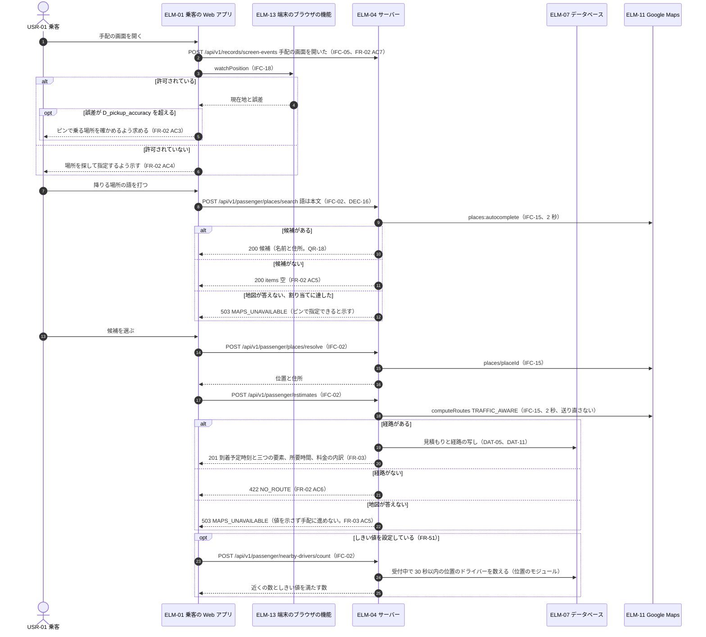
```mermaid
sequenceDiagram
  autonumber
  actor P as USR-01 乗客
  participant PA as ELM-01 乗客の Web アプリ
  participant BC as ELM-13 端末のブラウザの機能
  participant SRV as ELM-04 サーバー
  participant DB as ELM-07 データベース
  participant MAP as ELM-11 Google Maps
  P->>PA: 手配の画面を開く
  PA->>SRV: POST /api/v1/records/screen-events 手配の画面を開いた（IFC-05、FR-02 AC7）
  PA->>BC: watchPosition（IFC-18）
  alt 許可されている
    BC-->>PA: 現在地と誤差
    opt 誤差が D_pickup_accuracy を超える
      PA-->>P: ピンで乗る場所を確かめるよう求める（FR-02 AC3）
    end
  else 許可されていない
    PA-->>P: 場所を探して指定するよう示す（FR-02 AC4）
  end
  P->>PA: 降りる場所の語を打つ
  PA->>SRV: POST /api/v1/passenger/places/search 語は本文（IFC-02、DEC-16）
  SRV->>MAP: places:autocomplete（IFC-15、2 秒）
  alt 候補がある
    SRV-->>PA: 200 候補（名前と住所。QR-18）
  else 候補がない
    SRV-->>PA: 200 items 空（FR-02 AC5）
  else 地図が答えない、割り当てに達した
    SRV-->>PA: 503 MAPS_UNAVAILABLE（ピンで指定できると示す）
  end
  P->>PA: 候補を選ぶ
  PA->>SRV: POST /api/v1/passenger/places/resolve（IFC-02）
  SRV->>MAP: places/placeId（IFC-15）
  SRV-->>PA: 位置と住所
  PA->>SRV: POST /api/v1/passenger/estimates（IFC-02）
  SRV->>MAP: computeRoutes TRAFFIC_AWARE（IFC-15、2 秒、送り直さない）
  alt 経路がある
    SRV->>DB: 見積もりと経路の写し（DAT-05、DAT-11）
    SRV-->>PA: 201 到着予定時刻と三つの要素、所要時間、料金の内訳（FR-03）
  else 経路がない
    SRV-->>PA: 422 NO_ROUTE（FR-02 AC6）
  else 地図が答えない
    SRV-->>PA: 503 MAPS_UNAVAILABLE（値を示さず手配に進めない。FR-03 AC5）
  end
  opt しきい値を設定している（FR-51）
    PA->>SRV: POST /api/v1/passenger/nearby-drivers/count（IFC-02）
    SRV->>DB: 受付中で 30 秒以内の位置のドライバーを数える（位置のモジュール）
    SRV-->>PA: 近くの数としきい値を満たす数
  end
```

### CUJ-01-B 手配の確定（配車を手配する）

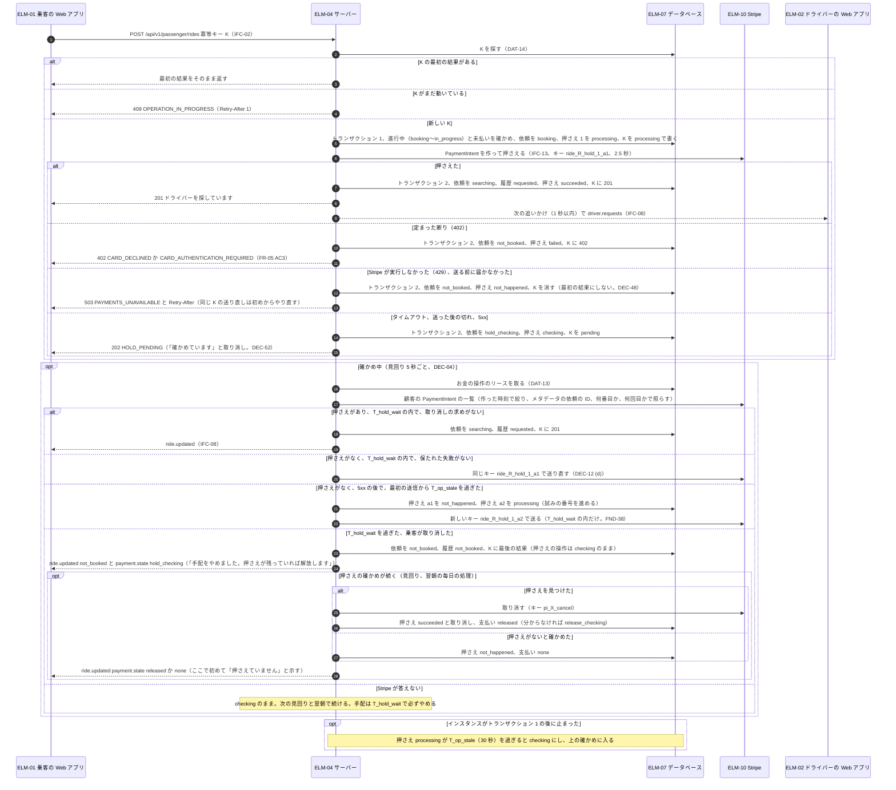
```mermaid
sequenceDiagram
  autonumber
  participant PA as ELM-01 乗客の Web アプリ
  participant SRV as ELM-04 サーバー
  participant DB as ELM-07 データベース
  participant ST as ELM-10 Stripe
  participant DA as ELM-02 ドライバーの Web アプリ
  PA->>SRV: POST /api/v1/passenger/rides 冪等キー K（IFC-02）
  SRV->>DB: K を探す（DAT-14）
  alt K の最初の結果がある
    SRV-->>PA: 最初の結果をそのまま返す
  else K がまだ動いている
    SRV-->>PA: 409 OPERATION_IN_PROGRESS（Retry-After 1）
  else 新しい K
    SRV->>DB: トランザクション 1、進行中（booking〜in_progress）と未払いを確かめ、依頼を booking、押さえ 1 を processing、K を processing で書く
    SRV->>ST: PaymentIntent を作って押さえる（IFC-13、キー ride_R_hold_1_a1、2.5 秒）
    alt 押さえた
      SRV->>DB: トランザクション 2、依頼を searching、履歴 requested、押さえ succeeded、K に 201
      SRV-->>PA: 201 ドライバーを探しています
      SRV-->>DA: 次の追いかけ（1 秒以内）で driver.requests（IFC-08）
    else 定まった断り（402）
      SRV->>DB: トランザクション 2、依頼を not_booked、押さえ failed、K に 402
      SRV-->>PA: 402 CARD_DECLINED か CARD_AUTHENTICATION_REQUIRED（FR-05 AC3）
    else Stripe が実行しなかった（429）、送る前に届かなかった
      SRV->>DB: トランザクション 2、依頼を not_booked、押さえ not_happened、K を消す（最初の結果にしない。DEC-48）
      SRV-->>PA: 503 PAYMENTS_UNAVAILABLE と Retry-After（同じ K の送り直しは初めからやり直す）
    else タイムアウト、送った後の切れ、5xx
      SRV->>DB: トランザクション 2、依頼を hold_checking、押さえ checking、K を pending
      SRV-->>PA: 202 HOLD_PENDING（「確かめています」と取り消し。DEC-52）
    end
  end
  opt 確かめ中（見回り 5 秒ごと、DEC-04）
    SRV->>DB: お金の操作のリースを取る（DAT-13）
    SRV->>ST: 顧客の PaymentIntent の一覧（作った時刻で絞り、メタデータの依頼の ID、何番目か、何回目かで照らす）
    alt 押さえがあり、T_hold_wait の内で、取り消しの求めがない
      SRV->>DB: 依頼を searching、履歴 requested、K に 201
      SRV-->>PA: ride.updated（IFC-08）
    else 押さえがなく、T_hold_wait の内で、保たれた失敗がない
      SRV->>ST: 同じキー ride_R_hold_1_a1 で送り直す（DEC-12 (d)）
    else 押さえがなく、5xx の後で、最初の送信から T_op_stale を過ぎた
      SRV->>DB: 押さえ a1 を not_happened、押さえ a2 を processing（試みの番号を進める）
      SRV->>ST: 新しいキー ride_R_hold_1_a2 で送る（T_hold_wait の内だけ。FND-38）
    else T_hold_wait を過ぎた、乗客が取り消した
      SRV->>DB: 依頼を not_booked、履歴 not_booked、K に最後の結果（押さえの操作は checking のまま）
      SRV-->>PA: ride.updated not_booked と payment.state hold_checking（「手配をやめました。押さえが残っていれば解放します」）
      opt 押さえの確かめが続く（見回り、翌朝の毎日の処理）
        alt 押さえを見つけた
          SRV->>ST: 取り消す（キー pi_X_cancel）
          SRV->>DB: 押さえ succeeded と取り消し、支払い released（分からなければ release_checking）
        else 押さえがないと確かめた
          SRV->>DB: 押さえ not_happened、支払い none
        end
        SRV-->>PA: ride.updated payment.state released か none（ここで初めて「押さえていません」と示す）
      end
    else Stripe が答えない
      Note over SRV: checking のまま。次の見回りと翌朝で続ける。手配は T_hold_wait で必ずやめる
    end
  end
  opt インスタンスがトランザクション 1 の後に止まった
    Note over SRV,DB: 押さえ processing が T_op_stale（30 秒）を過ぎると checking にし、上の確かめに入る
  end
```

### CUJ-01-C 取り消し（配車を手配する。FR-07、FR-08）

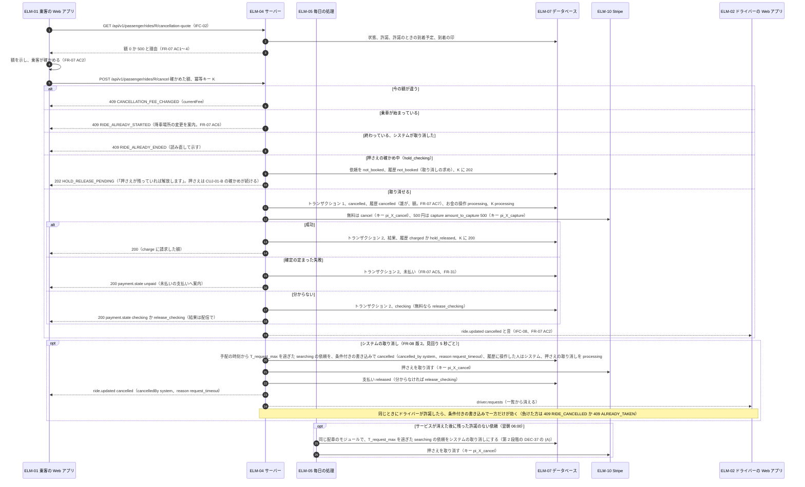
```mermaid
sequenceDiagram
  autonumber
  participant PA as ELM-01 乗客の Web アプリ
  participant SRV as ELM-04 サーバー
  participant BAT as ELM-05 毎日の処理
  participant DB as ELM-07 データベース
  participant ST as ELM-10 Stripe
  participant DA as ELM-02 ドライバーの Web アプリ
  PA->>SRV: GET /api/v1/passenger/rides/R/cancellation-quote（IFC-02）
  SRV->>DB: 状態、許諾、許諾のときの到着予定、到着の印
  SRV-->>PA: 額 0 か 500 と理由（FR-07 AC1〜4）
  PA->>PA: 額を示し、乗客が確かめる（FR-07 AC2）
  PA->>SRV: POST /api/v1/passenger/rides/R/cancel 確かめた額、冪等キー K
  alt 今の額が違う
    SRV-->>PA: 409 CANCELLATION_FEE_CHANGED（currentFee）
  else 乗車が始まっている
    SRV-->>PA: 409 RIDE_ALREADY_STARTED（降車場所の変更を案内。FR-07 AC6）
  else 終わっている、システムが取り消した
    SRV-->>PA: 409 RIDE_ALREADY_ENDED（読み直して示す）
  else 押さえの確かめ中（hold_checking）
    SRV->>DB: 依頼を not_booked、履歴 not_booked（取り消しの求め）、K に 202
    SRV-->>PA: 202 HOLD_RELEASE_PENDING（「押さえが残っていれば解放します」。押さえは CUJ-01-B の確かめが続ける）
  else 取り消せる
    SRV->>DB: トランザクション 1、cancelled、履歴 cancelled（誰が、額。FR-07 AC7）、お金の操作 processing、K processing
    SRV->>ST: 無料は cancel（キー pi_X_cancel）、500 円は capture amount_to_capture 500（キー pi_X_capture）
    alt 成功
      SRV->>DB: トランザクション 2、結果、履歴 charged か hold_released、K に 200
      SRV-->>PA: 200（charge に請求した額）
    else 確定の定まった失敗
      SRV->>DB: トランザクション 2、未払い（FR-07 AC5、FR-31）
      SRV-->>PA: 200 payment.state unpaid（未払いの支払いへ案内）
    else 分からない
      SRV->>DB: トランザクション 2、checking（無料なら release_checking）
      SRV-->>PA: 200 payment.state checking か release_checking（結果は配信で）
    end
    SRV-->>DA: ride.updated cancelled と音（IFC-08、FR-07 AC2）
  end
  opt システムの取り消し（FR-08 版 2。見回り 5 秒ごと）
    SRV->>DB: 手配の時刻から T_request_max を過ぎた searching の依頼を、条件付きの書き込みで cancelled（cancelled_by system、reason request_timeout）、履歴に操作した人はシステム、押さえの取り消しを processing
    SRV->>ST: 押さえを取り消す（キー pi_X_cancel）
    SRV->>DB: 支払い released（分からなければ release_checking）
    SRV-->>PA: ride.updated cancelled（cancelledBy system、reason request_timeout）
    SRV-->>DA: driver.requests（一覧から消える）
    Note over SRV,DA: 同じときにドライバーが許諾したら、条件付きの書き込みで一方だけが効く（負けた方は 409 RIDE_CANCELLED か 409 ALREADY_TAKEN）
  end
  opt サービスが消えた後に残った許諾のない依頼（翌朝 06:00）
    BAT->>DB: 同じ配車のモジュールで、T_request_max を過ぎた searching の依頼をシステムの取り消しにする（第 2 段階の DEC-37 の (A)）
    BAT->>ST: 押さえを取り消す（キー pi_X_cancel）
  end
```

### CUJ-01-D アカウントと支払い手段（配車を手配する。FR-01、FR-04、FR-48）

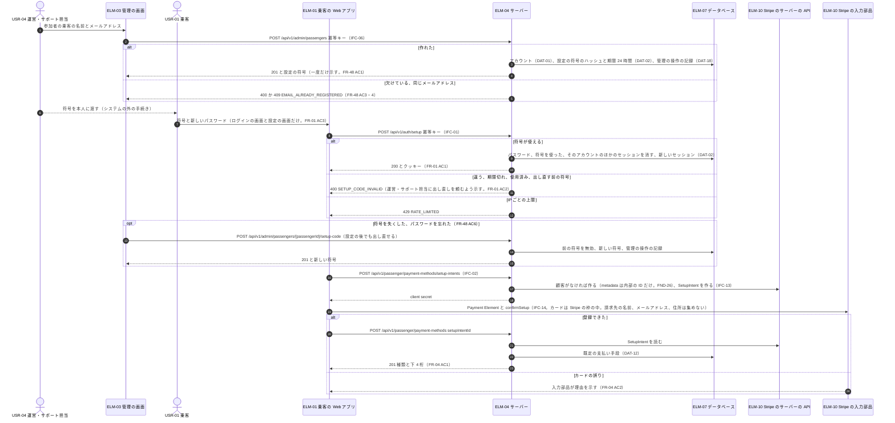
```mermaid
sequenceDiagram
  autonumber
  actor OP as USR-04 運営・サポート担当
  participant BO as ELM-03 管理の画面
  actor P as USR-01 乗客
  participant PA as ELM-01 乗客の Web アプリ
  participant SRV as ELM-04 サーバー
  participant DB as ELM-07 データベース
  participant ST as ELM-10 Stripe のサーバーの API
  participant SJ as ELM-10 Stripe の入力部品
  OP->>BO: 参加者の乗客の名前とメールアドレス
  BO->>SRV: POST /api/v1/admin/passengers 冪等キー（IFC-06）
  alt 作れた
    SRV->>DB: アカウント（DAT-01）、設定の符号のハッシュと期限 24 時間（DAT-02）、管理の操作の記録（DAT-18）
    SRV-->>BO: 201 と設定の符号（一度だけ示す。FR-48 AC1）
  else 欠けている、同じメールアドレス
    SRV-->>BO: 400 か 409 EMAIL_ALREADY_REGISTERED（FR-48 AC3・4）
  end
  OP-->>P: 符号を本人に渡す（システムの外の手続き）
  P->>PA: 符号と新しいパスワード（ログインの画面と設定の画面だけ。FR-01 AC3）
  PA->>SRV: POST /api/v1/auth/setup 冪等キー（IFC-01）
  alt 符号が使える
    SRV->>DB: パスワード、符号を使った、そのアカウントのほかのセッションを消す、新しいセッション（DAT-02）
    SRV-->>PA: 200 とクッキー（FR-01 AC1）
  else 違う、期限切れ、使用済み、出し直す前の符号
    SRV-->>PA: 400 SETUP_CODE_INVALID（運営・サポート担当に出し直しを頼むよう示す。FR-01 AC2）
  else IP ごとの上限
    SRV-->>PA: 429 RATE_LIMITED
  end
  opt 符号を失くした、パスワードを忘れた（FR-48 AC6）
    BO->>SRV: POST /api/v1/admin/passengers/{passengerId}/setup-code（設定の後でも出し直せる）
    SRV->>DB: 前の符号を無効、新しい符号、管理の操作の記録
    SRV-->>BO: 201 と新しい符号
  end
  PA->>SRV: POST /api/v1/passenger/payment-methods/setup-intents（IFC-02）
  SRV->>ST: 顧客がなければ作る（metadata は内部の ID だけ。FND-26）、SetupIntent を作る（IFC-13）
  SRV-->>PA: client secret
  PA->>SJ: Payment Element と confirmSetup（IFC-14。カードは Stripe の枠の中。請求先の名前、メールアドレス、住所は集めない）
  alt 登録できた
    PA->>SRV: POST /api/v1/passenger/payment-methods setupIntentId
    SRV->>ST: SetupIntent を読む
    SRV->>DB: 既定の支払い手段（DAT-12）
    SRV-->>PA: 201 種類と下 4 桁（FR-04 AC1）
  else カードの誤り
    SJ-->>PA: 入力部品が理由を示す（FR-04 AC2）
  end
```

### CUJ-02 乗車（乗客）（手配した車かどうかを確認する）

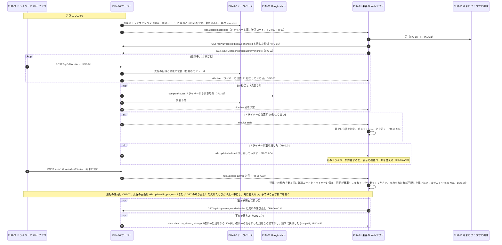
```mermaid
sequenceDiagram
  autonumber
  participant DA as ELM-02 ドライバーの Web アプリ
  participant SRV as ELM-04 サーバー
  participant DB as ELM-07 データベース
  participant MAP as ELM-11 Google Maps
  participant PA as ELM-01 乗客の Web アプリ
  participant BC as ELM-13 端末のブラウザの機能
  Note over DA,SRV: 許諾は CUJ-06
  SRV->>DB: 許諾のトランザクション（担当、確認コード、許諾のときの到着予定、車両の写し、履歴 accepted）
  SRV-->>PA: ride.updated accepted（ドライバーと車、確認コード。IFC-08、FR-09）
  PA->>BC: 音（IFC-18、FR-06 AC1）
  PA->>SRV: POST /api/v1/records/displays changeId と示した時刻（IFC-05）
  PA->>SRV: GET /api/v1/passenger/rides/R/driver-photo（IFC-02）
  loop 迎車中、10 秒ごと
    DA->>SRV: POST /api/v1/locations（IFC-04）
    SRV->>DB: 受信の記録と最後の位置（位置のモジュール）
    SRV-->>PA: ride.live ドライバーの位置（1 秒ごとの今の値。DEC-51）
  end
  loop 60 秒ごと（見回り）
    SRV->>MAP: computeRoutes ドライバーから乗車場所（IFC-15）
    SRV->>DB: 到着予定
    SRV-->>PA: ride.live 到着予定
  end
  alt ドライバーの位置が 30 秒より古い
    SRV-->>PA: ride.live stale
    PA->>PA: 最後の位置と時刻、止まっていることを示す（FR-10 AC4）
  end
  alt ドライバーが取り消した（FR-22）
    SRV-->>PA: ride.updated relisted 探し直しています（FR-06 AC4）
    Note over PA: 別のドライバーが許諾すると、表示と確認コードを替える（FR-09 AC2）
  end
  DA->>SRV: POST /api/v1/driver/rides/R/arrive（迎車の流れ）
  SRV-->>PA: ride.updated arrived と音（FR-06 AC2）
  PA->>PA: 迎車中の案内「乗る前に確認コードをドライバーに伝え、画面が乗車中に変わってから乗ってください。変わらなければ手配した車ではありません」（FR-26 AC3。DEC-30）
  Note over DA,PA: 運転の開始は CUJ-07。乗客の画面は ride.updated in_progress（または GET の取り直し）を受けたときだけ乗車中にし、先に変えない。手で取り直す操作を置く
  opt 裏から前面に戻った
    PA->>SRV: GET /api/v1/passenger/rides/active と流れの開き直し（FR-06 AC3）
  end
  opt 不在で終えた（CUJ-07）
    SRV-->>PA: ride.updated no_show と charge（確かめた到着なら 500 円、確かめられなかった到着なら請求なし。請求に失敗したら unpaid。FND-45）
  end
```

### 迎車（CUJ にない流れ。CUJ-02 と CUJ-07 の間）

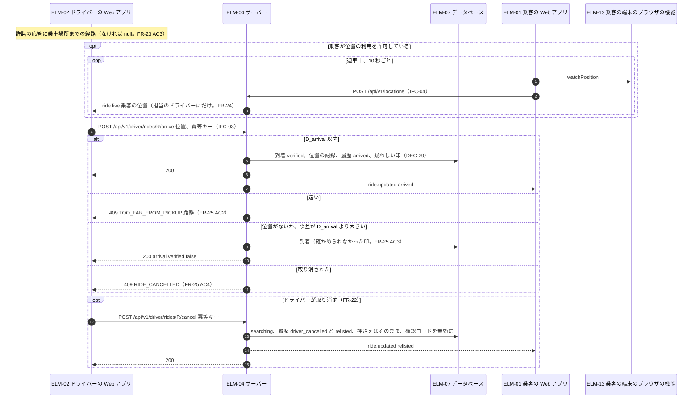
```mermaid
sequenceDiagram
  autonumber
  participant DA as ELM-02 ドライバーの Web アプリ
  participant SRV as ELM-04 サーバー
  participant DB as ELM-07 データベース
  participant PA as ELM-01 乗客の Web アプリ
  participant BC as ELM-13 乗客の端末のブラウザの機能
  Note over DA: 許諾の応答に乗車場所までの経路（なければ null。FR-23 AC3）
  opt 乗客が位置の利用を許可している
    loop 迎車中、10 秒ごと
      PA->>BC: watchPosition
      PA->>SRV: POST /api/v1/locations（IFC-04）
      SRV-->>DA: ride.live 乗客の位置（担当のドライバーにだけ。FR-24）
    end
  end
  DA->>SRV: POST /api/v1/driver/rides/R/arrive 位置、冪等キー（IFC-03）
  alt D_arrival 以内
    SRV->>DB: 到着 verified、位置の記録、履歴 arrived、疑わしい印（DEC-29）
    SRV-->>DA: 200
    SRV-->>PA: ride.updated arrived
  else 遠い
    SRV-->>DA: 409 TOO_FAR_FROM_PICKUP 距離（FR-25 AC2）
  else 位置がないか、誤差が D_arrival より大きい
    SRV->>DB: 到着（確かめられなかった印。FR-25 AC3）
    SRV-->>DA: 200 arrival.verified false
  else 取り消された
    SRV-->>DA: 409 RIDE_CANCELLED（FR-25 AC4）
  end
  opt ドライバーが取り消す（FR-22）
    DA->>SRV: POST /api/v1/driver/rides/R/cancel 冪等キー
    SRV->>DB: searching、履歴 driver_cancelled と relisted、押さえはそのまま、確認コードを無効に
    SRV-->>PA: ride.updated relisted
    SRV-->>DA: 200
  end
```

### CUJ-03 降車（乗客）（正しい場所に到着したかを確認する）

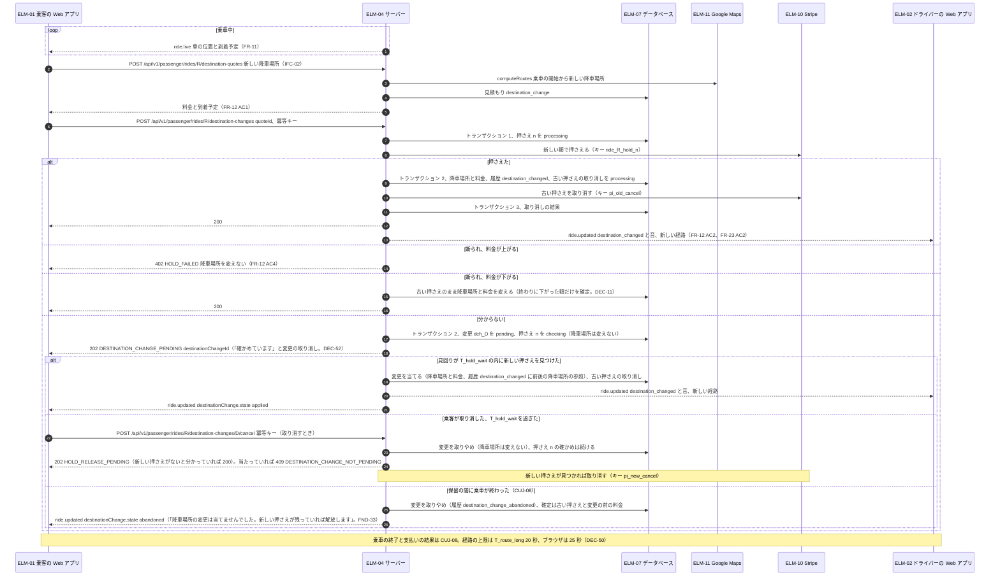
```mermaid
sequenceDiagram
  autonumber
  participant PA as ELM-01 乗客の Web アプリ
  participant SRV as ELM-04 サーバー
  participant DB as ELM-07 データベース
  participant MAP as ELM-11 Google Maps
  participant ST as ELM-10 Stripe
  participant DA as ELM-02 ドライバーの Web アプリ
  loop 乗車中
    SRV-->>PA: ride.live 車の位置と到着予定（FR-11）
  end
  PA->>SRV: POST /api/v1/passenger/rides/R/destination-quotes 新しい降車場所（IFC-02）
  SRV->>MAP: computeRoutes 乗車の開始から新しい降車場所
  SRV->>DB: 見積もり destination_change
  SRV-->>PA: 料金と到着予定（FR-12 AC1）
  PA->>SRV: POST /api/v1/passenger/rides/R/destination-changes quoteId、冪等キー
  SRV->>DB: トランザクション 1、押さえ n を processing
  SRV->>ST: 新しい額で押さえる（キー ride_R_hold_n）
  alt 押さえた
    SRV->>DB: トランザクション 2、降車場所と料金、履歴 destination_changed、古い押さえの取り消しを processing
    SRV->>ST: 古い押さえを取り消す（キー pi_old_cancel）
    SRV->>DB: トランザクション 3、取り消しの結果
    SRV-->>PA: 200
    SRV-->>DA: ride.updated destination_changed と音、新しい経路（FR-12 AC2、FR-23 AC2）
  else 断られ、料金が上がる
    SRV-->>PA: 402 HOLD_FAILED 降車場所を変えない（FR-12 AC4）
  else 断られ、料金が下がる
    SRV->>DB: 古い押さえのまま降車場所と料金を変える（終わりに下がった額だけを確定。DEC-11）
    SRV-->>PA: 200
  else 分からない
    SRV->>DB: トランザクション 2、変更 dch_D を pending、押さえ n を checking（降車場所は変えない）
    SRV-->>PA: 202 DESTINATION_CHANGE_PENDING destinationChangeId（「確かめています」と変更の取り消し。DEC-52）
    alt 見回りが T_hold_wait の内に新しい押さえを見つけた
      SRV->>DB: 変更を当てる（降車場所と料金、履歴 destination_changed に前後の降車場所の参照）、古い押さえの取り消し
      SRV-->>DA: ride.updated destination_changed と音、新しい経路
      SRV-->>PA: ride.updated destinationChange.state applied
    else 乗客が取り消した、T_hold_wait を過ぎた
      PA->>SRV: POST /api/v1/passenger/rides/R/destination-changes/D/cancel 冪等キー（取り消すとき）
      SRV->>DB: 変更を取りやめ（降車場所は変えない）、押さえ n の確かめは続ける
      SRV-->>PA: 202 HOLD_RELEASE_PENDING（新しい押さえがないと分かっていれば 200）。当たっていれば 409 DESTINATION_CHANGE_NOT_PENDING
      Note over SRV,ST: 新しい押さえが見つかれば取り消す（キー pi_new_cancel）
    else 保留の間に乗車が終わった（CUJ-08）
      SRV->>DB: 変更を取りやめ（履歴 destination_change_abandoned）、確定は古い押さえと変更の前の料金
      SRV-->>PA: ride.updated destinationChange.state abandoned（「降車場所の変更は当てませんでした。新しい押さえが残っていれば解放します」。FND-33）
    end
  end
  Note over PA,DA: 乗車の終了と支払いの結果は CUJ-08。経路の上限は T_route_long 20 秒、ブラウザは 25 秒（DEC-50）
```

### CUJ-04 ドライバーの評価

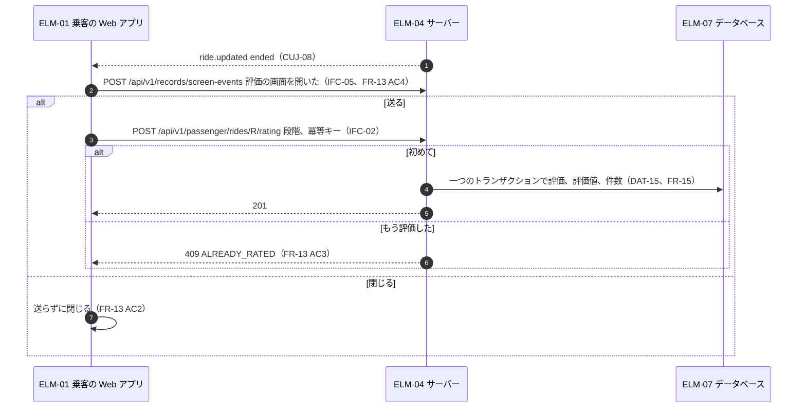
```mermaid
sequenceDiagram
  autonumber
  participant PA as ELM-01 乗客の Web アプリ
  participant SRV as ELM-04 サーバー
  participant DB as ELM-07 データベース
  SRV-->>PA: ride.updated ended（CUJ-08）
  PA->>SRV: POST /api/v1/records/screen-events 評価の画面を開いた（IFC-05、FR-13 AC4）
  alt 送る
    PA->>SRV: POST /api/v1/passenger/rides/R/rating 段階、冪等キー（IFC-02）
    alt 初めて
      SRV->>DB: 一つのトランザクションで評価、評価値、件数（DAT-15、FR-15）
      SRV-->>PA: 201
    else もう評価した
      SRV-->>PA: 409 ALREADY_RATED（FR-13 AC3）
    end
  else 閉じる
    PA->>PA: 送らずに閉じる（FR-13 AC2）
  end
```

### CUJ-05 評価のしきい値の設定

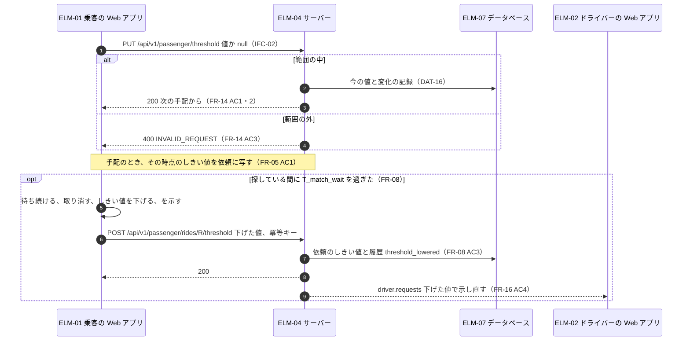
```mermaid
sequenceDiagram
  autonumber
  participant PA as ELM-01 乗客の Web アプリ
  participant SRV as ELM-04 サーバー
  participant DB as ELM-07 データベース
  participant DA as ELM-02 ドライバーの Web アプリ
  PA->>SRV: PUT /api/v1/passenger/threshold 値か null（IFC-02）
  alt 範囲の中
    SRV->>DB: 今の値と変化の記録（DAT-16）
    SRV-->>PA: 200 次の手配から（FR-14 AC1・2）
  else 範囲の外
    SRV-->>PA: 400 INVALID_REQUEST（FR-14 AC3）
  end
  Note over PA,SRV: 手配のとき、その時点のしきい値を依頼に写す（FR-05 AC1）
  opt 探している間に T_match_wait を過ぎた（FR-08）
    PA->>PA: 待ち続ける、取り消す、しきい値を下げる、を示す
    PA->>SRV: POST /api/v1/passenger/rides/R/threshold 下げた値、冪等キー
    SRV->>DB: 依頼のしきい値と履歴 threshold_lowered（FR-08 AC3）
    SRV-->>PA: 200
    SRV-->>DA: driver.requests 下げた値で示し直す（FR-16 AC4）
  end
```

### CUJ-06 配車受付（配車依頼を選ぶ、依頼内容を確認する、依頼を許諾する）

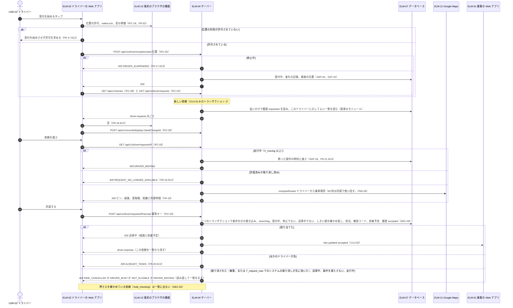
```mermaid
sequenceDiagram
  autonumber
  actor D as USR-02 ドライバー
  participant DA as ELM-02 ドライバーの Web アプリ
  participant BC as ELM-13 端末のブラウザの機能
  participant SRV as ELM-04 サーバー
  participant DB as ELM-07 データベース
  participant MAP as ELM-11 Google Maps
  participant PA as ELM-01 乗客の Web アプリ
  D->>DA: 受付を始めるタップ
  DA->>BC: 位置の許可、wakeLock、音の準備（IFC-18、FR-52）
  alt 位置の利用が許可されていない
    DA-->>D: 受付を始めさせず許可を求める（FR-17 AC2）
  else 許可されている
    DA->>SRV: POST /api/v1/driver/reception/start 位置（IFC-03）
    alt 停止中
      SRV-->>DA: 403 DRIVER_SUSPENDED（FR-17 AC3）
    else
      SRV->>DB: 受付中、変化の記録、最後の位置（DAT-04、DAT-10）
      SRV-->>DA: 200
      DA->>SRV: GET /api/v1/stream（IFC-08）と GET /api/v1/driver/requests（IFC-03）
    end
  end
  Note over SRV: 新しい依頼（CUJ-01-B のトランザクション 2）
  SRV->>DB: 追いかけで履歴 requested を読み、このドライバーに示してよい一覧を読む（配車のモジュール）
  SRV-->>DA: driver.requests 丸ごと
  DA->>BC: 音（FR-18 AC2）
  DA->>SRV: POST /api/v1/records/displays listedChangeId（IFC-05）
  D->>DA: 依頼を選ぶ
  DA->>SRV: GET /api/v1/driver/requests/R（IFC-03）
  alt 走行中（V_moving 以上）
    SRV->>DB: 断った操作の時刻と速さ（DAT-19、FR-21 AC4）
    SRV-->>DA: 409 DRIVER_MOVING
  else 許諾済みか取り消し済み
    SRV-->>DA: 409 REQUEST_NO_LONGER_AVAILABLE（FR-19 AC2）
  else
    SRV->>MAP: computeRoutes ドライバーから乗車場所（60 秒は許諾で使い回す。FND-28）
    SRV-->>DA: 200 ピン、経路、受取額、距離と所要時間（FR-19）
  end
  D->>DA: 許諾する
  DA->>SRV: POST /api/v1/driver/requests/R/accept 冪等キー（IFC-03）
  SRV->>DB: 一つのトランザクションで条件付きの書き込み、searching、受付中、停止でない、迎車中でない、しきい値を確かめ直し、担当、確認コード、到着予定、履歴 accepted（DEC-09）
  alt 割り当てた
    SRV-->>DA: 200 迎車中（経路と到着予定）
    SRV-->>PA: ride.updated accepted（CUJ-02）
    SRV-->>DA: driver.requests（この依頼を一覧から消す）
  else ほかのドライバーが先
    SRV-->>DA: 409 ALREADY_TAKEN（FR-20 AC2）
  else 取り消された（乗客、または T_request_max でのシステムの取り消しが先に効いた）、迎車中、条件を満たさない、走行中
    SRV-->>DA: 409 RIDE_CANCELLED か DRIVER_BUSY か NOT_ELIGIBLE か DRIVER_MOVING（読み直して一覧を示す）
  end
  Note over DA,SRV: 押さえを確かめている依頼（hold_checking）は一覧に出ない（DEC-52）
```

### CUJ-07 乗車（ドライバー）（依頼主かどうかを確認する、運転を始める）

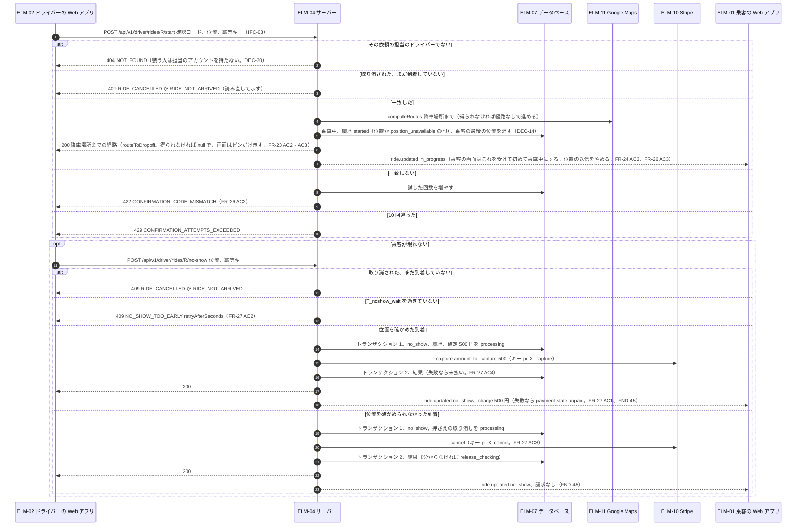
```mermaid
sequenceDiagram
  autonumber
  participant DA as ELM-02 ドライバーの Web アプリ
  participant SRV as ELM-04 サーバー
  participant DB as ELM-07 データベース
  participant MAP as ELM-11 Google Maps
  participant ST as ELM-10 Stripe
  participant PA as ELM-01 乗客の Web アプリ
  DA->>SRV: POST /api/v1/driver/rides/R/start 確認コード、位置、冪等キー（IFC-03）
  alt その依頼の担当のドライバーでない
    SRV-->>DA: 404 NOT_FOUND（装う人は担当のアカウントを持たない。DEC-30）
  else 取り消された、まだ到着していない
    SRV-->>DA: 409 RIDE_CANCELLED か RIDE_NOT_ARRIVED（読み直して示す）
  else 一致した
    SRV->>MAP: computeRoutes 降車場所まで（得られなければ経路なしで進める）
    SRV->>DB: 乗車中、履歴 started（位置か position_unavailable の印）、乗客の最後の位置を消す（DEC-14）
    SRV-->>DA: 200 降車場所までの経路（routeToDropoff。得られなければ null で、画面はピンだけ示す。FR-23 AC2・AC3）
    SRV-->>PA: ride.updated in_progress（乗客の画面はこれを受けて初めて乗車中にする。位置の送信をやめる。FR-24 AC3、FR-26 AC3）
  else 一致しない
    SRV->>DB: 試した回数を増やす
    SRV-->>DA: 422 CONFIRMATION_CODE_MISMATCH（FR-26 AC2）
  else 10 回違った
    SRV-->>DA: 429 CONFIRMATION_ATTEMPTS_EXCEEDED
  end
  opt 乗客が現れない
    DA->>SRV: POST /api/v1/driver/rides/R/no-show 位置、冪等キー
    alt 取り消された、まだ到着していない
      SRV-->>DA: 409 RIDE_CANCELLED か RIDE_NOT_ARRIVED
    else T_noshow_wait を過ぎていない
      SRV-->>DA: 409 NO_SHOW_TOO_EARLY retryAfterSeconds（FR-27 AC2）
    else 位置を確かめた到着
      SRV->>DB: トランザクション 1、no_show、履歴、確定 500 円を processing
      SRV->>ST: capture amount_to_capture 500（キー pi_X_capture）
      SRV->>DB: トランザクション 2、結果（失敗なら未払い。FR-27 AC4）
      SRV-->>DA: 200
      SRV-->>PA: ride.updated no_show、charge 500 円（失敗なら payment.state unpaid。FR-27 AC1、FND-45）
    else 位置を確かめられなかった到着
      SRV->>DB: トランザクション 1、no_show、押さえの取り消しを processing
      SRV->>ST: cancel（キー pi_X_cancel。FR-27 AC3）
      SRV->>DB: トランザクション 2、結果（分からなければ release_checking）
      SRV-->>DA: 200
      SRV-->>PA: ride.updated no_show、請求なし（FND-45）
    end
  end
```

### CUJ-08 降車（ドライバー）（到着を確認する、決済を行う）

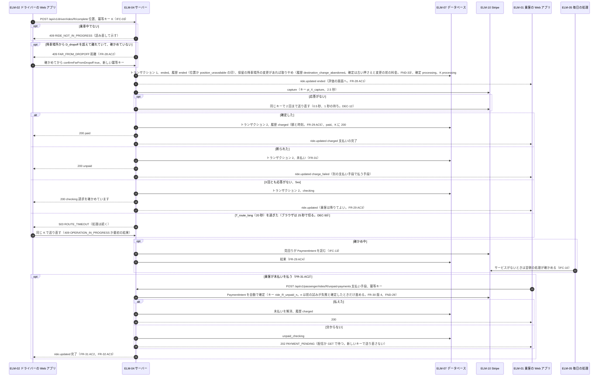
```mermaid
sequenceDiagram
  autonumber
  participant DA as ELM-02 ドライバーの Web アプリ
  participant SRV as ELM-04 サーバー
  participant DB as ELM-07 データベース
  participant ST as ELM-10 Stripe
  participant PA as ELM-01 乗客の Web アプリ
  participant B as ELM-05 毎日の処理
  DA->>SRV: POST /api/v1/driver/rides/R/complete 位置、冪等キー K（IFC-03）
  opt 乗車中でない
    SRV-->>DA: 409 RIDE_NOT_IN_PROGRESS（読み直して示す）
  end
  opt 降車場所から D_dropoff を超えて離れていて、確かめていない
    SRV-->>DA: 409 FAR_FROM_DROPOFF 距離（FR-28 AC2）
    DA->>SRV: 確かめてから confirmFarFromDropoff true、新しい冪等キー
  end
  SRV->>DB: トランザクション 1、ended、履歴 ended（位置か position_unavailable の印）、保留の降車場所の変更があれば取りやめ（履歴 destination_change_abandoned。確定は古い押さえと変更の前の料金。FND-33）、確定 processing、K processing
  SRV-->>PA: ride.updated ended（評価の画面へ。FR-28 AC1）
  SRV->>ST: capture（キー pi_X_capture、2.5 秒）
  opt 応答がない
    SRV->>ST: 同じキーで 2 回まで送り直す（0.5 秒、1 秒の待ち。DEC-12）
  end
  alt 確定した
    SRV->>DB: トランザクション 2、履歴 charged（額と時刻。FR-29 AC5）、paid、K に 200
    SRV-->>DA: 200 paid
    SRV-->>PA: ride.updated charged 支払いの完了
  else 断られた
    SRV->>DB: トランザクション 2、未払い（FR-31）
    SRV-->>DA: 200 unpaid
    SRV-->>PA: ride.updated charge_failed（別の支払い手段で払う手段）
  else 3 回とも応答がない、5xx
    SRV->>DB: トランザクション 2、checking
    SRV-->>DA: 200 checking 請求を確かめています
    SRV-->>PA: ride.updated（乗客は降りてよい。FR-29 AC3）
  else T_route_long（20 秒）を過ぎた（ブラウザは 25 秒で切る。DEC-50）
    SRV-->>DA: 503 ROUTE_TIMEOUT（処理は続く）
    DA->>SRV: 同じ K で送り直す（409 OPERATION_IN_PROGRESS か最初の結果）
  end
  opt 確かめ中
    SRV->>ST: 見回りが PaymentIntent を読む（IFC-13）
    SRV->>DB: 結果（FR-29 AC4）
    B->>ST: サービスがないときは翌朝の処理が確かめる（IFC-10）
  end
  opt 乗客が未払いを払う（FR-31 AC2）
    PA->>SRV: POST /api/v1/passenger/rides/R/unpaid-payments 支払い手段、冪等キー
    SRV->>ST: PaymentIntent を自動で確定（キー ride_R_unpaid_n。n は前の試みが失敗と確定したときだけ進める。FR-30 版 4、FND-29）
    alt 払えた
      SRV->>DB: 未払いを解消、履歴 charged
      SRV-->>PA: 200
    else 分からない
      SRV->>DB: unpaid_checking
      SRV-->>PA: 202 PAYMENT_PENDING（配信か GET で待つ。新しいキーで送り直さない）
    end
    SRV-->>DA: ride.updated 完了（FR-31 AC2、FR-32 AC3）
  end
```

### CUJ-09 受ける条件の設定

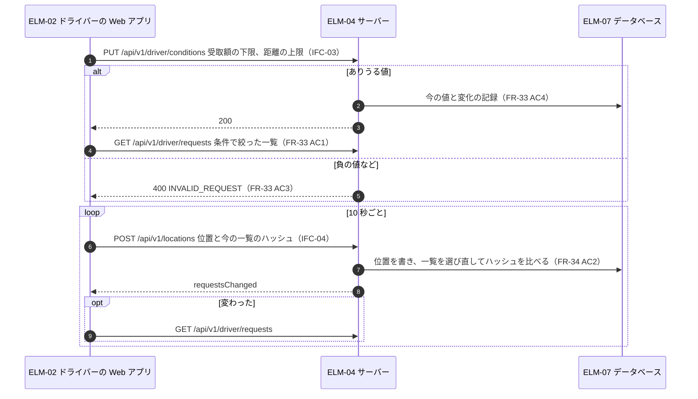
```mermaid
sequenceDiagram
  autonumber
  participant DA as ELM-02 ドライバーの Web アプリ
  participant SRV as ELM-04 サーバー
  participant DB as ELM-07 データベース
  DA->>SRV: PUT /api/v1/driver/conditions 受取額の下限、距離の上限（IFC-03）
  alt ありうる値
    SRV->>DB: 今の値と変化の記録（FR-33 AC4）
    SRV-->>DA: 200
    DA->>SRV: GET /api/v1/driver/requests 条件で絞った一覧（FR-33 AC1）
  else 負の値など
    SRV-->>DA: 400 INVALID_REQUEST（FR-33 AC3）
  end
  loop 10 秒ごと
    DA->>SRV: POST /api/v1/locations 位置と今の一覧のハッシュ（IFC-04）
    SRV->>DB: 位置を書き、一覧を選び直してハッシュを比べる（FR-34 AC2）
    SRV-->>DA: requestsChanged
    opt 変わった
      DA->>SRV: GET /api/v1/driver/requests
    end
  end
```

### CUJ-10 障害の原因の特定

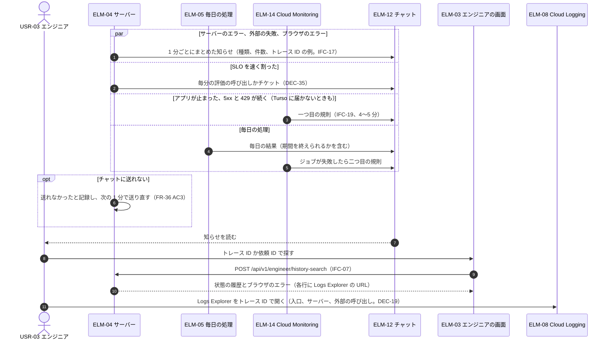
```mermaid
sequenceDiagram
  autonumber
  actor E as USR-03 エンジニア
  participant SRV as ELM-04 サーバー
  participant B as ELM-05 毎日の処理
  participant MON as ELM-14 Cloud Monitoring
  participant CHAT as ELM-12 チャット
  participant BO as ELM-03 エンジニアの画面
  participant LOG as ELM-08 Cloud Logging
  par サーバーのエラー、外部の失敗、ブラウザのエラー
    SRV->>CHAT: 1 分ごとにまとめた知らせ（種類、件数、トレース ID の例。IFC-17）
  and SLO を速く割った
    SRV->>CHAT: 毎分の評価の呼び出しかチケット（DEC-35）
  and アプリが止まった、5xx と 429 が続く（Turso に届かないときも）
    MON->>CHAT: 一つ目の規則（IFC-19、4〜5 分）
  and 毎日の処理
    B->>CHAT: 毎日の結果（期間を終えられるかを含む）
    MON->>CHAT: ジョブが失敗したら二つ目の規則
  end
  opt チャットに送れない
    SRV->>SRV: 送れなかったと記録し、次の 1 分で送り直す（FR-36 AC3）
  end
  CHAT-->>E: 知らせを読む
  E->>BO: トレース ID か依頼 ID で探す
  BO->>SRV: POST /api/v1/engineer/history-search（IFC-07）
  SRV-->>BO: 状態の履歴とブラウザのエラー（各行に Logs Explorer の URL）
  E->>LOG: Logs Explorer をトレース ID で開く（入口、サーバー、外部の呼び出し。DEC-19）
```

### CUJ-11〜13 変更の配備（新しい機能の追加、既存の機能の修正、利用技術の版上げ）

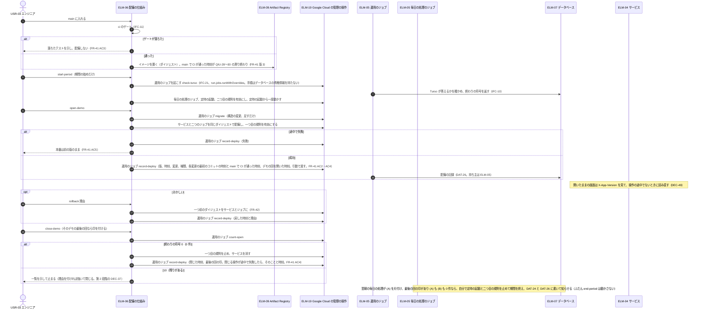
```mermaid
sequenceDiagram
  autonumber
  actor E as USR-03 エンジニア
  participant GH as ELM-06 配備の仕組み
  participant REG as ELM-09 Artifact Registry
  participant GCP as ELM-19 Google Cloud の管理の操作
  participant OPS as ELM-05 運用のジョブ
  participant BAT as ELM-05 毎日の処理のジョブ
  participant DB as ELM-07 データベース
  participant SRV as ELM-04 サービス
  E->>GH: main に入れる
  GH->>GH: ci のゲート（IFC-11）
  alt ゲートが落ちた
    GH-->>E: 落ちたテストを示し、配備しない（FR-41 AC3）
  else 通った
    GH->>REG: イメージを置く（ダイジェスト）。main で CI が通った時刻が QIU-28〜30 の測り終わり（FR-41 版 3）
  end
  E->>GH: start-period（期間の始めだけ）
  GH->>GCP: 運用のジョブを起こす check-turso（IFC-21、run.jobs.runWithOverrides。手順はデータベースの資格情報を持たない）
  OPS->>DB: Turso が答えるかを確かめ、終わりの符号を返す（IFC-10）
  GH->>GCP: 毎日の処理のジョブ、定時の起動、二つ目の規則を有効にし、定時の起動から一度動かす
  E->>GH: open-demo
  GH->>GCP: 運用のジョブ migrate（構造の変更、足すだけ）
  GH->>GCP: サービスと二つのジョブを同じダイジェストで配備し、一つ目の規則を有効にする
  alt 途中で失敗
    GH->>GCP: 運用のジョブ record-deploy（失敗）
    GH-->>E: 本番は前の版のまま（FR-41 AC5）
  else 成功
    GH->>GCP: 運用のジョブ record-deploy（版、時刻、変更、種類、各変更の最初のコミットの時刻と main で CI が通った時刻、デモの回を開いた時刻。引数で渡す。FR-41 AC2・AC4）
    OPS->>DB: 配備の記録（DAT-26。持ち主は ELM-05）
  end
  Note over SRV: 開いたままの画面は X-App-Version を見て、操作の途中でないときに読み直す（DEC-49）
  opt おかしい
    E->>GH: rollback 理由
    GH->>GCP: 一つ前のダイジェストをサービスとジョブに（FR-42）
    GH->>GCP: 運用のジョブ record-deploy（戻した時刻と理由）
  end
  E->>GH: close-demo（そのデモの最後の回なら印を付ける）
  GH->>GCP: 運用のジョブ count-open
  alt 終わりの符号 0（0 件）
    GH->>GCP: 一つ目の規則を止め、サービスを消す
    GH->>GCP: 運用のジョブ record-deploy（閉じた時刻、最後の回の印。閉じる操作が途中で失敗したら、そのことと時刻。FR-41 AC4）
  else 10（残りがある）
    GH-->>E: 一覧を示して止まる（理由を付ければ強いて閉じる。第 2 段階の DEC-37）
  end
  Note over BAT,DB: 翌朝の毎日の処理が (A) を片付け、最後の回の印があり (A) も (B) も 0 件なら、自分で定時の起動と二つ目の規則を止めて期間を終え、DAT-24 と DAT-26 に書いて知らせる（ふだん end-period は動かさない）
```

### CUJ-14 苦情への対応（ドライバーの登録を含む）

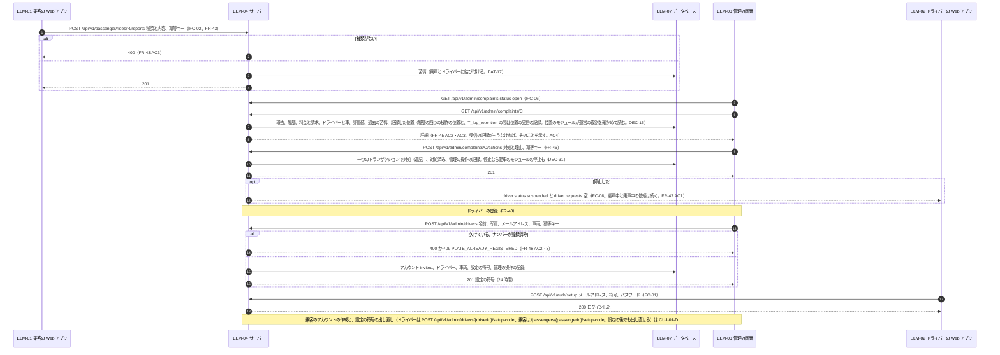
```mermaid
sequenceDiagram
  autonumber
  participant PA as ELM-01 乗客の Web アプリ
  participant SRV as ELM-04 サーバー
  participant DB as ELM-07 データベース
  participant BO as ELM-03 管理の画面
  participant DA as ELM-02 ドライバーの Web アプリ
  PA->>SRV: POST /api/v1/passenger/rides/R/reports 種類と内容、冪等キー（IFC-02、FR-43）
  alt 種類がない
    SRV-->>PA: 400（FR-43 AC3）
  else
    SRV->>DB: 苦情（乗車とドライバーに結び付ける。DAT-17）
    SRV-->>PA: 201
  end
  BO->>SRV: GET /api/v1/admin/complaints status open（IFC-06）
  BO->>SRV: GET /api/v1/admin/complaints/C
  SRV->>DB: 報告、履歴、料金と請求、ドライバーと車、評価値、過去の苦情、記録した位置（履歴の四つの操作の位置と、T_log_retention の間は位置の受信の記録。位置のモジュールが運営の役割を確かめて読む。DEC-15）
  SRV-->>BO: 詳細（FR-45 AC2・AC3。受信の記録がもうなければ、そのことを示す。AC4）
  BO->>SRV: POST /api/v1/admin/complaints/C/actions 対処と理由、冪等キー（FR-46）
  SRV->>DB: 一つのトランザクションで対処（追記）、対処済み、管理の操作の記録。停止なら配車のモジュールの停止も（DEC-31）
  SRV-->>BO: 201
  opt 停止した
    SRV-->>DA: driver.status suspended と driver.requests 空（IFC-08。迎車中と乗車中の依頼は続く。FR-47 AC1）
  end
  Note over BO,SRV: ドライバーの登録（FR-48）
  BO->>SRV: POST /api/v1/admin/drivers 名前、写真、メールアドレス、車両、冪等キー
  alt 欠けている、ナンバーが登録済み
    SRV-->>BO: 400 か 409 PLATE_ALREADY_REGISTERED（FR-48 AC2・3）
  else
    SRV->>DB: アカウント invited、ドライバー、車両、設定の符号、管理の操作の記録
    SRV-->>BO: 201 設定の符号（24 時間）
  end
  DA->>SRV: POST /api/v1/auth/setup メールアドレス、符号、パスワード（IFC-01）
  SRV-->>DA: 200 ログインした
  Note over BO,SRV: 乗客のアカウントの作成と、設定の符号の出し直し（ドライバーは POST /api/v1/admin/drivers/{driverId}/setup-code、乗客は /passengers/{passengerId}/setup-code。設定の後でも出し直せる）は CUJ-01-D
```

### CUJ-16 返金への対応

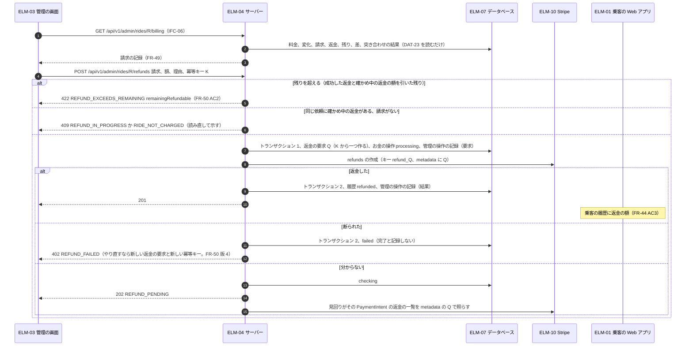
```mermaid
sequenceDiagram
  autonumber
  participant BO as ELM-03 管理の画面
  participant SRV as ELM-04 サーバー
  participant DB as ELM-07 データベース
  participant ST as ELM-10 Stripe
  participant PA as ELM-01 乗客の Web アプリ
  BO->>SRV: GET /api/v1/admin/rides/R/billing（IFC-06）
  SRV->>DB: 料金、変化、請求、返金、残り、差、突き合わせの結果（DAT-23 を読むだけ）
  SRV-->>BO: 請求の記録（FR-49）
  BO->>SRV: POST /api/v1/admin/rides/R/refunds 請求、額、理由、冪等キー K
  alt 残りを超える（成功した返金と確かめ中の返金の額を引いた残り）
    SRV-->>BO: 422 REFUND_EXCEEDS_REMAINING remainingRefundable（FR-50 AC2）
  else 同じ依頼に確かめ中の返金がある、請求がない
    SRV-->>BO: 409 REFUND_IN_PROGRESS か RIDE_NOT_CHARGED（読み直して示す）
  else
    SRV->>DB: トランザクション 1、返金の要求 Q（K から一つ作る）、お金の操作 processing、管理の操作の記録（要求）
    SRV->>ST: refunds の作成（キー refund_Q、metadata に Q）
    alt 返金した
      SRV->>DB: トランザクション 2、履歴 refunded、管理の操作の記録（結果）
      SRV-->>BO: 201
      Note over PA: 乗客の履歴に返金の額（FR-44 AC3）
    else 断られた
      SRV->>DB: トランザクション 2、failed（完了と記録しない）
      SRV-->>BO: 402 REFUND_FAILED（やり直すなら新しい返金の要求と新しい冪等キー。FR-50 版 4）
    else 分からない
      SRV->>DB: checking
      SRV-->>BO: 202 REFUND_PENDING
      SRV->>ST: 見回りがその PaymentIntent の返金の一覧を metadata の Q で照らす
    end
  end
```

### DRV-01 受け付け続ける

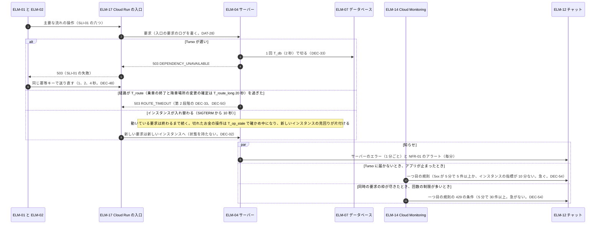
```mermaid
sequenceDiagram
  autonumber
  participant APP as ELM-01 と ELM-02
  participant IN as ELM-17 Cloud Run の入口
  participant SRV as ELM-04 サーバー
  participant DB as ELM-07 データベース
  participant MON as ELM-14 Cloud Monitoring
  participant CHAT as ELM-12 チャット
  APP->>IN: 主要な流れの操作（SLI-01 の六つ）
  IN->>SRV: 要求（入口の要求のログを書く。DAT-28）
  alt Turso が遅い
    SRV->>DB: 1 回 T_db（2 秒）で切る（DEC-33）
    SRV-->>IN: 503 DEPENDENCY_UNAVAILABLE
    IN-->>APP: 503（SLI-01 の失敗）
    APP->>IN: 同じ冪等キーで送り直す（1、2、4 秒。DEC-48）
  else 経路が T_route（乗車の終了と降車場所の変更の確定は T_route_long 20 秒）を過ぎた
    SRV-->>IN: 503 ROUTE_TIMEOUT（第 2 段階の DEC-33、DEC-50）
  else インスタンスが入れ替わる（SIGTERM から 10 秒）
    Note over SRV: 動いている要求は終わるまで続く。切れたお金の操作は T_op_stale で確かめ中になり、新しいインスタンスの見回りが片付ける
    IN->>SRV: 新しい要求は新しいインスタンスへ（状態を持たない。DEC-02）
  end
  par 知らせ
    SRV->>CHAT: サーバーのエラー（1 分ごと）と NFR-01 のアラート（毎分）
  and Turso に届かないとき、アプリが止まったとき
    MON->>CHAT: 一つ目の規則（5xx が 5 分で 5 件以上か、インスタンスの指標が 10 分ない。急ぐ。DEC-54）
  and 同時の要求の枠が尽きたとき、回数の制限が多いとき
    MON->>CHAT: 一つ目の規則の 429 の条件（5 分で 30 件以上。急がない。DEC-54）
  end
```

### DRV-02 状態の変化を届ける

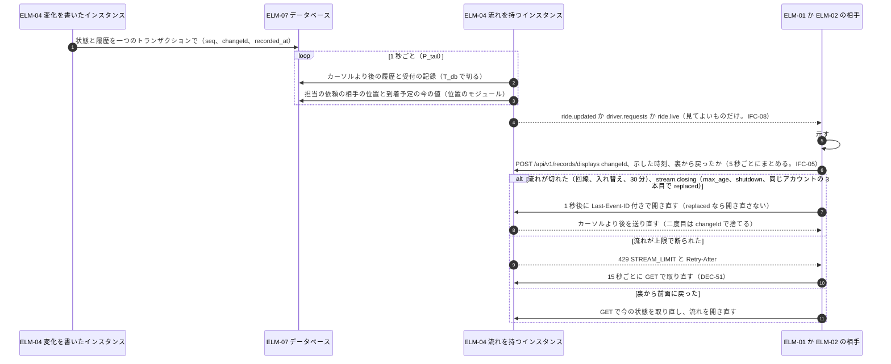
```mermaid
sequenceDiagram
  autonumber
  participant W as ELM-04 変化を書いたインスタンス
  participant DB as ELM-07 データベース
  participant S as ELM-04 流れを持つインスタンス
  participant APP as ELM-01 か ELM-02 の相手
  W->>DB: 状態と履歴を一つのトランザクションで（seq、changeId、recorded_at）
  loop 1 秒ごと（P_tail）
    S->>DB: カーソルより後の履歴と受付の記録（T_db で切る）
    S->>DB: 担当の依頼の相手の位置と到着予定の今の値（位置のモジュール）
  end
  S-->>APP: ride.updated か driver.requests か ride.live（見てよいものだけ。IFC-08）
  APP->>APP: 示す
  APP->>S: POST /api/v1/records/displays changeId、示した時刻、裏から戻ったか（5 秒ごとにまとめる。IFC-05）
  alt 流れが切れた（回線、入れ替え、30 分）、stream.closing（max_age、shutdown、同じアカウントの 3 本目で replaced）
    APP->>S: 1 秒後に Last-Event-ID 付きで開き直す（replaced なら開き直さない）
    S-->>APP: カーソルより後を送り直す（二度目は changeId で捨てる）
  else 流れが上限で断られた
    S-->>APP: 429 STREAM_LIMIT と Retry-After
    APP->>S: 15 秒ごとに GET で取り直す（DEC-51）
  else 裏から前面に戻った
    APP->>S: GET で今の状態を取り直し、流れを開き直す
  end
```

### DRV-03 現在地の新しさ

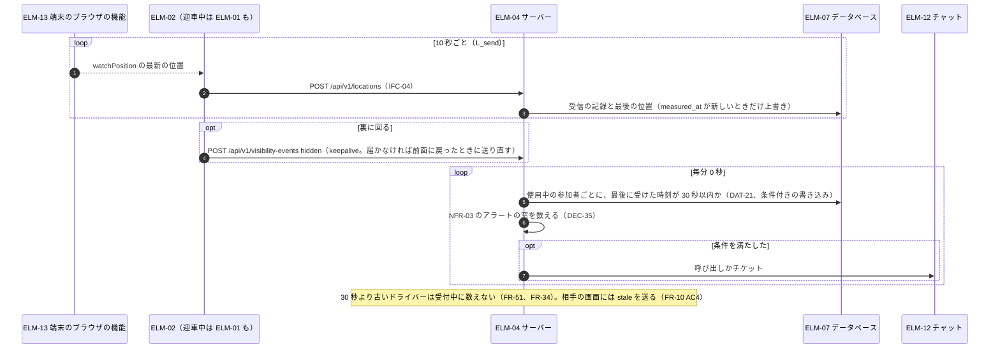
```mermaid
sequenceDiagram
  autonumber
  participant BC as ELM-13 端末のブラウザの機能
  participant APP as ELM-02（迎車中は ELM-01 も）
  participant SRV as ELM-04 サーバー
  participant DB as ELM-07 データベース
  participant CHAT as ELM-12 チャット
  loop 10 秒ごと（L_send）
    BC-->>APP: watchPosition の最新の位置
    APP->>SRV: POST /api/v1/locations（IFC-04）
    SRV->>DB: 受信の記録と最後の位置（measured_at が新しいときだけ上書き）
  end
  opt 裏に回る
    APP->>SRV: POST /api/v1/visibility-events hidden（keepalive。届かなければ前面に戻ったときに送り直す）
  end
  loop 毎分 0 秒
    SRV->>DB: 使用中の参加者ごとに、最後に受けた時刻が 30 秒以内か（DAT-21、条件付きの書き込み）
    SRV->>SRV: NFR-03 のアラートの窓を数える（DEC-35）
    opt 条件を満たした
      SRV->>CHAT: 呼び出しかチケット
    end
  end
  Note over SRV: 30 秒より古いドライバーは受付中に数えない（FR-51、FR-34）。相手の画面には stale を送る（FR-10 AC4）
```

### DRV-04 お金を一度だけ（毎日の処理）

```mermaid
sequenceDiagram
  autonumber
  participant SCH as ELM-19 Cloud Scheduler
  participant B as ELM-05 毎日の処理
  participant DB as ELM-07 データベース
  participant ST as ELM-10 Stripe
  participant LOG as ELM-08 Cloud Logging
  participant CHAT as ELM-12 チャット
  participant MON as ELM-14 Cloud Monitoring
  SCH->>B: 06:00 に起動（IFC-10。デモの期間だけ）
  loop 終わっていない日ごと（古い日から）
    B->>DB: 確かめ中のお金の操作のリースを取る
    B->>ST: 照らす。起きていれば記録、24 時間の内で保たれた失敗がなければ同じキー、過ぎたか 5xx の後なら起きていないと確かめてから新しいキー（DEC-12 (d)）。手配をやめた依頼の押さえが見つかれば取り消す（DEC-52）
    B->>DB: 手配から T_request_max を過ぎて残った searching の依頼を、配車のモジュールでシステムの取り消しにし、押さえを取り消す（FR-08 版 2。第 2 段階の DEC-37 の (A)）
    B->>ST: 前日の PaymentIntent と返金の一覧（日本時間の日）
    B->>DB: 依頼ごとに比べ、突き合わせの結果を追記（DAT-23、FR-55）
    opt 一致しない、NFR-07 の誤り（押さえ直しの後に残る古い押さえ、手配をやめた依頼や取り消した依頼に残る押さえ、システムの取り消しへのキャンセル料を含む。NFR-07 版 3）
      B->>CHAT: 1 件ごとに知らせる（エンジニアと運営）
    end
    B->>DB: 履歴の確かめ、毎日の監視、SLI-02〜05 の集計
    B->>LOG: 入口の要求のログとアプリのログを読む（IFC-20、SLI-01）
    B->>DB: 保存期間の処理（FR-53）、期間の要約（(A) と (B) の件数、最後の回の印。DAT-24）
  end
  alt どれかが終わらない
    B->>CHAT: 知らせ
    B-->>SCH: 失敗として終わる（DEC-17）
    MON->>CHAT: 二つ目の規則（遅くとも 07:35 ごろ）
  else すべて終わった
    B->>CHAT: 毎日の結果（(A) と (B) の件数、期間を終えられるか）
    opt 最後の回の印があり、(A) も (B) も 0 件
      B->>SCH: 定時の起動を止める（自分のサービスアカウントの権限だけ。第 2 段階の DEC-34・37）
      B->>MON: 二つ目の規則を止める
      B->>DB: 期間を終えたと DAT-24 と DAT-26 に書く
      B->>CHAT: 期間を終えた
    end
    opt (B) が残る（許諾の後の終わっていない依頼）
      B->>CHAT: 待たずに「サービスを開いて参加者に依頼を終えてもらうか、強いて終える」と知らせる（人が動くまで毎朝）
    end
  end
```

### DRV-05 割り当ての規則

```mermaid
sequenceDiagram
  autonumber
  participant D1 as ELM-02 ドライバー 1
  participant D2 as ELM-02 ドライバー 2
  participant SRV as ELM-04 サーバー
  participant DB as ELM-07 データベース
  participant BO as ELM-03 管理の画面
  par ほぼ同時の許諾
    D1->>SRV: POST /api/v1/driver/requests/R/accept
    D2->>SRV: POST /api/v1/driver/requests/R/accept
  end
  SRV->>DB: D1 のトランザクション、state searching かつ version v を条件に担当を書く
  SRV->>DB: D2 のトランザクション、同じ条件で書く（条件が外れて 0 行）
  SRV-->>D1: 200
  SRV-->>D2: 409 ALREADY_TAKEN（FR-20 AC2）
  Note over SRV,DB: 停止、迎車中でない、しきい値と評価の件数も同じトランザクションで確かめ直す（DEC-09）
  BO->>SRV: POST /api/v1/admin/drivers/D1/suspend
  SRV->>DB: 停止と変化の記録
  SRV-->>D1: driver.status suspended と driver.requests 空（FR-47）
  D1->>SRV: 一覧を開いたまま許諾する
  SRV-->>D1: 403 DRIVER_SUSPENDED（QR-16）
```

### DRV-07 iOS の Safari の前面と裏

```mermaid
sequenceDiagram
  autonumber
  participant APP as ELM-02 ドライバーの Web アプリ
  participant BC as ELM-13 iOS の Safari
  participant SRV as ELM-04 サーバー
  APP->>BC: 受付を始めるタップで wakeLock と音の準備
  BC-->>APP: visibilitychange hidden（ほかのアプリ、画面を消した）
  APP->>SRV: POST /api/v1/visibility-events hidden（keepalive）
  Note over BC: 裏では位置と流れが止まる（TC-09）
  BC-->>APP: visibilitychange visible
  APP->>SRV: POST /api/v1/visibility-events visible（hidden が届いていなければ一緒に）
  APP->>BC: wakeLock をもう一度（FR-52 AC3）
  opt 使えない、失敗
    APP->>APP: 画面が消えると更新が止まることを示す（FR-52 AC4）
  end
  APP->>SRV: GET /api/v1/driver/rides/active と GET /api/v1/driver/requests（FR-17 AC4）
  APP->>SRV: 流れを Last-Event-ID 付きで開き直す
  APP->>BC: watchPosition を続け、次の 10 秒で位置を送る
```

### DRV-27 測定点の記録

```mermaid
sequenceDiagram
  autonumber
  participant APP as ELM-01 と ELM-02
  participant IN as ELM-17 Cloud Run の入口
  participant SRV as ELM-04 サーバー
  participant DB as ELM-07 データベース
  participant LOG as ELM-08 Cloud Logging
  participant B as ELM-05 毎日の処理
  APP->>IN: 要求（traceparent と X-Client-Trace-Id）
  IN->>LOG: 入口の要求のログ（trace、spanId、状態の符号、時間。SLI-01）
  IN->>SRV: 要求（X-Cloud-Trace-Context）
  SRV->>DB: 状態と履歴（SLI-05、SLI-02 の記録の時刻）
  SRV->>LOG: request.completed（trace、spanId、route_id、account_kind）
  APP->>SRV: 表示の記録（SLI-02）、前面と裏（SLI-02 と SLI-03 の除外）、位置（SLI-03）、ブラウザのエラー（FR-38）
  SRV->>DB: 毎分の位置の確かめと 1 分ごとの数（DAT-21）
  B->>LOG: 前日の入口のログとアプリのログを読み、trace と spanId で結んでテスト用を除く（SLI-01）
  B->>DB: SLI-02〜05 を記録から数える（DAT-25）と突き合わせ（SLI-04）。SLI-03 は受信の記録、受付と状態、前面と裏、配備の記録のデモの回の開け閉めから確かめ直す（SLI-03 版 2）。SLI-05 は場所で行う四つの操作に位置か得られなかった印、ほかの変化に時刻と操作した人があればそろったと数える（SLI-05 版 2）
```

### DRV-29 守る

```mermaid
sequenceDiagram
  autonumber
  actor X as 攻撃者か参加者でない人（URL を見た人。PC-06）
  participant SRV as ELM-04 サーバー
  participant DB as ELM-07 データベース
  X->>SRV: POST /api/v1/auth/signup（乗客の登録）
  SRV-->>X: 404（経路がない。アカウントは運営・サポート担当が参加者にだけ作る。招待制）
  X->>SRV: ログインなしで /api/v1/passenger の経路
  SRV-->>X: 401 UNAUTHENTICATED（ログインより先に進めない）
  X->>SRV: GET /api/v1/config（ログインなし）
  SRV-->>X: 200（地図のブラウザの鍵は入れない。第 2 段階の DEC-21 版 5）
  X->>SRV: 設定の符号の推し量り（POST /api/v1/auth/setup）
  SRV-->>X: 400 SETUP_CODE_INVALID、10 回で 429 RATE_LIMITED（IP ごと 1 時間に 10 回。符号は推し量れない長さの乱数で 24 時間。DEC-55）
  X->>SRV: 他人の依頼 ID で GET /api/v1/passenger/rides/R
  SRV->>DB: セッションと依頼の持ち主を確かめる
  SRV-->>X: 404 NOT_FOUND（他人のものもないものと同じ）
  X->>SRV: 額を書き換えた取り消し
  SRV-->>X: 409 CANCELLATION_FEE_CHANGED（額はサーバーが決める。DEC-41）
  X->>SRV: ほかのサイトからの POST
  SRV-->>X: 403 FORBIDDEN（Origin。SameSite Strict のクッキーも付かない。DEC-43）
  X->>SRV: 乗客の役割で /api/v1/admin
  SRV-->>X: 403 FORBIDDEN（経路のまとまりで役割を確かめる。DEC-20）
  X->>SRV: ログインの総当たり
  SRV->>DB: 失敗の数（アカウントと IP の組。DAT-01）
  SRV-->>X: 429 ACCOUNT_LOCKED（同じ組で 5 回続けて失敗すると、その組を 15 分。本人は別の IP から入れる。第 2 段階の DEC-20）
  X->>SRV: 場所の検索と見積もりを繰り返す
  SRV-->>X: 429 RATE_LIMITED（アカウントごと。DEC-55）
  X->>SRV: 流れを多く開く（ログインした人だけが開ける）
  SRV-->>X: 429 STREAM_LIMIT（アカウントごと 2、IP ごと 6、全体 40。流れの優先は持たない。第 2 段階の DEC-21 版 5）
  X->>SRV: 手配したドライバーを装い、乗客から聞いた確認コードで POST /api/v1/driver/rides/R/start
  SRV-->>X: 404 NOT_FOUND（担当のドライバーのアカウントでない。乗客の画面は乗車中に変わらない。第 2 段階の DEC-30）
  Note over SRV: 管理とエンジニアの経路はパスキーが済んだセッションだけ。管理の操作（参加者のアカウントの作成と設定の符号の出し直しを含む）は担当とともに記録（DEC-31）。ログインより前の入口への多くの IP からの大量の要求は、IP ごとの制限と最大のインスタンスで費用だけを縛る（残る危険。第 2 段階の DEC-21 版 5。一つ目の規則の 429 の条件が急がない知らせで気づかせる。DEC-54）
```

### 制約と原則の主な要求

場面を持たない主な要求（制約）は、次のインタフェースの決まりに表れる。

| DRV | インタフェースでの表れ |
|---|---|
| DRV-17 技術 | OpenAPI の型を packages/contracts で共有する（DEC-26）。React と Hono の上で、どの仕様も TypeScript の型にできる形（JSON Schema 2020-12） |
| DRV-18 デモの回だけ | 手元では http://localhost:8080 で同じ仕様（servers）。サービスがないときに動くもの（IFC-10、IFC-11）は API を使わない |
| DRV-20 Web アプリだけ | 端末の機能は IFC-18 の四つだけ。安全な文脈（HTTPS か localhost） |
| DRV-21 個人情報 | URL に入れない（DEC-47）。ログに書かない（DEC-44）。座標は位置のモジュールだけが返す（IFC-04、IFC-07、IFC-08）。Stripe に送らない（IFC-13）。保持期間（DAT の保持期間の列） |
| DRV-22 カードの情報 | IFC-14 だけで入れ、サーバーの API の型にカードの欄がない |
| DRV-24 アクセシビリティ | 画面のインタフェース（IFC-23〜29）の決まり。ドラッグしない代わり（DEC-24）は地図が出ないときも使う（IFC-16） |
| DRV-25 役割 | 経路のまとまりで役割を確かめる（/api/v1/admin、/api/v1/engineer。DEC-47）。パスキーが済んだセッションだけ（DEC-43） |
| DRV-26 一人と費用 | 共通の約束事を一つにし、仕様書を道具で確かめる。回数の制限（DEC-55）。読み出しの増え方は FND-28 |
| DRV-30〜33（原則） | お金の操作はすべて冪等（DEC-48）。状態は配車のモジュールだけが書く（DAT-06、DAT-07）。ログとエラーの記録に座標を書かない（DEC-44）。毎日の処理は終わっていない日を続ける（IFC-10） |

## 遅延の予算

時刻のしきい値を持つ SLO は NFR-02 と NFR-03 の二つ。時刻のしきい値を持つ監視と確かめ（NFR-24、NFR-25、NFR-06、NFR-33）も同じ形で見た。予算は直列の区間それぞれに、目標の外れの割合を区間の数で分けたパーセンタイルで割り当てた（flows-and-budgets.md）。数はすべて作業用のスクリプト `budget.py` で計算した（出力は節の終わり）。予算はタイムアウトではない。タイムアウトは DEC-50 で別に決めた。

### NFR-02（SLI-02。状態の変化を記録した時刻から相手の画面に示した時刻まで 5 秒、95%）

測る区間は、状態の履歴の recorded_at（サーバーの時計）から、ブラウザが示した時刻（サーバーが受けた時刻を上限にする）まで。

| 区間 | 予算（99 パーセンタイル。5 区間） | もと |
|---|---|---|
| 次の追いかけまでの待ち | 1.00 秒 | P_tail（DEC-03）。上限で数える |
| 追いかけの読み出し（Turso） | 0.20 秒 | 仮。DEC-33 の見込み 0.1 秒の 2 倍 |
| 相手の選び分けと SSE への書き出し | 0.05 秒 | 仮 |
| 携帯の回線で端末に届く | 2.00 秒 | 入力にない。仮 |
| 受け取り、描画、表示の時刻の記録 | 0.20 秒 | 仮 |
| 余り | 1.55 秒 | |
| 合計 | 5.00 秒 | NFR-02 のしきい値 |

新しい依頼がドライバーの一覧に出る場合は、そのドライバーに示してよい一覧の読み出し（0.20 秒）が加わる。6 区間で 99.17 パーセンタイルに割り当て、和は 3.65 秒、余りは 1.35 秒。一覧を知らせだけにして画面が取り直す案（DEC-51 で退けた案）は 7 区間、和 4.70 秒、余り 0.30 秒になる。

携帯の回線の区間の 99 パーセンタイルは入力になく、測ってもいない。そこで、最初のデモの前の通しの確かめ（NFR-20 の実機の確かめと同じ機会。iPhone 2 台、携帯の回線）で、FR-54 の表示の記録から SLI-02 を測ることを関門にする。「遅延の予算は満たす」と言えるのは、その値が出てからになる。

### NFR-03（SLI-03。毎分の確かめで、最後に届いた位置が 30 秒以内、95%）

L_send（10 秒）ごとに送り、受けた時刻で数える。続けて 1 回届かなくても新しい。2 回続けて届かないと、二つの位置が届くまでの時間の差の分だけ古い時間ができ、毎分の確かめがそこに当たると古いと数える（当たる見込みは差 ÷ 60）。3 回続けて届かないと古い。一回の送信の予算は「次の送信より前に届くこと」で、遅れた送信は次の送信と重ならないよう捨てる（IFC-04）。30 秒の新しさは、位置の写しをほかに持たない（配信は 1 秒ごとに最後の位置を読む）ことで守る。

### NFR-24（手配の画面の要求で 3 秒を超えたものが 1 時間に 5% 以下。入口の時間）

| 要求 | 区間（予算のパーセンタイル） | 予算の和 | タイムアウトまで待った最悪 |
|---|---|---|---|
| 場所の検索 | ELM-04 0.15 秒、Places 1.00 秒（97.5） | 1.15 秒 | 2.15 秒 |
| 場所の候補の位置（再実行で足した。FND-35） | ELM-04 0.15 秒、Places 1.00 秒（97.5） | 1.15 秒 | 2.15 秒 |
| 見積もり | ELM-04 0.15 秒、Routes 1.00 秒、見積もりの書き込み 0.20 秒（98.33） | 1.35 秒 | 2.35 秒 |
| 手配の確定 | ELM-04 とトランザクション 1 0.20 秒、Stripe 1.50 秒、トランザクション 2 0.10 秒（98.33） | 1.80 秒 | 2.85 秒（第 2 段階の 2.7 秒にセッションの読み出し 0.1 秒を足した） |

Places、Routes、Stripe の値は入力になく、仮の値。最初のデモの前の NFR-44 の確かめで測る（DEC-50）。NFR-24 が数える四つの経路と、入口のログの見出し x-route-id の値は「測定点」の表（passenger.places.search、passenger.places.resolve、passenger.estimates.create、passenger.rides.create）。

### NFR-25（乗車の終了から請求の結果の記録まで、どの乗車も 10 秒以内）

どの乗車もなので、パーセンタイルではなく最悪で見た。Stripe の確定 3 回 × 2.5 秒と待ち 1.5 秒で 9.0 秒、二つのトランザクションを足して 9.2 秒（余り 0.8 秒）。Turso が遅く二つとも T_db で止まると 13.0 秒で、NFR-25 が知らせる（異常として知らせてよい。第 2 段階）。数え方は NFR-25 版 3 のとおり、状態の履歴の ended から請求の結果（charged か charge_failed）の早い方までで、10 秒の内にどちらもない乗車（確かめ中）も超えたと数える（FND-35）。経路の上限は T_route_long（20 秒）で、要求の中の最悪 9.35 秒（Turso が遅いと 15.05 秒）より 4.95 秒以上長く、ブラウザは 25 秒で切る（第 2 段階の DEC-33、DEC-50）。

### NFR-06（前日分の突き合わせと履歴の確かめ。8:30 に終わっていなければ知らせる）

06:00 に始め、一回の上限 45 分 × 2 回で遅くとも 07:30 に終わるか失敗する。指標が見えるまでの遅れと知らせで 07:35 ごろ、8:30 まで 55 分。処理ごとの上限（DEC-53）の和は 42 分で、一回の上限 45 分の内。

### NFR-33（試験用のエラーから 5 分以内に知らせが届く）

サーバーのエラーは最悪 87 秒（1 分のまとめ、チャットへの送信 5 秒 × 4 回と待ち 7 秒）。ブラウザのエラーは、記録の送信を足して最悪 102 秒。どちらも 300 秒の内。

### 失敗したときの流れとエラーバジェット

| SLO | 28 日の有効な出来事（PC-05 の規模） | 許容される失敗の件数 | 失敗したときの流れの扱い |
|---|---|---|---|
| NFR-01（99%） | 8〜144 件 | 0.08〜1.44 件 | 1 件の 503 でも使い切りうる。Turso の障害、インスタンスの入れ替え、T_route の超えは、どれも 1 件ずつ振り返る（EBP-01 の最後の規則）。送り直し（DEC-48）は参加者の操作を救うが、SLI-01 は要求ごとに数えるので失敗は消えない |
| NFR-02（95%） | 6〜15 組（デモ全体） | 0.30〜0.75 件 | 30 分ごとのつなぎ直しに当たる見込みは一つの変化で 0.11%、デモ全体で 0.017 組で、件数の内。流れを上限で断られると、15 秒ごとの問い合わせの間の変化は遅いと数える（参加者でない人の利用で起きうる。FND-23） |
| NFR-03（95%） | 一回の回で 186〜225 回 | 9.3〜11.2 回（一回の回） | 位置の送信が 30 秒止まれば 3 回が古くなる。裏の時間は除く（裏に回った時刻が遅れて届くときの扱いは FND-24） |

この規模では、許容される失敗の件数が NFR-01 と NFR-02 で 1 件ほどかそれ未満なので、失敗したときの流れを「件数の内に収める」設計はできない。これは第 2 段階の品質チェーンへの課題 4 と同じで、第 1 段階の質問 13 で品質チェーンは直さないと決まっている。設計ができるのは、起きる見込みを下げることと、起きたら知らせて 1 件ずつ振り返れるよう記録を残すこと（DRV-27）だけ。

### スクリプトの出力

```text
## NFR-02（SLI-02。記録した時刻から相手の画面に示した時刻まで 5 秒、95%）
### A: 依頼の状態の変化（許諾、取り消し、探し直し、迎車の到着）
しきい値 5.0 秒、目標 95%、直列の区間 5 個 → 各区間の予算は 99.00 パーセンタイル
  - 次の追いかけまでの待ち（P_tail）: 1.00 秒（DEC-03。一様に 0〜1 秒、上限で数える）
  - 追いかけの読み出し（Turso）: 0.20 秒（仮。DEC-33 の見込み 0.1 秒の 2 倍）
  - 相手の選び分けと SSE への書き出し（ELM-04）: 0.05 秒（仮。第 2 段階の見込み）
  - 携帯の回線で端末に届く: 2.00 秒（入力にない。実機で測る（下の確かめ））
  - ブラウザの受け取り、描画、表示の時刻の記録: 0.20 秒（仮）
  合計 3.45 秒、余り 1.55 秒（しきい値の 31%）

### B: 新しい依頼がドライバーの一覧に出る（DEC-51: 一覧を丸ごと送る）
しきい値 5.0 秒、目標 95%、直列の区間 6 個 → 各区間の予算は 99.17 パーセンタイル
  - 次の追いかけまでの待ち（P_tail）: 1.00 秒（DEC-03）
  - 追いかけの読み出し（Turso）: 0.20 秒（仮）
  - そのドライバーに示してよい依頼の読み出し（Turso）: 0.20 秒（仮。FR-16、FR-34 の条件）
  - SSE への書き出し: 0.05 秒（仮）
  - 携帯の回線で端末に届く: 2.00 秒（入力にない）
  - 描画と表示の時刻の記録: 0.20 秒（仮）
  合計 3.65 秒、余り 1.35 秒（しきい値の 27%）

### C（退けた案）: 知らせだけ送り、画面が一覧を取り直す
しきい値 5.0 秒、目標 95%、直列の区間 7 個 → 各区間の予算は 99.29 パーセンタイル
  - 次の追いかけまでの待ち（P_tail）: 1.00 秒（DEC-03）
  - 追いかけの読み出し（Turso）: 0.20 秒（仮）
  - SSE への書き出し: 0.05 秒（仮）
  - 携帯の回線で知らせが届く: 2.00 秒（入力にない）
  - 一覧の要求の往復（携帯の回線）: 1.00 秒（入力にない。仮）
  - 一覧の読み出し（ELM-04 と Turso）: 0.25 秒（仮）
  - 描画と表示の時刻の記録: 0.20 秒（仮）
  合計 4.70 秒、余り 0.30 秒（しきい値の 6%）

## NFR-03（SLI-03。毎分の確かめで、最後に届いた位置が 30 秒以内、95%）
送る間隔 L_send 10 秒、T_loc_fresh 30 秒。届いた位置の間が T を超えると古い。
  続けて 0 回届かない: 届いた位置の間は 10 秒（それぞれの届くまでの時間の差を除く）→ 新しい
  続けて 1 回届かない: 届いた位置の間は 20 秒（それぞれの届くまでの時間の差を除く）→ 新しい
  続けて 2 回届かない: 届いた位置の間は 30 秒（それぞれの届くまでの時間の差を除く）→ 境目（下の注）
  続けて 3 回届かない: 届いた位置の間は 40 秒（それぞれの届くまでの時間の差を除く）→ 古い
  注: 2 回続けて届かないと間は 30 秒 + （次が届くまでの時間 − 前が届くまでの時間）。この差の秒数だけ古い時間ができ、毎分の確かめがそこに当たると古いと数える（当たる見込みは差 ÷ 60）
  一回の送信の予算: 次の送信（10 秒後）より前に届くこと。届くまでの上限は T_route（10 秒）なので、遅れた送信は次の送信と重ならないよう捨てる

## NFR-24（手配の画面の要求が 3 秒を超えるのが 1 時間に 5% 以下。入口の時間で測る）
### 場所の検索（POST /api/v1/passenger/places/search）
しきい値 3.0 秒、目標 95%、直列の区間 2 個 → 各区間の予算は 97.50 パーセンタイル
  - ELM-04 の処理（セッションの確かめを含む）: 0.15 秒（仮。Turso の読み出し 1 回を含む）
  - Places API の候補: 1.00 秒（入力にない。タイムアウトは 2 秒（DEC-22））
  合計 1.15 秒、余り 1.85 秒（しきい値の 62%）
  タイムアウトまで待った最悪は 0.15 + 2.00 = 2.15 秒

### 場所の候補の位置（POST /api/v1/passenger/places/resolve）
しきい値 3.0 秒、目標 95%、直列の区間 2 個 → 各区間の予算は 97.50 パーセンタイル
  - ELM-04 の処理（セッションの確かめを含む）: 0.15 秒
  - Places API の位置と住所: 1.00 秒
  合計 1.15 秒、余り 1.85 秒（しきい値の 62%）
  タイムアウトまで待った最悪は 0.15 + 2.00 = 2.15 秒
（再実行の分は作業用の `budget_rerun.py`。乗車の終了: ふだんの最悪 9.35 秒、Turso が T_db で止まると 15.05 秒、T_route_long 20 秒との差 4.95 秒。降車場所の変更の確定: 5.45 秒、13.05 秒、差 6.95 秒。ブラウザ 25 秒は T_route_long より 5.00 秒長い）

### 見積もり（POST /api/v1/passenger/estimates）
しきい値 3.0 秒、目標 95%、直列の区間 3 個 → 各区間の予算は 98.33 パーセンタイル
  - ELM-04 の処理（セッション、運賃の計算）: 0.15 秒（仮）
  - Routes API の経路: 1.00 秒（入力にない。タイムアウトは 2 秒（DEC-22））
  - 見積もりの書き込み（Turso）: 0.20 秒（仮）
  合計 1.35 秒、余り 1.65 秒（しきい値の 55%）
  タイムアウトまで待った最悪は 0.15 + 2.00 + 0.20 = 2.35 秒

### 手配の確定（POST /api/v1/passenger/rides）
しきい値 3.0 秒、目標 95%、直列の区間 3 個 → 各区間の予算は 98.33 パーセンタイル
  - ELM-04 の処理と一つ目のトランザクション（セッション、操作キー、処理中）: 0.20 秒（仮。Turso 2 回）
  - Stripe の押さえ: 1.50 秒（入力にない。タイムアウトは 2.5 秒（DEC-12）。NFR-44 の確かめで測る）
  - 二つ目のトランザクション（依頼、履歴、最初の結果）: 0.10 秒（仮）
  合計 1.80 秒、余り 1.20 秒（しきい値の 40%）
  タイムアウトまで待った最悪は 0.05 + 3 × 0.1 + 2.5 = 2.85 秒（第 2 段階の 2.7 秒にセッションの読み出しを足した）

## NFR-25（乗車の終了から請求の結果の記録まで 10 秒を超えた乗車が 1 件でもあれば知らせる。どの乗車も、なので最悪で見る）
  Stripe の確定 3 回 × 2.5 秒 + 待ち 1.5 秒 = 9.0 秒
  一つ目と二つ目のトランザクション 2 × 0.1 秒を足して 9.2 秒（余り 0.8 秒）
  Turso が遅く二つとも T_db（2 秒）で止まると 13.0 秒で 10 秒を超え、NFR-25 が知らせる（異常として知らせてよい。第 2 段階）

## 処理中を確かめ中とみなすまでの時間 T_op_stale
  経路が T_route（10 秒）で切られても、処理は自分の呼び出しが終わるまで続く。最長は 13.0 秒（降車の確定で二つのトランザクションが T_db で止まったとき。FND-21 の計算と同じ）
  T_op_stale = 30 秒は最長の 2.3 倍。これより短いと、まだ動いている操作の確かめが始まる

## ブラウザのタイムアウト
  SSE 以外の要求は 15 秒。サーバーは T_route（10 秒）で必ず答えるので、その上に携帯の回線の 5 秒を足した（5 秒の余り）

## NFR-06（前日分の突き合わせと履歴の確かめが 9:00 までに終わり、8:30 に終わっていなければ知らせる）
  06:00 に始め、一回の上限 45 分 × 2 回で遅くとも 07:30 に終わるか失敗する（DEC-17）
  ジョブの指標は 60 秒ごとに取られ、最大 120 秒遅れて見える（Cloud Monitoring の指標の一覧）。合わせて 180 秒、知らせに 2 分として 07:35 ごろ。8:30 まで 55 分
  処理ごとの上限（仮）: 確かめ中のお金の操作を片付ける 5 分、Stripe との突き合わせ（FR-55） 15 分、履歴の確かめと毎日の監視 5 分、SLI の集計（入口のログの読み出しを含む） 10 分、保存期間の処理（FR-53） 5 分、期間を終える条件の記録と知らせ 2 分。合計 42 分で一回の上限 45 分の内（余り 3 分）
  ふだんの実行は数分（乗車 2〜6 回。PC-05）。追いつく日が多いときは、日ごとに同じ順で続ける

## NFR-33（試験用のエラーを起こしてから 5 分以内に知らせが届く）
  サーバーのエラー: 1 分ごとにまとめる（60 秒）+ チャットへの送信（5 秒 × 4 回 + 待ち 7 秒の最悪 27 秒）= 最悪 87 秒
  ブラウザのエラー: 記録の送信（すぐ送る。届かなければ前面に戻ったとき）+ 上と同じ。通信があれば最悪 102 秒（ブラウザのタイムアウト 15 秒を足す）
  どちらも 300 秒の内（余り 198 秒）

## 一つ目の Cloud Monitoring の規則が知らせるまで（DEC-54）
  Turso に届かないとき: 位置の送信だけで 2 人 × 6 回/分 = 12 件/分の 503。5 件目までに 25 秒
  指標の取り込み 60 秒 + 見えるまで 120 秒 + 評価 60 秒として、最初の 503 から 25 + 240 = 265 秒ほど（4 分半）

## エラーバジェットの件数（PC-05 の規模。第 2 段階の derive4.py の見込み）
  NFR-01（SLI-01、99%）: 28 日の有効な要求は 8〜144 件 → 許容される失敗の件数は 0.08〜1.44 件。1 ÷（1 − 0.99）= 100 件に届かないので、EBP-01 の最後の規則（1 件ずつ振り返る）
  NFR-02（SLI-02、95%）: デモ全体の組は 6〜15 組 → 0.30〜0.75 件。1 ÷ 0.05 = 20 組に届かないので同じ
  NFR-03（SLI-03、95%）: 一回の回の確かめは 186〜225 回 → 9.3〜11.2 回（回が 1〜4 回なので 28 日では 9.3〜45.0 回）

## 失敗したときの流れ（NFR-02）
  流れの 30 分ごとのつなぎ直し: つなぎ直しの間（1 秒の待ち + TLS と最初の応答で 1 秒ほど、仮に 2.0 秒）に起きた変化は、つなぎ直した後に届く。一つの変化が当たる見込みは 2.0/1800 = 0.11%
  デモ全体の 15 組で、当たる組の数の見込みは 0.017 組。許容される失敗の件数（0.30〜0.75 件）の内
  インスタンスの入れ替え: 流れが切れ、1 秒の待ちでつなぎ直し、最後の通し番号から送り直す。入れ替えは週に数回（Cloud Run の文書。第 2 段階）で、デモの回の 3 時間に当たる見込みは小さい
  流れが上限（40 本）で断られたとき: 15 秒ごとの問い合わせに移るので、その間の変化は最大 15 秒遅れ、遅いと数える。参加者でない人の利用で起きうる（FND-23）

## Turso の読み出し（DEC-51。第 2 段階の DEC-03 の見込みとの差）
  インスタンスが 1 秒ごとに 3 回（状態の履歴、ドライバーの受付の記録、相手の位置と到着予定の今の値）読む: デモの回 1 回で 32,400 回（第 2 段階の見込みは 10,800 回。3 倍）

## 地図の呼び出し（DEC-22 の場面に、依頼の内容の経路を足した）
  第 2 段階の見込み 189 回 + 依頼の内容のドライバーから乗車場所までの経路（乗車 3 回 × 見る回数 3 回まで。60 秒は許諾で使い回す）9 回 = 198 回
  Q_maps_day 1,000 回に 5.1 倍の余裕（第 2 段階は 5.3 倍）
```

## 画面

画面ごとの中身（目的、示すもの、受け取るもの、操作と移り先、エラーと空の状態）は IFC-23〜29 の項目に書いた。ここでは CUJ ごとの移り変わりを描く。箱の括弧はその画面のインタフェース。

### CUJ-01 配車手配（乗客）

```mermaid
flowchart TD
  L["ログイン（IFC-23。自分でアカウントを作る画面はない）"] -->|"ログインした"| B["手配（IFC-24）"]
  L -->|"設定の符号を受け取った、パスワードを忘れた"| SU["設定の符号でパスワードを決める（IFC-23）"]
  SU -->|"符号が違う、期限切れ、使用済み（運営・サポート担当に出し直しを頼む）"| SU
  SU -->|"決めた"| PM["支払い手段（IFC-23）"]
  L -->|"未払いがある"| U["未払いの支払い（IFC-23）"]
  B -->|"位置の許可がない、誤差が大きい、候補がない、経路がない、地図が使えない"| B
  B -->|"支払い手段がない"| PM
  PM -->|"登録した"| B
  B -->|"押さえられない、混み合っている（503）"| B
  B -->|"未払いがある"| U
  U -->|"払った、確かめ中"| B
  B -->|"手配した"| ST["手配の状況（IFC-24）"]
  B -->|"押さえの確かめ中（202 HOLD_PENDING）"| HC["確かめています（IFC-24。取り消せる）"]
  HC -->|"押さえたと分かった"| ST
  HC -->|"取り消した、T_hold_wait を過ぎた"| RL["手配をやめた（IFC-24。押さえが残っていれば解放します）"]
  RL -->|"解放した、押さえていないと分かった"| B
  ST -->|"T_match_wait を過ぎた、しきい値を下げた"| ST
  ST -->|"取り消した"| B
  ST -->|"T_request_max を過ぎた（システムの取り消し、料金なし）"| B
  ST -->|"許諾された"| PU["迎車中（IFC-24）"]
```

### CUJ-02 乗車（乗客）、CUJ-03 降車（乗客）

```mermaid
flowchart TD
  PU["迎車中（IFC-24。乗る前に確認コードを伝え、画面が乗車中に変わってから乗る）"] -->|"位置が届かない、到着予定がない"| PU
  PU -->|"画面が変わらない（手で取り直す）"| PU
  PU -->|"ドライバーが取り消した"| ST["手配の状況（IFC-24）"]
  PU -->|"取り消した（額を確かめる）"| B["手配（IFC-24）"]
  PU -->|"違う車を報告"| R["報告（IFC-25）"]
  PU -->|"不在で終わった（500 円か請求なし）"| NS["不在の結果（IFC-24）"]
  NS -->|"請求に失敗した"| U["未払いの支払い（IFC-23）"]
  PU -->|"運転が始まった（サーバーの記録を受けたときだけ）"| IR["乗車中（IFC-24）"]
  IR -->|"位置が古い、降車場所を変えられない"| IR
  IR -->|"変更を確かめています（取り消せる）"| DC["降車場所の変更を確かめ中（IFC-24）"]
  DC -->|"変更を当てた、取りやめた"| IR
  IR -->|"違う車を報告"| R
  IR -->|"乗車が終わった"| RS["到着と支払いの結果（IFC-24。保留の変更を取りやめたら、その旨）"]
  RS -->|"請求を確かめています"| RT["評価（IFC-25）"]
  RS -->|"未払い"| U
  U -->|"払った、確かめ中"| RT
  RS -->|"支払いの完了"| RT
  RT -->|"履歴（IFC-25）の未払いから"| U
```

### CUJ-04 ドライバーの評価、CUJ-05 評価のしきい値の設定

```mermaid
flowchart TD
  RT["評価（IFC-25）"] -->|"送った、もう評価した"| H["乗車の履歴（IFC-25）"]
  RT -->|"閉じた"| B["手配（IFC-24）"]
  TH["しきい値の設定（IFC-25）"] -->|"範囲の外"| TH
  TH -->|"設定した、解除した"| B
  H -->|"履歴がない"| H
  H -->|"報告する"| R["報告（IFC-25）"]
  R -->|"種類がない"| R
  R -->|"送った"| H
```

### CUJ-06 配車受付（ドライバー）

```mermaid
flowchart TD
  DL["ログインと設定の符号でパスワードを決める（IFC-26。POST /api/v1/auth/setup）"] -->|"符号が違う、期限切れ、使用済み（運営・サポート担当に出し直しを頼む）"| DL
  DL -->|"ログインした"| RC["受付（IFC-26）"]
  RC -->|"位置の許可がない、停止中、画面の点灯を使えない"| RC
  RC -->|"受付を始めた（画面の点灯を取る）"| LI["依頼の一覧（IFC-26）"]
  LI -->|"受付を止めた（画面の点灯を放す）"| RC
  LI -->|"依頼がない、走行中"| LI
  LI -->|"停止された"| RC
  LI -->|"選んだ"| DT["依頼の内容（IFC-26）"]
  DT -->|"許諾済み、取り消された、間に合わなかった、条件を満たさない、走行中"| LI
  DT -->|"許諾した"| PK["迎車中（IFC-27）"]
```

### CUJ-07 乗車（ドライバー）、CUJ-08 降車（ドライバー）、CUJ-09 受ける条件の設定

```mermaid
flowchart TD
  PK["迎車中（IFC-27）"] -->|"到着が遠い、コードが違う、不在が早すぎる、経路がない、取り消された・まだ到着していない（読み直す）"| PK
  PK -->|"乗客が取り消した、取り消した、不在で終えた"| LI["依頼の一覧（IFC-26）"]
  PK -->|"運転を始めた"| IR["乗車中（IFC-27）"]
  IR -->|"降車場所が変わった、終えるには遠い、経路がない（ピンだけ示す）"| IR
  IR -->|"終えた（完了、確かめ中、未払い。受付を止めたら画面の点灯を放す）"| LI
  LI -->|"受取額"| EA["受取額（IFC-27）"]
  EA -->|"まだない"| EA
  LI -->|"条件"| CO["受ける条件（IFC-27）"]
  CO -->|"ありえない値"| CO
  CO -->|"設定した"| LI
```

### CUJ-14 苦情への対応、CUJ-16 返金への対応（運営・サポート担当）

```mermaid
flowchart TD
  AL["ログイン、パスワードとパスキー（IFC-28）"] -->|"パスキーの失敗"| AL
  AL --> CL["苦情の一覧（IFC-28）"]
  CL -->|"該当する苦情がない"| CL
  CL --> CD["苦情の詳細（IFC-28）"]
  CD --> AC["対処の記録（IFC-28）"]
  AC -->|"内容がない"| AC
  AC -->|"記録した"| CL
  CD --> BI["請求と返金（IFC-28）"]
  BI -->|"残りを超える、断られた、確かめ中、Stripe と一致しない"| BI
  AL --> DR["ドライバー（IFC-28）"]
  DR -->|"欠けている、ナンバーが登録済み"| DR
  DR -->|"登録した、設定の符号を出し直した（一度だけ示す）"| DR
  AL --> PS["乗客のアカウント（IFC-28）"]
  PS -->|"欠けている、同じメールアドレス"| PS
  PS -->|"作った、設定の符号を出し直した（一度だけ示す）"| PS
  CD -->|"受信の記録がもうない（履歴の位置だけ示す）"| CD
  BI -->|"確かめ中の返金がある、請求がない"| BI
```

### CUJ-10 障害の原因の特定（エンジニア）

```mermaid
flowchart TD
  EL["ログイン（IFC-28 と同じ）"] --> SR["状態の履歴の検索（IFC-29）"]
  SR -->|"ない、範囲が広すぎる"| SR
  SR -->|"行のトレース ID"| LX["Logs Explorer（Google Cloud のコンソール）"]
  SR --> PO["依頼の位置（IFC-29）"]
  SR --> TA["テスト用の印（IFC-29）"]
```

## データ

```mermaid
erDiagram
  DAT-01 ||--o{ DAT-02 : "セッションとパスキー"
  DAT-01 ||--o| DAT-03 : "ドライバー"
  DAT-01 ||--o| DAT-12 : "支払い手段の参照"
  DAT-01 ||--o| DAT-16 : "しきい値と条件"
  DAT-01 ||--o| DAT-10 : "最後の位置"
  DAT-01 ||--o{ DAT-09 : "受信の記録"
  DAT-03 ||--|| DAT-04 : "受付と停止"
  DAT-03 ||--o| DAT-15 : "評価値"
  DAT-01 ||--o{ DAT-06 : "乗客の依頼"
  DAT-03 ||--o{ DAT-06 : "担当した依頼"
  DAT-05 ||--o| DAT-06 : "手配した見積もり"
  DAT-06 ||--o{ DAT-07 : "状態の履歴"
  DAT-07 ||--o{ DAT-08 : "位置（場所で行う四つの操作、降車場所の変更の前後）"
  DAT-06 ||--o{ DAT-13 : "お金の操作"
  DAT-06 ||--o{ DAT-11 : "経路の写し"
  DAT-06 ||--o| DAT-15 : "評価"
  DAT-06 ||--o{ DAT-17 : "苦情と対処"
  DAT-17 ||--o{ DAT-18 : "管理の操作の記録"
  DAT-07 ||--o{ DAT-19 : "表示の記録"
  DAT-06 ||--o{ DAT-23 : "突き合わせの結果"
  DAT-01 ||--o{ DAT-14 : "操作キー"
  DAT-27 ||--|| DAT-28 : "trace と spanId"
```

DAT-20〜22、24〜26、29 はほかの実体と ID でゆるく結ぶだけなので、図から外した。

| DAT | 実体 | 持ち主 | 置き場所 | 整合の取り方 | 保持期間 | 扱いの区分 | 根拠 |
|---|---|---|---|---|---|---|---|
| DAT-01 | アカウント | ELM-04 | ELM-07 | 認証のモジュールだけが書く。 | 名前、メールアドレス、パスワードのハッシュは、最後に使ってから T_pii_retention（3 年）を過ぎると消して匿名にする（FR-53）。残りはシステムを終えるとき（DEC-36） | 個人情報 | 推定 |
| DAT-02 | セッション、パスキー、一度だけの符号 | ELM-04 | ELM-07 | 認証のモジュールだけが書く。 | セッションは期限（DEC-43）か失効の後に毎日の処理が消す。パスキーと符号はアカウントと同じ | 個人情報 | 推定 |
| DAT-03 | ドライバーと車両 | ELM-04 | ELM-07 | 管理のモジュールだけが書く。 | 個人に結び付く部分は、記録してから T_pii_retention（3 年）を過ぎると毎日の処理が消して匿名にする（FR-53）。残りはシステムを終えるときに消す（DEC-36） | 個人情報 | 推定 |
| DAT-04 | ドライバーの受付と停止（今の状態と変化の記録） | ELM-04 | ELM-07 | 配車のモジュールだけが書く。 | 変化の記録は T_pii_retention（FR-17 の受付の時間、FR-47 AC4）を過ぎたら、毎日の処理が配車のモジュールを通して消す（FR-53）。今の状態はシステムを終えるとき | 個人情報 | 推定 |
| DAT-05 | 見積もり（手配と降車場所の変更） | ELM-04 | ELM-07 | 料金のモジュールだけが書く。 | 期限を過ぎるか使った後に、毎日の処理が経路の写しとともに消す | 個人情報 | 推定 |
| DAT-06 | 配車依頼 | ELM-04 | ELM-07 | 配車のモジュールだけが書く（DRV-31）。 | 個人に結び付く部分は、記録してから T_pii_retention（3 年）を過ぎると毎日の処理が消して匿名にする（FR-53）。残りはシステムを終えるときに消す（DEC-36） | 個人情報 | 推定 |
| DAT-07 | 配車依頼と乗車の状態の履歴 | ELM-04 | ELM-07 | 配車のモジュールが依頼の状態と同じトランザクションで追記するだけ（FR-39 AC3）。 | 変化の種類と時刻は残す。操作した人と位置の参照は T_pii_retention で消す（FR-53 AC1）。システムを終えるとき（DEC-36） | 個人情報 | 推定 |
| DAT-08 | 状態の履歴が参照する位置 | ELM-04 | ELM-07 | 位置のモジュールだけが読み書きする（DEC-15）。 | T_pii_retention を過ぎたら消す（FR-53） | 個人情報 | 推定 |
| DAT-09 | 位置の受信の記録 | ELM-04 | ELM-07 | 位置のモジュールが、サーバーで現在地を受けるたびに一行追記し（FR-17 AC2。同じ送信の ID の二度目は捨てる）、同じトランザクションで最後の位置（DAT-10）を更新する。 | T_log_retention（28 日、仮。DEC-14）。毎日の処理が消す | 個人情報 | 推定 |
| DAT-10 | 参加者ごとの最後の位置 | ELM-04 | ELM-07 | 位置のモジュールだけが書く。 | 乗客の分は示すのをやめるとき（FR-24 AC3）、ドライバーの分は受付を止めたとき（FR-17）に消す（DEC-14） | 個人情報 | 推定 |
| DAT-11 | Google の経路の写し | ELM-04 | ELM-07 | 地図のモジュールだけが書く。 | 依頼のその区間が終わるか見積もりの期限で消す（DEC-22。Google の規約の確かめは未解決の点） | 個人情報 | 推定 |
| DAT-12 | 支払い手段の参照 | ELM-04 | ELM-07 | 支払いのモジュールだけが書く。 | アカウントと同じ | 決済情報 | 推定 |
| DAT-13 | お金の操作（押さえ、確定、押さえの取り消し、返金、未払いの支払い） | ELM-04 | ELM-07 | 支払いのモジュールだけが書く。 | 額、種類、Stripe の ID は突き合わせのために残す。依頼の匿名化と一緒に個人への結び付きを消す。システムを終えるとき | 決済情報 | 推定 |
| DAT-14 | 操作キーと最初の結果 | ELM-04 | ELM-07 | 冪等性のモジュールだけが書く。 | 7 日（仮。T_idem_keep。DEC-48）。毎日の処理が消す | 個人情報 | 推定 |
| DAT-15 | 評価と評価値 | ELM-04 | ELM-07 | 評価のモジュールだけが書く。 | 乗客との結び付きは T_pii_retention で消す。評価値は残す | 個人情報 | 推定 |
| DAT-16 | 乗客のしきい値とドライバーの受ける条件 | ELM-04 | ELM-07 | 設定のモジュールだけが書く。 | T_pii_retention を過ぎたら、毎日の処理が設定のモジュールを通して消す（FR-53） | 個人情報 | 推定 |
| DAT-17 | 苦情（乗客の報告）と対処 | ELM-04 | ELM-07 | 苦情のモジュールだけが書く。 | T_pii_retention | 個人情報 | 推定 |
| DAT-18 | 管理の操作の記録 | ELM-04 | ELM-07 | 管理のモジュールが操作と同じトランザクションで追記するだけ（DEC-31）。 | 担当との結び付きは T_pii_retention で匿名にする（DEC-31）。システムを終えるとき | 個人情報 | 推定 |
| DAT-19 | 表示の記録、画面の出来事、前面と裏の時刻、断った操作 | ELM-04 | ELM-07 | 測るモジュールだけが書く。 | T_log_retention（毎日の処理が消す） | 個人情報 | 推定 |
| DAT-20 | ブラウザのエラーの記録 | ELM-04 | ELM-07 | 測るモジュールだけが書く。 | T_log_retention | 個人情報 | 推定 |
| DAT-21 | 1 分ごとの数、位置の確かめ、アラートの状態 | ELM-04 | ELM-07 | 測るモジュールだけが書く。 | T_log_retention | 個人情報 | 推定 |
| DAT-22 | 知らせの記録 | ELM-04 | ELM-07 | 知らせのモジュールだけが書く（ELM-05 は持ち主のモジュールを通して書く。DEC-53。毎日の処理の知らせの記録と、T_log_retention を過ぎた行の削除）。 | T_log_retention | 社内 | 推定 |
| DAT-23 | Stripe との突き合わせの結果 | ELM-05 | ELM-07 | 毎日の処理だけが追記する（FR-55 AC4。直した後の突き合わせは新しい結果として追記）。 | 個人情報を持たない。システムを終えるとき | 決済情報 | 推定 |
| DAT-24 | 毎日の処理の記録と期間の要約 | ELM-05 | ELM-07 | 毎日の処理だけが書く。 | システムを終えるとき | 社内 | 推定 |
| DAT-25 | SLI の日ごとの値 | ELM-05 | ELM-07 | 毎日の処理だけが書く。 | システムを終えるとき | 社内 | 推定 |
| DAT-26 | 配備と開け閉めの記録 | ELM-05 | ELM-07 | 運用のジョブの record-deploy が、配備の仕組み（ELM-06）の渡す引数で、手順の段の終わりに一行書く（配備の仕組みはデータベースの資格情報を持たない。第 2 段階の DEC-27 版 3・4、DEC-34 版 2。FR-41 AC2・4、FR-42 AC1）。 | システムを終えるとき | 社内 | 推定 |
| DAT-27 | アプリの構造化ログ | ELM-04 | ELM-08 | 一行ずつ書き、書き換えない。 | 30 日（Cloud Logging の既定。DEC-16） | internal（位置、連絡先、名前、自由記述、カードの情報を書かない。DEC-44） | 推定 |
| DAT-28 | Cloud Run の入口の要求のログ | ELM-17 | ELM-08 | Cloud Run の入口が書く（アプリは書かない）。 | 30 日（Cloud Logging の既定） | personal（IP アドレス） | 推定 |
| DAT-29 | データベースの書き出し | ELM-22 | ELM-23 | 手元の保守の手順だけが書く。 | 最新の二つ。システムを終えるときに消す（DEC-28、DEC-36） | personal（全員の個人情報と決済情報の記録） | 推定 |

持ち主の例外は一つだけで、第 2 段階の DEC-05 が決めた。ELM-05 は、ELM-04 の持つ実体（DAT-07 の匿名化、DAT-13 の確かめ中の片付け）を、同じ配車と支払いのモジュールのコードで書く。書くコードは一つで、同じ行を ELM-04 の見回りと ELM-05 が同時に片付けないよう、DAT-13 のリースで一つにする。

保持期間は、品質チェーンの T_pii_retention（3 年）と T_log_retention（28 日）、第 2 段階の決定（DEC-14、DEC-16、DEC-22、DEC-28、DEC-36）から取った。操作キーの 7 日（DEC-48）は個人情報の保持期間ではなく、送り直しのための設計上の値。

### ELM-05 が書くもの（FND-39）

ELM-05（毎日の処理のジョブと運用のジョブ）は、ELM-04 と同じイメージの同じドメインのモジュールを使う（第 2 段階の DEC-01）。ELM-04 が持ち主の実体を書くときは、必ずその持ち主のモジュールを通し、表を直接書かない（DEC-53）。持ち主は一つのまま（モジュールが一つ）で、動くプロセスが二つになるだけ。

| 実体 | 持ち主 | ELM-05 が書くこと | 通すモジュール |
|---|---|---|---|
| DAT-06 配車依頼、DAT-07 状態の履歴 | ELM-04 | 手配から T_request_max を過ぎて残った searching の依頼をシステムの取り消しにし、履歴に追記する（FR-08 版 2。第 2 段階の DEC-37 の (A)） | 配車のモジュール（条件付きの書き込み。DEC-09） |
| DAT-13 お金の操作 | ELM-04 | 確かめ中の片付け（照らして記録、同じキーか新しい試みで送る）、手配をやめた依頼と取り消した依頼の押さえの取り消し | 支払いのモジュール（リースを取る。DEC-12） |
| DAT-14 操作キーと最初の結果 | ELM-04 | pending の最初の結果を確定したものに替える、T_idem_keep を過ぎたキーを消す | 冪等性のモジュール |
| DAT-22 知らせの記録 | ELM-04 | 毎日の結果と 1 件ごとの知らせを送った記録 | 知らせのモジュール |
| DAT-02 セッション、DAT-05 見積もり、DAT-11 経路の写し、DAT-21 1 分ごとの数と位置の確かめ | ELM-04 | 期限を過ぎたセッション、期限を過ぎたか使った見積もり、見積もりの期限を過ぎた経路の写し、T_log_retention を過ぎた行の削除 | それぞれの持ち主のモジュール（認証、料金、地図、測るモジュール） |
| DAT-27 アプリの構造化ログ | ELM-04 | 自分の実行のログ（service=batch） | ログのモジュール |
| DAT-01・03・04・07・08・09・15・16・17・18・19・20 ほか | ELM-04 | 保存期間の処理（T_pii_retention と T_log_retention を過ぎた個人情報の匿名化と削除。FR-53） | それぞれの持ち主のモジュールの保存期間の操作 |
| DAT-23 突き合わせの結果、DAT-24 毎日の処理の記録と期間の要約、DAT-25 SLI の日ごとの値 | ELM-05 | 持ち主として書く | 毎日の処理のモジュール |
| DAT-26 配備と開け閉めの記録 | ELM-05（運用のジョブ） | record-deploy（版、変更、CI が通った時刻、デモの回の開け閉め、最後の回の印）と、毎日の処理が期間を終えた記録 | 運用のコマンド（IFC-10） |

### データの品質の流れ

DRV-03（現在地と受付の状態の最新性。QR-27）:

```mermaid
flowchart LR
  BC["ELM-13 位置、誤差、測った時刻"] -->|"10 秒ごと（IFC-04）"| LOC["ELM-04 位置のモジュール: 範囲、未来の時刻、60 秒より古い測定、速さを確かめる"]
  LOC -->|"追記"| R[("DAT-09 受信の記録")]
  LOC -->|"新しいときだけ上書き"| LAST[("DAT-10 最後の位置")]
  LAST -->|"1 秒ごとの今の値（DEC-51）"| SSE["IFC-08 ride.live（30 秒より古いと stale）"]
  LAST -->|"30 秒より古いドライバーを除く"| CNT["一覧の距離（FR-34）と近くの数（FR-51）"]
  R -->|"毎分 0 秒（受けた時刻だけ）"| CHK[("DAT-21 位置の確かめ")]
  CHK --> ALERT["NFR-03 のアラート（DEC-35）"]
  R -->|"翌朝、受けた時刻だけ"| RECHECK["ELM-05 確かめ直し: 毎分 0 秒の時点ごとに、受付と状態（DAT-04、DAT-07）、前面と裏（DAT-19）、デモの回の開け閉め（DAT-26）から使用中の参加者を数える"]
  RECHECK --> SLI[("DAT-25 SLI-03 の日ごとの値（SLI-03 版 2）")]
```

位置の写しはほかに持たず、配信も 1 秒ごとに最後の位置を読むので、届くまでの遅れは 1 秒と回線の時間だけ。許される古さ（30 秒）が、送る間隔（10 秒）と配信の読み出しの間隔（1 秒）の上限になる。毎日の値はサーバーの毎分の確かめを使わず記録から確かめ直すので、サーバーが止まった間と Turso に届かなかった間も数えから落ちない（受信がなければ新しくないと数える）。受信の記録はサーバーが現在地を受けるたびに一行（FR-17 版 2）で、苦情の調べ（FR-45 版 2）でも T_log_retention の間示す。

DRV-04（請求と返金の記録が Stripe と一致する。QR-32）:

```mermaid
flowchart LR
  OP["ELM-04 支払いのモジュール（DEC-12 の三つのトランザクション）"] -->|"冪等キーとメタデータ"| ST["ELM-10 Stripe の PaymentIntent と返金"]
  OP --> M[("DAT-13 お金の操作")]
  M -->|"処理中が 30 秒を過ぎた、結果が分からない"| CHK["確かめ中（見回り 5 秒ごと、毎日の処理）。5xx の後は起きていないと確かめて新しい試み。手配をやめた依頼と取り消した依頼の押さえは見つけしだい取り消す"]
  CHK -->|"一覧と取り出しで照らす"| ST
  ST -->|"前日の一覧（日本時間）"| REC["ELM-05 突き合わせ: 依頼ごとに押さえ、確定、取り消し、返金、未払いの支払いの額と件数"]
  M --> REC
  REC --> RES[("DAT-23 突き合わせの結果")]
  RES --> N["知らせ（FR-55 AC2、NFR-07 版 3: 押さえ直しの後に残る古い押さえ、手配をやめた依頼と取り消した依頼に残る押さえ、システムの取り消しへのキャンセル料を含む）"]
  RES --> FR49["管理の画面（FR-49 AC3）"]
  RES --> SLI4["SLI-04 と NFR-04"]
```

DRV-27（状態の履歴の完全性。QR-33）:

```mermaid
flowchart LR
  ACT["状態を変える操作（IFC-02、03、06）と見回り"] --> DISP["ELM-04 配車のモジュール: 状態遷移表で確かめる"]
  DISP -->|"同じトランザクション"| H[("DAT-07 状態の履歴")]
  DISP -->|"同じトランザクション（場所で行う四つの操作だけ。得られなければ印。降車場所の変更の前後）"| P[("DAT-08 位置の記録")]
  H -->|"1 秒ごと"| SSE["IFC-08（記録に残った変化は必ず配る）"]
  H -->|"翌朝"| CHECK["ELM-05 履歴の確かめ: 終わり方ごとの変化がそろうか（四つの操作は位置か印、ほかは時刻と操作した人。取り消しにシステムの取り消しと手配をやめた依頼を含む。SLI-05 版 2）"]
  P --> CHECK
  CHECK --> SLI5["SLI-05 と NFR-05"]
  APP["ELM-01 と ELM-02 のエラーと報告"] -->|"送れなければ端末に保つ（FR-38 AC2）"| ERR[("DAT-20 と DAT-17")]
```

ほかのデータの品質:

| 要求 | どこから来るか | どう確かめるか | どう伝わるか | 何と何を照らすか |
|---|---|---|---|---|
| QR-28、29 乗る場所の正確性と座標の精度（DRV-08） | 端末の位置、Places の候補、ピン | 誤差が D_pickup_accuracy を超えればピンで確かめる（FR-02 AC3）。座標は小数点以下 6 桁以上（NFR-37） | 見積もりから依頼に写す（DAT-05 → DAT-06） | 運転を始めた位置と乗る場所（NFR-14、毎日） |
| QR-35 障害で失わない（DRV-13） | Turso | 時点を指定した復元（24 時間）と書き出し（DEC-28） | 復元は新しいデータベース | 復元の後に突き合わせ（NFR-38） |
| QR-37 登録されたドライバーだけ | 運営・サポート担当の登録（FR-48） | ドライバーの役割は登録でだけ付く（IFC-06） | アカウントと受付 | NFR-30 のテスト |
| QR-20 アカウントは本人だけ（招待制） | 運営・サポート担当が作るアカウントと一度だけの設定の符号（FR-48 版 2） | 符号はハッシュと期限 24 時間で持ち、使うか出し直すと使えない。乗客が自分で作る入口はない（IFC-01） | 本人が符号でパスワードを決める（決め直しでほかのセッションを消す。DAT-02） | NFR-16 のテスト（使った・出し直す前の・違う符号） |
| QR-49 到着の記録 | ドライバーの到着の操作と位置 | D_arrival、誤差、疑わしい印（DEC-29） | 位置を確かめた到着だけに不在の料金とキャンセル料。疑わしい印の付いた到着にも規則どおり請求する（QR-49 版 3） | NFR-45 の毎日の一覧（印と、ドライバーごとの件数）を担当が見て、偽りなら返金する（FR-50） |
| QR-31 評価値 | 乗客の評価 | 範囲（FR-14 AC3）、一つの依頼に一つ | 評価と評価値を一つのトランザクション | NFR-19 の見直し（ドライバーが 1 人で取れない。第 2 段階） |

## 要素をまたぐ状態

### 配車依頼（ELM-01、ELM-02、ELM-04、ELM-05）

```mermaid
stateDiagram-v2
  state "手配の処理中" as booking
  state "押さえの確かめ中" as hold_checking
  state "手配できなかった・手配をやめた" as not_booked
  state "ドライバーを探している" as searching
  state "迎車中" as accepted
  state "迎車が到着" as arrived
  state "乗車中" as in_progress
  state "乗車の終わり" as ended
  state "取り消し" as cancelled
  state "不在" as no_show
  [*] --> booking: ELM-04 が手配のトランザクション 1 で書く
  booking --> searching: 押さえた（ELM-04）
  booking --> not_booked: 定まった断り（402）、Stripe が実行しなかった（429）か届かなかった（503。押さえは起きていない）
  booking --> hold_checking: タイムアウト、送った後の切れ、5xx、T_op_stale（ELM-04。202 HOLD_PENDING）
  hold_checking --> searching: 見回りが押さえを見つけた、T_hold_wait の内で取り消しの求めなし（ELM-04）
  hold_checking --> not_booked: T_hold_wait を過ぎた、乗客が取り消した（202 HOLD_RELEASE_PENDING）、押さえがないと確かめた（押さえの確かめは支払いの状態で続く）
  searching --> accepted: ドライバーが許諾（ELM-02）
  searching --> cancelled: 乗客が取り消し、無料（ELM-01）
  searching --> cancelled: 手配から T_request_max を過ぎた（ELM-04 の見回り。サービスが消えた後は ELM-05。システムの取り消し、無料、押さえを解放）
  searching --> searching: しきい値を下げた（ELM-01）
  accepted --> searching: ドライバーが取り消し、押さえはそのまま（ELM-02。T_request_max は手配の時刻から数え続ける）
  accepted --> arrived: 到着（ELM-02）
  accepted --> cancelled: 乗客が取り消し、500 円か無料（ELM-01）
  arrived --> in_progress: 担当のドライバーのアカウントが送った確認コードが一致（ELM-02。乗客の画面はこの変化を受けて乗車中になる）
  arrived --> no_show: T_noshow_wait の後（ELM-02）
  arrived --> searching: ドライバーが取り消し（ELM-02）
  arrived --> cancelled: 乗客が取り消し（ELM-01）
  in_progress --> in_progress: 降車場所の変更（ELM-01。押さえ直しを確かめている間は保留し、降車場所を変えない）
  in_progress --> ended: 乗車の終了（ELM-02。保留の降車場所の変更は取りやめ、古い押さえで確定）
  not_booked --> [*]: 配車として終わり、残りうる押さえは次の図
  ended --> [*]: 配車として終わり、お金は次の図
  cancelled --> [*]: 配車として終わり、キャンセル料と解放は次の図
  no_show --> [*]: 配車として終わり、不在の料金は次の図
```

searching には時刻で出る道がある（手配から T_request_max。FR-08 版 2）。許諾と重なったら条件付きの書き込みで一方だけが効く。accepted と arrived には時刻で出る道がなく（FR-08 版 2 は許諾の後の依頼を扱わない）、出口は参加者の操作だけなので、デモを閉じる手順は count-open で止まる（第 2 段階の DEC-37 の (B)）。ACTIVE_RIDE_EXISTS に数えるのは booking、hold_checking、searching、accepted、arrived、in_progress。

### 依頼の支払いの状態（ELM-04、ELM-05、ELM-10）

```mermaid
stateDiagram-v2
  state "押さえていない" as none
  state "押さえている途中" as holding
  state "押さえを確かめ中" as hold_checking
  state "押さえた" as held
  state "解放を確かめ中" as release_checking
  state "解放した" as released
  state "確定している途中" as capturing
  state "請求を確かめ中" as checking
  state "支払い済み" as paid
  state "未払い" as unpaid
  state "未払いの支払いを確かめ中" as unpaid_checking
  state "一部を返金" as partially_refunded
  state "全部を返金" as refunded
  [*] --> holding: 手配（ELM-04）
  holding --> held: 押さえた
  holding --> none: 定まった断り、Stripe が実行しなかった、届かなかった
  holding --> hold_checking: 分からない
  hold_checking --> held: 見回りが見つけた（手配が続いている）
  hold_checking --> release_checking: 見つけたが手配をやめていた、取り消しの結果が分からない
  hold_checking --> released: 見つけて取り消した
  hold_checking --> none: 押さえがないと Stripe で確かめた
  held --> held: 押さえ直し（降車場所の変更。新しい押さえを確かめている間も held、古い押さえを取り消す）
  held --> released: 無料の取り消し、システムの取り消し、確かめられなかった到着での不在（取り消しが成功）
  held --> release_checking: 同上で取り消しの結果が分からない
  release_checking --> released: 取り消したと確かめた、押さえが期限で消えた
  held --> capturing: 乗車の終了、キャンセル料、不在の料金
  capturing --> paid: 確定した
  capturing --> unpaid: 定まった失敗（FR-31）
  capturing --> checking: 分からない
  checking --> paid: 見回りか毎日の処理が確定を見つけた
  checking --> unpaid: 確定していないと確かめた（押さえが期限で消えたときを含む）
  unpaid --> paid: 別の支払い手段で払った（FR-31 AC2。新しい試み）
  unpaid --> unpaid_checking: 払った結果が分からない（202 PAYMENT_PENDING）
  unpaid_checking --> paid: 見つけた
  unpaid_checking --> unpaid: 起きていないと確かめた
  paid --> partially_refunded: 一部の返金（ELM-03）
  partially_refunded --> partially_refunded: さらに一部の返金
  paid --> refunded: 全部の返金
  partially_refunded --> refunded: 残りの返金
  none --> [*]
  released --> [*]
  refunded --> [*]
```

paid、partially_refunded、unpaid は終わりにしない。返金と支払いでまだお金が動きうるため。返金を確かめている間は paid か partially_refunded のまま、返金の操作（DAT-13 の checking）で追い、返金できる残りの額から確かめ中の額を引く。その間の新しい返金は 409 REFUND_IN_PROGRESS。返金に失敗したと分かった後のやり直しは新しい返金の要求（FR-50 版 4）。押さえ直しを確かめている間は held のまま（古い押さえが有効）で、新しい押さえは押さえの操作の checking で追い、変更をやめたら見つかりしだい取り消す。checking は確定の確かめだけを指す。PaymentState はこの 13 値（none、holding、hold_checking、held、release_checking、released、capturing、checking、paid、unpaid、unpaid_checking、partially_refunded、refunded）。

### お金の操作（DAT-13。ELM-04 の要求と見回り、ELM-05）

```mermaid
stateDiagram-v2
  state "処理中" as processing
  state "成功" as succeeded
  state "失敗" as failed
  state "確かめ中" as checking
  state "起きていない" as not_happened
  [*] --> processing: トランザクション 1（ELM-04）
  processing --> succeeded: Stripe が成功を返した（トランザクション 2）
  processing --> failed: Stripe が定まった失敗を返した（402 など）
  processing --> not_happened: Stripe が実行しなかった（429）、送る前に届かなかった（押さえは 503 を返し、キーの最初の結果にしない）
  processing --> checking: タイムアウト、送った後の切れ、5xx、409、T_op_stale を過ぎた
  checking --> succeeded: 照らして見つけた、同じキーの送り直しが成功（リースを持つ一つだけ）
  checking --> failed: 同じキーの送り直しが定まった失敗
  checking --> not_happened: 起きていないと確かめ、もう送らない（取り消しの求め、T_hold_wait、24 時間を過ぎたとき、5xx の後に新しい試みに替えるとき）
  checking --> checking: Stripe が答えない（次の見回り、翌朝）
  succeeded --> [*]
  failed --> [*]
  not_happened --> [*]
```

5xx を受けた押さえは、同じキーで送り直しても同じ 5xx が返る（Stripe は 5xx を保つ）。そのため、照らして PaymentIntent がなく、最初の送信から T_op_stale を過ぎた（最初の要求は動いていない）と確かめたら、その操作を not_happened にし、試みの番号を進めた新しいお金の操作を作って送る（T_hold_wait の内だけ。DEC-52 版 2、第 2 段階の DEC-12 の (d)）。押さえのキーは依頼の ID、押さえの何番目か、試みの何回目か。

### ドライバーの受付（DAT-04。ELM-02、ELM-03、ELM-04）

```mermaid
stateDiagram-v2
  state "受付していない" as off
  state "受付中" as receiving
  state "停止中" as suspended
  [*] --> off: 登録（ELM-03）
  off --> receiving: 受付の開始（ELM-02）
  receiving --> off: 受付の停止（ELM-02）
  receiving --> suspended: 停止、受付を止める（ELM-03）
  off --> suspended: 停止（ELM-03）
  suspended --> off: 再開（ELM-03）
```

受付中でも、位置が 30 秒より古いあいだは受付中に数えない（DEC-14）。迎車中と乗車中は依頼の状態から決まる（停止しても続く。FR-47 AC1）。

### 操作キー（DAT-14。ELM-01〜03、ELM-04）

```mermaid
stateDiagram-v2
  state "処理中" as processing
  state "結果待ち" as pending
  state "最初の結果あり" as completed
  [*] --> processing: お金を動かす操作のトランザクション 1
  [*] --> completed: お金を動かさない操作は一つのトランザクションで最初の結果まで書く
  processing --> completed: トランザクション 2 で最初の結果
  processing --> pending: 結果が分からない（202）
  pending --> completed: 確かめで結果が定まった
  completed --> [*]: T_idem_keep（7 日）の後に毎日の処理が消す
```

処理中のまま止まったもの（インスタンスがトランザクション 1 の後に止まった）は、お金の操作が T_op_stale で確かめ中になり、確かめの結果で completed になる。

### 設定の符号（DAT-02。ELM-03、ELM-04、ELM-01・02）

```mermaid
stateDiagram-v2
  state "出した" as issued
  state "使った" as used
  state "出し直しで無効" as superseded
  state "期限切れ" as expired
  [*] --> issued: 乗客のアカウントの作成、ドライバーの登録、符号の出し直し（ELM-03 → ELM-04）
  issued --> used: 本人が POST /api/v1/auth/setup でパスワードを決めた（ELM-01・02。決め直しならそのアカウントのほかのセッションを消す）
  issued --> superseded: 新しい符号を出した（前の符号は使えない）
  issued --> expired: 24 時間を過ぎた
  used --> [*]
  superseded --> [*]
  expired --> [*]
```

使った、無効、期限切れの符号でパスワードを決めようとすると 400 SETUP_CODE_INVALID で、画面は運営・サポート担当に出し直しを頼むよう示す（FR-01 AC2）。符号は設定を済ませた後も出し直せ、パスワードの再設定を兼ねる（FR-48 AC6）。

### デモの期間と回（ELM-06、ELM-05、ELM-17、ELM-19）

```mermaid
stateDiagram-v2
  state "何も動かない" as idle
  state "期間の中" as period_open
  state "デモの回" as demo_open
  state "システムを終えた" as system_ended
  [*] --> idle
  idle --> period_open: start-period（ELM-06。運用のジョブで check-turso、ジョブと定時の起動と二つ目の規則を有効にし、一度動かす）
  period_open --> demo_open: open-demo（ELM-06。運用のジョブで migrate と record-deploy（開いた時刻）、サービス、一つ目の規則）
  demo_open --> period_open: close-demo（運用のジョブの count-open が 0、または理由を付けて強いて。閉じた時刻、最後の回なら印を record-deploy で残す）
  period_open --> period_open: 毎朝 06:00 の毎日の処理（ELM-05。(A) を片付け、(A) と (B) と最後の回の印を記録する）
  period_open --> idle: 毎日の処理が期間を終える（最後の回の印があり、(A) も (B) も 0 件。自分で定時の起動と二つ目の規則を止める）
  period_open --> idle: end-period（ELM-06。強いて終えるときだけ、理由を付けて）
  idle --> system_ended: end-system（ELM-06 と ELM-22。最後に Stripe のサンドボックスを消す案内）
  system_ended --> [*]
```

(A) は毎日の処理が片付けられる残り（確かめ中の操作、状態を取り出せる確定も解放もしていない押さえ、手配から T_request_max を過ぎた許諾のない依頼。最後のものはシステムの取り消しとして終える）。(B) は許諾の後の終わっていない依頼とその押さえで、残れば待たずに知らせる（第 2 段階の DEC-37 版 4）。

### 苦情（DAT-17。ELM-01、ELM-03、ELM-04）

```mermaid
stateDiagram-v2
  state "未対応" as open
  state "対処済み" as handled
  [*] --> open: 乗客の報告（ELM-01）
  open --> handled: 対処を記録（ELM-03）
  handled --> handled: 対処を変えた（前の記録を残して追記）
```

## 測定点

| SLI | 出どころ | 欄 |
|---|---|---|
| SLI-01 配車の主要な流れの可用性 | 入口の要求のログ（DAT-28。ELM-05 が IFC-20 で読む）と、アプリの request.completed（IFC-09）。trace と spanId で結び、テスト用アカウントを除く（DEC-16、DEC-44）。アラートには ELM-04 が書く 1 分ごとの数（DAT-21。DEC-35） | 入口: requestMethod、requestUrl（経路の表で route_id に当てる）、status、latency、trace、spanId、timestamp。アプリ: route_id、account_kind、status。除くもの: テスト用アカウント（account_kind）、六つの操作でない経路。死活の確かめと合成の監視は置かない。Cloud Run の起動の確かめは入口を通らない |
| SLI-02 状態の変化を相手の画面に届ける速さ | 状態の履歴（DAT-07）と表示の記録（DAT-19。IFC-05）。前面と裏（DAT-19）。新しい依頼の相手は、その時点の受付（DAT-04）、条件（DAT-16）、受信の記録（DAT-09）から ELM-05 が求める | change_id、type、recorded_at、account_id、displayed_at、received_at、after_background、test_account |
| SLI-03 現在地の最新性 | 毎日の値: ELM-05 が、受信の記録（DAT-09。受けた時刻だけ）、受付（DAT-04）、状態の履歴（DAT-07）、前面と裏（DAT-19）、配備の記録のデモの回を開いた時刻と閉じた時刻（DAT-26。FR-41 版 4）から、毎分 0 秒の時点を同じ規則で確かめ直して DAT-25 に書く（SLI-03 版 2。サーバーが止まった間と Turso に届かなかった間も、受信がなければ新しくないと数え、後から届いた裏の記録も除く）。アラート: ELM-04 の毎分 0 秒の確かめ（DAT-21。DEC-35）だけに使う | minute、account_id、role_state、last_received_at、fresh、excluded_reason（裏、受付の最初の 30 秒、テスト用）、session_open（デモの回が開いていたか） |
| SLI-04 請求と返金の記録の一致 | ELM-05 の突き合わせの結果（DAT-23）。Stripe の一覧（IFC-13）と DAT-13 から | business_date、ride_id、matched、mismatches、test_account。結果の分からない請求は翌日に判定し直す |
| SLI-05 状態の履歴の完全性 | 状態の履歴（DAT-07）と位置の記録（DAT-08）。ELM-05 の履歴の確かめ。場所で行う四つの操作（arrived、started、no_show、ended）は位置の参照か得られなかった印（position_unavailable、迎車の到着は unverified）、ほかの変化は時刻と操作した人があればそろったと数える。取り消しにシステムの取り消し（cancelled_by system）と手配をやめた依頼（not_booked）を含める（SLI-05 版 2） | ride_id、type、recorded_at、actor_kind（passenger、driver、staff、system）、actor_id、position_ref か position_unavailable（四つの操作だけ）、cancelled_by、test_account |

監視の NFR の出どころ:

| NFR | 出どころ | 誰が数えるか |
|---|---|---|
| NFR-06 毎日の処理の進み | 毎日の処理の記録（DAT-24）と、ELM-14 の二つ目の規則 | ELM-05、ELM-14 |
| NFR-07 請求の誤りと二重 | 突き合わせの結果（DAT-23）とお金の操作（DAT-13） | ELM-05（毎朝） |
| NFR-09 規則に反する割り当て | 状態の履歴（DAT-07）と受付と停止の記録（DAT-04） | ELM-05（毎朝） |
| NFR-14 乗る場所のずれ | 運転の開始の位置（DAT-08）と依頼の乗る場所（DAT-06） | ELM-05（毎朝） |
| NFR-21 ブラウザごとのエラー | ブラウザのエラーの記録（DAT-20）と入口のログの userAgent | ELM-05（前日を 1 時間ごとに。チケット） |
| NFR-24 手配の画面の応答 | 入口の要求のログの経路が、passenger.places.search、passenger.places.resolve、passenger.estimates.create、passenger.rides.create に当たるもの（経路と route_id の表。アプリの応答の見出し x-route-id にも同じ値を書く。FND-35） | ELM-05（前日を 1 時間ごとに。チケット） |
| NFR-25 降車の請求の時間 | 状態の履歴の ended から、請求の結果（charged か charge_failed）の早い方までの差（DAT-07、DAT-13）。10 秒の内にどちらもない乗車（確かめ中）も超えたと数える（NFR-25 版 3、FND-35） | ELM-05（毎朝） |
| NFR-28 外部の呼び出しの失敗 | 外部の呼び出しの 1 分ごとの数（DAT-21） | ELM-04（毎分、直近 1 時間。デモの回の外はサーバーがないので扱いを持たない。NFR-28 の版） |
| NFR-29 走行中に見える許諾 | 許諾の時刻（DAT-07）と前後の受信の記録（DAT-09） | ELM-05（週に一度） |
| NFR-41 保存期間を過ぎた個人情報 | 保存期間の処理の記録（DAT-24）と、期限を過ぎて残る記録の数 | ELM-05（毎朝） |
| NFR-07 請求の誤りと二重（版 3） | 押さえ直しの後に残る古い押さえ、同じ押さえ直しの二つ目、取り消した依頼と手配をやめた依頼に残る押さえ、システムの取り消しへのキャンセル料、二度目の返金を、突き合わせの結果（DAT-23）とお金の操作（DAT-13）から見つける | ELM-05（毎朝） |
| NFR-45 不在の料金とキャンセル料の根拠 | 不在とキャンセル料の請求（DAT-07、DAT-13）、到着の位置（DAT-08）、疑わしい印（DAT-07。第 2 段階の DEC-29）、ドライバーごとの位置を確かめられなかった到着と疑わしい到着の件数 | ELM-05（毎朝） |

## 受け入れ基準のトレース

すべての割り当てられた FR（54 件）の受け入れ基準 214 件（品質チェーンの再実行で 200 件から増えた）を、通るインタフェースと流れに当てた。IFC の列は IFC の functions から作り直した（FND-48。作業用の `gen_trace.rb`）。流れの名前は「端から端の流れ」の見出し。FR-40 AC1 の「履歴とログを時刻順に一つに示す」は、第 2 段階の技術的負債（DEC-19）のとおり、エンジニアの画面（IFC-29）と Logs Explorer の二つに分かれる。

| FR | 基準 | IFC | 流れ |
|---|---|---|---|
| FR-01 | AC1: 乗客とドライバーが、運営・サポート担当から受け取った設定の符号（FR-48）でパスワードを決めると、… | IFC-01、IFC-07、IFC-23、IFC-26、IFC-28、IFC-29 | CUJ-01-D |
| FR-01 | AC2: 一度使った設定の符号、出し直す前の古い符号、または正しくない符号でパスワードを決めようとしたとき、パ… | IFC-01、IFC-07、IFC-23、IFC-26、IFC-28、IFC-29 | CUJ-01-D |
| FR-01 | AC3: 乗客が自分でアカウントを作る手段はない。ログインしていない人には、ログインと、設定の符号でパスワード… | IFC-01、IFC-07、IFC-23、IFC-26、IFC-28、IFC-29 | CUJ-01-D |
| FR-01 | AC4: 運営・サポート担当は、あらかじめ用意されたアカウントでログインし、管理の画面を使う。 | IFC-01、IFC-07、IFC-23、IFC-26、IFC-28、IFC-29 | CUJ-14（ドライバーの登録） |
| FR-01 | AC5: 誤った資格情報でログインしようとしたとき、ログインさせずその旨を示す。 | IFC-01、IFC-07、IFC-23、IFC-26、IFC-28、IFC-29 | DRV-27 |
| FR-01 | AC6: アカウントにテスト用の印を付けられ、そのアカウントの出来事の記録（FR-39）にも印が残る（測定量か… | IFC-01、IFC-07、IFC-23、IFC-26、IFC-28、IFC-29 | CUJ-01-D |
| FR-02 | AC1: 位置情報の利用を許可した乗客が手配の画面を開くと、現在地が乗る場所として入っている。 | IFC-02、IFC-05、IFC-15、IFC-16、IFC-18、IFC-24 | CUJ-01-A |
| FR-02 | AC2: 住所や施設の名前で探すと候補を示し、選んだ場所に地図のピンを置く。乗客はピンを動かして入口などの位置… | IFC-02、IFC-05、IFC-15、IFC-16、IFC-18、IFC-24 | CUJ-01-A |
| FR-02 | AC3: 乗る場所に入れた現在地の誤差が D_pickup_accuracy を超えるとき、乗る場所を現在地の… | IFC-02、IFC-05、IFC-15、IFC-16、IFC-18、IFC-24 | CUJ-01-A |
| FR-02 | AC4: 位置情報の利用が許可されていないとき、現在地を入れず、場所を探して指定するよう示す。 | IFC-02、IFC-05、IFC-15、IFC-16、IFC-18、IFC-24 | CUJ-01-A |
| FR-02 | AC5: 探しても候補がないとき、その旨を示し、地図のピンで指定できるようにする。 | IFC-02、IFC-05、IFC-15、IFC-16、IFC-18、IFC-24 | CUJ-01-A |
| FR-02 | AC6: 乗る場所と降りる場所の間に経路がないとき、料金の確認に進めず理由を示す。 | IFC-02、IFC-05、IFC-15、IFC-16、IFC-18、IFC-24 | CUJ-01-A |
| FR-02 | AC7: 手配の画面を開いた時刻を記録する（QIU-03 の測定に使う）。 | IFC-02、IFC-05、IFC-15、IFC-16、IFC-18、IFC-24 | DRV-27 |
| FR-03 | AC1: 乗る場所と降りる場所が決まると、目的地への到着予定時刻、所要時間、料金を示す。 | IFC-02、IFC-15、IFC-24 | CUJ-01-A |
| FR-03 | AC2: 到着予定時刻は、ドライバーが見つかるまでの見込みの時間、ドライバーが乗車場所に着くまでの見込みの時間… | IFC-02、IFC-15、IFC-24 | CUJ-01-A |
| FR-03 | AC3: 料金は、模擬の運賃表 R_fare（context.yaml の制約）を、経路の見込みの距離（km）… | IFC-02、IFC-15、IFC-24 | CUJ-01-A |
| FR-03 | AC4: 乗る場所か降りる場所を変えると、示す値を計算し直す。 | IFC-02、IFC-15、IFC-24 | CUJ-01-A |
| FR-03 | AC5: 外部のサービスから経路や渋滞の情報を得られないとき、値を示さず、手配に進めないことと理由を示す。 | IFC-02、IFC-15、IFC-24 | CUJ-01-A |
| FR-03 | AC6: 手配したとき、そのとき示していた到着予定時刻と料金を依頼に記録する（QIU-02 と QIU-08 … | IFC-02、IFC-15、IFC-24 | CUJ-01-A |
| FR-04 | AC1: 乗客が支払い手段を登録すると、手配のときにその支払い手段を使う。 | IFC-02、IFC-13、IFC-14、IFC-23 | CUJ-01-D |
| FR-04 | AC2: 決済のサービスが受け付けない支払い手段（期限切れ、番号の誤りなど）は、登録せず理由を示す。 | IFC-02、IFC-13、IFC-14、IFC-23 | CUJ-01-D |
| FR-04 | AC3: 進行中の依頼で使っている支払い手段を削除しようとしたとき、削除せずその旨を示す。 | IFC-02、IFC-13、IFC-14、IFC-23 | CUJ-01-D |
| FR-05 | AC1: 乗客が手配を確定すると、確定した料金の額を決済のサービスで押さえ、確定した料金、示した到着予定時刻、… | IFC-02、IFC-08、IFC-13、IFC-24 | CUJ-01-B |
| FR-05 | AC2: 支払い手段が登録されていないとき、依頼を作らず、登録を求める。 | IFC-02、IFC-08、IFC-13、IFC-24 | CUJ-01-B |
| FR-05 | AC3: 決済のサービスが額を押さえられないとき（残高不足、カードの停止など）、依頼を作らず、理由と、別の支払… | IFC-02、IFC-08、IFC-13、IFC-24 | CUJ-01-B |
| FR-05 | AC4: 押さえの結果が分からない（決済のサービスが答えない）とき、依頼をドライバーに示さず「確かめています」… | IFC-02、IFC-08、IFC-13、IFC-24 | CUJ-01-B |
| FR-05 | AC5: 進行中の依頼がある乗客、または未払いの乗車がある乗客（FR-31）が手配しようとしたとき、依頼を作ら… | IFC-02、IFC-08、IFC-13、IFC-24 | CUJ-01-B |
| FR-05 | AC6: 確定の操作が二度届いても、依頼は一つだけ作り、額も一度だけ押さえる。 | IFC-02、IFC-08、IFC-13、IFC-24 | CUJ-01-B |
| FR-06 | AC1: ドライバーが許諾すると、乗客の画面を迎車中に変え、ドライバーと車の情報（FR-09）を示し、音で知ら… | IFC-02、IFC-08、IFC-18、IFC-24 | CUJ-02 |
| FR-06 | AC2: 迎車が乗車場所に着くと（FR-25）、乗客の画面と音で知らせる。 | IFC-02、IFC-08、IFC-18、IFC-24 | CUJ-02 |
| FR-06 | AC3: ブラウザが裏に回っていた間に状況が変わったとき、前面に戻ったら最新の状況を示す。 | IFC-02、IFC-08、IFC-18、IFC-24 | DRV-07 |
| FR-06 | AC4: 許諾したドライバーが取り消して探し直しているとき（FR-22）、その旨を示す。 | IFC-02、IFC-08、IFC-18、IFC-24 | CUJ-02 |
| FR-07 | AC1: 許諾の前に乗客が取り消すと、依頼をドライバーの一覧から消し、押さえた額をすべて解放する。キャンセル料… | IFC-02、IFC-08、IFC-13、IFC-24、IFC-27 | CUJ-01-C |
| FR-07 | AC2: 許諾の後に乗客が取り消そうとすると、取り消す前にキャンセル料（500 円）がかかることを示し、乗客が… | IFC-02、IFC-08、IFC-13、IFC-24、IFC-27 | CUJ-01-C |
| FR-07 | AC3: 許諾したときに示した乗車場所への到着予定時刻（FR-10 が記録した値）から T_cancel_gr… | IFC-02、IFC-08、IFC-13、IFC-24、IFC-27 | CUJ-01-C |
| FR-07 | AC4: 許諾のときの到着予定が記録されていないとき、キャンセル料をかけずに取り消す。 | IFC-02、IFC-08、IFC-13、IFC-24、IFC-27 | CUJ-01-C |
| FR-07 | AC5: キャンセル料の請求に失敗すると、未払いとして扱う（FR-31）。 | IFC-02、IFC-08、IFC-13、IFC-24、IFC-27 | CUJ-01-C |
| FR-07 | AC6: 乗車が始まった依頼を取り消そうとしたとき、取り消さず、降車場所の変更（FR-12）を案内する。 | IFC-02、IFC-08、IFC-13、IFC-24、IFC-27 | CUJ-01-C |
| FR-07 | AC7: 誰がいつ取り消したか、キャンセル料を請求したかどうかとその額を記録する（FR-39）。 | IFC-02、IFC-08、IFC-13、IFC-24、IFC-27 | CUJ-01-C |
| FR-08 | AC1: 手配から T_match_wait が過ぎても許諾がないとき、その旨を示し、「待ち続ける」と「取り消… | IFC-02、IFC-08、IFC-10、IFC-13、IFC-24 | CUJ-01-B、CUJ-05 |
| FR-08 | AC2: しきい値を設定している乗客には、しきい値でドライバーが絞られていることを示し、しきい値を下げて同じ依… | IFC-02、IFC-08、IFC-10、IFC-13、IFC-24 | CUJ-01-B、CUJ-05 |
| FR-08 | AC3: しきい値を下げたとき、変更後のしきい値と変えた時刻を依頼に記録する（QIU-01 と QIU-11 … | IFC-02、IFC-08、IFC-10、IFC-13、IFC-24 | CUJ-01-B、CUJ-05 |
| FR-08 | AC4: 「取り消す」を選ぶと、FR-07 と同じく依頼を取り消す。 | IFC-02、IFC-08、IFC-10、IFC-13、IFC-24 | CUJ-01-B、CUJ-05 |
| FR-08 | AC5: 手配から T_request_max を過ぎても許諾がない依頼（許諾したドライバーが取り消して探し直… | IFC-02、IFC-08、IFC-10、IFC-13、IFC-24 | CUJ-01-C |
| FR-09 | AC1: 依頼が許諾されると、乗客の画面にドライバーの名前と顔写真、車種、車の色、ナンバー、乗車の確認コードを… | IFC-02、IFC-08、IFC-24 | CUJ-02 |
| FR-09 | AC2: ドライバーが取り消してほかのドライバーが許諾したとき、表示を新しいドライバーと車に替え、確認コードも… | IFC-02、IFC-08、IFC-24 | CUJ-02 |
| FR-10 | AC1: 迎車中、ドライバーの現在地と乗車場所への到着予定を地図に示し、現在地が届くたびに更新する。 | IFC-04、IFC-08、IFC-15、IFC-16、IFC-24 | CUJ-02 |
| FR-10 | AC2: 依頼が許諾されたとき、乗客に最初に示した乗車場所への到着予定時刻を依頼に記録する。ドライバーが替わっ… | IFC-04、IFC-08、IFC-15、IFC-16、IFC-24 | CUJ-02 |
| FR-10 | AC3: 到着予定を計算できず示せないとき、その旨を示し、依頼には到着予定がないことを記録する。 | IFC-04、IFC-08、IFC-15、IFC-16、IFC-24 | CUJ-02 |
| FR-10 | AC4: ドライバーの現在地が届かなくなったとき（ドライバーのブラウザが裏に回ったときなど）、最後に分かった位… | IFC-04、IFC-08、IFC-15、IFC-16、IFC-24 | CUJ-02 |
| FR-10 | AC5: 現在地がまた届くようになると、更新が止まっているという表示を消す。 | IFC-04、IFC-08、IFC-15、IFC-16、IFC-24 | CUJ-02 |
| FR-11 | AC1: 乗車中、車の現在地、最後に指定した降車場所のピン、到着予定時刻を地図に示し、現在地が届くたびに更新す… | IFC-04、IFC-08、IFC-16、IFC-24 | CUJ-03 |
| FR-11 | AC2: 現在地が届かなくなったとき、最後に分かった位置とその時刻を示す。 | IFC-04、IFC-08、IFC-16、IFC-24 | CUJ-03 |
| FR-12 | AC1: 乗車中の乗客が新しい降車場所を指定すると、その場合の料金と到着予定時刻を計算して示し、乗客が承認する… | IFC-02、IFC-08、IFC-13、IFC-15、IFC-24、IFC-27 | CUJ-03 |
| FR-12 | AC2: 乗客が承認すると、ドライバーの画面と音で知らせて新しい降車場所のピンと経路を示し、確定した料金と押さ… | IFC-02、IFC-08、IFC-13、IFC-15、IFC-24、IFC-27 | CUJ-03 |
| FR-12 | AC3: 今いる場所で降りることも、降車場所の変更として指定できる。 | IFC-02、IFC-08、IFC-13、IFC-15、IFC-24、IFC-27 | CUJ-03 |
| FR-12 | AC4: 料金を計算できないとき、または新しい額を押さえられないとき、降車場所を変えず理由を示す。 | IFC-02、IFC-08、IFC-13、IFC-15、IFC-24、IFC-27 | CUJ-03 |
| FR-12 | AC5: 新しい額の押さえの結果が分からない（決済のサービスが答えない）とき、降車場所を変えずに「確かめていま… | IFC-02、IFC-08、IFC-13、IFC-15、IFC-24、IFC-27 | CUJ-03 |
| FR-12 | AC6: 変えた時刻と、変更の前後の降車場所と料金を記録する（QIU-02、QIU-06、QIU-08 の数え… | IFC-02、IFC-08、IFC-13、IFC-15、IFC-24、IFC-27 | CUJ-03 |
| FR-13 | AC1: 乗車が終わると（FR-28）、乗客の画面に評価の画面を示し、乗客は N_rating_levels … | IFC-02、IFC-05、IFC-25 | CUJ-04 |
| FR-13 | AC2: 乗客は評価を送らずに評価の画面を閉じられる。 | IFC-02、IFC-05、IFC-25 | CUJ-04 |
| FR-13 | AC3: 評価を送った乗車にもう一度評価を送ろうとしたとき、受け付けずその旨を示す。 | IFC-02、IFC-05、IFC-25 | CUJ-04 |
| FR-13 | AC4: 評価の画面を開いた時刻と、評価を送った時刻を記録する（QIU-09 の測定に使う）。 | IFC-02、IFC-05、IFC-25 | DRV-27 |
| FR-14 | AC1: 乗客がしきい値を設定すると、次の手配からその値を使う。 | IFC-02、IFC-25 | CUJ-05 |
| FR-14 | AC2: 乗客がしきい値を解除すると、次の手配から評価に関わらずすべてのドライバーを対象にする。 | IFC-02、IFC-25 | CUJ-05 |
| FR-14 | AC3: 評価の段階（N_rating_levels）の範囲の外の値は受け付けない。 | IFC-02、IFC-25 | CUJ-05 |
| FR-14 | AC4: 設定の画面で、評価の件数が N_min_ratings に満たないドライバーには依頼を示さないこと（… | IFC-02、IFC-25 | CUJ-05 |
| FR-15 | AC1: ドライバーの評価値は、そのドライバーが受けたすべての評価の平均とする。 | IFC-02、IFC-03 | CUJ-04 |
| FR-15 | AC2: 評価が届くと、そのドライバーの評価値と評価の件数を更新し、次のしきい値の判定（FR-16）から使う。 | IFC-02、IFC-03 | CUJ-04 |
| FR-15 | AC3: 評価がまだないドライバーは、評価値なし、件数 0 とする。 | IFC-02、IFC-03 | CUJ-04 |
| FR-16 | AC1: しきい値を設定した乗客の依頼は、評価値がしきい値以上で、評価の件数が N_min_ratings 以… | IFC-02、IFC-03、IFC-08、IFC-26 | CUJ-06、DRV-05 |
| FR-16 | AC2: 条件を満たさないドライバーがその依頼を許諾しようとしたとき（一覧を見た後に評価値が下がったときなど）… | IFC-02、IFC-03、IFC-08、IFC-26 | CUJ-06、DRV-05 |
| FR-16 | AC3: しきい値を設定していない乗客の依頼は、評価に関わらず示す。 | IFC-02、IFC-03、IFC-08、IFC-26 | CUJ-06、DRV-05 |
| FR-16 | AC4: 依頼の途中で乗客がしきい値を下げたとき（FR-08）、下げた値で示す相手を選び直す。 | IFC-02、IFC-03、IFC-08、IFC-26 | CUJ-05 |
| FR-17 | AC1: ドライバーが受付を開始すると、依頼の一覧（FR-18）を示し、現在地をサーバーに送り始める。 | IFC-03、IFC-04、IFC-18、IFC-26 | CUJ-06 |
| FR-17 | AC2: サーバーがドライバーの現在地を受けるたびに、アカウント、受けた時刻、位置を記録する（苦情の調べ（FR… | IFC-03、IFC-04、IFC-18、IFC-26 | CUJ-02、DRV-03 |
| FR-17 | AC3: 位置情報の利用が許可されていないとき、受付を開始させず、許可を求める。 | IFC-03、IFC-04、IFC-18、IFC-26 | CUJ-06 |
| FR-17 | AC4: 配車を停止されたドライバー（FR-47）が受付を開始しようとしたとき、開始させずその旨を示す。 | IFC-03、IFC-04、IFC-18、IFC-26 | DRV-07 |
| FR-17 | AC5: 受付中にブラウザが裏に回った時刻と前面に戻った時刻を記録し（QIU-12 と QIU-17 の分母に… | IFC-03、IFC-04、IFC-18、IFC-26 | CUJ-06 |
| FR-17 | AC6: ドライバーが受付を停止すると、一覧の更新と現在地の送信をやめ、停止した時刻を記録する。 | IFC-03、IFC-04、IFC-18、IFC-26 | CUJ-06 |
| FR-18 | AC1: 受付中のドライバーに、示してよい依頼（FR-16、FR-34）を一覧で示し、各依頼に現在地から乗車場… | IFC-03、IFC-08、IFC-26 | CUJ-06 |
| FR-18 | AC2: 新しい依頼が来ると一覧に加え、音で知らせる。 | IFC-03、IFC-08、IFC-26 | CUJ-06 |
| FR-18 | AC3: ほかのドライバーが許諾した依頼と、取り消された依頼は一覧から消す。 | IFC-03、IFC-08、IFC-26 | CUJ-06 |
| FR-18 | AC4: 示す依頼がないとき、その旨を示す。 | IFC-03、IFC-08、IFC-26 | CUJ-06 |
| FR-19 | AC1: ドライバーが一覧で依頼を選ぶと、乗車場所と降車場所のピン、経路、受取額、乗車場所までの距離と所要時間… | IFC-03、IFC-08、IFC-15、IFC-16、IFC-26 | CUJ-06 |
| FR-19 | AC2: 見ている間にほかのドライバーが許諾したとき、または乗客が取り消したとき、その旨を示して一覧に戻る。 | IFC-03、IFC-08、IFC-15、IFC-16、IFC-26 | CUJ-06 |
| FR-20 | AC1: ドライバーが許諾すると、依頼をそのドライバーに割り当て、ほかのドライバーの一覧から消し、乗客に知らせ… | IFC-03、IFC-08、IFC-26 | CUJ-06、DRV-05 |
| FR-20 | AC2: 同じ依頼を二人のドライバーがほぼ同時に許諾したとき、一人だけに割り当て、もう一人にはほかのドライバー… | IFC-03、IFC-08、IFC-26 | CUJ-06、DRV-05 |
| FR-20 | AC3: 乗客が取り消した依頼を許諾しようとしたとき、割り当てずその旨を示す。 | IFC-03、IFC-08、IFC-26 | CUJ-06、DRV-05 |
| FR-20 | AC4: 迎車中または乗車中のドライバーが新しい依頼を許諾しようとしたとき、受け付けずその旨を示す。 | IFC-03、IFC-08、IFC-26 | CUJ-06、DRV-05 |
| FR-21 | AC1: 現在地から求めたドライバーの速度が V_moving 以上のとき、依頼を選ぶ操作と許諾する操作を受け… | IFC-03、IFC-04、IFC-18、IFC-26 | CUJ-06 |
| FR-21 | AC2: 速度が V_moving 未満になると、操作を受け付ける。 | IFC-03、IFC-04、IFC-18、IFC-26 | CUJ-06 |
| FR-21 | AC3: 位置情報が届かず速度を求められないとき、操作を受け付け、速度が分からなかったことを記録する。 | IFC-03、IFC-04、IFC-18、IFC-26 | CUJ-06 |
| FR-21 | AC4: 受け付けなかった操作の時刻と速度を記録する（QIU-14 の測定に使う）。 | IFC-03、IFC-04、IFC-18、IFC-26 | CUJ-06 |
| FR-22 | AC1: 迎車中のドライバーが取り消すと、乗客に知らせ（FR-06）、依頼を乗客の依頼のまま、ほかのドライバー… | IFC-03、IFC-08、IFC-27 | 迎車 |
| FR-22 | AC2: 乗車が始まった依頼を取り消そうとしたとき、取り消さずその旨を示す。 | IFC-03、IFC-08、IFC-27 | 迎車 |
| FR-22 | AC3: 誰がいつ取り消したかを記録する（FR-39）。 | IFC-03、IFC-08、IFC-27 | 迎車 |
| FR-23 | AC1: ドライバーが許諾すると、現在地から乗車場所までの経路と乗車場所のピンを地図に示す。 | IFC-03、IFC-15、IFC-16、IFC-27 | 迎車、CUJ-07 |
| FR-23 | AC2: 運転を始めると（FR-26）、降車場所までの経路と降車場所のピンを示す。降車場所が変わると（FR-1… | IFC-03、IFC-15、IFC-16、IFC-27 | 迎車、CUJ-07 |
| FR-23 | AC3: 外部のサービスから経路を得られないとき、乗車場所または降車場所のピンだけを示し、経路を示せないことを… | IFC-03、IFC-15、IFC-16、IFC-27 | 迎車、CUJ-07 |
| FR-24 | AC1: 迎車中、位置情報の利用を許可した乗客の現在地をドライバーの地図に示し、届くたびに更新する。 | IFC-04、IFC-08、IFC-16、IFC-18、IFC-24、IFC-27 | 迎車 |
| FR-24 | AC2: 乗客が許可していないとき、または現在地が届かないとき、乗車場所のピンだけを示し、乗客の現在地が分から… | IFC-04、IFC-08、IFC-16、IFC-18、IFC-24、IFC-27 | 迎車 |
| FR-24 | AC3: 乗車が始まるか依頼が終わると、乗客の現在地を示すのをやめ、乗客のブラウザからの送信も止める。 | IFC-04、IFC-08、IFC-16、IFC-18、IFC-24、IFC-27 | 迎車 |
| FR-25 | AC1: ドライバーが乗車場所への到着を知らせたとき、現在地が乗る場所から D_arrival 以内なら、時刻… | IFC-03、IFC-08、IFC-27 | 迎車 |
| FR-25 | AC2: 現在地が乗る場所から D_arrival より離れているとき、到着を受け付けず、乗車場所に近づくよう… | IFC-03、IFC-08、IFC-27 | 迎車 |
| FR-25 | AC3: 現在地を得られないとき、または現在地の誤差が D_arrival より大きく距離を確かめられないとき… | IFC-03、IFC-08、IFC-27 | 迎車 |
| FR-25 | AC4: 取り消された依頼について到着を知らせようとしたとき、受け付けずその旨を示す。 | IFC-03、IFC-08、IFC-27 | 迎車 |
| FR-26 | AC1: ドライバーが乗客から聞いた確認コードを入れ、手配の確認コードと一致すると、乗車の開始の時刻と位置を記… | IFC-03、IFC-08、IFC-24、IFC-27 | CUJ-07 |
| FR-26 | AC2: 確認コードが一致しないとき、運転を開始させず、依頼主かどうか確かめるよう示す。 | IFC-03、IFC-08、IFC-24、IFC-27 | CUJ-07 |
| FR-26 | AC3: 迎車中の乗客の画面に、乗る前に確認コードをドライバーに伝え、画面が乗車中に変わってから乗るよう示す。… | IFC-03、IFC-08、IFC-24、IFC-27 | CUJ-02、CUJ-07 |
| FR-27 | AC1: 乗車場所への到着から T_noshow_wait が過ぎると、ドライバーは依頼を不在として終えられる… | IFC-03、IFC-08、IFC-13、IFC-24、IFC-27 | CUJ-07 |
| FR-27 | AC2: 到着から T_noshow_wait が過ぎる前に不在として終えようとしたとき、受け付けず、あとどれ… | IFC-03、IFC-08、IFC-13、IFC-24、IFC-27 | CUJ-07 |
| FR-27 | AC3: 到着が「位置を確かめられなかった」と記録されている依頼（FR-25）を不在で終えたとき、不在の料金は… | IFC-03、IFC-08、IFC-13、IFC-24、IFC-27 | CUJ-07 |
| FR-27 | AC4: 不在の料金の請求に失敗すると、未払いとして扱う（FR-31）。 | IFC-03、IFC-08、IFC-13、IFC-24、IFC-27 | CUJ-07 |
| FR-28 | AC1: ドライバーが降車場所への到着を知らせると、乗車を終え、時刻と位置を記録し、決済（FR-29）を始め、… | IFC-03、IFC-08、IFC-24、IFC-27 | CUJ-08 |
| FR-28 | AC2: 終える位置が、最後に指定した降車場所から D_dropoff を超えて離れているとき、ドライバーに確… | IFC-03、IFC-08、IFC-24、IFC-27 | CUJ-08 |
| FR-29 | AC1: 乗車が終わると、乗客の操作なしに、確定した料金（降車場所を変えたときは変更後の料金）を押さえていた支… | IFC-02、IFC-03、IFC-08、IFC-10、IFC-13、IFC-24、IFC-27 | CUJ-08 |
| FR-29 | AC2: 決済のサービスが請求の失敗を返したとき、FR-31 の扱いに移る。 | IFC-02、IFC-03、IFC-08、IFC-10、IFC-13、IFC-24、IFC-27 | CUJ-08 |
| FR-29 | AC3: 決済のサービスが応答しないとき、失敗と扱わず、同じキー（FR-30）で請求の結果を確かめる。確かめて… | IFC-02、IFC-03、IFC-08、IFC-10、IFC-13、IFC-24、IFC-27 | CUJ-08、DRV-04 |
| FR-29 | AC4: 確かめた結果が成功なら支払いの完了を示し、失敗なら FR-31 の扱いに移る。 | IFC-02、IFC-03、IFC-08、IFC-10、IFC-13、IFC-24、IFC-27 | DRV-04 |
| FR-29 | AC5: 請求した額と時刻を乗車の記録に残す。 | IFC-02、IFC-03、IFC-08、IFC-10、IFC-13、IFC-24、IFC-27 | CUJ-08 |
| FR-30 | AC1: 請求済みの依頼と種類の組について請求が届くと、最初の結果を返し、二度目の請求はしない。 | IFC-10、IFC-13 | CUJ-08、DRV-04 |
| FR-30 | AC2: 決済のサービスから応答がなく請求をやり直すとき、同じキーを使う。 | IFC-10、IFC-13 | CUJ-08、DRV-04 |
| FR-30 | AC3: 請求に失敗したと分かった後、乗客が別の支払い手段で払うとき（FR-31）は、新しいキーで請求する。 | IFC-10、IFC-13 | CUJ-08 |
| FR-30 | AC4: 依頼か請求の種類が違えば、それぞれのキーで請求する。 | IFC-10、IFC-13 | CUJ-08、DRV-04 |
| FR-31 | AC1: 請求に失敗すると、乗客の画面に理由と、別の支払い手段を選んで払う手段を示し、ドライバーの画面にその依… | IFC-02、IFC-03、IFC-08、IFC-13、IFC-14、IFC-23、IFC-24、IFC-27 | CUJ-08 |
| FR-31 | AC2: 乗客が別の支払い手段で払うと、未払いを解消し、両方の画面に示す。 | IFC-02、IFC-03、IFC-08、IFC-13、IFC-14、IFC-23、IFC-24、IFC-27 | CUJ-08 |
| FR-31 | AC3: 未払いの依頼がある乗客の新しい手配は受け付けない（FR-05）。 | IFC-02、IFC-03、IFC-08、IFC-13、IFC-14、IFC-23、IFC-24、IFC-27 | CUJ-08 |
| FR-32 | AC1: 乗車が終わると、その乗車の運賃、手数料（アプリ手配料）、受取額、決済の状態（完了・未払い）をドライバ… | IFC-03、IFC-27 | CUJ-08 |
| FR-32 | AC2: 許諾していた依頼が乗客に取り消されてキャンセル料を請求したとき（FR-07）、または不在で終えたとき… | IFC-03、IFC-27 | CUJ-08 |
| FR-32 | AC3: 未払いが解消されると（FR-31）、決済の状態を完了に変える。 | IFC-03、IFC-27 | CUJ-08 |
| FR-33 | AC1: ドライバーが受取額の下限と、現在地から乗車場所までの距離の上限を設定すると、それ以降の依頼の一覧（F… | IFC-03、IFC-27 | CUJ-09 |
| FR-33 | AC2: 条件を解除すると、条件のない一覧に戻す。 | IFC-03、IFC-27 | CUJ-09 |
| FR-33 | AC3: 負の値など、ありえない値は受け付けない。 | IFC-03、IFC-27 | CUJ-09 |
| FR-33 | AC4: 条件の値と変えた時刻を記録する（QIU-12 と QIU-17 の数え分けに使う）。 | IFC-03、IFC-27 | CUJ-09 |
| FR-34 | AC1: 条件を設定したドライバーの一覧には、受取額が下限以上で、現在地から乗車場所までの距離が上限以内の依頼… | IFC-03、IFC-04、IFC-26 | CUJ-09 |
| FR-34 | AC2: ドライバーが移動して乗車場所までの距離が変わると、示す依頼を選び直す。 | IFC-03、IFC-04、IFC-26 | CUJ-09 |
| FR-34 | AC3: 条件を設定していないドライバーには、しきい値（FR-16）で絞った依頼をすべて示す。 | IFC-03、IFC-04、IFC-26 | CUJ-09 |
| FR-36 | AC1: 通知の条件を満たすエラー（サーバーのエラー、外部サービスの呼び出しの失敗、ブラウザから届いたエラー）… | IFC-09、IFC-10、IFC-17、IFC-19、IFC-20 | CUJ-10 |
| FR-36 | AC2: 通知した時刻と内容を記録する（QIU-19 の起点に使う）。 | IFC-09、IFC-10、IFC-17、IFC-19、IFC-20 | CUJ-10 |
| FR-36 | AC3: 通知先に送れなかったとき、送れなかったことを記録し、送り直す。 | IFC-09、IFC-10、IFC-17、IFC-19、IFC-20 | CUJ-10 |
| FR-37 | AC1: ブラウザの一つの操作から始まった処理のログは、どの部分のものでも同じトレース ID を持つ。 | IFC-09 | CUJ-10、DRV-27 |
| FR-37 | AC2: 外部サービスへの要求と応答のログにも、そのトレース ID を残す。 | IFC-09 | CUJ-10、DRV-27 |
| FR-37 | AC3: エラーの応答にトレース ID を含め、ブラウザのエラーの記録（FR-38）と結び付けられるようにする… | IFC-09 | CUJ-10、DRV-27 |
| FR-38 | AC1: 乗客かドライバーのブラウザでエラー（画面の処理の失敗、サーバーへの要求の失敗、位置情報の取得の失敗）… | IFC-05、IFC-09 | CUJ-10 |
| FR-38 | AC2: 通信が切れていて送れないとき、ブラウザに保持し、通信が戻ったら送る。 | IFC-05、IFC-09 | CUJ-10 |
| FR-39 | AC1: 配車依頼と乗車の状態が変わるたびに（手配、許諾、取り消し、迎車の到着、乗車の開始、不在、乗車の終了、… | IFC-07 | DRV-27 |
| FR-39 | AC2: ドライバーが場所で行う四つの操作（迎車の到着 FR-25、乗車の開始 FR-26、不在 FR-27、… | IFC-07 | DRV-27 |
| FR-39 | AC3: 記録は書き換えず、追記だけする。ただし、保存期間を過ぎた記録から操作した人と位置を消すとき（FR-5… | IFC-07 | DRV-27 |
| FR-39 | AC4: テスト用アカウント（FR-01）の依頼の記録には、テスト用の印を残す。 | IFC-07 | DRV-27 |
| FR-40 | AC1: 依頼 ID で探すと、その依頼の状態の履歴（FR-39）と、関係するトレース ID のログを時刻順に… | IFC-07、IFC-29 | CUJ-10 |
| FR-40 | AC2: トレース ID で探すと、ブラウザ・サーバー・外部サービスのログを時刻順に示す。 | IFC-07、IFC-29 | CUJ-10 |
| FR-40 | AC3: 利用者 ID、時間の範囲、エラーの種類でも探せる。 | IFC-07、IFC-29 | CUJ-10 |
| FR-40 | AC4: 条件に合うものがないとき、その旨を示す。 | IFC-07、IFC-29 | CUJ-10 |
| FR-41 | AC1: エンジニアが配備を始めると、自動のテストを実行し、通ったときだけ本番を新しい版に替える。 | IFC-10、IFC-11、IFC-21 | CUJ-11〜13 |
| FR-41 | AC2: 配備ごとに、版、時刻、含まれる変更、変更の種類（新しい機能・修正・版上げ）、各変更の最初のコミットの… | IFC-10、IFC-11、IFC-21 | CUJ-11〜13 |
| FR-41 | AC3: テストに通らないとき、配備せず、どのテストが失敗したかを示す。 | IFC-10、IFC-11、IFC-21 | CUJ-11〜13 |
| FR-41 | AC4: デモの回を開いたとき（サーバーを配備したとき）と閉じたとき（サーバーを止めたとき）に、その時刻を記録… | IFC-10、IFC-11、IFC-21 | CUJ-11〜13 |
| FR-41 | AC5: 配備の途中で失敗したとき、本番は前の版のまま動き、失敗を記録してエンジニアに通知する。 | IFC-10、IFC-11、IFC-21 | CUJ-11〜13 |
| FR-42 | AC1: エンジニアが戻す操作をすると、本番を一つ前に配備した版に替え、戻した時刻と理由を記録する。 | IFC-11、IFC-21 | CUJ-11〜13 |
| FR-42 | AC2: 戻せる前の版がないとき（初めての配備のあと）、戻さずその旨を示す。 | IFC-11、IFC-21 | CUJ-11〜13 |
| FR-43 | AC1: 乗客が乗車の履歴（FR-44）から乗車を選び、種類と内容を入れて報告すると、その乗車とドライバーに結… | IFC-02、IFC-24、IFC-25 | CUJ-14 |
| FR-43 | AC2: 迎車中と乗車中の画面からも「手配した車と違う車に乗った」を報告できる（QIU-05 の分子に使う）。 | IFC-02、IFC-24、IFC-25 | CUJ-14 |
| FR-43 | AC3: 種類が選ばれていないとき、受け付けず、選ぶよう示す。 | IFC-02、IFC-24、IFC-25 | CUJ-14 |
| FR-44 | AC1: 乗車が終わると、その乗車（日時、乗る場所・降りる場所、ドライバーと車、示した料金、請求額）を乗客の履… | IFC-02、IFC-25 | CUJ-14 |
| FR-44 | AC2: キャンセル料か不在の料金を請求すると（FR-07、FR-27）、その依頼（日時、乗る場所、ドライバー… | IFC-02、IFC-25 | CUJ-14 |
| FR-44 | AC3: 返金されると（FR-50）、その乗車の履歴に返金の額を示す。 | IFC-02、IFC-25 | CUJ-16 |
| FR-44 | AC4: 未払いの依頼には、未払いであることと払う手段（FR-31）を示す。 | IFC-02、IFC-25 | CUJ-14 |
| FR-45 | AC1: 受け付けた苦情を、状態（未対応・対処済み）、種類、受付の時刻とともに一覧で示し、状態と種類で絞り込め… | IFC-06、IFC-16、IFC-28 | CUJ-14 |
| FR-45 | AC2: 苦情を開くと、報告の内容、その乗車の記録（状態の履歴、記録した位置、料金と請求）、ドライバーと車の情… | IFC-06、IFC-16、IFC-28 | CUJ-14 |
| FR-45 | AC3: 記録した位置は、状態の履歴に残る位置（迎車の到着、乗車の開始、不在、乗車の終了。FR-39）と、T_… | IFC-06、IFC-16、IFC-28 | CUJ-14 |
| FR-45 | AC4: 受信の記録が T_log_retention を過ぎて残っていないときは、状態の履歴の位置だけを示し… | IFC-06、IFC-16、IFC-28 | CUJ-14 |
| FR-46 | AC1: 運営・サポート担当が対処の内容（対処しないことを含む）と理由を入れて記録すると、記録の時刻と担当とと… | IFC-06、IFC-28 | CUJ-14 |
| FR-46 | AC2: 対処の内容が入っていないとき、記録せず、入れるよう示す。 | IFC-06、IFC-28 | CUJ-14 |
| FR-46 | AC3: 対処済みの苦情の対処を変えるとき、前の記録を残したまま新しい記録を加える。 | IFC-06、IFC-28 | CUJ-14 |
| FR-47 | AC1: 運営・サポート担当がドライバーの配車を停止すると、そのドライバーの受付を止め、依頼の一覧を示さない。… | IFC-03、IFC-06、IFC-08、IFC-26、IFC-28 | CUJ-14、DRV-05 |
| FR-47 | AC2: 停止中のドライバーが受付を開始しようとしたとき、開始させない（FR-17）。 | IFC-03、IFC-06、IFC-08、IFC-26、IFC-28 | CUJ-14、DRV-05 |
| FR-47 | AC3: 再開すると、そのドライバーは受付を開始できる。 | IFC-03、IFC-06、IFC-08、IFC-26、IFC-28 | CUJ-14、DRV-05 |
| FR-47 | AC4: 停止と再開の時刻、担当、理由を記録する。 | IFC-03、IFC-06、IFC-08、IFC-26、IFC-28 | CUJ-14、DRV-05 |
| FR-48 | AC1: 運営・サポート担当が乗客の名前と連絡先を入れて登録すると、乗客のアカウントを作り、一度だけ使える設定… | IFC-01、IFC-06、IFC-28 | CUJ-01-D |
| FR-48 | AC2: 運営・サポート担当が、審査を通ったドライバーの名前、顔写真、連絡先と、車両の車種、色、ナンバーをすべ… | IFC-01、IFC-06、IFC-28 | CUJ-14（ドライバーの登録） |
| FR-48 | AC3: 必要な項目が欠けているとき、登録せず、欠けている項目を示す。 | IFC-01、IFC-06、IFC-28 | CUJ-01-D、CUJ-14 |
| FR-48 | AC4: 同じ連絡先のアカウントがすでにあるとき、アカウントを作らず、その旨を運営・サポート担当に示す。 | IFC-01、IFC-06、IFC-28 | CUJ-01-D |
| FR-48 | AC5: すでに登録されたナンバーを登録しようとしたとき、登録せずその旨を示す。 | IFC-01、IFC-06、IFC-28 | CUJ-14（ドライバーの登録） |
| FR-48 | AC6: 運営・サポート担当が設定の符号を出し直すと、前の符号は使えなくなる。参加者が新しい符号でパスワードを… | IFC-01、IFC-06、IFC-28 | CUJ-01-D |
| FR-48 | AC7: 車両の情報を変えると、次の依頼から新しい情報を乗客に示す（FR-09）。 | IFC-01、IFC-06、IFC-28 | CUJ-14 |
| FR-49 | AC1: 依頼を開くと、手配時に示した料金、降車場所の変更による料金の変化、請求の種類と額、決済の状態、行った… | IFC-06、IFC-28 | CUJ-16 |
| FR-49 | AC2: 請求額と確定した料金が違うとき、その差を示す。 | IFC-06、IFC-28 | CUJ-16 |
| FR-49 | AC3: 決済のサービスの記録と一致しなかった依頼（FR-55）には、一致しなかった項目を示す。 | IFC-06、IFC-28 | CUJ-16 |
| FR-49 | AC4: 苦情（FR-45）から、その依頼の請求の記録を開ける。 | IFC-06、IFC-28 | CUJ-16 |
| FR-50 | AC1: 運営・サポート担当が額と理由を入れて返金すると、決済のサービスで返金し、額、理由、担当、時刻を記録し… | IFC-06、IFC-13、IFC-28 | CUJ-16 |
| FR-50 | AC2: 返金できる残りの額を超える額は受け付けず、その旨を示す。 | IFC-06、IFC-13、IFC-28 | CUJ-16 |
| FR-50 | AC3: 返金の要求ごとに一意のキーを付け、同じ返金の操作が二度届いても返金は一度だけ行う。 | IFC-06、IFC-13、IFC-28 | CUJ-16 |
| FR-50 | AC4: 決済のサービスが返金に失敗したとき、返金を完了と記録せず理由を示す。決済のサービスが答えず送り直すと… | IFC-06、IFC-13、IFC-28 | CUJ-16 |
| FR-51 | AC1: しきい値を設定した乗客が乗る場所を決めると、手配の前に、乗る場所から D_nearby_driver… | IFC-02、IFC-04、IFC-24 | CUJ-01-A |
| FR-51 | AC2: 乗る場所を変えると、数え直す。 | IFC-02、IFC-04、IFC-24 | CUJ-01-A |
| FR-51 | AC3: しきい値を満たすドライバーが一人もいないとき、その旨と、しきい値を下げられること（FR-14）を示す… | IFC-02、IFC-04、IFC-24 | CUJ-01-A |
| FR-52 | AC1: ドライバーが受付を始めると、受付・迎車・乗車が続く間、画面が自動で消えないようにする。 | IFC-18、IFC-26、IFC-27 | DRV-07 |
| FR-52 | AC2: 受付を終えて、迎車中でも乗車中でもなくなると、画面を消えないようにすることをやめる。 | IFC-18、IFC-26、IFC-27 | DRV-07 |
| FR-52 | AC3: ブラウザが裏に回ったあと前面に戻ると、もう一度画面が消えないようにする。 | IFC-18、IFC-26、IFC-27 | DRV-07 |
| FR-52 | AC4: ブラウザが画面を消えないようにすることに対応していない、または失敗したとき、画面が消えると依頼の一覧… | IFC-18、IFC-26、IFC-27 | DRV-07 |
| FR-53 | AC1: 記録してから T_pii_retention を過ぎた状態の履歴（FR-39）は、操作した人と位置を… | IFC-10 | DRV-27 |
| FR-53 | AC2: ログに残る位置情報と個人情報は、記録してから T_pii_retention を過ぎると消す。 | IFC-10 | DRV-27 |
| FR-53 | AC3: 処理が途中で失敗したとき、次の処理で残りを続け、変えられなかった件数を記録する。 | IFC-10 | DRV-27 |
| FR-54 | AC1: 新しい配車依頼がドライバーの一覧に（FR-18）、状態の変化（許諾、迎車の到着、取り消し、降車場所の… | IFC-05、IFC-08、IFC-24、IFC-26、IFC-27 | DRV-02 |
| FR-54 | AC2: ブラウザが裏に回っていた間の変化を、前面に戻ってから示したときは、裏から戻って示したという印を付けて… | IFC-05、IFC-08、IFC-24、IFC-26、IFC-27 | DRV-02 |
| FR-54 | AC3: 同じ変化を同じ相手に二度目に示したときは記録しない。 | IFC-05、IFC-08、IFC-24、IFC-26、IFC-27 | DRV-02 |
| FR-54 | AC4: 通信が切れていて送れないとき、ブラウザに保持し、通信が戻ったら送る。 | IFC-05、IFC-08、IFC-24、IFC-26、IFC-27 | DRV-02 |
| FR-54 | AC5: テスト用アカウントの印を記録に残す（FR-01）。 | IFC-05、IFC-08、IFC-24、IFC-26、IFC-27 | DRV-02 |
| FR-55 | AC1: 毎日、前日の押さえ・請求（運賃、キャンセル料、不在の料金）・返金の記録を、決済のサービスの記録と依頼… | IFC-10、IFC-13、IFC-17 | DRV-04 |
| FR-55 | AC2: 一致しない依頼があると、その一覧をエンジニアと運営・サポート担当に知らせ、管理の画面のその依頼（FR… | IFC-10、IFC-13、IFC-17 | DRV-04 |
| FR-55 | AC3: 決済のサービスから記録を取り出せないとき、その日の突き合わせを終えたと記録せず、エンジニアに知らせ、… | IFC-10、IFC-13、IFC-17 | DRV-04 |
| FR-55 | AC4: 突き合わせの結果は書き換えない。直した後にもう一度突き合わせると、新しい結果として追記する。 | IFC-10、IFC-13、IFC-17 | DRV-04 |
| FR-55 | AC5: テスト用アカウントの依頼も突き合わせ、印を結果に残す（FR-01）。 | IFC-10、IFC-13、IFC-17 | DRV-04 |

## 設計上の値

この段で決めた仮の値（どれも要合意）:

| 値 | 仮の値 | もと | 項目 |
|---|---|---|---|
| limit | 既定 20、最大 100 | 提案。画面の一覧の長さ | DEC-42 |
| 乗客とドライバーのセッション | 最後に使ってから 24 時間、長くても 7 日 | デモの回（3 時間）とデモ（1〜2 日）の間にログインし直さない | DEC-43 |
| 運営とエンジニアのセッション | 最後に使ってから 1 時間、長くても 8 時間。ログインごとにパスキー | 役割の操作の重さ（DEC-20） | DEC-43 |
| パスワードの長さ | 12 文字以上 | 提案（NIST SP 800-63B の考え方） | DEC-43 |
| 設定の符号（乗客とドライバー） | 英数 10 文字、24 時間、一度だけ。出し直すと前の符号は使えない | 運営・サポート担当が本人に直接渡す。メールアドレスと組で使い、推し量りは IP ごとに 1 時間に 10 回まで（DEC-55）なので当てられない | DEC-43 |
| T_idem_keep（最初の結果を保つ期間） | 7 日 | Stripe のキーの 24 時間より長く、デモ（1〜2 日）の送り直しをすべて覆う。T_pii_retention より短い | DEC-48 |
| T_op_stale（処理中を確かめ中とみなすまで） | 30 秒 | T_route で切られても続く処理の最長 13.0 秒（遅延の予算の計算）の 2.3 倍（DEC-12 が第 3 段階に任せた値） | DEC-48 |
| ブラウザの送り直し | ネットワークの誤り、タイムアウト、500、503 のときだけ、同じキーで 3 回まで（1、2、4 秒の間） | 409 OPERATION_IN_PROGRESS は Retry-After に従う。それでも分からなければ状態を読み直す | DEC-48 |
| ブラウザの要求のタイムアウト（SSE のほか） | 15 秒 | T_route（10 秒）に携帯の回線の 5 秒を足した（計算） | DEC-50 |
| ブラウザの要求のタイムアウト（乗車の終了と降車場所の変更の確定） | 25 秒 | T_route_long（20 秒）に 5 秒を足した（計算） | DEC-50 |
| 配信の無音の上限（ブラウザ） | 60 秒 | 生存確認 25 秒の 2 回分を少し超える | DEC-50 |
| チャットの Webhook | 1 回 5 秒、3 回まで送り直す（1、2、4 秒） | 提案。最悪 27 秒で NFR-33 の 5 分の内（計算） | DEC-50 |
| 毎日の処理の Stripe の呼び出し | 1 回 10 秒、読むだけは 3 回まで送り直す | 要求の外なので NFR-24 に縛られない | DEC-50 |
| 毎日の処理の Cloud Logging の読み出し | 1 回 30 秒、3 回まで | 提案 | DEC-50 |
| 配備と開け閉めの手順（IFC-11） | 手順ごとに 30 分（start-period は 60 分） | ジョブの一回の上限 45 分を待つ start-period のほかは数分で終わる | DEC-50 |
| 流れを断られたときの問い合わせ | 15 秒ごと | NFR-02 の 5 秒には届かないが、迎車と到着の流れを止めない最小の間隔として提案 | DEC-51 |
| T_hold_wait | 60 秒 | T_book（30 秒）の 2 倍。見回り（5 秒）で 10 回ほど確かめられ、5xx の後も T_op_stale（30 秒）を過ぎてから新しいキーで一度は試せる | DEC-52 |
| SLI-02 の実機の確かめ（最初のデモの前の関門） | iPhone 2 台で、変化と相手の組の 95% が 5 秒以内。届かなければ追いかけの間隔と区間を見直してから始める | 携帯の回線の区間の値が入力になく仮の値（FND-36） | DEC-51 |
| 毎日の処理の処理ごとの上限 | 確かめ中の片付け 5 分、突き合わせ 15 分、履歴の確かめと監視 5 分、SLI の集計 10 分、保存期間 5 分、記録と知らせ 2 分（合計 42 分） | 一回の上限 45 分の内（計算）。ふだんは数分 | DEC-53 |
| 一つ目の規則（a） | 5xx が 5 分で 5 件以上（急ぐ） | Turso に届かないと位置の送信だけで 1 分に 12 件の 503 が出るので、30 秒ほどで超える。ふだんの一時の誤り 1〜2 件では鳴らない | DEC-54 |
| 一つ目の規則（b） | インスタンスの数の指標が 10 分届かない（急ぐ） | 最小 1 のインスタンスは 60 秒ごとに指標を出す。止まって入れ替わらないときを拾う | DEC-54 |
| 一つ目の規則（c） | 429 が 5 分で 30 件以上（急がない） | 参加者 2 人の業務の回数の制限では 5 分に 30 件にまず届かず、入口の枠が尽きると数秒で超える。ログインの総当たりでも鳴る（FND-37） | DEC-54 |
| 知らせをまとめる間隔 | 1 分（DEC-17 のまま） | NFR-33 の 5 分の内 | DEC-54 |
| ログイン | 同じアカウントと同じ IP の組で 5 回続けて失敗すると、その組を 15 分止める（第 2 段階の DEC-20）。IP ごとに 1 時間に 30 回 | 第 2 段階と提案 | DEC-55 |
| 設定の符号 | IP ごとに 1 時間に 10 回（参加者全員。Turso に数える） | 提案。打ち間違えても足り、推し量りを遅くする | DEC-55 |
| 場所の検索 | アカウントごとに 1 分に 30 回、1 日に 300 回 | 打つたびに呼ぶので 0.3 秒の間を置く。一回の手配で 20〜40 回 | DEC-55 |
| 見積もり | アカウントごとに 1 分に 10 回、1 日に 100 回 | 場所を変えるたびに計算し直す（FR-03 AC4） | DEC-55 |
| 手配の確定 | アカウントごとに 1 時間に 10 回 | デモの回の乗車は 1〜3 回（PC-05） | DEC-55 |
| 位置 | アカウントごとに 1 分に 12 回 | L_send 10 秒の 2 倍 | DEC-55 |
| 記録 | アカウントごとに 1 分に 60 回 | まとめて送るので十分 | DEC-55 |
| 確認コード | 一つの割り当てで 10 回違ったら止める | 4 桁の符号を当て推量で当てられないように | DEC-55 |
| そのほかの経路 | アカウントごとに 1 分に 120 回 | 提案 | DEC-55 |

この段の予算とタイムアウトが前提にしている第 2 段階の値は、P_tail 1 秒、生存確認 25 秒、流れの最長 30 分（DEC-03）、P_sweep 5 秒（DEC-04）、Stripe 1 回 2.5 秒と降車の確定の送り直し 2 回（DEC-12）、L_send 10 秒（DEC-14）、流れの本数 2・6・40（DEC-21）、地図 2 秒と到着予定の取り直し 60 秒（DEC-22）、T_route 10 秒と T_route_long 20 秒（乗車の終了と降車場所の変更の確定）と T_db 2 秒（DEC-33）、ジョブの一回 45 分とやり直し 1 回（DEC-17）。値を変えるのは第 2 段階で、この段はそれに従う。 品質チェーンの値として T_request_max（仮に 30 分。FR-08 版 2）も使う。

## 指摘

再実行（2026-11-04）で処理した、この段への指摘（すべて受け入れ）:

| FND | 出どころ | 判断 | 変わったこと |
|---|---|---|---|
| FND-30（中） | `design-review`（第 3 段階）→ この段 | 受け入れ（一つ目の案） | 429 と送る前に届かなかった押さえは起きていないと扱い、not_booked と 503 PAYMENTS_UNAVAILABLE（キーの最初の結果にしない）。ACTIVE_RIDE_EXISTS の状態を書いた。DEC-52・48、IFC-02・13、CUJ-01-B、状態遷移図 |
| FND-31（中） | 同上 | 受け入れ | 手配の終わりとお金の確かめを分け、「押さえていない」は Stripe が答えたときだけ示す。取り消しの応答は 202 HOLD_RELEASE_PENDING。DEC-52、IFC-02・24、状態遷移図 |
| FND-32（中） | 同上 | 受け入れ | 支払いの状態に release_checking と unpaid_checking を足して 13 値に。checking を確定だけに絞り、押さえ直しと返金を確かめている間の扱いを図の注に書いた |
| FND-33（中） | 同上 | 受け入れ（二つ目の案） | 乗車の終了で保留の降車場所の変更を取りやめ、古い押さえと変更の前の料金で確定する。新しい押さえは見つかれば取り消す。IFC-02・03、CUJ-03・08、DAT-07、DEC-52 |
| FND-34（軽微） | 同上 | 受け入れ | IFC-03 の start、no-show、complete、cancel と IFC-06 の返金に、状態が許さないときの 409 を足した |
| FND-35（軽微） | 同上 | 受け入れ | NFR-25 の数え方（結果のない乗車も超えた）と NFR-24 の四つの経路の表と x-route-id、places.resolve の予算 |
| FND-36（軽微） | 同上 | 受け入れ | SLI-02 の実機の関門を DEC-51 の設計上の値にし、要合意に載せた |
| FND-37（軽微） | 同上 | 受け入れ | 一つ目の規則を 5xx（急ぐ）と 429（5 分で 30 件、急がない）に分けた。DEC-54、IFC-19 |
| FND-38（軽微） | 同上 | 受け入れ | 5xx の後は起きていないと確かめてから試みの番号を進めた新しいキーで送る。DEC-52、IFC-13 |
| FND-39（軽微） | 同上 | 受け入れ | ELM-05 が持ち主のモジュールを通して書く実体と操作を「データ」の表と DEC-53 に書いた |
| FND-40（軽微） | 同上 | 受け入れ | 配信の仕様書を IFC-08 とそろえた（見出し、401 と 429、ride.live、stream.closing の理由、アカウントの本数を超えたとき） |
| FND-41（軽微） | 同上 | 受け入れ | ログの仕様書に auth.* と stream.* を足し、account_kind と必須の欄と「書かない」を DEC-44 とそろえた |
| FND-42（軽微） | 同上 | 受け入れ | エラーの拡張の欄、detail を任意に、ログインのない状態を変える操作の 403、202 の本文。DEC-38 |
| FND-43（軽微） | 同上 | 受け入れ | キーのない操作の例外、PUT と PATCH と DELETE のキー、ID と時刻の形、一覧、クッキー、X-App-Version、単数の資源、仮の値の印、x-functions。DEC-47・48、仕様書 |
| FND-45（中） | 同上 | 受け入れ | 不在の請求、キャンセル料と不在の料金の請求の失敗、請求した額（charge）を乗客の画面に。確かめ中と未払いからも評価へ、履歴の未払いから支払いへ |
| FND-46（中） | 同上 | 受け入れ | 変更の前後の降車場所を DAT-08 の位置の参照で持つ。許諾のときの到着予定が計算できなければ null を記録する。DAT-06・07・08 |
| FND-47（軽微） | 同上 | 受け入れ | 流れに履歴の追記と ride.updated を、画面に位置の古さ、経路なし、画面の点灯の解放を描き、routeToDropoff が null になりうると書いた |
| FND-48（軽微） | 同上 | 受け入れ | IFC の functions からトレースの表を作り直し、FR-15 を IFC-02・03 に足した |

この段が前回出した FND-28・29 は、第 2 段階が 3 回目の再実行で受け入れた（DEC-03・15・22 の出どころと見込み、DEC-12・13 の未払いの支払い）。この再実行でこの段が出す指摘はない。

## 品質チェーンへの課題

この段の課題はすべて決着した（品質チェーンの再実行、2026-11-03）。新しい課題はない。

| # | 課題 | 品質チェーンの項目 | 答え | 品質チェーンの段階 |
|---|---|---|---|---|
| 1 | FR-01 AC2 は同じ連絡先のアカウントがあるときに理由を示すので、メールアドレスを入れた人にアカウントの有無が分かる | FR-01、QR-20、DRV-29 | 決着（設計 3-1）: 招待制で乗客が自分で登録する画面がなくなり、重複の理由はアカウントを作る運営・サポート担当にだけ示す（FR-01 版 3、FR-48 版 2） | 第 2 段階 |
| 2 | FR-50 AC4 の「やり直すときは同じキー」は、失敗と確定した返金のやり直しにならない | FR-50、FR-30 | 決着（設計 3-2）: 応答がなく送り直すときは同じキー、失敗と分かった後のやり直しは新しい返金の要求（FR-50 版 4）。FR-30 版 4 も同じ形（品質チェーン第 2 段階の質問 21） | 第 2 段階 |
| 3 | 押さえの結果が分からないときの扱い（DEC-52）を FR-05・12 の受け入れ基準に | FR-05、FR-12、QR-07 | 決着（設計 3-3、2-1）: FR-05 版 3・FR-12 版 4 に入った。この段は DEC-52 版 2 で、FND-31 の勧め（手配の終わりとお金の確かめを分ける）に合わせた | 第 2 段階 |
| レビューの 1 | NFR-25 の数え方（結果のない乗車） | NFR-25 | 決着（レビュー 3-1）: NFR-25 版 3。この段は測定点に書いた（FND-35） | 第 4 段階 |

第 2 段階と第 1 段階の課題も、すべて決着した。

## 要合意

| 項目 | 合意すること | 承認者の候補 |
|---|---|---|
| DEC-42 | 一覧の limit（既定 20、最大 100） | 開発の責任者 |
| DEC-43 | セッションの長さ（乗客とドライバーは 24 時間・最長 7 日、運営とエンジニアは 1 時間・最長 8 時間とログインごとのパスキー）、パスワードの長さ、設定の符号（英数 10 文字、24 時間、乗客とドライバー。出し直しでパスワードの再設定とほかのセッションの終わり） | 開発の責任者 |
| DEC-48 | T_idem_keep（7 日）、T_op_stale（30 秒）、ブラウザの送り直し（3 回まで、1・2・4 秒）。503 PAYMENTS_UNAVAILABLE を最初の結果にしない例外 | 開発の責任者 |
| DEC-50 | ブラウザ 15 秒（乗車の終了と降車場所の変更の確定は 25 秒）、配信の無音 60 秒、チャット 5 秒と 3 回、毎日の処理の Stripe 10 秒と Cloud Logging 30 秒、配備の手順 30 分（start-period は 60 分）。Stripe の 2.5 秒が正常な遅い応答から決めた値でないこと（NFR-44 で測る） | 開発の責任者 |
| DEC-51 | 流れを断られたときの 15 秒ごとの問い合わせ。Turso の読み出しが 3 倍になること。SLI-02 の実機の関門と、届かなかったときに見直してから始めること | プロダクトオーナー、開発の責任者 |
| DEC-52 | T_hold_wait（60 秒）と、間に合わなければ手配をやめること（押さえられていた手配も取りやめになる）。手配をやめた後も押さえの確かめが続き、「押さえが残っていれば解放します」が出続けうること。手配をやめた依頼の押さえを確かめている間の新しい手配で、押さえが一時に二つになりうること。保留の降車場所の変更を乗車の終了で取りやめること | プロダクトオーナー、開発の責任者 |
| DEC-53 | 毎日の処理の処理ごとの上限（合計 42 分） | 開発の責任者 |
| DEC-54 | 一つ目の規則の条件（5xx が 5 分で 5 件、インスタンスの指標が 10 分ない、429 が 5 分で 30 件で急がない）。サーバーの知らせと二度鳴りうること。429 の知らせが入口の枠の尽きと業務の制限を分けないこと | 開発の責任者 |
| DEC-55 | 経路ごとの回数の制限の値（ログインはアカウントと IP の組、設定の符号は IP ごとに 1 時間に 10 回） | プロダクトオーナー、開発の責任者 |
| IFC-01、02、03、05、06、08、10、17、19 | 上の値をそれぞれのインタフェースで使うこと | 開発の責任者（IFC-02、06 はプロダクトオーナーも） |

承認者の候補はどちらも開発者本人（STK-01）。

## 質問と回答

| # | 質問 | 下書きの答え | 回答 | 変わったこと |
|---|---|---|---|---|
| 1 | 第 2 段階に未解決の指摘が 8 件（中 3 件）あるまま、この段を進めるか | 進める。この段で決められる部分（FND-20・21・22・26 の一部）を先に閉じ、第 2 段階の再実行の後にこの段を追随させる | 下書きどおり（このまま進める） | YAML の項目と仕様書を書いた。第 2 段階の再実行の後に、変わりうる項目（IFC 8 件、DAT 2 件、DEC 2 件）でこの段を再実行する（「次へ」） |
| 2 | 押さえの結果が分からないとき、手配と降車場所の変更をいつまで確かめるか | T_hold_wait（60 秒）まで確かめ、間に合わなければ押さえを解放して手配をやめる（変更なら変えない）。乗客はその間取り消せる（DEC-52） | 下書きどおり（60 秒で打ち切る） | DEC-52 の選んだ案と T_hold_wait を確認済みにした（合意の記録があるまで下書き） |
| 3 | 前提 1: エラーの形とアカウントの作り方 | エラーは RFC 9457 に code、traceId、errors を足す（DEC-38）。乗客はメールアドレスとパスワードだけで作り、同じメールアドレスはその旨を示す（FR-01 AC2）。ドライバーは一度だけの設定の符号（24 時間）でパスワードを決める。最初の運営・エンジニアのアカウントは Secret Manager の一度だけの秘密で作る | 回答なし（選ばれなかった。推定のまま） | なし |
| 4 | 前提 2: セッション、写真、取り消し、一覧の配り方 | セッションは乗客とドライバーが 24 時間（最長 7 日）、運営とエンジニアが 1 時間（最長 8 時間）でログインごとにパスキー。顔写真は Turso に置く。取り消しは額を示してから確かめた額を送る（違えば 409）。ドライバーの一覧は SSE で丸ごと送る | 回答なし（選ばれなかった。推定のまま） | なし |
| 5 | 前提 3: お金、Stripe、回数の制限、地図 | 未払いは別の支払い手段で新しい PaymentIntent を自動で確定して払う（FND-29）。Stripe の顧客には内部の ID だけを送る（FND-26）。回数の制限はメモリで数え、作成とログインの失敗だけ Turso で数える。依頼の内容でドライバーから乗車場所までの経路を求める（FND-28） | 回答なし（推定のまま） | なし |
| 6 | （再実行）降車場所の変更で押さえ直しの結果が分からず保留している間（長くて 60 秒）に、ドライバーが乗車を終えたらどうするか（FND-33） | 変更を取りやめ、古い押さえと変更の前の料金で確定する。新しい押さえは見つかれば取り消し、乗客に変更を当てなかったと示す | 下書きどおり（変更を取りやめる） | DEC-52 版 2 の保留の変更の扱いを確認済みにした。IFC-02・03、CUJ-03・08、状態遷移図はこのまま |
| 7 | （再実行）前提 4: 429 と送る前の接続の失敗は押さえが起きていない扱い（503。DEC-52）。手配をやめた依頼の押さえを確かめている間も新しい手配を受ける（DEC-52）。一つ目の規則の 429 は 5 分で 30 件、急がない知らせ（DEC-54）。確かめ中の返金があれば新しい返金を 409 で断る（IFC-06） | 一行ずつの前提 | 回答なし（何も選ばれなかった。推定のまま） | なし |

## 未解決の点

- T_request_max（仮に 30 分）は品質チェーンの要合意のまま（FR-08）。値が変わっても設定（DEC-45）を替えるだけ。
- Cloud Run がブラウザの送った traceparent のトレース ID を入口の要求のログに使うか。入口のログが spanId を持つか。最初の配備で確かめる（DEC-44。違っても client_trace_id で結べる）。
- Stripe のテスト環境と Google Maps の正常な遅い応答（NFR-44 の確かめで測る。DEC-50）。
- 携帯の回線の区間の値（NFR-02 の予算。最初のデモの前の通しの確かめで SLI-02 を測る）。
- Google Maps Platform の規約の、経路と地点の内容をためておく制限（第 2 段階から持ち越し）。依頼の乗る場所と降りる場所の座標が Places の内容なら、DAT-06 の保持期間（T_pii_retention）より短い制限がかかりうる。
- チャットの種類（IFC-17 の形と IFC-19 の通知の経路）。
- R_fare の km と分の刻み、端数、消費税（DEC-41。丸めは料金のモジュール一か所）。
- 機能のしきい値（D_pickup_accuracy、D_arrival、D_dropoff、D_nearby_drivers、T_match_wait、T_noshow_wait、T_cancel_grace、V_moving、N_rating_levels、N_min_ratings）の値。値がなければ起動を止める（DEC-45）。
- iOS の Safari の Wake Lock、音、前面に戻ったときのつなぎ直し（実機で確かめる。NFR-20）。
- Turso の CLI の細かい形（IFC-22。第 4 段階）。

## 範囲外

- デモの開け閉め、復元、秘密の入れ替えの運用の手順書（第 2 段階から持ち越し）。設計は手順（IFC-11、IFC-12）と、その中の確かめまで。
- チャットの製品を選ぶこと。設計は中立の知らせの形（DEC-54）を決め、包みを一つにするまで。
- 法令と Google の規約の中身の確かめ（第 1 段階から持ち越し）。
- 設定の符号を参加者本人に渡す手段（手渡しなど）。設計は符号を作ったときと出し直したときに一度だけ示すところまで（第 1 段階の範囲外と同じ）。

## 次へ

1. 別の文脈で `design-review` を、この段の再実行の差分について動かす。とくに、押さえの結果が分からないときの三つの分け方と手配の終わり（DEC-52、IFC-02・13、状態遷移図）、支払いの状態の 13 値、保留の降車場所の変更、T_request_max のシステムの取り消しと許諾のぶつかり、招待制の認証と管理の API（IFC-01・06）、運用のジョブと期間の終わり（IFC-10・11、DAT-26）を読んでもらう。第 2 段階の 3 回目と 4 回目の差分のレビューと合わせて動かしてもよい。
2. `high-level-design-to-detailed-design` を、コンポーネントごとに動かす。勧める順は、インタフェースを最も多く提供するサーバー ELM-04、毎日の処理と運用のコマンド ELM-05、乗客の Web アプリ ELM-01、ドライバーの Web アプリ ELM-02、管理とエンジニアの画面 ELM-03、配備の仕組み ELM-06、手元の保守の手順 ELM-22。
3. 品質チェーンへの課題はすべて決着した。
