# 概略設計: 配車サービス

状態: 回答反映済み · 更新: 2026-11-13 · 入力の基準: b8682a4 · 第 3 段階（全 4 段階）

## 概要
インタフェースは 25 で、ELM-03 が提供するものが 16（HTTP の操作 14、流れ 1、日々の処理 1。仕様書は POL-05 のとおりコードから生成し、スキーマは HND-16 で実装に送る）、外部のシステムが 5（EXT-01 の API と入力部品、EXT-02 の API と地図を描く部品、Web Push の配信。どれも持ち主の文書を引く）、画面が 4。手で書く仕様書はない。端から端の流れは CUJ-01〜CUJ-18 と、シナリオを持つ主な設計を動かす要求 9 で描いた。データの実体は 27 で、持ち主はどれも ELM-03。時間のしきい値の SLO の遅延の予算は、NFR-07（最も長い依頼の流れで 4.10 秒、余裕 0.90 秒）、NFR-19（位置の古さ 10.7 秒、余裕 19.3 秒）、NFR-34（一つの取引）のどれも収まり、決済に ELM-03 が答える期限 8.8 秒は T_payment_response（10 秒）のうちにある。共通の約束事は DEC-35〜DEC-44 で、結果が分からないお金の操作の答え方は DEC-45、予算とタイムアウトの決め方は DEC-46。この段階に宛てた申し送り 9 をすべて決め、尋ねる点はなかった。未確認の仮定はこの段階が書いた 4（DAS-10〜DAS-13）で、どれも暫定の決定。品質チェーンに、遅延の予算の値を測るゲートを QCR-06 で求めた（影響は低）。

## 入力
| 出どころ | 得たもの |
|---|---|
| docs/design/2-architecture.md、elm/、dec/ | 要素 ELM-01〜ELM-12（コンポーネントは ELM-01、ELM-02、ELM-03）、DEC-01〜DEC-27、実行時の構成のつなぎ、脅威のモデル、通し確認 |
| docs/design/2b-technical-policy.md、pol/、dec/ | POL-01〜POL-06。仕様書の作り方は POL-05（ELM-03 が提供する HTTP の操作と流れはコードから生成、EXT-01、EXT-02、Web Push は持ち主の文書、日々の処理を終えた記録と画面は作らない、手で書くものは今はない）。コードの中の約束事は POL-04。DEC-28〜DEC-34 |
| docs/design/1-architecture-drivers.md、drv/ | DRV-01〜DRV-35（主なものは 12）とそのシナリオ |
| docs/design/design-context.yaml | TC-01〜TC-18、PC-01〜PC-03、TEAM-01、STK-01〜STK-04。今の構造はなく、すべて新規 |
| docs/design/hnd/ | この段階に宛てた申し送り HND-01〜HND-06、HND-08、HND-11、HND-15（どれも契機は第 3 段階の次の実行） |
| docs/design/fnd/、reviews/ | この段階に宛てた指摘はない。未解決の FND-10、FND-11（第 2 段階）と FND-19〜FND-21（第 2b 段階）は、この段階の項目に触れない |
| docs/design/das/、qcr/、quality-chain-requests.md | 未確認の DAS-01、DAS-02、DAS-04〜DAS-09、確認済みの DAS-03。品質チェーンへの要求 QCR-01（未回答）と QCR-02〜QCR-05（回答済み）。要求書に手で書かれた答えはない |
| docs/quality/context.yaml | USR-01〜USR-04、CUJ-01〜CUJ-18 とその手順、CON-01〜CON-08、EXT-01、EXT-02、OPF-01〜OPF-03 |
| docs/quality/fr/ | 有効な FR 53 とその受け入れ基準とインタフェースの種類（画面、通知、EXT-01、EXT-02） |
| docs/quality/sli/、nfr/、ebp/ | SLI-01〜SLI-06（システムの境界）、SLI-08〜SLI-13（データ）、SLI-14（利用者の側）の数える単位の出来事と数え方の規則。時間のしきい値の SLO は NFR-07、NFR-19、NFR-34（NFR-08 はしきい値が時刻の差の当たりで、流れの遅れではない）。監視の NFR-17、NFR-29 のしきい値。EBP-01 |
| docs/quality/qr/、qas/ | データの品質とセキュリティの詳しい中身（QR-05、QR-15、QR-17、QR-19、QR-24、QR-29、QR-30、QR-33〜QR-37、QR-41、QR-42、QR-57〜QR-59 ほか）。この段階の項目が直接依存する QAS-25、QAS-32、QAS-33、QAS-54 |
| 公開の情報（この実行で読んだ）: [Stripe の Idempotent requests](https://docs.stripe.com/api/idempotent_requests)、[Stripe の高度なエラー処理](https://docs.stripe.com/error-low-level)、[Stripe の支払い方法を保留する](https://docs.stripe.com/payments/place-a-hold-on-a-payment-method) | 同じキーの送り直しは一度目の答え（500 を含む）を返し、キーは少なくとも 24 時間持たれ、その後のキーの再利用は新しい要求になる。ネットワークの誤りと 409（同じキーが動いている）は同じキーで送り直し、500 の結果は不確定で取引を読んで確かめる。押さえの期限が切れると取引は canceled になり、一部の確定の残りは自動で解かれ、確定は一度だけ。日本に拠点があるアカウントの円の取引は最長 30 日押さえられる |
| 持ち主の文書（IFC が引く）: [Stripe の API](https://docs.stripe.com/api)、[Stripe の Payment Element](https://docs.stripe.com/payments/payment-element)、[Places API (New)](https://developers.google.com/maps/documentation/places/web-service/overview)、[Geocoding API](https://developers.google.com/maps/documentation/geocoding/overview)、[Routes API](https://developers.google.com/maps/documentation/routes)、[Maps JavaScript API](https://developers.google.com/maps/documentation/javascript/overview)、[RFC 8030](https://www.rfc-editor.org/rfc/rfc8030)、[RFC 8291](https://www.rfc-editor.org/rfc/rfc8291)、[RFC 8292](https://www.rfc-editor.org/rfc/rfc8292) | IFC-17〜IFC-21 の操作の名前と、設計が頼る振る舞い。詳しい項目と限りは持ち主の文書による |

既存のコードはなく、読んだコードもない。何も配備しない（TC-09）ため、EXT-01 のテスト環境の応答の時間、モバイルの通信の遅れ、iOS の Safari のホーム画面に加えた Web アプリの流れと位置の振る舞い、自身の処理とデータベースの時間はどれも測っておらず、予算とタイムアウトの値は暫定（DAS-10、DAS-11）。

## 共通の約束事
| 約束事 | DEC |
|---|---|
| エラーの形と、項目の誤りの符号 | DEC-35 |
| ID の形と作り手、サインインの ID | DEC-36 |
| 時刻の表し方、日で数える時間帯、端末の時刻の直し方 | DEC-37 |
| 額の表し方と丸め方 | DEC-38 |
| 一覧の区切りと並べ方 | DEC-39 |
| 本人の確かめの印とその受け渡し | DEC-40 |
| 版の扱い | DEC-41 |
| 冪等キーのヘッダーと答え方 | DEC-42 |
| たどる ID と要求の ID のヘッダー、ログのどの行も持つ項目 | DEC-43 |
| 名前の付け方 | DEC-44 |
| お金の操作の結果が分からないときの答えとその符号 | DEC-45 |

コードがこれらをどう作るか（エラーを渡して境界の一か所でこの形に変えること、ログの書き方と伏せ方、設定と秘密の値の読み方、人に見せる文の置き場所）は技術方針の POL-04 にあり、ここでは決めていない。

## 設計の決定
<!-- generated: decisions -->
| DEC | 名前 | 対象 | 根拠 |
|---|---|---|---|
| DEC-35 | ELM-03 のどの操作も一つの形で誤りを返し、状態の組と安定した符号で利用側のすることを分ける | DRV-02、DRV-24、DRV-12、DRV-29 | 推定 |
| DEC-36 | 公開する ID は種類の接頭辞と ULID で ELM-03 が作り、端末は操作ごとの UUID を作り、サインインの ID は別の短い文字列にする | DRV-28、DRV-29、DRV-02、DRV-24 | 推定 |
| DEC-37 | 時刻は UTC で表し、日で数えるものは Asia/Tokyo の日付で数え、端末の時刻は送った時刻と往復の時間からサーバーの時刻に直す | DRV-26、DRV-27、DRV-04、DRV-21、SLI-10、SLI-14 | 推定 |
| DEC-38 | 額は円の整数と通貨の符号で表し、端数を丸めるのは料金を求めるときの一度だけにする | DRV-07、DRV-31、SLI-11、SLI-12 | 推定 |
| DEC-39 | 一覧はどれも不透明な cursor と limit で区切り、並べ方を一覧ごとに一つに決め、個人の情報で探す一覧は本文で条件を送る | DRV-24、DRV-29、FR-31、FR-38、FR-50 | 推定 |
| DEC-40 | 本人の確かめの印は ELM-03 が持つセッションの ID を入れた __Host- のクッキーだけにし、状態を変える要求は Origin を確かめる | DRV-28、DRV-29、FR-48、FR-49 | 推定 |
| DEC-41 | ELM-03 の操作は経路に /v1 を持って足すだけで変え、流れと知らせは種類ごとの版を持ち、Web アプリは ELM-03 の版が変われば読み直す | DRV-12、DRV-13、FR-36 | 推定 |
| DEC-42 | 状態を変える要求は Idempotency-Key に操作ごとの UUID を付け、同じキーには最初の答えを、動いている間は 409 を、中身の違う要求には 422 を返す | DRV-02、DRV-07、DRV-32、FR-30、FR-40 | 仮定 |
| DEC-43 | 端末は操作ごとのたどる ID を X-Trace-Id で、ELM-03 は要求ごとの ID を X-Request-Id で渡し、ログのどの行も SLI と調べに要る項目を持つ | DRV-24、DRV-25、DRV-29、FR-34、FR-52、SLI-01 | 推定 |
| DEC-44 | 経路は /v1/ の後の kebab-case の複数形の名詞、項目は camelCase、符号は UPPER_SNAKE_CASE とし、個人の情報は経路と問い合わせに入れない | DRV-12、DRV-29、DRV-34 | 推定 |
| DEC-45 | EXT-01 の答えを四つに分け、押さえは結果が分からなければしなかったことにし、決済と返金と登録は結果が分からないと答えて確かめ続ける | DRV-07、DRV-32、DRV-01、FR-29、FR-30、FR-39、FR-40、FR-46、FR-54 | 推定 |
| DEC-46 | 時間のしきい値の SLO はホップごとに裾の分け前で予算を割り、タイムアウトは呼ばれる側の最悪の待ちより長くし、端末は ELM-03 の期限に通信の余裕を足す | NFR-07、NFR-19、NFR-34、NFR-29、DRV-03、DRV-04、DRV-07、DRV-01 | 仮定 |
<!-- /generated -->

DEC-35〜DEC-44 は共通の約束事。DEC-45 は、DEC-10 のお金の操作の原則を利用側への答え（状態の組と符号）に移したもの。DEC-46 は、予算とタイムアウトの決め方と、どの呼び出しにも属さない値（予算のホップ、通信の余裕、外部を呼ばない操作の答えの期限、期限の来た処理を拾う間隔）を持つ。

## インタフェース
<!-- generated: interfaces -->
| IFC | 名前 | 種類 | 提供側 | 利用側 | FR | 仕様 | 根拠 |
|---|---|---|---|---|---|---|---|
| IFC-01 | Web アプリの起動と本人の確かめ | HTTP | ELM-03 | ELM-01、ELM-02 | FR-48、FR-49、FR-51 | HND-16 | 推定 |
| IFC-02 | 場所と見積もり | HTTP | ELM-03 | ELM-01 | FR-01、FR-02、FR-03、FR-47 | HND-16 | 推定 |
| IFC-03 | 依頼と乗車の操作 | HTTP | ELM-03 | ELM-01 | FR-04、FR-06、FR-07、FR-08、FR-09、FR-10、FR-12、FR-13、FR-23、FR-24、FR-25、FR-26、FR-27、FR-28、FR-29、FR-30、FR-45、FR-46、FR-47、FR-54 | HND-16 | 仮定 |
| IFC-04 | ドライバーの受付と依頼の一覧 | HTTP | ELM-03 | ELM-01 | FR-05、FR-17、FR-18、FR-19、FR-20、FR-21、FR-22、FR-43、FR-44、FR-45 | HND-16 | 推定 |
| IFC-05 | 位置の受け取り | HTTP | ELM-03 | ELM-01 | FR-08、FR-10、FR-13、FR-19、FR-22、FR-24 | HND-16 | 仮定 |
| IFC-06 | 連絡のメッセージ | HTTP | ELM-03 | ELM-01 | FR-11 | HND-16 | 推定 |
| IFC-07 | 支払い方法の登録 | HTTP | ELM-03 | ELM-01 | FR-46 | HND-16 | 推定 |
| IFC-08 | 乗客の閾値とドライバーの条件 | HTTP | ELM-03 | ELM-01 | FR-16、FR-32 | HND-16 | 推定 |
| IFC-09 | 乗車の履歴、評価、苦情と返金の求め | HTTP | ELM-03 | ELM-01 | FR-15、FR-31、FR-37 | HND-16 | 推定 |
| IFC-10 | 端末からの報告と知らせの宛先 | HTTP | ELM-03 | ELM-01、ELM-02 | FR-52、FR-53 | HND-16 | 仮定 |
| IFC-11 | 変化の流れ | イベント | ELM-03 | ELM-01、ELM-02 | FR-04、FR-05、FR-06、FR-07、FR-08、FR-10、FR-11、FR-13、FR-18、FR-20、FR-21、FR-23、FR-24、FR-26、FR-27、FR-29、FR-31、FR-33、FR-36、FR-37、FR-39、FR-44、FR-46、FR-47 | HND-16 | 仮定 |
| IFC-12 | 運営・サポートの担当者の操作 | HTTP | ELM-03 | ELM-02 | FR-09、FR-37、FR-38、FR-41、FR-42、FR-43、FR-44、FR-45、FR-50、FR-51 | HND-16 | 推定 |
| IFC-13 | 返金 | HTTP | ELM-03 | ELM-02 | FR-39、FR-40、FR-50 | HND-16 | 推定 |
| IFC-14 | エンジニアの調査と振る舞いの切り替え | HTTP | ELM-03 | ELM-02 | FR-33、FR-34、FR-35、FR-36、FR-45、FR-51、FR-52 | HND-16 | 推定 |
| IFC-15 | 日々の処理 | バッチ | ELM-03 | ELM-08、ELM-10 | FR-04、FR-51、FR-54 | — | 仮定 |
| IFC-16 | 生存確認 | HTTP | ELM-03 | ELM-08 | FR-33 | HND-16 | 推定 |
| IFC-17 | 決済サービスの API（EXT-01） | HTTP | ELM-05 | ELM-03 | FR-29、FR-30、FR-39、FR-40、FR-46、FR-54 | — | 仮定 |
| IFC-18 | 決済サービスの入力部品（EXT-01 の Stripe.js） | HTTP | ELM-05 | ELM-01 | FR-46 | — | 推定 |
| IFC-19 | 地図のサービスの API（EXT-02） | HTTP | ELM-06 | ELM-03 | FR-01、FR-02、FR-03、FR-06、FR-08、FR-13、FR-20、FR-47 | — | 仮定 |
| IFC-20 | 地図を描く部品（EXT-02 の Maps JavaScript API） | HTTP | ELM-06 | ELM-01 | FR-01、FR-08、FR-13、FR-24 | — | 推定 |
| IFC-21 | Web Push の配信（ELM-07） | HTTP | ELM-07 | ELM-03、ELM-01、ELM-02 | FR-04、FR-06、FR-07、FR-10、FR-13、FR-18、FR-22、FR-23、FR-26、FR-31、FR-33、FR-39、FR-44、FR-47 | — | 推定 |
| IFC-22 | 乗客の画面 | 画面 | ELM-01 | USR-01 | FR-01、FR-02、FR-03、FR-04、FR-06、FR-07、FR-08、FR-09、FR-10、FR-11、FR-12、FR-13、FR-15、FR-16、FR-23、FR-26、FR-27、FR-31、FR-36、FR-37、FR-39、FR-46、FR-47、FR-48、FR-49、FR-52、FR-53、FR-54 | — | 推定 |
| IFC-23 | ドライバーの画面 | 画面 | ELM-01 | USR-02 | FR-07、FR-11、FR-12、FR-17、FR-18、FR-19、FR-20、FR-21、FR-22、FR-23、FR-24、FR-25、FR-26、FR-27、FR-28、FR-29、FR-30、FR-32、FR-36、FR-44、FR-47、FR-48、FR-49、FR-52、FR-53 | — | 推定 |
| IFC-24 | 運営・サポートの担当者の画面 | 画面 | ELM-02 | USR-04 | FR-37、FR-38、FR-39、FR-40、FR-41、FR-42、FR-43、FR-44、FR-48、FR-49、FR-50 | — | 推定 |
| IFC-25 | エンジニアの画面 | 画面 | ELM-02 | USR-03 | FR-33、FR-34、FR-35、FR-36、FR-48、FR-49、FR-52 | — | 推定 |
<!-- /generated -->

ELM-03 が提供する HTTP の操作と流れ（IFC-01〜IFC-14、IFC-16）と日々の呼び出しの入口（IFC-15）は、POL-05 の一つ目の項に当たる。両側を同じ開発者が作り、ほかの者がこのシステムの決まりに合わせて作るインタフェースはないため、手で書く仕様書（POL-05 の八つ目の項）はどれにも当たらず、ifc/specs/ には何も書いていない。IFC はそれぞれの操作、誤りとその符号、冪等キーの意味、結果が分からないときの答え、利用側に見える状態と出来事を持ち、要求、応答、出来事の中身のスキーマは HND-16 で実装に送った（@hono/zod-openapi が経路の定義から生成する）。IFC-15 は日々の処理（バッチ）で、その呼び出しの入口のスキーマも HND-16 に含めた。

外部のシステムのインタフェース（IFC-17〜IFC-21）は持ち主の文書（「入力」に挙げた）を引き、設計が頼る振る舞いと、このシステムからの呼び出しのタイムアウトと待ち（お金の道の IFC-17）か、その枠（ほか）を持つ。EXT-01 の答えの分け方（済んだ、はっきりした拒否、結果が分からない、処理されなかった）は IFC-17 にあり、同じキーの 500 が繰り返し返る（Stripe の文書）ため、500 の後の確かめは読み出しで行う。画面（IFC-22〜IFC-25）は文書を作らず、IFC が決まり（POL-05 の七つ目の項）。

ELM-01 と ELM-02 から ELM-03 への一つのつなぎを、業務の機能（依頼と乗車、受付、位置、支払い方法など）ごとに IFC に分けた。一つの IFC の操作は ELM-03 の一つの機能のディレクトリ（POL-02 の例）にほぼ当たり、第 4 段階のモジュールがそれぞれの操作を一つずつ受け持てる。誤りの符号は共通のもの（DEC-35、DEC-42）を各 IFC で繰り返さず、その IFC に固有のものだけを書いた。

## SLI の出どころ
<!-- generated: sli-bindings -->
| SLI | 名前 | 見る位置 | 出どころの項目 | 既存の出どころ | 代わりの要求 |
|---|---|---|---|---|---|
| SLI-01 | 配車手配の可用性 | システムの境界 | IFC-01、IFC-02、IFC-03、IFC-11 | — | — |
| SLI-02 | 迎車中の乗客の画面の可用性 | システムの境界 | IFC-03、IFC-06、IFC-11 | — | — |
| SLI-03 | 乗車中の乗客の画面の可用性 | システムの境界 | IFC-03、IFC-11 | — | — |
| SLI-04 | 配車受付の可用性 | システムの境界 | IFC-01、IFC-04 | — | — |
| SLI-05 | 乗車の開始の可用性 | システムの境界 | IFC-03 | — | — |
| SLI-06 | 到着の確認と決済の可用性 | システムの境界 | IFC-03 | — | — |
| SLI-08 | 乗車してからの到着の見込みの当たり | データ | DAT-07 | — | — |
| SLI-09 | 乗る場所の位置の正確さ | データ | DAT-07 | — | — |
| SLI-10 | 車と乗客の現在地の新しさ | データ | DAT-21 | — | — |
| SLI-11 | 押さえる額、示す額、請求する額の確定額と決まりの料金との一致 | データ | DAT-11 | — | — |
| SLI-12 | 押さえと請求の記録と決済サービスの処理の一致 | データ | DAT-13 | — | — |
| SLI-13 | 新しい評価をマッチに使う評価に反映する速さ | データ | DAT-14 | — | — |
| SLI-14 | 依頼の状態の変化を相手の画面に示す速さ（利用者の側） | 利用者の側 | IFC-10 | — | — |
<!-- /generated -->

どの SLI にも既存の出どころはなく、出来事を出す仕組みはこの段階が設計した。品質チェーンへの要求に代えた SLI はない。

- システムの境界の SLI-01〜SLI-06 は、ELM-03 の入口が要求ごとに書く境界の出来事（DAT-19）で数える（DEC-23）。受けたときに書いて答えたときに結果を足すので、答えずに止まった操作も悪いイベントとして残る。「応えを待たずに送り直したものは一つ」は、送り直しでも変わらないたどる ID（DEC-43）で数える。乗客の操作か、どの画面の操作かは、アカウントの種類と、受けたときの依頼の状態（ridePhase）で分ける（迎車中の表示は SLI-02、乗車中の表示は SLI-03）。失敗の出どころ（failureOrigin）で、EXT-01 と EXT-02 の失敗と無応答を GOOD から外し、拒否の知らせを GOOD に残す。SLI-01、SLI-02、SLI-03 が数える知らせ（配車の確定、迎車の到着、到着）は、ELM-03 が流れか Web Push で届けた記録（DAT-20）で数える。
- 利用者の側の SLI-14 は、相手の端末が示した時刻を送る報告（IFC-10）で数え、区間の始まりは境界の出来事の受けた時刻か、迎車の到着を決めた位置を受けた時刻。端末の時刻は DEC-37 でサーバーの時刻に直す。示せなかったと記録するのは、ELM-03 が届けるときに相手の流れが開いていなかったときだけで、流れで送ったのに示した時刻が来ない変化は数えから外さない。
- データの SLI-08〜SLI-13 は保存した記録を問い合わせる（DAT-07、DAT-11、DAT-13、DAT-14、DAT-21）。SLI-10 は、ELM-03 がデモの回の間 1 分ごとに最新の位置を確かめて書く記録（DAT-21）で数える。SLI-12 は日々の処理の照合（IFC-15、DAT-13）で、処理を行った日の値をその 2 日後に決める。
- 試験用のアカウントは、その時点の区別を記録に写して外す（FR-42、QR-47）。模擬の利用による確かめはこの設計にはなく、置くときは試験用のアカウントで行う。負荷の試験はない（POL-03）。本番の環境の記録だけを数え、環境の名前（DEC-43 の env）で分ける。

## 端から端の流れ
どの図も、参加者は要素の ID、矢印は IFC の操作か出来事。ELM-04 の読み書きはインタフェースではない（ELM-03 の中、第 4 段階）が、どの取引で何を書くかを示すために描く。SLI の出どころが流れを見る所は注で示す。お金の操作の試みの状態は「要素をまたぐ状態」、値は「遅延の予算とタイムアウト」。

### CUJ-01 配車手配
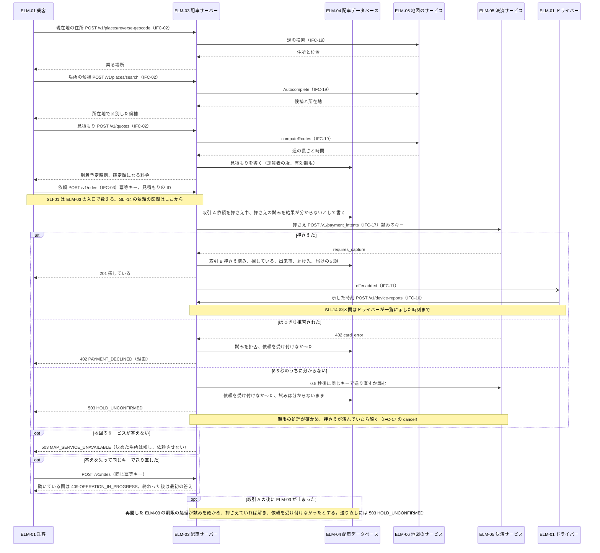
```mermaid
sequenceDiagram
  participant P as ELM-01 乗客
  participant S as ELM-03 配車サーバー
  participant DB as ELM-04 配車データベース
  participant M as ELM-06 地図のサービス
  participant PAY as ELM-05 決済サービス
  participant D as ELM-01 ドライバー
  P->>S: 現在地の住所 POST /v1/places/reverse-geocode（IFC-02）
  S->>M: 逆の検索（IFC-19）
  M-->>S: 住所と位置
  S-->>P: 乗る場所
  P->>S: 場所の候補 POST /v1/places/search（IFC-02）
  S->>M: Autocomplete（IFC-19）
  M-->>S: 候補と所在地
  S-->>P: 所在地で区別した候補
  P->>S: 見積もり POST /v1/quotes（IFC-02）
  S->>M: computeRoutes（IFC-19）
  M-->>S: 道の長さと時間
  S->>DB: 見積もりを書く（運賃表の版、有効期限）
  S-->>P: 到着予定時刻、確定額になる料金
  P->>S: 依頼 POST /v1/rides（IFC-03）冪等キー、見積もりの ID
  Note over P,S: SLI-01 は ELM-03 の入口で数える。SLI-14 の依頼の区間はここから
  S->>DB: 取引 A 依頼を押さえ中、押さえの試みを結果が分からないとして書く
  S->>PAY: 押さえ POST /v1/payment_intents（IFC-17）試みのキー
  alt 押さえた
    PAY-->>S: requires_capture
    S->>DB: 取引 B 押さえ済み、探している、出来事、届け先、届けの記録
    S-->>P: 201 探している
    S-)D: offer.added（IFC-11）
    D->>S: 示した時刻 POST /v1/device-reports（IFC-10）
    Note over D,S: SLI-14 の区間はドライバーが一覧に示した時刻まで
  else はっきり拒否された
    PAY-->>S: 402 card_error
    S->>DB: 試みを拒否、依頼を受け付けなかった
    S-->>P: 402 PAYMENT_DECLINED（理由）
  else 8.5 秒のうちに分からない
    S->>PAY: 0.5 秒後に同じキーで送り直すか読む
    S->>DB: 依頼を受け付けなかった、試みは分からないまま
    S-->>P: 503 HOLD_UNCONFIRMED
    Note over S,PAY: 期限の処理が確かめ、押さえが済んでいたら解く（IFC-17 の cancel）
  end
  opt 地図のサービスが答えない
    S-->>P: 503 MAP_SERVICE_UNAVAILABLE（決めた場所は残し、依頼させない）
  end
  opt 答えを失って同じキーで送り直した
    P->>S: POST /v1/rides（同じ冪等キー）
    S-->>P: 動いている間は 409 OPERATION_IN_PROGRESS、終わった後は最初の答え
  end
  opt 取引 A の後に ELM-03 が止まった
    Note over S,DB: 再開した ELM-03 の期限の処理が試みを確かめ、押さえていれば解き、依頼を受け付けなかったとする。送り直しには 503 HOLD_UNCONFIRMED
  end
```

依頼の後の時刻の処理と取り消し:

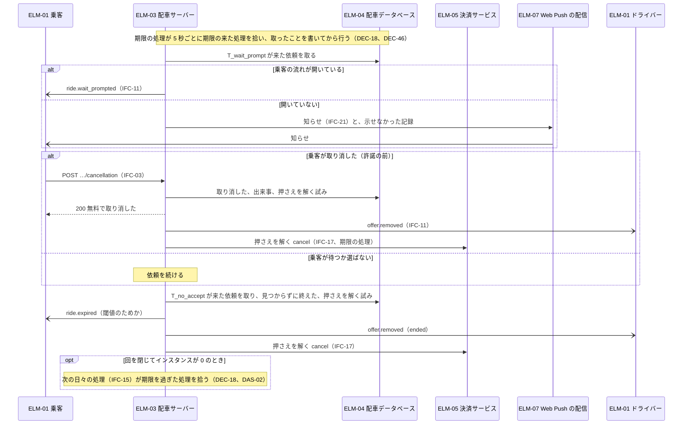
```mermaid
sequenceDiagram
  participant P as ELM-01 乗客
  participant S as ELM-03 配車サーバー
  participant DB as ELM-04 配車データベース
  participant PAY as ELM-05 決済サービス
  participant WP as ELM-07 Web Push の配信
  participant D as ELM-01 ドライバー
  Note over S,DB: 期限の処理が 5 秒ごとに期限の来た処理を拾い、取ったことを書いてから行う（DEC-18、DEC-46）
  S->>DB: T_wait_prompt が来た依頼を取る
  alt 乗客の流れが開いている
    S-)P: ride.wait_prompted（IFC-11）
  else 開いていない
    S->>WP: 知らせ（IFC-21）と、示せなかった記録
    WP-)P: 知らせ
  end
  alt 乗客が取り消した（許諾の前）
    P->>S: POST …/cancellation（IFC-03）
    S->>DB: 取り消した、出来事、押さえを解く試み
    S-->>P: 200 無料で取り消した
    S-)D: offer.removed（IFC-11）
    S->>PAY: 押さえを解く cancel（IFC-17、期限の処理）
  else 乗客が待つか選ばない
    Note over S: 依頼を続ける
  end
  S->>DB: T_no_accept が来た依頼を取り、見つからずに終えた、押さえを解く試み
  S-)P: ride.expired（閾値のためか）
  S-)D: offer.removed（ended）
  S->>PAY: 押さえを解く cancel（IFC-17）
  opt 回を閉じてインスタンスが 0 のとき
    Note over S: 次の日々の処理（IFC-15）が期限を過ぎた処理を拾う（DEC-18、DAS-02）
  end
```

支払い方法の登録（CUJ-01 の手順「配車を手配する」の前に行う）:

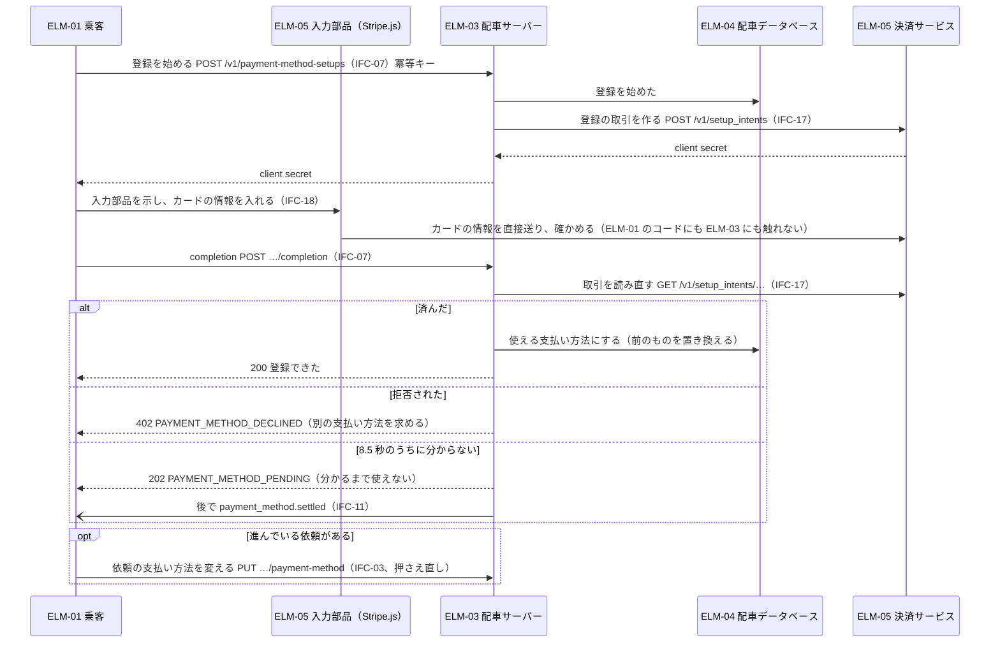
```mermaid
sequenceDiagram
  participant P as ELM-01 乗客
  participant SE as ELM-05 入力部品（Stripe.js）
  participant S as ELM-03 配車サーバー
  participant DB as ELM-04 配車データベース
  participant PAY as ELM-05 決済サービス
  P->>S: 登録を始める POST /v1/payment-method-setups（IFC-07）冪等キー
  S->>DB: 登録を始めた
  S->>PAY: 登録の取引を作る POST /v1/setup_intents（IFC-17）
  PAY-->>S: client secret
  S-->>P: client secret
  P->>SE: 入力部品を示し、カードの情報を入れる（IFC-18）
  SE->>PAY: カードの情報を直接送り、確かめる（ELM-01 のコードにも ELM-03 にも触れない）
  P->>S: completion POST …/completion（IFC-07）
  S->>PAY: 取引を読み直す GET /v1/setup_intents/…（IFC-17）
  alt 済んだ
    S->>DB: 使える支払い方法にする（前のものを置き換える）
    S-->>P: 200 登録できた
  else 拒否された
    S-->>P: 402 PAYMENT_METHOD_DECLINED（別の支払い方法を求める）
  else 8.5 秒のうちに分からない
    S-->>P: 202 PAYMENT_METHOD_PENDING（分かるまで使えない）
    S-)P: 後で payment_method.settled（IFC-11）
  end
  opt 進んでいる依頼がある
    P->>S: 依頼の支払い方法を変える PUT …/payment-method（IFC-03、押さえ直し）
  end
```

### CUJ-02 乗車（乗客）
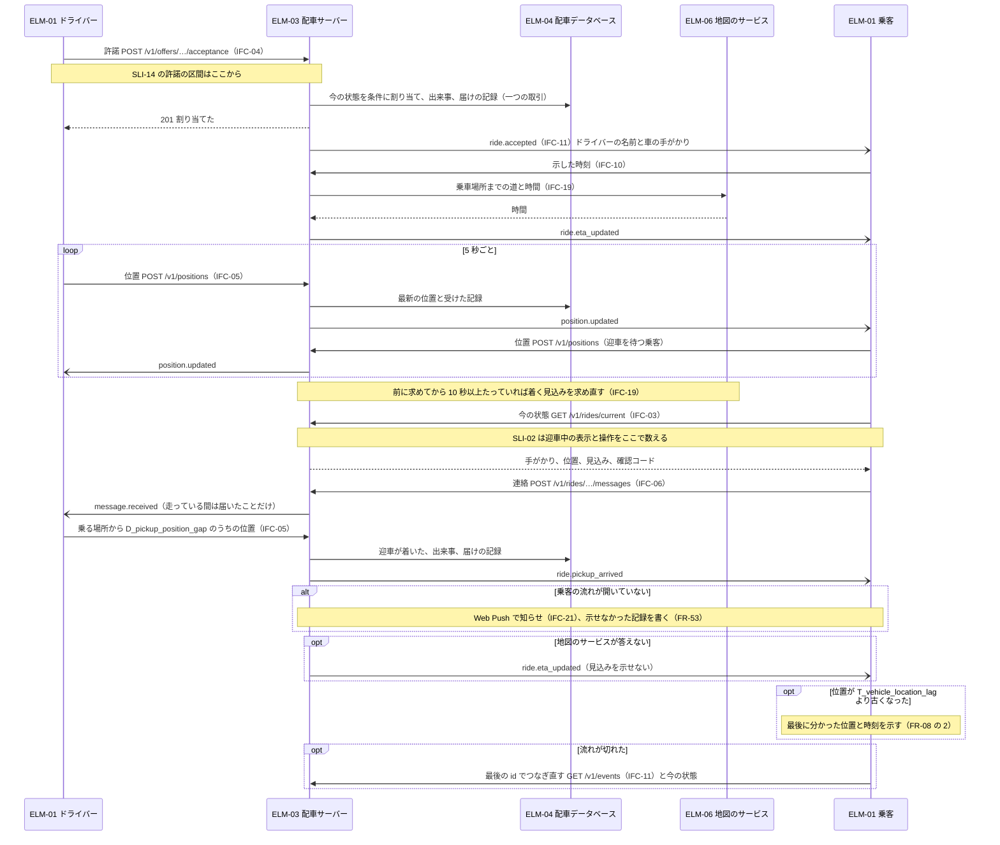
```mermaid
sequenceDiagram
  participant D as ELM-01 ドライバー
  participant S as ELM-03 配車サーバー
  participant DB as ELM-04 配車データベース
  participant M as ELM-06 地図のサービス
  participant P as ELM-01 乗客
  D->>S: 許諾 POST /v1/offers/…/acceptance（IFC-04）
  Note over D,S: SLI-14 の許諾の区間はここから
  S->>DB: 今の状態を条件に割り当て、出来事、届けの記録（一つの取引）
  S-->>D: 201 割り当てた
  S-)P: ride.accepted（IFC-11）ドライバーの名前と車の手がかり
  P->>S: 示した時刻（IFC-10）
  S->>M: 乗車場所までの道と時間（IFC-19）
  M-->>S: 時間
  S-)P: ride.eta_updated
  loop 5 秒ごと
    D->>S: 位置 POST /v1/positions（IFC-05）
    S->>DB: 最新の位置と受けた記録
    S-)P: position.updated
    P->>S: 位置 POST /v1/positions（迎車を待つ乗客）
    S-)D: position.updated
  end
  Note over S,M: 前に求めてから 10 秒以上たっていれば着く見込みを求め直す（IFC-19）
  P->>S: 今の状態 GET /v1/rides/current（IFC-03）
  Note over P,S: SLI-02 は迎車中の表示と操作をここで数える
  S-->>P: 手がかり、位置、見込み、確認コード
  P->>S: 連絡 POST /v1/rides/…/messages（IFC-06）
  S-)D: message.received（走っている間は届いたことだけ）
  D->>S: 乗る場所から D_pickup_position_gap のうちの位置（IFC-05）
  S->>DB: 迎車が着いた、出来事、届けの記録
  S-)P: ride.pickup_arrived
  alt 乗客の流れが開いていない
    Note over S,P: Web Push で知らせ（IFC-21）、示せなかった記録を書く（FR-53）
  end
  opt 地図のサービスが答えない
    S-)P: ride.eta_updated（見込みを示せない）
  end
  opt 位置が T_vehicle_location_lag より古くなった
    Note over P: 最後に分かった位置と時刻を示す（FR-08 の 2）
  end
  opt 流れが切れた
    P->>S: 最後の id でつなぎ直す GET /v1/events（IFC-11）と今の状態
  end
```

許諾の後の乗客の取り消し:

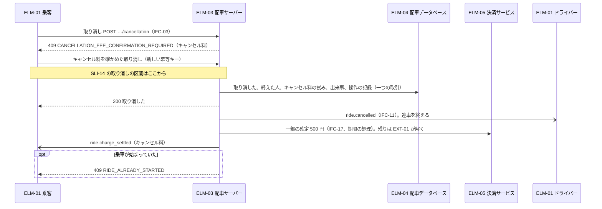
```mermaid
sequenceDiagram
  participant P as ELM-01 乗客
  participant S as ELM-03 配車サーバー
  participant DB as ELM-04 配車データベース
  participant PAY as ELM-05 決済サービス
  participant D as ELM-01 ドライバー
  P->>S: 取り消し POST …/cancellation（IFC-03）
  S-->>P: 409 CANCELLATION_FEE_CONFIRMATION_REQUIRED（キャンセル料）
  P->>S: キャンセル料を確かめた取り消し（新しい冪等キー）
  Note over P,S: SLI-14 の取り消しの区間はここから
  S->>DB: 取り消した、終えた人、キャンセル料の試み、出来事、操作の記録（一つの取引）
  S-->>P: 200 取り消した
  S-)D: ride.cancelled（IFC-11）。迎車を終える
  S->>PAY: 一部の確定 500 円（IFC-17、期限の処理）。残りは EXT-01 が解く
  S-)P: ride.charge_settled（キャンセル料）
  opt 乗車が始まっていた
    S-->>P: 409 RIDE_ALREADY_STARTED
  end
```

### CUJ-03 降車（乗客）
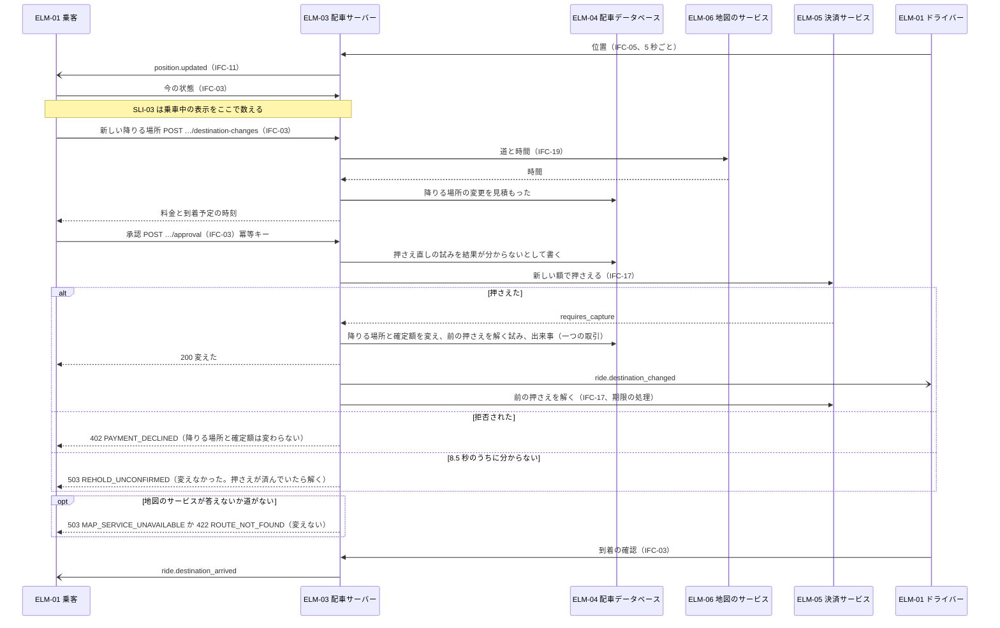
```mermaid
sequenceDiagram
  participant P as ELM-01 乗客
  participant S as ELM-03 配車サーバー
  participant DB as ELM-04 配車データベース
  participant M as ELM-06 地図のサービス
  participant PAY as ELM-05 決済サービス
  participant D as ELM-01 ドライバー
  D->>S: 位置（IFC-05、5 秒ごと）
  S-)P: position.updated（IFC-11）
  P->>S: 今の状態（IFC-03）
  Note over P,S: SLI-03 は乗車中の表示をここで数える
  P->>S: 新しい降りる場所 POST …/destination-changes（IFC-03）
  S->>M: 道と時間（IFC-19）
  M-->>S: 時間
  S->>DB: 降りる場所の変更を見積もった
  S-->>P: 料金と到着予定の時刻
  P->>S: 承認 POST …/approval（IFC-03）冪等キー
  S->>DB: 押さえ直しの試みを結果が分からないとして書く
  S->>PAY: 新しい額で押さえる（IFC-17）
  alt 押さえた
    PAY-->>S: requires_capture
    S->>DB: 降りる場所と確定額を変え、前の押さえを解く試み、出来事（一つの取引）
    S-->>P: 200 変えた
    S-)D: ride.destination_changed
    S->>PAY: 前の押さえを解く（IFC-17、期限の処理）
  else 拒否された
    S-->>P: 402 PAYMENT_DECLINED（降りる場所と確定額は変わらない）
  else 8.5 秒のうちに分からない
    S-->>P: 503 REHOLD_UNCONFIRMED（変えなかった。押さえが済んでいたら解く）
  end
  opt 地図のサービスが答えないか道がない
    S-->>P: 503 MAP_SERVICE_UNAVAILABLE か 422 ROUTE_NOT_FOUND（変えない）
  end
  D->>S: 到着の確認（IFC-03）
  S-)P: ride.destination_arrived
```

### CUJ-04 ドライバーの評価
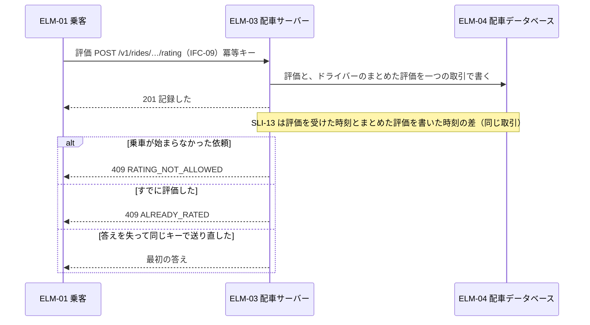
```mermaid
sequenceDiagram
  participant P as ELM-01 乗客
  participant S as ELM-03 配車サーバー
  participant DB as ELM-04 配車データベース
  P->>S: 評価 POST /v1/rides/…/rating（IFC-09）冪等キー
  S->>DB: 評価と、ドライバーのまとめた評価を一つの取引で書く
  S-->>P: 201 記録した
  Note over S,DB: SLI-13 は評価を受けた時刻とまとめた評価を書いた時刻の差（同じ取引）
  alt 乗車が始まらなかった依頼
    S-->>P: 409 RATING_NOT_ALLOWED
  else すでに評価した
    S-->>P: 409 ALREADY_RATED
  else 答えを失って同じキーで送り直した
    S-->>P: 最初の答え
  end
```

### CUJ-05 マッチするドライバーの閾値の設定
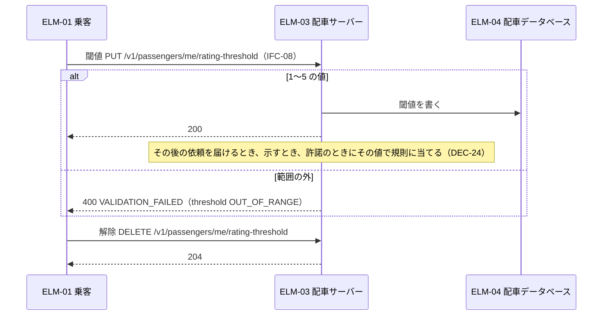
```mermaid
sequenceDiagram
  participant P as ELM-01 乗客
  participant S as ELM-03 配車サーバー
  participant DB as ELM-04 配車データベース
  P->>S: 閾値 PUT /v1/passengers/me/rating-threshold（IFC-08）
  alt 1〜5 の値
    S->>DB: 閾値を書く
    S-->>P: 200
    Note over S: その後の依頼を届けるとき、示すとき、許諾のときにその値で規則に当てる（DEC-24）
  else 範囲の外
    S-->>P: 400 VALIDATION_FAILED（threshold OUT_OF_RANGE）
  end
  P->>S: 解除 DELETE /v1/passengers/me/rating-threshold
  S-->>P: 204
```

### CUJ-06 配車受付
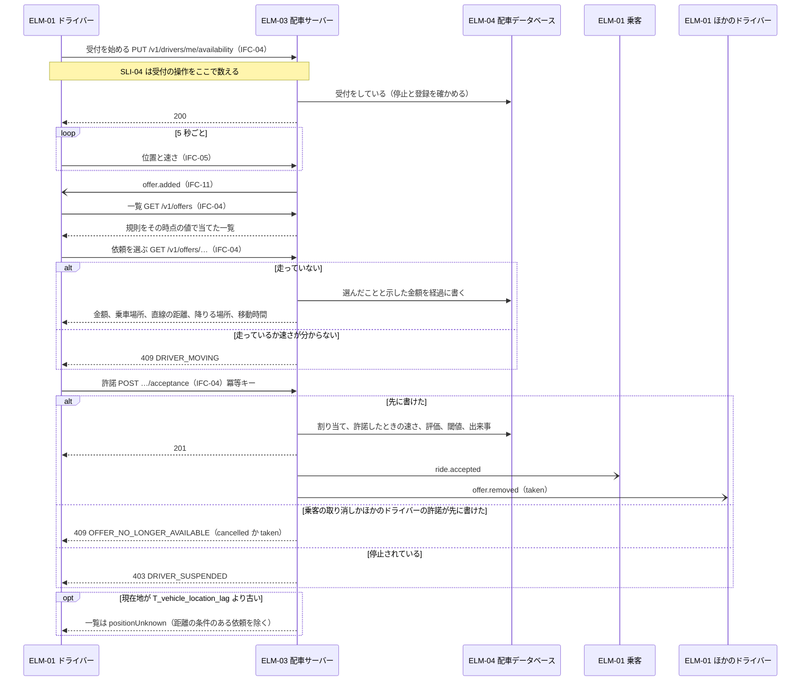
```mermaid
sequenceDiagram
  participant D as ELM-01 ドライバー
  participant S as ELM-03 配車サーバー
  participant DB as ELM-04 配車データベース
  participant P as ELM-01 乗客
  participant D2 as ELM-01 ほかのドライバー
  D->>S: 受付を始める PUT /v1/drivers/me/availability（IFC-04）
  Note over D,S: SLI-04 は受付の操作をここで数える
  S->>DB: 受付をしている（停止と登録を確かめる）
  S-->>D: 200
  loop 5 秒ごと
    D->>S: 位置と速さ（IFC-05）
  end
  S-)D: offer.added（IFC-11）
  D->>S: 一覧 GET /v1/offers（IFC-04）
  S-->>D: 規則をその時点の値で当てた一覧
  D->>S: 依頼を選ぶ GET /v1/offers/…（IFC-04）
  alt 走っていない
    S->>DB: 選んだことと示した金額を経過に書く
    S-->>D: 金額、乗車場所、直線の距離、降りる場所、移動時間
  else 走っているか速さが分からない
    S-->>D: 409 DRIVER_MOVING
  end
  D->>S: 許諾 POST …/acceptance（IFC-04）冪等キー
  alt 先に書けた
    S->>DB: 割り当て、許諾したときの速さ、評価、閾値、出来事
    S-->>D: 201
    S-)P: ride.accepted
    S-)D2: offer.removed（taken）
  else 乗客の取り消しかほかのドライバーの許諾が先に書けた
    S-->>D: 409 OFFER_NO_LONGER_AVAILABLE（cancelled か taken）
  else 停止されている
    S-->>D: 403 DRIVER_SUSPENDED
  end
  opt 現在地が T_vehicle_location_lag より古い
    S-->>D: 一覧は positionUnknown（距離の条件のある依頼を除く）
  end
```

### CUJ-07 乗車（ドライバー）
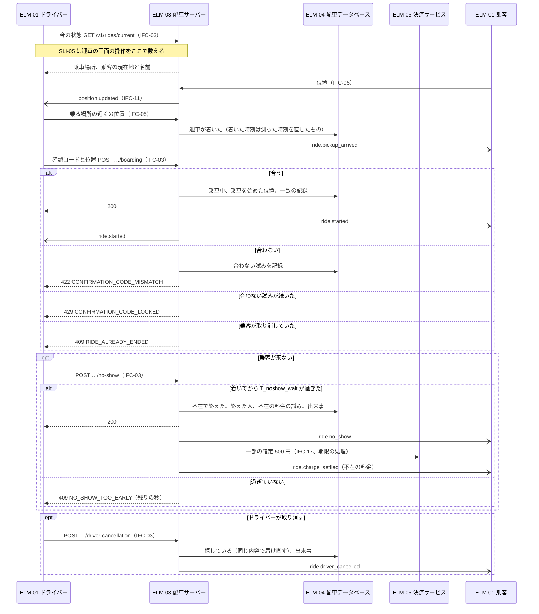
```mermaid
sequenceDiagram
  participant D as ELM-01 ドライバー
  participant S as ELM-03 配車サーバー
  participant DB as ELM-04 配車データベース
  participant PAY as ELM-05 決済サービス
  participant P as ELM-01 乗客
  D->>S: 今の状態 GET /v1/rides/current（IFC-03）
  Note over D,S: SLI-05 は迎車の画面の操作をここで数える
  S-->>D: 乗車場所、乗客の現在地と名前
  P->>S: 位置（IFC-05）
  S-)D: position.updated（IFC-11）
  D->>S: 乗る場所の近くの位置（IFC-05）
  S->>DB: 迎車が着いた（着いた時刻は測った時刻を直したもの）
  S-)P: ride.pickup_arrived
  D->>S: 確認コードと位置 POST …/boarding（IFC-03）
  alt 合う
    S->>DB: 乗車中、乗車を始めた位置、一致の記録
    S-->>D: 200
    S-)P: ride.started
    S-)D: ride.started
  else 合わない
    S->>DB: 合わない試みを記録
    S-->>D: 422 CONFIRMATION_CODE_MISMATCH
  else 合わない試みが続いた
    S-->>D: 429 CONFIRMATION_CODE_LOCKED
  else 乗客が取り消していた
    S-->>D: 409 RIDE_ALREADY_ENDED
  end
  opt 乗客が来ない
    D->>S: POST …/no-show（IFC-03）
    alt 着いてから T_noshow_wait が過ぎた
      S->>DB: 不在で終えた、終えた人、不在の料金の試み、出来事
      S-->>D: 200
      S-)P: ride.no_show
      S->>PAY: 一部の確定 500 円（IFC-17、期限の処理）
      S-)P: ride.charge_settled（不在の料金）
    else 過ぎていない
      S-->>D: 409 NO_SHOW_TOO_EARLY（残りの秒）
    end
  end
  opt ドライバーが取り消す
    D->>S: POST …/driver-cancellation（IFC-03）
    S->>DB: 探している（同じ内容で届け直す）、出来事
    S-)P: ride.driver_cancelled
  end
```

### CUJ-08 降車（ドライバー）
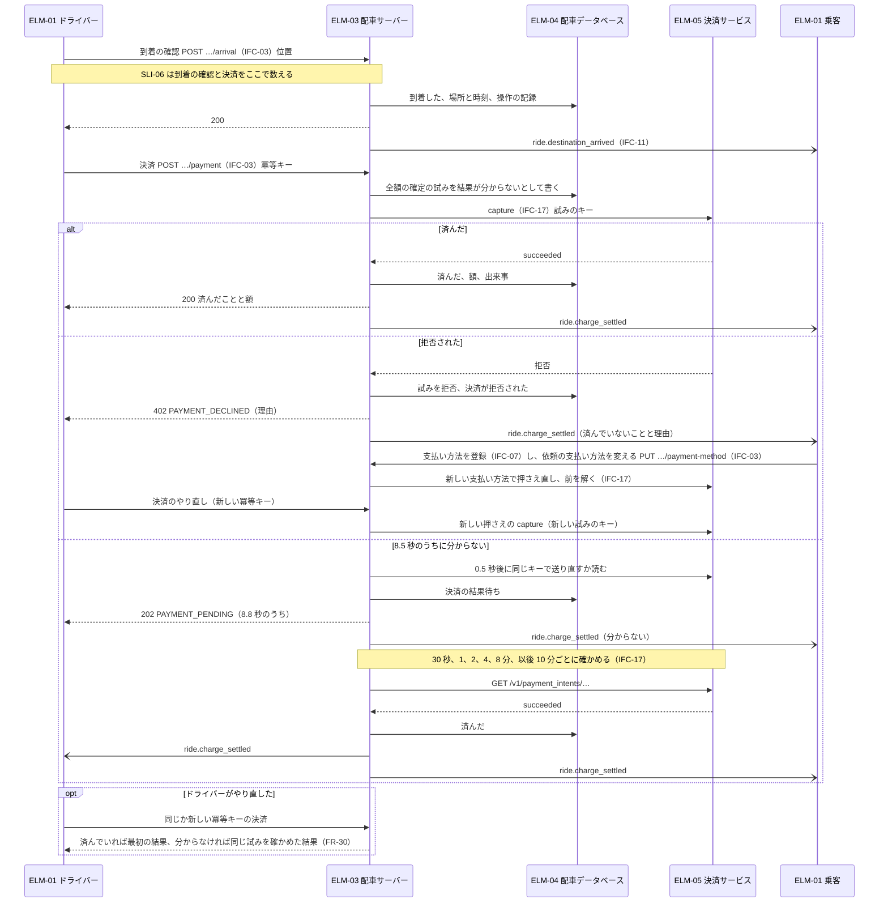
```mermaid
sequenceDiagram
  participant D as ELM-01 ドライバー
  participant S as ELM-03 配車サーバー
  participant DB as ELM-04 配車データベース
  participant PAY as ELM-05 決済サービス
  participant P as ELM-01 乗客
  D->>S: 到着の確認 POST …/arrival（IFC-03）位置
  Note over D,S: SLI-06 は到着の確認と決済をここで数える
  S->>DB: 到着した、場所と時刻、操作の記録
  S-->>D: 200
  S-)P: ride.destination_arrived（IFC-11）
  D->>S: 決済 POST …/payment（IFC-03）冪等キー
  S->>DB: 全額の確定の試みを結果が分からないとして書く
  S->>PAY: capture（IFC-17）試みのキー
  alt 済んだ
    PAY-->>S: succeeded
    S->>DB: 済んだ、額、出来事
    S-->>D: 200 済んだことと額
    S-)P: ride.charge_settled
  else 拒否された
    PAY-->>S: 拒否
    S->>DB: 試みを拒否、決済が拒否された
    S-->>D: 402 PAYMENT_DECLINED（理由）
    S-)P: ride.charge_settled（済んでいないことと理由）
    P->>S: 支払い方法を登録（IFC-07）し、依頼の支払い方法を変える PUT …/payment-method（IFC-03）
    S->>PAY: 新しい支払い方法で押さえ直し、前を解く（IFC-17）
    D->>S: 決済のやり直し（新しい冪等キー）
    S->>PAY: 新しい押さえの capture（新しい試みのキー）
  else 8.5 秒のうちに分からない
    S->>PAY: 0.5 秒後に同じキーで送り直すか読む
    S->>DB: 決済の結果待ち
    S-->>D: 202 PAYMENT_PENDING（8.8 秒のうち）
    S-)P: ride.charge_settled（分からない）
    Note over S,PAY: 30 秒、1、2、4、8 分、以後 10 分ごとに確かめる（IFC-17）
    S->>PAY: GET /v1/payment_intents/…
    PAY-->>S: succeeded
    S->>DB: 済んだ
    S-)D: ride.charge_settled
    S-)P: ride.charge_settled
  end
  opt ドライバーがやり直した
    D->>S: 同じか新しい冪等キーの決済
    S-->>D: 済んでいれば最初の結果、分からなければ同じ試みを確かめた結果（FR-30）
  end
```

### CUJ-09 配車依頼を受ける条件の設定
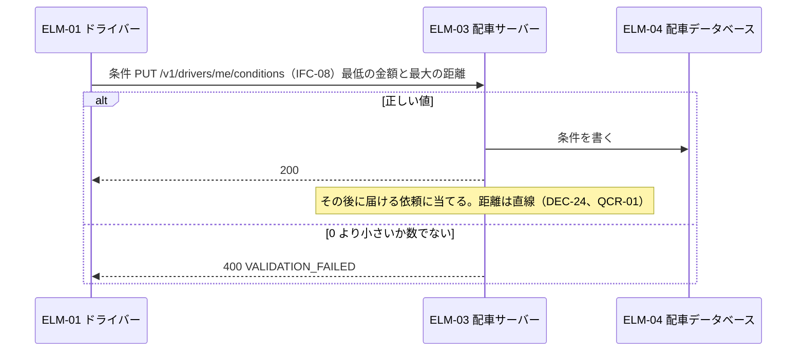
```mermaid
sequenceDiagram
  participant D as ELM-01 ドライバー
  participant S as ELM-03 配車サーバー
  participant DB as ELM-04 配車データベース
  D->>S: 条件 PUT /v1/drivers/me/conditions（IFC-08）最低の金額と最大の距離
  alt 正しい値
    S->>DB: 条件を書く
    S-->>D: 200
    Note over S: その後に届ける依頼に当てる。距離は直線（DEC-24、QCR-01）
  else 0 より小さいか数でない
    S-->>D: 400 VALIDATION_FAILED
  end
```

### CUJ-10 障害の原因の特定
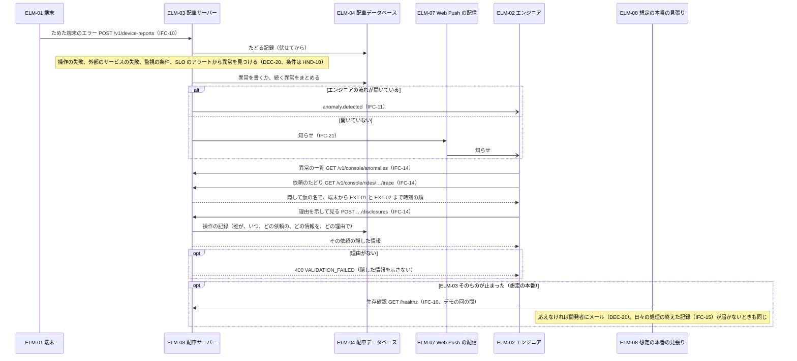
```mermaid
sequenceDiagram
  participant D as ELM-01 端末
  participant S as ELM-03 配車サーバー
  participant DB as ELM-04 配車データベース
  participant WP as ELM-07 Web Push の配信
  participant E as ELM-02 エンジニア
  participant G as ELM-08 想定の本番の見張り
  D->>S: ためた端末のエラー POST /v1/device-reports（IFC-10）
  S->>DB: たどる記録（伏せてから）
  Note over S: 操作の失敗、外部のサービスの失敗、監視の条件、SLO のアラートから異常を見つける（DEC-20、条件は HND-10）
  S->>DB: 異常を書くか、続く異常をまとめる
  alt エンジニアの流れが開いている
    S-)E: anomaly.detected（IFC-11）
  else 開いていない
    S->>WP: 知らせ（IFC-21）
    WP-)E: 知らせ
  end
  E->>S: 異常の一覧 GET /v1/console/anomalies（IFC-14）
  E->>S: 依頼のたどり GET /v1/console/rides/…/trace（IFC-14）
  S-->>E: 隠して仮の名で、端末から EXT-01 と EXT-02 まで時刻の順
  E->>S: 理由を示して見る POST …/disclosures（IFC-14）
  S->>DB: 操作の記録（誰が、いつ、どの依頼の、どの情報を、どの理由で）
  S-->>E: その依頼の隠した情報
  opt 理由がない
    S-->>E: 400 VALIDATION_FAILED（隠した情報を示さない）
  end
  opt ELM-03 そのものが止まった（想定の本番）
    G->>S: 生存確認 GET /healthz（IFC-16、デモの回の間）
    Note over G: 応えなければ開発者にメール（DEC-20）。日々の処理の終えた記録（IFC-15）が届かないときも同じ
  end
```

### CUJ-11 新しい機能の追加
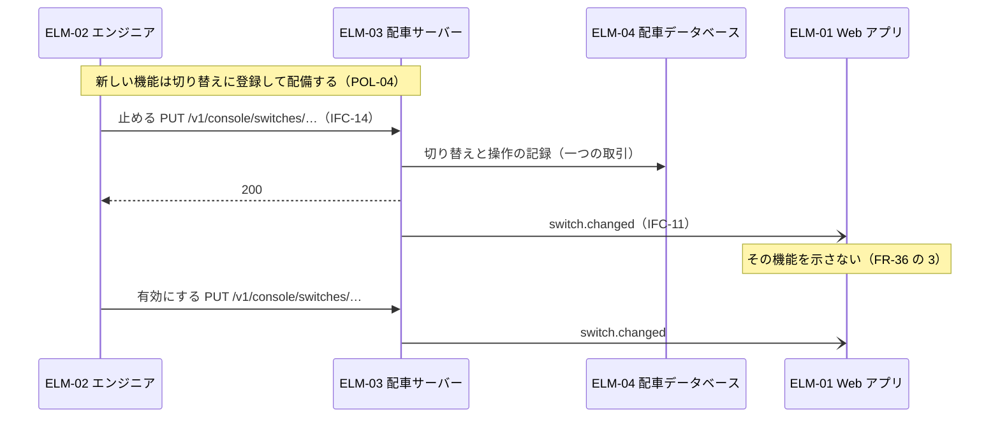
```mermaid
sequenceDiagram
  participant E as ELM-02 エンジニア
  participant S as ELM-03 配車サーバー
  participant DB as ELM-04 配車データベース
  participant A as ELM-01 Web アプリ
  Note over E,S: 新しい機能は切り替えに登録して配備する（POL-04）
  E->>S: 止める PUT /v1/console/switches/…（IFC-14）
  S->>DB: 切り替えと操作の記録（一つの取引）
  S-->>E: 200
  S-)A: switch.changed（IFC-11）
  Note over A: その機能を示さない（FR-36 の 3）
  E->>S: 有効にする PUT /v1/console/switches/…
  S-)A: switch.changed
```

### CUJ-12 既存の機能の修正
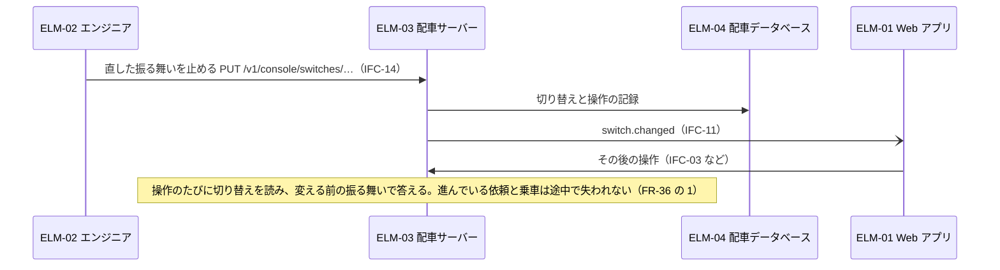
```mermaid
sequenceDiagram
  participant E as ELM-02 エンジニア
  participant S as ELM-03 配車サーバー
  participant DB as ELM-04 配車データベース
  participant A as ELM-01 Web アプリ
  E->>S: 直した振る舞いを止める PUT /v1/console/switches/…（IFC-14）
  S->>DB: 切り替えと操作の記録
  S-)A: switch.changed（IFC-11）
  A->>S: その後の操作（IFC-03 など）
  Note over S: 操作のたびに切り替えを読み、変える前の振る舞いで答える。進んでいる依頼と乗車は途中で失われない（FR-36 の 1）
```

### CUJ-13 利用技術のバージョンアップへの対応
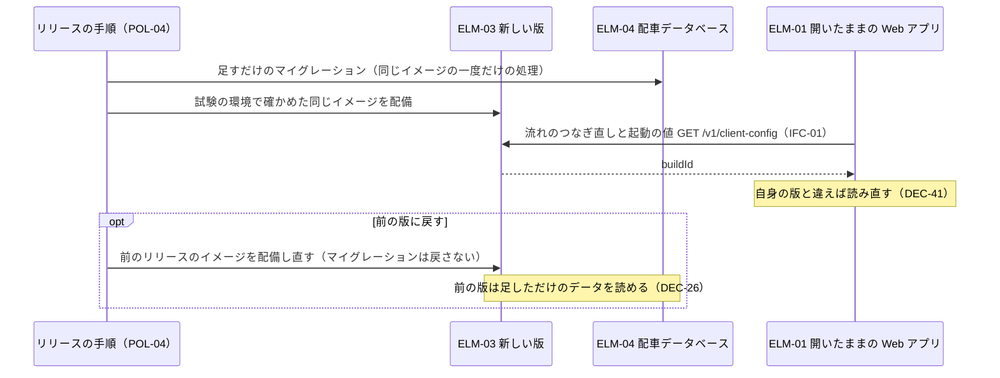
```mermaid
sequenceDiagram
  participant R as リリースの手順（POL-04）
  participant S as ELM-03 新しい版
  participant DB as ELM-04 配車データベース
  participant A as ELM-01 開いたままの Web アプリ
  R->>DB: 足すだけのマイグレーション（同じイメージの一度だけの処理）
  R->>S: 試験の環境で確かめた同じイメージを配備
  A->>S: 流れのつなぎ直しと起動の値 GET /v1/client-config（IFC-01）
  S-->>A: buildId
  Note over A: 自身の版と違えば読み直す（DEC-41）
  opt 前の版に戻す
    R->>S: 前のリリースのイメージを配備し直す（マイグレーションは戻さない）
    Note over S,DB: 前の版は足しただけのデータを読める（DEC-26）
  end
```

### CUJ-14 苦情への対応
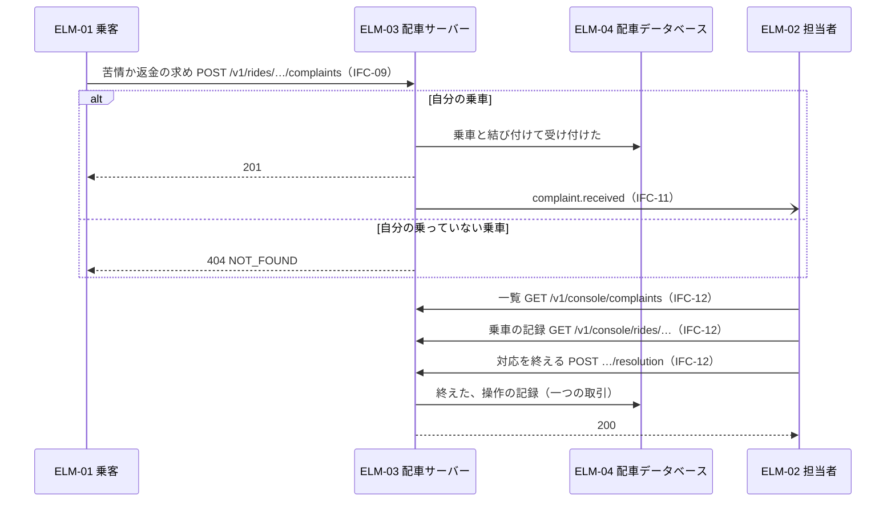
```mermaid
sequenceDiagram
  participant P as ELM-01 乗客
  participant S as ELM-03 配車サーバー
  participant DB as ELM-04 配車データベース
  participant O as ELM-02 担当者
  P->>S: 苦情か返金の求め POST /v1/rides/…/complaints（IFC-09）
  alt 自分の乗車
    S->>DB: 乗車と結び付けて受け付けた
    S-->>P: 201
    S-)O: complaint.received（IFC-11）
  else 自分の乗っていない乗車
    S-->>P: 404 NOT_FOUND
  end
  O->>S: 一覧 GET /v1/console/complaints（IFC-12）
  O->>S: 乗車の記録 GET /v1/console/rides/…（IFC-12）
  O->>S: 対応を終える POST …/resolution（IFC-12）
  S->>DB: 終えた、操作の記録（一つの取引）
  S-->>O: 200
```

### CUJ-15 返金への対応
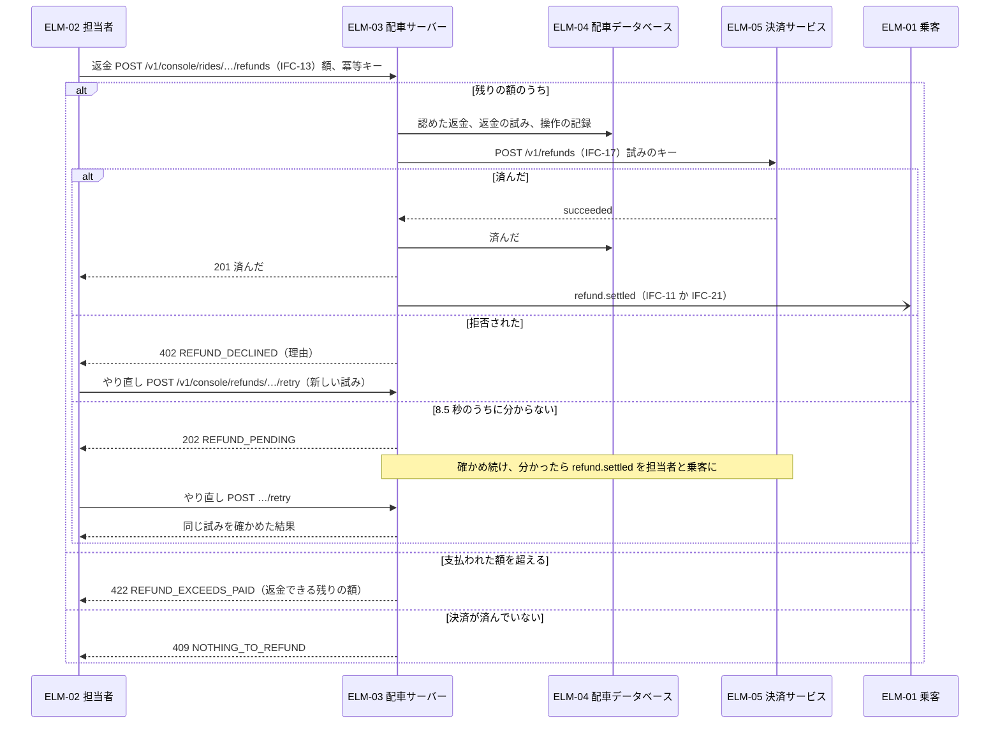
```mermaid
sequenceDiagram
  participant O as ELM-02 担当者
  participant S as ELM-03 配車サーバー
  participant DB as ELM-04 配車データベース
  participant PAY as ELM-05 決済サービス
  participant P as ELM-01 乗客
  O->>S: 返金 POST /v1/console/rides/…/refunds（IFC-13）額、冪等キー
  alt 残りの額のうち
    S->>DB: 認めた返金、返金の試み、操作の記録
    S->>PAY: POST /v1/refunds（IFC-17）試みのキー
    alt 済んだ
      PAY-->>S: succeeded
      S->>DB: 済んだ
      S-->>O: 201 済んだ
      S-)P: refund.settled（IFC-11 か IFC-21）
    else 拒否された
      S-->>O: 402 REFUND_DECLINED（理由）
      O->>S: やり直し POST /v1/console/refunds/…/retry（新しい試み）
    else 8.5 秒のうちに分からない
      S-->>O: 202 REFUND_PENDING
      Note over S,PAY: 確かめ続け、分かったら refund.settled を担当者と乗客に
      O->>S: やり直し POST …/retry
      S-->>O: 同じ試みを確かめた結果
    end
  else 支払われた額を超える
    S-->>O: 422 REFUND_EXCEEDS_PAID（返金できる残りの額）
  else 決済が済んでいない
    S-->>O: 409 NOTHING_TO_REFUND
  end
```

### CUJ-16 参加者のアカウントの作成
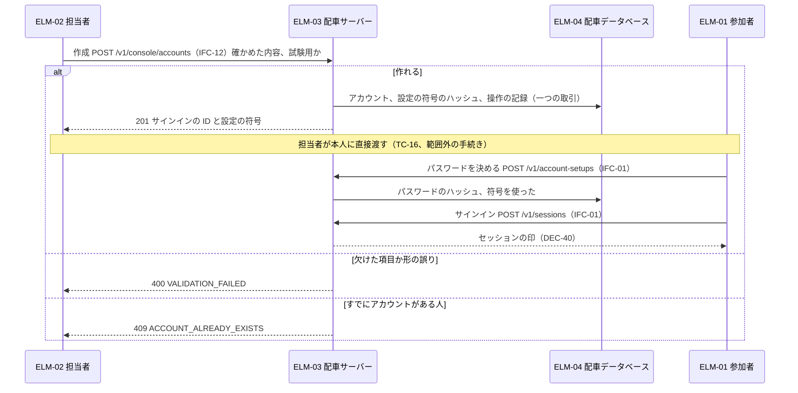
```mermaid
sequenceDiagram
  participant O as ELM-02 担当者
  participant S as ELM-03 配車サーバー
  participant DB as ELM-04 配車データベース
  participant A as ELM-01 参加者
  O->>S: 作成 POST /v1/console/accounts（IFC-12）確かめた内容、試験用か
  alt 作れる
    S->>DB: アカウント、設定の符号のハッシュ、操作の記録（一つの取引）
    S-->>O: 201 サインインの ID と設定の符号
    Note over O,A: 担当者が本人に直接渡す（TC-16、範囲外の手続き）
    A->>S: パスワードを決める POST /v1/account-setups（IFC-01）
    S->>DB: パスワードのハッシュ、符号を使った
    A->>S: サインイン POST /v1/sessions（IFC-01）
    S-->>A: セッションの印（DEC-40）
  else 欠けた項目か形の誤り
    S-->>O: 400 VALIDATION_FAILED
  else すでにアカウントがある人
    S-->>O: 409 ACCOUNT_ALREADY_EXISTS
  end
```

### CUJ-17 審査を通ったドライバーと車両の登録
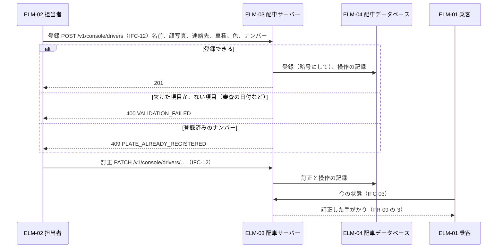
```mermaid
sequenceDiagram
  participant O as ELM-02 担当者
  participant S as ELM-03 配車サーバー
  participant DB as ELM-04 配車データベース
  participant P as ELM-01 乗客
  O->>S: 登録 POST /v1/console/drivers（IFC-12）名前、顔写真、連絡先、車種、色、ナンバー
  alt 登録できる
    S->>DB: 登録（暗号にして）、操作の記録
    S-->>O: 201
  else 欠けた項目か、ない項目（審査の日付など）
    S-->>O: 400 VALIDATION_FAILED
  else 登録済みのナンバー
    S-->>O: 409 PLATE_ALREADY_REGISTERED
  end
  O->>S: 訂正 PATCH /v1/console/drivers/…（IFC-12）
  S->>DB: 訂正と操作の記録
  P->>S: 今の状態（IFC-03）
  S-->>P: 訂正した手がかり（FR-09 の 3）
```

### CUJ-18 ドライバーの停止
```mermaid
sequenceDiagram
  participant O as ELM-02 担当者
  participant S as ELM-03 配車サーバー
  participant DB as ELM-04 配車データベース
  participant D as ELM-01 ドライバー
  O->>S: 停止 POST /v1/console/drivers/…/suspension（IFC-12）
  alt 停止していない
    S->>DB: 停止、操作の記録、許諾していない依頼を除く出来事
    S-->>O: 200（迎車中か乗車中の依頼があれば activeRides）
    S-)D: driver.suspended と offer.removed（IFC-11）
    D->>S: 停止の前に開いていた依頼の許諾（IFC-04）
    S-->>D: 403 DRIVER_SUSPENDED
  else すでに停止している
    S-->>O: 409 DRIVER_ALREADY_SUSPENDED
  end
  O->>S: 再開 DELETE …/suspension（IFC-12）
  S-)D: driver.resumed
```

### DRV-01 配車の手配から決済までの流れが、使いたいときに使える
```mermaid
sequenceDiagram
  participant A as ELM-01 端末
  participant S1 as ELM-03 インスタンス
  participant S2 as ELM-03 起こし直したインスタンス
  participant DB as ELM-04 配車データベース
  participant PAY as ELM-05 決済サービス
  A->>S1: 状態を変える操作（冪等キー、たどる ID）
  S1->>DB: 境界の出来事（受けた）、冪等キーを動いているとして書く
  Note over S1: インスタンスが落ちる（DAS-02）
  A->>S2: タイムアウトの後、同じキーで送り直す（IFC-03 は 15 秒か 10 秒）
  S2->>DB: キーの記録を読む
  alt 最初の要求の期限を過ぎて結果がない
    S2-->>A: 依頼の今の状態で答える（押さえが分からなければ 503 HOLD_UNCONFIRMED、決済なら試みを確かめた結果）
  else 最初の要求が書き終えていた
    S2-->>A: 最初の答え
  end
  A->>S2: 流れを最後の id でつなぎ直す（IFC-11）
  S2-)A: 続きの出来事
  Note over A,S2: 答えのなかった操作は境界の出来事に結果のない記録として残り、SLI-01〜SLI-06 の悪いイベントになる
  opt EXT-01 か EXT-02 が答えない
    S2-->>A: お金の操作は DEC-45 の 503 か 202、場所と見積もりは 503 MAP_SERVICE_UNAVAILABLE。確定した依頼と乗車は止めない
  end
```

### DRV-04 車と乗客の現在地が、実際の位置から遅れない
```mermaid
sequenceDiagram
  participant D as ELM-01 ドライバー
  participant S as ELM-03 配車サーバー
  participant DB as ELM-04 配車データベース
  participant P as ELM-01 乗客
  loop 5 秒ごと（画面に出ている間）
    D->>S: その前の 5 秒のうちに測った位置、sentAt、lastRoundTripMs（IFC-05）
    S->>DB: 測った時刻をサーバーの時刻に直し（DEC-37）、新しければ最新に、記録に足す
    S-)P: position.updated（IFC-11）
  end
  Note over S,DB: 1 分ごとの確かめ（DAT-21）が最新の位置の古さを書く。SLI-10 はここで数える
  opt 届かない間が T_vehicle_location_lag を超えた
    Note over S: その位置を分からないものとし、依頼を届ける判断と距離の条件と走っているかの判断に使わない
    S-)P: 最後に分かった位置と時刻として示す
  end
```

### DRV-07 お金は確定額と決まりの料金どおりに一度だけ動き、記録は決済サービスの処理と一致する
```mermaid
sequenceDiagram
  participant S as ELM-03 配車サーバー
  participant DB as ELM-04 配車データベース
  participant PAY as ELM-05 決済サービス
  participant J as ELM-08 か ELM-10 の日々の呼び出し
  participant E as ELM-02 担当者とエンジニア
  Note over S,PAY: 依頼の押さえ、押さえ直し、全額か一部の確定、解除、返金は、どれも試みを書いてから試みのキーで送る（DEC-10、IFC-17）
  S->>DB: 試み（結果が分からない）
  S->>PAY: 状態を変える呼び出し（4 秒、同じキーで一度だけ送り直す）
  alt 済んだか拒否
    S->>DB: 結果と、依頼の状態（一つの取引）
  else 分からない
    S->>DB: 分からないまま、次に確かめる時刻
    S->>PAY: 23 時間のうちは同じキー、500 の後と 23 時間の後は読み出しで確かめる
  end
  J->>S: 毎日 04:00 POST /internal/jobs/daily（IFC-15）
  S->>PAY: 2 日前から作られた取引と返金の一覧（IFC-17）
  S->>DB: 照合の結果（DAT-13）。日 d の値は d の 2 日後に決める
  opt 食い違い、二度目の請求、超えた返金
    S->>DB: 異常
    S-)E: anomaly.detected（NFR-24）
  end
```

### DRV-03 依頼、許諾、取り消し、迎車の到着が相手の画面にすぐ示される
```mermaid
sequenceDiagram
  participant A as ELM-01 操作した端末
  participant S as ELM-03 配車サーバー
  participant DB as ELM-04 配車データベース
  participant WP as ELM-07 Web Push の配信
  participant B as ELM-01 相手の端末
  A->>S: 操作（依頼、許諾、取り消し）か迎車の位置
  Note over A,S: SLI-14 の区間の始まり（ELM-03 が受けた時刻）
  S->>DB: 状態の変化、出来事、相手ごとの届けの記録（一つの取引）
  alt 相手の流れが開いている
    S-)B: 出来事（IFC-11。ほかのインスタンスが書いたものは 1 秒ごとに読む）
    B->>S: 示した時刻（IFC-10）
    Note over B,S: SLI-14 の区間の終わり（直した示した時刻）
    opt 決まった待ちのうちに示した時刻が来ない
      S->>WP: 知らせ（IFC-21。数えからは外さない）
    end
  else 開いていない
    S->>DB: 示せなかった（FR-53。SLI-14 の数えから外れる）
    S->>WP: 知らせ（IFC-21）
    WP-)B: 知らせ
    B->>S: 後で示した時刻（IFC-10）
  end
```

### DRV-28 本人であることを確かめた人だけがアカウントを使える
```mermaid
sequenceDiagram
  participant X as ELM-01 か ELM-02
  participant S as ELM-03 配車サーバー
  participant DB as ELM-04 配車データベース
  X->>S: サインイン POST /v1/sessions（IFC-01）
  alt 合う
    S->>DB: セッション（ハッシュ）、失敗の回数を戻す
    S-->>X: __Host-session のクッキー（DEC-40）
  else 合わない
    S->>DB: 失敗の回数を足し、決まった回数で止める（HND-12）
    S-->>X: 401 AUTH_FAILED か 423 ACCOUNT_LOCKED
  end
  X->>S: 依頼、許諾、決済、返金、登録、停止、調査の操作
  alt セッションがない
    S-->>X: 401 NOT_SIGNED_IN
  else その種類に許していない
    S-->>X: 403 NOT_ALLOWED（DEC-15）
  end
  X->>S: 使い終える DELETE /v1/sessions/current
  S->>DB: セッションを消し、宛先を外す
```

### DRV-29 乗客とドライバーの個人の情報は、許された人のほかには見えない
```mermaid
sequenceDiagram
  participant E as ELM-02 エンジニア
  participant S as ELM-03 配車サーバー
  participant DB as ELM-04 配車データベース
  participant D as ELM-01 ドライバー
  E->>S: たどる GET …/trace（IFC-14）
  S->>DB: 記録を読み、DEC-15 の決まりで隠し、鍵を使った仮の名にする
  S-->>E: 隠した経過
  E->>S: 理由つき POST …/disclosures（IFC-14）
  S->>DB: 操作の記録
  S-->>E: その依頼の分だけ
  D->>S: 乗車の後に乗客の場所を見ようとする（IFC-03）
  S-->>D: 404 NOT_FOUND（DEC-15、QR-57）
  Note over S,DB: ログとたどる記録には伏せたものだけを書き（DEC-43）、保存する個人の情報は記録した日の鍵で暗号にする（DEC-16）。3 年を過ぎた日の鍵は日々の処理（IFC-15）が写しとともに捨てる
```

### DRV-02 一つの依頼の状態と割り当ては一つに定まり、失われも二重にもならない
```mermaid
sequenceDiagram
  participant P as ELM-01 乗客
  participant S as ELM-03 配車サーバー
  participant DB as ELM-04 配車データベース
  participant D as ELM-01 ドライバー
  par ほぼ同時
    P->>S: 取り消し（IFC-03）
  and
    D->>S: 許諾（IFC-04）
  end
  S->>DB: 今の状態を条件に書く（先に書けた一つだけが通る、DEC-08）
  alt 取り消しが先
    S-->>P: 200 取り消した
    S-->>D: 409 OFFER_NO_LONGER_AVAILABLE（cancelled）
  else 許諾が先
    S-->>D: 201 割り当てた
    S-->>P: 409 CANCELLATION_FEE_CONFIRMATION_REQUIRED（キャンセル料を示す）
  end
  D->>S: 到着の確認（通信が途切れて答えを失う）
  D->>S: 同じ冪等キーで送り直す
  S-->>D: 最初の答え（一度だけ効いた）
  Note over P,D: つなぎ直した画面は GET /v1/rides/current で今の状態を示す（QR-02）
```

### DRV-24 エンジニアは一件の依頼を、端末から外部のサービスとのやり取りまでたどれる
```mermaid
sequenceDiagram
  participant A as ELM-01 端末
  participant S as ELM-03 配車サーバー
  participant DB as ELM-04 配車データベース
  participant PAY as ELM-05 決済サービス
  participant E as ELM-02 エンジニア
  A->>A: 端末のエラー（つながらない間はためる）
  A->>S: 操作（X-Trace-Id）
  S->>PAY: 呼び出し（metadata に traceId と attemptId）
  S->>DB: 段階ごとのたどる記録（たどる ID、依頼、部分、結果、時間）
  A->>S: つながった後にためたエラー（IFC-10）
  S->>DB: 端末のエラーのたどる記録
  S-)E: anomaly.detected（IFC-11）
  E->>S: GET …/trace（IFC-14）
  S-->>E: 端末、ELM-03、EXT-01、EXT-02、ELM-07 の出来事を時刻の順に（N_trace_retention_days の間）
```

### DRV-12 一つの機能の変更はその部分にとどまり、変えなかった機能を公開の前に自動で確かめられる
```mermaid
sequenceDiagram
  participant Dev as エンジニア
  participant C as 検査の手順（POL-04）
  participant G as 生成した仕様書と型（POL-05）
  Dev->>C: ELM-03 の一つの機能と、それを示す画面を変える
  C->>G: 経路の定義から openapi.json と api-client の型を生成し直す（HND-16）
  C->>C: 最後のリリースの文書と比べ、v1 の中で壊す変更なら失敗する（DEC-41）
  C->>C: 型の確かめ、依存の規則、単体と結合の層
  Note over Dev,C: インタフェースの決まりは IFC と DEC-35〜DEC-45 にあり、コードの中で生成した仕様書がそれを写す
```

DRV-14、DRV-15、DRV-16 は制約でシナリオを持たない。その制約は、どの流れも ELM-01 をホーム画面に加えた iOS の Safari の Web アプリとして使い（DRV-14）、ELM-08 と ELM-10 のどちらでも同じインタフェースで動き（DRV-15、日々の呼び出しは Cloud Scheduler とローカルの定期の呼び出しが同じ形の要求で呼ぶ）、外部のサービスを増やさない（DRV-16）ことで守る。

## 遅延の予算とタイムアウト
予算の割り方とタイムアウトの決め方は DEC-46。直列の n ホップのそれぞれに、SLO の目標の裾を n で分けた 1 − (1 − 目標) ÷ n のパーセンタイルの予算を割り、和と余裕がしきい値に収まるかをスクリプトで確かめた（スクリプトは作業用で、リポジトリには置かない。出力は下）。ホップの値はどれも測っていない暫定の値で（DAS-10、DAS-11）、リリースの前にこれらの流れを測るゲートは QCR-06 で品質チェーンに求めた（設計のゲートにはしない）。

### NFR-07（SLI-14、T_dispatch_propagation）
SLI-14 の見る位置は利用者の側で、区間は ELM-03 が操作を受けた時刻（迎車の到着は乗る場所から D_pickup_position_gap のうちの迎車の位置を受けた時刻）から、相手の端末が画面、一覧、知らせに示した時刻まで（IFC-10 の出どころ）。そのため、ELM-03 から相手の端末への通信と、相手の端末が示すまでが予算に入り、操作した端末から ELM-03 までは区間の外。相手の流れが開いていなかった変化は、示せなかったと記録して数えから外れる（SLI-14 の数え方の規則、FR-53）ので、Web Push の配信の時間は予算に入らない。最も長いのは依頼の流れで、依頼を受け付けるのは押さえられたとき（FR-54 の 1）なので、EXT-01 の押さえが区間の中にある。

| ホップ（依頼からドライバーの一覧まで） | 予算（99.29 パーセンタイル、7 ホップ） | もと |
|---|---|---|
| ELM-03 の自身の処理 | 0.10 秒 | DEC-46（DAS-11） |
| ELM-04 の取引 A（依頼を押さえ中にし、押さえの試みを書く） | 0.10 秒 | DEC-46（DAS-11） |
| EXT-01 の押さえ（作って確かめる、IFC-17） | 2.00 秒 | 測っていない暫定の値（DAS-10） |
| ELM-04 の取引 B（探している、出来事、届け先、届けの記録） | 0.10 秒 | DEC-46（DAS-11） |
| ほかのインスタンスが出来事の記録を読む間隔（IFC-11） | 1.00 秒 | DAS-11。インスタンスが一つ（DAS-02）なら 0 だが、二つ以上でも動く（DEC-06）ため入れる |
| ELM-03 からドライバーの端末への流れ（モバイルの通信） | 0.50 秒 | DEC-46（DAS-11） |
| ドライバーの端末が一覧に示して時刻を残す | 0.30 秒 | DEC-46（DAS-11） |
| 余裕 | 0.90 秒 | |
| 計 | 5.00 秒 | NFR-07 のしきい値 T_dispatch_propagation（QAS-25） |

許諾（乗客の画面）、乗客とドライバーの取り消し（相手の画面）、ほかのドライバーの許諾（見ているドライバーの一覧）、迎車の到着（乗客の画面と知らせ）は、外部を呼ばない 5 ホップ（99.00 パーセンタイル）で、自身の処理 0.10、取引 0.10、記録を読む間隔 1.00、流れ 0.50、示すまで 0.30 の計 2.00 秒と余裕 3.00 秒で収まる。迎車の着く見込み（ride.eta_updated）は確定の知らせ（ride.accepted）の後に別に届けるため、EXT-02 の時間は許諾の区間に入らない。

失敗したときの流れとエラーバジェット: NFR-07 の許される遅れは、ウィンドウの状態の変化と相手の組の 5% で、28 日に入る乗車 2〜6 回（OPF-01、OPF-02）では 1 件に満たない（NFR-07 自身の計算）。スクリプトの計算では、一つの乗車で数える組は 3（依頼をドライバーに、許諾を乗客に、迎車の到着を乗客に。ドライバーは 1 人、OPF-03）で、ウィンドウの組は 6〜18、許される遅れは 0.30〜0.90 件。そのため、次のどの失敗の流れも一度起きればエラーバジェットを 1 件で使い切り（111〜667%）、EBP-01 の最後の規則（悪いイベントを 1 件ずつ振り返る）で扱う。これは品質チェーンが NFR-07 の計算と、品質チェーンの第 4 段階の報告（docs/quality/4-nfr-slo.md）の「未解決の点」で既に挙げていることで、設計で避けられる量ではない。

- EXT-01 の押さえが予算の 2 秒を超える（押さえは 8.5 秒まで待つ、IFC-17）。依頼の変化はその分遅れて示される。
- ELM-03 のインスタンスが落ちる（DAS-02）。落ちる前に書いた変化はつなぎ直したときに続きから届くが遅れ、答えなかった操作は SLI-01〜SLI-06 の悪いイベントになる。
- 相手の流れが開いているのに端末が止まっている（画面から外れた直後）。示した時刻が遅れて届くか届かず、GOOD にならない。決まった待ちの後に Web Push でも知らせる（IFC-11、待ちは HND-19）。

### NFR-19（SLI-10、T_vehicle_location_lag）
SLI-10 の見る位置はデータで、ELM-03 が 1 分ごとに持っている最新の位置の古さ（確かめた時刻と、DEC-37 で直した測った時刻の差）を書く（DAT-21）。端末は 5 秒ごとに、その前の 5 秒のうちに測った位置を送る（IFC-05）。

| ホップ（測ってから確かめるまでの位置の古さ） | 予算（98.75 パーセンタイル、4 ホップ） | もと |
|---|---|---|
| 送るときの位置の古さ | 5.0 秒 | IFC-05（DAS-11） |
| 端末から ELM-03 への通信（DEC-37 の直し方で古さに入る） | 0.5 秒 | DEC-46（DAS-11） |
| ELM-03 の自身の処理と ELM-04 への書き込み | 0.2 秒 | DEC-46（DAS-11） |
| 次の位置が書かれるまでの待ち | 5.0 秒 | IFC-05（DAS-11） |
| 余裕 | 19.3 秒 | |
| 計 | 30.0 秒 | NFR-19 のしきい値 T_vehicle_location_lag |

失敗したときの流れとエラーバジェット: 通信が途切れた間は、30 秒を過ぎた分から 1 分ごとに一人一回の悪い確かめになる。許される古い確かめは、NFR-19 自身の計算でドライバーの確かめ 180〜720 回の 5% の 9〜36 回に、迎車を待つ乗客の確かめの 5% が加わる。一回の途切れが数分なら、ウィンドウに数回までは収まる。アプリが画面から外れると位置は届かず（DAS-03）、その間の確かめは悪いイベントになる。参加者が画面に出したままにすること（TC-13、TC-18）がその予算を守る。

着く見込みの遅れ（HND-08）: QR-19 は乗客に示す乗車場所に着く見込みも T_vehicle_location_lag より遅れないことを求める。見込みは、新しい位置を受けて前に求めてから 10 秒以上たっていれば求め直す（IFC-19）。位置の古さ 10.7 秒、求め直す間隔 10 秒、EXT-02 の道の時間 1.0 秒（暫定、DAS-11）、流れと示すまで 0.8 秒の和は 22.5 秒で、30 秒に収まる。

### NFR-34（SLI-13、T_rating_reflect）
評価とまとめた評価は一つの取引で書く（DEC-24、DAT-14）ので、反映までの時間はその取引の時間（自身の処理と取引で 0.2 秒）で、T_rating_reflect（1 時間）に収まる。失敗したときは評価そのものが記録されず（乗客にその答えが返る）、記録した評価がまとめた評価に入らないことはない。

### NFR-08（SLI-08）
NFR-08 のしきい値 T_arrival_estimate_gap は、乗客が承認した到着予定の時刻と到着を確認した時刻の差の許容で、システムの中の流れの時間ではないため、ホップの予算はない。設計が受け持つのは、承認する到着予定の時刻を、その時点の新しい位置（T_vehicle_location_lag のうち）から EXT-02 の道の時間で求めること（IFC-03、IFC-19）と、到着を確認した時刻を残すこと（DAT-07、SLI-08 の出どころ）。外れの多くは EXT-02 の見込みと道の混み方によるもので、品質チェーンの QAS-26 が値を暫定に置いている。

### スクリプトの出力
```text
### NFR-07 (SLI-14, user-side: from ELM-03 receiving the operation or position, to display on the counterpart)
== request -> driver's list (POST /v1/rides with the hold)
   hops: 7, per-hop percentile: 99.29 (target 95%)
   ELM-03 own work                                    0.10 s  DEC-46 (DAS-11)
   ELM-04 txn A (ride holding, attempt)               0.10 s  DEC-46 (DAS-11)
   EXT-01 hold (create and confirm)                   2.00 s  IFC-17 (DAS-10)
   ELM-04 txn B (searching, event, offers)            0.10 s  DEC-46 (DAS-11)
   event log read by another instance                 1.00 s  IFC-11 (DAS-11)
   stream to the device over the mobile network       0.50 s  DEC-46 (DAS-11)
   device renders and records the display time        0.30 s  DEC-46 (DAS-11)
   sum of hops                                        4.10 s
   margin                                             0.90 s
   threshold                                          5.00 s  fits
== accept -> passenger's screen
   hops: 5, per-hop percentile: 99.00 (target 95%)
   ELM-03 own work                                    0.10 s  DEC-46 (DAS-11)
   ELM-04 txn (conditional write, event)              0.10 s  DEC-46 (DAS-11)
   event log read by another instance                 1.00 s  IFC-11 (DAS-11)
   stream to the device over the mobile network       0.50 s  DEC-46 (DAS-11)
   device renders and records the display time        0.30 s  DEC-46 (DAS-11)
   sum of hops                                        2.00 s
   margin                                             3.00 s
   threshold                                          5.00 s  fits
== cancel (passenger or driver) -> counterpart
   hops: 5, per-hop percentile: 99.00 (target 95%)
   ELM-03 own work                                    0.10 s  DEC-46 (DAS-11)
   ELM-04 txn (conditional write, event)              0.10 s  DEC-46 (DAS-11)
   event log read by another instance                 1.00 s  IFC-11 (DAS-11)
   stream to the device over the mobile network       0.50 s  DEC-46 (DAS-11)
   device renders and records the display time        0.30 s  DEC-46 (DAS-11)
   sum of hops                                        2.00 s
   margin                                             3.00 s
   threshold                                          5.00 s  fits
== another driver's accept -> watching drivers' list
   hops: 5, per-hop percentile: 99.00 (target 95%)
   ELM-03 own work                                    0.10 s  DEC-46 (DAS-11)
   ELM-04 txn (conditional write, event)              0.10 s  DEC-46 (DAS-11)
   event log read by another instance                 1.00 s  IFC-11 (DAS-11)
   stream to the device over the mobile network       0.50 s  DEC-46 (DAS-11)
   device renders and records the display time        0.30 s  DEC-46 (DAS-11)
   sum of hops                                        2.00 s
   margin                                             3.00 s
   threshold                                          5.00 s  fits
== pickup arrival -> passenger (position within D_pickup_position_gap received)
   hops: 5, per-hop percentile: 99.00 (target 95%)
   ELM-03 own work (arrival rule)                     0.10 s  DEC-46 (DAS-11)
   ELM-04 txn (position, ride arrived, event)         0.10 s  DEC-46 (DAS-11)
   event log read by another instance                 1.00 s  IFC-11 (DAS-11)
   stream to the device over the mobile network       0.50 s  DEC-46 (DAS-11)
   device renders and records the display time        0.30 s  DEC-46 (DAS-11)
   sum of hops                                        2.00 s
   margin                                             3.00 s
   threshold                                          5.00 s  fits

### NFR-07 error budget (failure paths)
   valid events per window: 6-18 (rides 2-6 x 3 changes); error budget 5%: 0.30-0.90 events
   EXT-01 hold slower than its hop budget (one request)                               1 bad -> 111%-333% of the budget
   instance restart: events delivered on reconnect (accept and arrival of one ride)   2 bad -> 222%-667% of the budget
   counterpart's stream open but suspended (one change)                               1 bad -> 111%-333% of the budget

### NFR-19 (SLI-10, data: age of the position ELM-03 holds at a one-minute check)
== worst normal age at a check
   hops: 4, per-hop percentile: 98.75 (target 95%)
   age of the fix when sent                           5.00 s  IFC-05 (DAS-11)
   device -> ELM-03 over the mobile network           0.50 s  DEC-46 (DAS-11)
   ELM-03 own work and ELM-04 write                   0.20 s  DEC-46 (DAS-11)
   wait until the next report is stored               5.00 s  IFC-05 (DAS-11)
   sum of hops                                       10.70 s
   margin                                            19.30 s
   threshold                                         30.00 s  fits
   loss of connection for 1 min: about 1 bad checks per participant
   loss of connection for 2 min: about 2 bad checks per participant
   error budget (NFR-19): 5% of 180-720 driver checks = 9-36 checks per window, plus 5% of the passengers' checks

### HND-08: lag of the ETA shown to the passenger
   position age (above) 10.7 + recompute interval 10.0 + EXT-02 1.0 + stream 0.5 + render 0.3 = 22.5 s <= T_vehicle_location_lag 30 s: fits

### NFR-34 (SLI-13): rating and the aggregated rating in one ELM-04 transaction (DEC-24)
   reflect time = one transaction, 0.20 s <= T_rating_reflect 3600 s: fits

### Timeouts on the money path (IFC-17 values, DAS-10)
   EXT-01 user-facing wait from the first send: 4.0 + 0.5 + 4.0 = 8.5 s
   ELM-03 answer deadline (hold, re-hold, payment, refund): 0.1 + 0.1 + 8.5 + 0.1 = 8.8 s
   payment: 8.8 s <= T_payment_response 10 s measured at the system boundary (NFR-29): fits, margin 1.2 s
   payment method completion (read, retry read): 0.1 + 8.5 + 0.1 = 8.7 s
   device timeout must exceed deadline + allowance: 8.8 + 5.0 = 13.8 s -> 15 s
   DB-only operations on these paths: ELM-03 deadline 2.0 s (>= 0.2 s of own work and one transaction); device timeout must exceed 7.0 s -> 10 s
   order along the path: device 15 > ELM-03 8.8 > EXT-01 wait 8.5 > one EXT-01 call 4.0
   stream: heartbeat 15 s; the device reconnects after 35 s of silence (> 2 x 15 + 5)
   unknown attempts re-checked [30, 60, 120, 240, 480, 600] s after the wait, then every 600 s; worker pickup 5 s <= shortest gap 30 s: fits
   same-key re-send only within 23 h of the first send (EXT-01 keeps keys 24 h)
```

### タイムアウト
時間のしきい値の SLO の道とお金の道の上の呼び出しの値は、それぞれの IFC の timing にあり、どの呼ぶ側も呼ばれる側の最悪の待ちより長く待つ。

| 呼び出しの道 | 値（IFC） | 呼ぶ側が待つ最悪 |
|---|---|---|
| 依頼の押さえ: ELM-01 → ELM-03 POST /v1/rides → ELM-05 | ELM-03 から ELM-05 へ一回 4 秒、0.5 秒置いて同じキーで一度だけ送り直すか読む、最初に送ってから 8.5 秒で分からなければしなかったことにする（IFC-17）。ELM-03 の答えの期限 8.8 秒、ELM-01 のタイムアウト 15 秒（IFC-03） | ELM-03 は 8.8 秒（0.1 + 0.1 + 4.0 + 0.5 + 4.0 + 0.1）。ELM-01 の 15 秒はそれに通信の余裕 5 秒を足した 13.8 秒より長い |
| 降りる場所の変更の承認と依頼の支払い方法の変更（押さえ直し） | 依頼の押さえと同じ（IFC-03、IFC-17） | 同じ 8.8 秒と 15 秒 |
| 決済: ELM-01 → ELM-03 POST …/payment → ELM-05 | 依頼の押さえと同じ値で、分からなければ 202 PAYMENT_PENDING（IFC-03、IFC-17） | 8.8 秒で、NFR-29 がシステムの境界で数える T_payment_response（10 秒）のうちで余裕 1.2 秒（HND-01） |
| 返金: ELM-02 → ELM-03 POST …/refunds → ELM-05 | 決済と同じ値で、分からなければ 202 REFUND_PENDING（IFC-13、IFC-17）。ELM-02 のタイムアウト 15 秒 | 8.8 秒と 15 秒 |
| 支払い方法の登録の読み直し: ELM-01 → ELM-03 completion → ELM-05 | 読み出し 4 秒と一度の読み直し、待ち 8.5 秒、分からなければ 202 PAYMENT_METHOD_PENDING（IFC-07、IFC-17） | 8.7 秒と 15 秒 |
| 料金の請求と押さえを解くこと（期限の処理 → ELM-05） | 期限の処理が 5 秒ごとに拾い（DEC-46）、一回 4 秒で送る（IFC-17） | 利用者は待たない |
| 結果が分からない試みの確かめ（期限の処理と日々の処理 → ELM-05） | 待ちの後 30 秒、1、2、4、8 分、以後 10 分ごと。同じキーは最初に送ってから 23 時間のうち、500 の後と 23 時間の後は読み出し（IFC-17）。インスタンスが 0 の間は毎日 04:00 の日々の処理（IFC-15、DEC-18） | 拾う間隔 5 秒は最も短い確かめの間隔 30 秒より短い（HND-11） |
| 照合（日々の処理 → ELM-05） | 毎日 04:00（Asia/Tokyo）、2 日前の 00:00 から当日の 00:00 までに作られた取引と返金、一覧の 1 ページ 10 秒（IFC-15、IFC-17） | 日 d の値は d の 2 日後に決まる（HND-06） |
| 取り消し、ドライバーの取り消し、乗客の不在: ELM-01 → ELM-03 | ELM-03 の答えの期限 2 秒、ELM-01 のタイムアウト 10 秒（IFC-03、DEC-46） | 2 秒と 10 秒（2 秒と余裕 5 秒の和より長い） |
| 許諾: ELM-01 → ELM-03 | 同じ 2 秒と 10 秒（IFC-04） | 同じ |
| 評価: ELM-01 → ELM-03 | 同じ 2 秒と 10 秒（IFC-09） | 同じ |
| 位置: ELM-01 → ELM-03 | 5 秒ごとに送り、一回のタイムアウト 5 秒で送り直さない。ELM-03 の答えの期限 2 秒（IFC-05） | 見捨てた送りが後で書かれても測った時刻の順で新しい方が残るため、次の送りで替わってよい |
| 流れ: ELM-03 → ELM-01、ELM-02 | 生存の確かめ 15 秒ごと、端末は 35 秒何も受けなければつなぎ直し、つなぎ直しの待ち 1 秒から 30 秒まで、ほかのインスタンスの出来事を読む間隔 1 秒（IFC-11、HND-04） | 35 秒は生存の確かめの 2 回分と余裕 5 秒より長い |
| 着く見込み: ELM-03 → ELM-06 | 前に求めてから 10 秒以上たっていれば求め直す（IFC-19、HND-08）。呼び出しのタイムアウトは第 4 段階（HND-07） | 見込みの遅れ 22.5 秒（上の計算） |

呼び出しの道の順（DEC-08、DEC-10、DEC-13）は、端末の 15 秒 ＞ ELM-03 の期限 8.8 秒 ＞ EXT-01 の待ち 8.5 秒 ＞ 一回の呼び出し 4 秒で保たれる。EXT-01 のクライアントの部品の自動のやり直しは使わず、やり直しは IFC-17 の一か所だけで行う（HND-14 の部品の選び方の枠）。

ほかの呼び出しは、IFC の timing に枠（呼ぶ側のタイムアウトは呼ばれる側の答えの期限に通信の余裕を足したものより長く、ELM-03 の期限は自身の取引と外部の呼び出しの最悪より長い）だけを書き、値を第 4 段階に送った。ELM-01 の呼び出し（IFC-01、IFC-02、IFC-03 の今の状態と乗車の開始と到着の確認と降りる場所の変更の見積もり、IFC-04 の受付の切り替えと一覧と依頼の選択、IFC-06、IFC-08、IFC-09 の履歴と苦情、IFC-10、IFC-18、IFC-20）は HND-17、ELM-02 の呼び出し（IFC-01、IFC-10、IFC-12、IFC-14）は HND-18、ELM-03 の答えの期限と、Web Push の送り方（IFC-21）、流れの後の Web Push の待ち（IFC-11）、日々の呼び出しの期限と再試行（IFC-15）、生存確認の値（IFC-16）は HND-19、EXT-02 の呼び出しは第 2 段階が書いた HND-07 が受け持つ。

## 画面
画面は四つの IFC（乗客の画面 IFC-22、ドライバーの画面 IFC-23、担当者の画面 IFC-24、エンジニアの画面 IFC-25）の中の画面で、どの箱もその IFC の画面か、受け入れ基準が挙げる誤りと空の状態。ELM-01 の画面を第 4 段階が確定の深さで設計しないときは、実装がこの IFC の中で作る。

### CUJ-01 配車手配
```mermaid
flowchart TD
  start["使い始め（IFC-22）"] -->|サインイン| plan["配車手配: 乗る場所と降りる場所（IFC-22）"]
  plan -->|現在地を乗る場所に| plan
  plan -->|現在地が分からない| noloc["現在地を示せない。乗る場所を入れる"]
  plan -->|名前か住所を入れる| cand["候補と地図（所在地で区別）"]
  cand -->|選ぶ| plan
  cand -->|見つからない| notfound["見つからない。ほかの場所を求め、もう一方は残す"]
  plan -->|同じ場所| same["同じ場所。どちらかを変える"]
  plan -->|両方決まった| quote["到着予定時刻と確定額になる料金"]
  quote -->|道がない、地図のサービスが答えない| noquote["示せない。依頼させない"]
  quote -->|依頼する| wait["ドライバーを探している"]
  quote -->|支払い方法がない| pm["設定: 支払い方法の登録"]
  quote -->|進んでいる依頼がある| active["進んでいる依頼を示す"]
  quote -->|押さえを拒否された| declined["理由。支払い方法を変える"]
  quote -->|押さえが分からない| unconfirmed["受け付けなかった。押さえが済んでいたら解く"]
  wait -->|T_wait_prompt| prompt["待ち続けるか取り消すか"]
  prompt -->|待つ| wait
  prompt -->|取り消す| cancelled["取り消した（無料）"]
  wait -->|T_no_accept| expired["見つからなかった（閾値のためかを示す）"]
  wait -->|許諾された| pickup["迎車（CUJ-02）"]
```

### CUJ-02 乗車（乗客）
```mermaid
flowchart TD
  pickup["迎車: ドライバーと車の手がかり、位置と見込み、確認コード（IFC-22）"] -->|位置が古い| lastpos["最後に分かった位置と時刻"]
  pickup -->|見込みを示せない| noeta["着く見込みを示せない"]
  pickup -->|連絡| msg["連絡のメッセージ"]
  msg -->|ドライバーが走っている| movingmsg["止まってから読むことを示す"]
  pickup -->|迎車が着いた| arrived["迎車が着いた。画面が乗車中に変わってから乗る"]
  pickup -->|取り消す| fee["キャンセル料を確かめる"]
  fee -->|確かめた| cancelled["取り消した（キャンセル料）"]
  pickup -->|ドライバーが取り消した| redispatch["取り消された。届け直している"]
  redispatch --> wait["ドライバーを探している（CUJ-01）"]
  arrived -->|乗車が始まった| riding["乗車中（CUJ-03）"]
  arrived -->|不在で終えられた| noshow["不在で終えた。不在の料金"]
```

### CUJ-03 降車（乗客）
```mermaid
flowchart TD
  riding["乗車中: 降りる場所と車の位置（IFC-22）"] -->|位置が古い| lastpos["最後に分かった位置と時刻"]
  riding -->|降りる場所を変える| change["新しい降りる場所の料金と到着予定の時刻"]
  change -->|承認| riding
  change -->|承認しない| riding
  change -->|場所か道がない、地図のサービスが答えない| nochange["示せない。変えない"]
  change -->|押さえ直せない、分からない| nohold["変えなかった（理由か、押さえが済んでいたら解く）"]
  riding -->|到着を確認された| arrived["到着した場所"]
  arrived -->|決済が済んだ| after["乗車後: 支払った額（CUJ-04）"]
  arrived -->|拒否された| retry["済んでいない。支払い方法を変える"]
  arrived -->|分からない| pending["済んだかどうか分からない。分かったら示す"]
```

### CUJ-04 ドライバーの評価
```mermaid
flowchart TD
  after["乗車後: 支払った額と区間（IFC-22）"] -->|評価を選んで送る| done["記録した"]
  after -->|閉じる| history["乗車の履歴"]
  after -->|乗車が始まらなかった、評価済み| no["評価できない"]
```

### CUJ-05 マッチするドライバーの閾値の設定
```mermaid
flowchart TD
  settings["設定: 評価の閾値（IFC-22）"] -->|1〜5 を選ぶ| saved["その後の依頼に使う"]
  settings -->|解除| cleared["評価で除かない"]
  settings -->|範囲の外| range["設定できる範囲を示す"]
```

### CUJ-06 配車受付
```mermaid
flowchart TD
  accept["配車受付: 受付の切り替えと一覧（IFC-23）"] -->|停止されている、登録が済んでいない| blocked["受付を始められない"]
  accept -->|現在地が分からない| noloc["現在地が分からない"]
  accept -->|一覧が空| empty["届いた依頼がない"]
  accept -->|依頼を選ぶ| detail["依頼の内容: 金額、乗車場所、距離、降りる場所、移動時間"]
  accept -->|走っている| moving["止まってから操作する"]
  detail -->|許諾| pickup["迎車（CUJ-07）"]
  detail -->|もう受けられない、取り消された| gone["もう受けられない。一覧から除く"]
  detail -->|走っている| moving
```

### CUJ-07 乗車（ドライバー）
```mermaid
flowchart TD
  pickup["迎車: 乗車場所、乗客の現在地と名前、地図（IFC-23）"] -->|乗客の現在地が古い| lastpos["最後に分かった現在地と時刻"]
  pickup -->|連絡| msg["連絡（走っている間は送れず中身は止まってから）"]
  pickup -->|確認コードを入れる| code["コードの入力"]
  code -->|合う| riding["乗車中（CUJ-08）"]
  code -->|合わない、止めている| mismatch["一致しない、待つ時間"]
  pickup -->|不在として終える| noshow["不在で終えた"]
  pickup -->|早い、着く前| early["待つ残りの時間か、着く前は終えられない"]
  pickup -->|取り消す| cancelled["取り消した。届け直される"]
  pickup -->|乗客が取り消した| gone["取り消された"]
```

### CUJ-08 降車（ドライバー）
```mermaid
flowchart TD
  riding["乗車中: 降りる場所と変わった降りる場所（IFC-23）"] -->|到着を確認| pay["決済"]
  pay -->|済んだ| done["済んだことと額"]
  pay -->|拒否された| declined["済んでいない理由。乗客の支払い方法の変更を待つ"]
  declined -->|乗客が変えた| pay
  pay -->|分からない| pending["分からない。分かったら示す"]
  done -->|もう一度決済| done
```

### CUJ-09 配車依頼を受ける条件の設定
```mermaid
flowchart TD
  cond["設定: 最低の金額と最大の距離（IFC-23）"] -->|保存| saved["その後に届ける依頼に使う"]
  cond -->|解除| cleared["金額と距離で除かない"]
  cond -->|0 より小さいか数でない| invalid["正しい値を求める"]
```

### CUJ-10 障害の原因の特定
```mermaid
flowchart TD
  notice["異常の知らせ（IFC-25、Web Push）"] --> list["異常の一覧（続くものはまとめる）"]
  list -->|異常がない| none["異常がない"]
  list -->|選ぶ| trace["依頼の経過のたどり（隠して仮の名）"]
  trace -->|依頼がない| notfound["見つからない"]
  trace -->|記録が保持期間を過ぎた| expired["残っている記録だけ"]
  trace -->|理由を入れて見る| disclosed["その依頼の隠した情報"]
  trace -->|理由がない| noreason["示さない"]
```

### CUJ-11 新しい機能の追加
```mermaid
flowchart TD
  switches["振る舞いの切り替え（IFC-25）"] -->|止める| off["Web アプリはその機能を示さない"]
  off -->|有効にする| switches
```

### CUJ-12 既存の機能の修正
```mermaid
flowchart TD
  switches["振る舞いの切り替え（IFC-25）"] -->|直した振る舞いを止める| old["変える前の振る舞いに戻る"]
  old -->|有効にする| switches
```

### CUJ-14 苦情への対応
```mermaid
flowchart TD
  history["乗車の履歴（IFC-22）"] -->|苦情か返金の求めを寄せる| sent["受け付けた"]
  history -->|自分の乗車でない| no["受け付けない"]
  inbox["苦情と返金の求め（IFC-24）: 受けたもの、終えたもの"] -->|開く| ride["乗車の照会"]
  ride -->|対応を終える| closed["終えた"]
  inbox -->|空| empty["受けた苦情がない"]
```

### CUJ-15 返金への対応
```mermaid
flowchart TD
  ride["乗車の照会（IFC-24）"] -->|返金| refund["返金: 認める額と残りの額"]
  refund -->|済んだ| done["済んだ"]
  refund -->|残りを超える| over["返金できる残りの額"]
  refund -->|決済が済んでいない| none["返金できない"]
  refund -->|拒否された| declined["済んでいない理由。やり直す"]
  declined -->|やり直す| refund
  refund -->|分からない| pending["分からない。やり直すと同じ返金を確かめる"]
```

### CUJ-16 参加者のアカウントの作成
```mermaid
flowchart TD
  form["アカウント: 乗客かドライバー、試験用か（IFC-24）"] -->|入れた内容を示す| confirm["確かめ"]
  confirm -->|作る| created["サインインの ID と設定の符号"]
  confirm -->|欠けた項目、形の誤り| invalid["どの項目かを示す"]
  confirm -->|すでにある人| exists["作成しない"]
  created -->|出し直す| created
```

### CUJ-17 審査を通ったドライバーと車両の登録
```mermaid
flowchart TD
  form["ドライバーと車両の登録（IFC-24）"] -->|入れた内容を示す| confirm["確かめ"]
  confirm -->|登録する| registered["登録した"]
  confirm -->|欠けた項目、登録済みのナンバー| invalid["登録しない"]
  registered -->|訂正| form
```

### CUJ-18 ドライバーの停止
```mermaid
flowchart TD
  driver["ドライバーの停止と再開（IFC-24）"] -->|停止| stopped["停止した（進んでいる依頼を示す）"]
  driver -->|すでに停止| already["停止していることを示す"]
  stopped -->|再開| driver
  log["操作の記録（IFC-24）"] -->|探す| found["当てはまる記録"]
  log -->|ない| none["見つからない"]
```

CUJ-13 には画面がない（版を上げた後は、起動の値の版が違えば Web アプリが読み直す、DEC-41）。どの画面も、サインインしていなければ使い始めに移り（FR-48 の 3）、許されない機能と止めた機能は示さず（FR-49 の 1、FR-36 の 3）、つながらない間は送っていることを示して、つながったら今の状態を読み直す（QR-02）。

## データ
```mermaid
erDiagram
  DAT-01 ||--o{ DAT-02 : "秘密とセッション"
  DAT-01 ||--o| DAT-03 : "ドライバーと車両の登録"
  DAT-01 ||--|| DAT-04 : "受付と閾値か条件"
  DAT-01 ||--o{ DAT-05 : "支払い方法"
  DAT-01 ||--o{ DAT-07 : "乗客かドライバーとして"
  DAT-01 ||--o{ DAT-10 : "位置"
  DAT-01 ||--o{ DAT-25 : "知らせの宛先"
  DAT-01 ||--o{ DAT-26 : "冪等キー"
  DAT-01 ||--o{ DAT-17 : "操作した人"
  DAT-24 ||--o{ DAT-06 : "料金を求めた版"
  DAT-06 ||--o{ DAT-07 : "名指す"
  DAT-07 ||--o{ DAT-08 : "降りる場所の変更"
  DAT-07 ||--o{ DAT-09 : "出来事"
  DAT-09 ||--o{ DAT-20 : "相手ごとの届けと示した時刻"
  DAT-07 ||--o{ DAT-11 : "お金の操作の試み"
  DAT-08 ||--o| DAT-11 : "押さえ直し"
  DAT-05 ||--o{ DAT-11 : "押さえた支払い方法"
  DAT-07 ||--o{ DAT-12 : "返金"
  DAT-12 ||--o{ DAT-11 : "返金の試み"
  DAT-11 ||--o{ DAT-13 : "照合"
  DAT-07 ||--o| DAT-14 : "評価"
  DAT-07 ||--o{ DAT-15 : "連絡のメッセージ"
  DAT-07 ||--o{ DAT-16 : "苦情と返金の求め"
  DAT-07 ||--o{ DAT-18 : "たどる記録"
  DAT-07 ||--o{ DAT-19 : "境界の出来事"
  DAT-10 ||--o{ DAT-21 : "1 分ごとの確かめ"
  DAT-22 ||--o{ DAT-18 : "異常のたどり"
```

DAT-23（振る舞いの切り替え）と DAT-27（日々の処理の記録）はほかの実体と結び付かない。どの実体も持ち主は ELM-03 で、置き場所は ELM-04（DEC-17）。ほかの要素が ELM-04 を直接読むことはない。属性は何であるかを示すものだけで、表、列、型、索引は第 4 段階（確定の深さのモジュールの不変条件に要るもの）と実装が、この DAT の中で決める。個人の情報の属性は記録した日の鍵で暗号にする（DEC-16）。

<!-- generated: data -->
| DAT | 名前 | 持ち主 | 置き場所 | 扱いの区分 | 根拠 |
|---|---|---|---|---|---|
| DAT-01 | アカウント | ELM-03 | ELM-04 | 個人情報 | 推定 |
| DAT-02 | 本人の確かめの秘密とセッション | ELM-03 | ELM-04 | other: 本人の確かめの秘密（ハッシュだけ） | 推定 |
| DAT-03 | ドライバーと車両の登録 | ELM-03 | ELM-04 | 個人情報 | 推定 |
| DAT-04 | 受付の状態と、乗客の閾値とドライバーの条件 | ELM-03 | ELM-04 | 社内 | 推定 |
| DAT-05 | 支払い方法と登録の取引 | ELM-03 | ELM-04 | 決済情報 | 推定 |
| DAT-06 | 見積もり | ELM-03 | ELM-04 | 個人情報 | 推定 |
| DAT-07 | 依頼と乗車 | ELM-03 | ELM-04 | 個人情報 | 推定 |
| DAT-08 | 降りる場所の変更 | ELM-03 | ELM-04 | 個人情報 | 推定 |
| DAT-09 | 依頼の経過の出来事 | ELM-03 | ELM-04 | 個人情報 | 推定 |
| DAT-10 | 位置 | ELM-03 | ELM-04 | 個人情報 | 推定 |
| DAT-11 | お金の操作の試み | ELM-03 | ELM-04 | 決済情報 | 推定 |
| DAT-12 | 返金 | ELM-03 | ELM-04 | 決済情報 | 推定 |
| DAT-13 | 照合の結果 | ELM-03 | ELM-04 | 決済情報 | 仮定 |
| DAT-14 | 評価とまとめた評価 | ELM-03 | ELM-04 | 個人情報 | 推定 |
| DAT-15 | 連絡のメッセージ | ELM-03 | ELM-04 | 個人情報 | 推定 |
| DAT-16 | 苦情と返金の求め | ELM-03 | ELM-04 | 個人情報 | 推定 |
| DAT-17 | 操作の記録 | ELM-03 | ELM-04 | 個人情報 | 推定 |
| DAT-18 | たどる記録 | ELM-03 | ELM-04 | 個人情報 | 推定 |
| DAT-19 | 境界の出来事 | ELM-03 | ELM-04 | 社内 | 推定 |
| DAT-20 | 届けと示した時刻の記録 | ELM-03 | ELM-04 | 社内 | 仮定 |
| DAT-21 | 現在地の確かめ | ELM-03 | ELM-04 | 社内 | 推定 |
| DAT-22 | 異常 | ELM-03 | ELM-04 | 社内 | 推定 |
| DAT-23 | 振る舞いの切り替え | ELM-03 | ELM-04 | 社内 | 推定 |
| DAT-24 | 模擬の運賃表 | ELM-03 | ELM-04 | 社内 | 推定 |
| DAT-25 | 知らせの宛先 | ELM-03 | ELM-04 | 個人情報 | 推定 |
| DAT-26 | 冪等キーの記録 | ELM-03 | ELM-04 | 個人情報 | 推定 |
| DAT-27 | 日々の処理の記録 | ELM-03 | ELM-04 | 社内 | 推定 |
<!-- /generated -->

保持期間は、法令（QR-59 の 3 年）と品質チェーンの未定の値（N_ride_record_days、N_trace_retention_days）と SLO のウィンドウ（直近 28 日）から決め、どの入力も期間を与えない連絡のメッセージは未定の値 N_message_retention_days とした。3 年を過ぎたものは、日々の処理が FR-51 のとおりに変え（状態の変化の種類と時刻を残し、操作した人と位置を消す）、戻すための写しの中のものはその日の鍵を捨てて読めなくする（DEC-16、DEC-17）。

### データの品質の流れ
| 要求 | どこから来るか | どう確かめるか | どう伝わり、どれだけかかるか | 何と照らし合わせるか |
|---|---|---|---|---|
| DRV-04、QR-19（現在地の新しさ） | 乗客とドライバーの端末が測った位置（IFC-05） | 緯度と経度の範囲、測った時刻を DEC-37 でサーバーの時刻に直し、新しいものだけを最新にする | 5 秒ごとに届き、流れで相手に示す（IFC-11）。古さの予算は 10.7 秒で T_vehicle_location_lag のうち | 1 分ごとの確かめ（DAT-21、SLI-10）。T_vehicle_location_lag を過ぎた位置は分からないものとして判断に使わない |
| DRV-05、QR-05、QR-09、QR-70（場所の位置の正しさ） | EXT-02 の場所の位置と住所（IFC-19）か、乗客の端末の位置（FR-02） | 同じ名前の候補を所在地で区別し、選んだ位置を地図で乗客に確かめさせる（IFC-02、IFC-20） | 見積もりと依頼に写し、ドライバーには依頼の一つの値から示す（QR-23） | 乗車を始めた位置との距離（DAT-07、SLI-09）、到着を確認した位置との距離（NFR-30） |
| DRV-07、QR-04、QR-29、QR-30（お金の一致） | 確定額（見積もりと承認、DAT-06、DAT-08）、CON-08 の料金、EXT-01 の答え（IFC-17） | 試みを送る前に書き、答えを四つに分け（DEC-45）、一つの決済、料金、返金に済んだか分からない試みを一つまで | 結果は答えか確かめで分かったときに試みと依頼に書き、流れで示す | 毎日の照合（IFC-15、DAT-13、SLI-12）と、示した額と請求した額の比べ（DAT-11、SLI-11）。食い違いは異常（NFR-24） |
| DRV-27、QR-15、QR-41、QR-47（記録の欠け） | 状態を変える操作と、ELM-03 の期限の処理（DAT-09）、端末のエラーと示した時刻（IFC-10）、苦情（IFC-09） | 状態の変化と出来事と届けの記録を一つの取引で書く。試験用の区別をその時点の値で写す | 書いた取引のうちに残る。端末の分はつながったら送る | 日々の処理が、終わった依頼の段階の欠けと苦情の結び付きを確かめる（IFC-15、NFR-14）。試験用の区別の欠けは NFR-18 |
| DRV-08、QR-16、QR-66（評価の反映と正しさ） | 乗客の評価（IFC-09） | 1〜5 の範囲、一つの乗車に一つ | 評価と同じ取引でまとめた評価を書き直す（反映は取引の時間） | まとめた評価と評価から求め直した値（NFR-35）、届けた時点の評価と閾値（DAT-09） |
| DRV-21、QR-59（3 年を過ぎた個人の情報） | 記録した日（Asia/Tokyo、DEC-37） | 日々の処理が記録した日で数える | 毎日 04:00 に変え、その日の鍵を写しとともに捨てる（IFC-15） | 日々の処理が 3 年を過ぎて残るものを確かめる（NFR-46） |

```mermaid
flowchart LR
  ops["ELM-01 と ELM-02 の操作（IFC-03、IFC-07、IFC-13）"] --> attempt["お金の操作の試み（DAT-11）を送る前に書く"]
  attempt --> ext["ELM-05（IFC-17）"]
  ext --> result["済んだ、拒否、分からない、処理されなかった（DEC-45）"]
  result --> ride["依頼、降りる場所の変更、返金、支払い方法（DAT-07、DAT-08、DAT-12、DAT-05）"]
  result -->|分からない| check["期限の処理と日々の処理の確かめ（IFC-17、IFC-15）"]
  check --> ext
  daily["日々の処理 04:00（IFC-15）"] --> list["EXT-01 の取引と返金の一覧（IFC-17）"]
  list --> recon["照合の結果（DAT-13、SLI-12）"]
  attempt --> recon
  recon -->|食い違い| anomaly["異常（DAT-22、NFR-24）"]
```

## 要素をまたぐ状態
お金、予約（依頼と割り当て）、結果が分からない状態を持ち、複数の要素にまたがる実体の状態。お金か予約がまだ動きうる状態は終わりにしない。ほかの実体（受付と停止、苦情、切り替え）の状態は、利用側に見える分を IFC が持ち、残りは第 4 段階が ELM-03 のモジュールで決める。

### 依頼と乗車（DAT-07）
```mermaid
stateDiagram-v2
  [*] --> holding: ELM-03 が依頼を受け、押さえを送る（ELM-01 の操作、IFC-03）
  holding --> searching: EXT-01 が押さえた（IFC-17）
  holding --> not_accepted: 拒否されたか、8.5 秒のうちに分からない（ELM-03）
  searching --> assigned: 許諾（ELM-01 のドライバー、IFC-04）
  searching --> cancelled_free: 乗客の取り消し（ELM-01）
  searching --> expired: T_no_accept（ELM-03 の期限の処理）
  assigned --> searching: ドライバーの取り消し、届け直す（ELM-01）
  assigned --> pickup_arrived: 迎車の位置が D_pickup_position_gap のうち（ELM-03、IFC-05）
  assigned --> cancelled_fee: キャンセル料を確かめた乗客の取り消し（ELM-01）
  pickup_arrived --> searching: ドライバーの取り消し
  pickup_arrived --> cancelled_fee: キャンセル料を確かめた乗客の取り消し
  pickup_arrived --> riding: 確認コードが合う（ELM-01 のドライバー、IFC-03）
  pickup_arrived --> no_show: T_noshow_wait の後のドライバーの操作
  riding --> riding: 押さえ直しが済んだ降りる場所の変更（ELM-03、DAT-08）
  riding --> destination_arrived: ドライバーの到着の確認
  destination_arrived --> completed: 決済が済んだ（EXT-01）
  destination_arrived --> payment_pending: 決済の結果が 8.5 秒のうちに分からない
  destination_arrived --> payment_declined: 決済がはっきり拒否された
  payment_pending --> completed: 確かめて済んでいた（ELM-03）
  payment_pending --> payment_declined: 確かめて拒否されていた
  payment_declined --> destination_arrived: 乗客が支払い方法を変えて押さえ直した（IFC-03）
  not_accepted --> [*]: 押さえの試みが済んだか拒否で終わり、押さえていれば解いた
  cancelled_free --> [*]: 押さえを解いた（期限の処理、IFC-17）
  expired --> [*]: 押さえを解いた
  cancelled_fee --> [*]: キャンセル料を一部の確定で請求した（残りは EXT-01 が解く）
  no_show --> [*]: 不在の料金を一部の確定で請求した
  completed --> [*]
```

holding から not_accepted に移った依頼で、押さえの試みが分からないまま残るときは、依頼は終わっても押さえが動きうるため、試みが済むか拒否で終わるまで終わりにしない（押さえていれば解く試みを作る）。cancelled_free、expired、cancelled_fee、no_show も、押さえを解く試みか料金の試みが済むまで終わりにしない（moneySettled、DAT-07）。決済が拒否された依頼は、乗客が支払い方法を変えるまで payment_declined にとどまり、乗車の履歴に済んでいないことを示す（FR-31 の 4）。終わった後の返金は返金（DAT-12）の状態で扱う。依頼の支払い方法の変更（PUT …/payment-method）も、押さえ直しが済んでから前の押さえを解き、済まなければ変えない（降りる場所の変更と同じ）。重なった許諾と取り消しは今の状態を条件に書くので、どの移り変わりも先に書けた一つだけが通る（DEC-08）。

### お金の操作の試み（DAT-11）
```mermaid
stateDiagram-v2
  [*] --> unknown: 送る前に書く（ELM-03）
  unknown --> succeeded: 求めた状態の答え（EXT-01）
  unknown --> refused: はっきりした拒否（EXT-01）
  unknown --> not_processed: 実行の前に退けられた（EXT-01）
  unknown --> unknown: まだ分からない。30 秒、1、2、4、8 分、以後 10 分ごとに確かめる（ELM-03）
  succeeded --> [*]
  refused --> [*]
  not_processed --> [*]
```

unknown は、送っている間と、答えがなかった後の両方を含み、ELM-03 が送る前に止まった試みも unknown のまま確かめる（同じキーを 23 時間のうちに送れば、送られていなかった試みもそこで一度だけ行われる）。確かめは、取引の ID が分かれば読み出し、分からなければ同じキーの送り直し（23 時間のうち、500 の後を除く）か、顧客と期間の一覧から attemptId で探すことで行い、見つからなければ作られていないとして refused にする。済んだ押さえが受け付けなかった依頼か押さえ直しのものだったときは、解く試みを新しく作る。

### 返金（DAT-12）
```mermaid
stateDiagram-v2
  [*] --> refunding: 担当者が認めた（ELM-02、IFC-13。試みを作る）
  refunding --> refunded: 試みが済んだ（EXT-01）
  refunding --> refund_unknown: 試みが 8.5 秒のうちに分からない
  refunding --> refund_failed: 試みがはっきり拒否された
  refund_unknown --> refunded: 確かめて済んでいた（ELM-03）
  refund_unknown --> refund_failed: 確かめて拒否か、返金がなかった
  refund_failed --> refunding: 担当者のやり直し（新しい試み、IFC-13）
  refunded --> [*]
```

refund_failed は、担当者がやり直せばお金が動くため終わりにしない（出口はやり直し）。返金できる残りの額は refunded と refund_unknown の合計で数える（FR-40、DEC-10）。

### 支払い方法の登録（DAT-05）
```mermaid
stateDiagram-v2
  [*] --> started: ELM-03 が登録の取引を作った（ELM-01 の操作、IFC-07）
  started --> checking: ELM-01 が入力部品で確かめて completion を呼んだ（IFC-18）
  checking --> usable: EXT-01 の取引が succeeded（ELM-03 が読み直す）
  checking --> declined: 拒否された
  checking --> registration_unknown: 8.5 秒のうちに分からない
  registration_unknown --> usable: 確かめて済んでいた
  registration_unknown --> declined: 確かめて拒否か、取引がなかった
  started --> abandoned: 確かめられないまま有効期限を過ぎた（値は第 4 段階）
  usable --> replaced: 新しい支払い方法が使えるようになった
  declined --> [*]
  abandoned --> [*]
  replaced --> [*]
```

registration_unknown の間、その支払い方法では依頼させず（FR-46 の 4）、押さえにも使わない。

### 降りる場所の変更（DAT-08）
```mermaid
stateDiagram-v2
  [*] --> quoted: 乗客が新しい降りる場所を決め、ELM-03 が見積もった（IFC-03）
  quoted --> reholding: 乗客の承認（ELM-01）
  quoted --> lapsed: 承認がないまま有効期限を過ぎた
  reholding --> applied: 新しい押さえが済んだ。降りる場所と確定額を変え、前の押さえを解く試みを作る
  reholding --> not_applied: 拒否されたか、8.5 秒のうちに分からない
  applied --> [*]
  not_applied --> [*]: 押さえ直しの試みが済んだか拒否で終わり、押さえていれば解いた
  lapsed --> [*]
```

## 受け入れ基準のたどり
<!-- generated: criteria -->
| FR | 基準 | IFC | 流れ |
|---|---|---|---|
| FR-01 | 1 | IFC-02、IFC-19、IFC-20、IFC-22 | CUJ-01 配車手配（POST /v1/places/search と地図、IFC-02、IFC-20） |
| FR-01 | 2 | IFC-02、IFC-19、IFC-20、IFC-22 | CUJ-01 配車手配（両方決まるまで見積もりに進ませない、IFC-22） |
| FR-01 | 3 | IFC-02、IFC-19、IFC-20、IFC-22 | CUJ-01 配車手配（候補が空、IFC-02） |
| FR-01 | 4 | IFC-02、IFC-19、IFC-20、IFC-22 | CUJ-01 配車手配（SAME_PICKUP_AND_DROPOFF、IFC-02） |
| FR-01 | 5 | IFC-02、IFC-19、IFC-20、IFC-22 | CUJ-01 配車手配の失敗の流れ（MAP_SERVICE_UNAVAILABLE） |
| FR-02 | 1 | IFC-02、IFC-19、IFC-22 | CUJ-01 配車手配（POST /v1/places/reverse-geocode） |
| FR-02 | 2 | IFC-02、IFC-19、IFC-22 | CUJ-01 配車手配（乗る場所を選び直す、IFC-22） |
| FR-02 | 3 | IFC-02、IFC-19、IFC-22 | CUJ-01 配車手配（PLACE_NOT_FOUND_AT_LOCATION、IFC-02） |
| FR-03 | 1 | IFC-02、IFC-19、IFC-22 | CUJ-01 配車手配（POST /v1/quotes） |
| FR-03 | 2 | IFC-02、IFC-19、IFC-22 | CUJ-01 配車手配（見積もりの料金が確定額、IFC-02、IFC-22） |
| FR-03 | 3 | IFC-02、IFC-19、IFC-22 | CUJ-01 配車手配（場所を変えると見積もり直す、IFC-22） |
| FR-03 | 4 | IFC-02、IFC-19、IFC-22 | CUJ-01 配車手配（ROUTE_NOT_FOUND、IFC-02） |
| FR-03 | 5 | IFC-02、IFC-19、IFC-22 | CUJ-01 配車手配の失敗の流れ（MAP_SERVICE_UNAVAILABLE） |
| FR-04 | 1 | IFC-03、IFC-11、IFC-15、IFC-21、IFC-22 | CUJ-01 配車手配（POST /v1/rides、押さえた） |
| FR-04 | 2 | IFC-03、IFC-11、IFC-15、IFC-21、IFC-22 | CUJ-01 依頼の後の時刻の処理と取り消し（ride.wait_prompted） |
| FR-04 | 3 | IFC-03、IFC-11、IFC-15、IFC-21、IFC-22 | CUJ-01 依頼の後の時刻の処理と取り消し（ride.expired） |
| FR-04 | 4 | IFC-03、IFC-11、IFC-15、IFC-21、IFC-22 | CUJ-01 配車手配（RIDE_ALREADY_ACTIVE、IFC-03） |
| FR-04 | 5 | IFC-03、IFC-11、IFC-15、IFC-21、IFC-22 | CUJ-01 配車手配（PAYMENT_METHOD_REQUIRED、IFC-03） |
| FR-05 | 1 | IFC-04、IFC-11 | CUJ-06 配車受付（届ける相手の規則の閾値、GET /v1/offers と offer.added） |
| FR-05 | 2 | IFC-04、IFC-11 | CUJ-06 配車受付（閾値がなければ評価で除かない） |
| FR-05 | 3 | IFC-04、IFC-11 | CUJ-06 配車受付（評価の件数、DAT-14） |
| FR-05 | 4 | IFC-04、IFC-11 | CUJ-01 依頼の後の時刻の処理と取り消し（ride.expired の閾値のため） |
| FR-06 | 1 | IFC-03、IFC-11、IFC-19、IFC-21、IFC-22 | CUJ-02 乗車（乗客）（ride.accepted と ride.eta_updated） |
| FR-06 | 2 | IFC-03、IFC-11、IFC-19、IFC-21、IFC-22 | CUJ-02 乗車（乗客）（GET /v1/rides/current） |
| FR-07 | 1 | IFC-03、IFC-11、IFC-21、IFC-22、IFC-23 | CUJ-01 依頼の後の時刻の処理と取り消し（許諾の前の取り消しと押さえを解く） |
| FR-07 | 2 | IFC-03、IFC-11、IFC-21、IFC-22、IFC-23 | CUJ-02 許諾の後の乗客の取り消し（CANCELLATION_FEE_CONFIRMATION_REQUIRED） |
| FR-07 | 3 | IFC-03、IFC-11、IFC-21、IFC-22、IFC-23 | CUJ-02 許諾の後の乗客の取り消し（ride.cancelled とキャンセル料） |
| FR-07 | 4 | IFC-03、IFC-11、IFC-21、IFC-22、IFC-23 | CUJ-02 許諾の後の乗客の取り消し（RIDE_ALREADY_STARTED） |
| FR-08 | 1 | IFC-03、IFC-05、IFC-11、IFC-19、IFC-20、IFC-22 | CUJ-02 乗車（乗客）（position.updated と ride.eta_updated） |
| FR-08 | 2 | IFC-03、IFC-05、IFC-11、IFC-19、IFC-20、IFC-22 | CUJ-02 乗車（乗客）（位置が古いとき最後に分かった位置） |
| FR-09 | 1 | IFC-03、IFC-12、IFC-22 | CUJ-02 乗車（乗客）（ride.accepted の手がかり） |
| FR-09 | 2 | IFC-03、IFC-12、IFC-22 | CUJ-02 乗車（乗客）（GET /v1/rides/current） |
| FR-09 | 3 | IFC-03、IFC-12、IFC-22 | CUJ-17 審査を通ったドライバーと車両の登録（訂正した手がかり） |
| FR-10 | 1 | IFC-03、IFC-05、IFC-11、IFC-21、IFC-22 | CUJ-02 乗車（乗客）（ride.pickup_arrived） |
| FR-10 | 2 | IFC-03、IFC-05、IFC-11、IFC-21、IFC-22 | CUJ-02 乗車（乗客）（GET /v1/rides/current） |
| FR-11 | 1 | IFC-06、IFC-11、IFC-22、IFC-23 | CUJ-02 乗車（乗客）（連絡のメッセージ、IFC-06） |
| FR-11 | 2 | IFC-06、IFC-11、IFC-22、IFC-23 | CUJ-02 の画面（MESSAGING_CLOSED、IFC-06） |
| FR-12 | 1 | IFC-03、IFC-22、IFC-23 | CUJ-02 乗車（乗客）（確認コードと乗る前の案内、GET /v1/rides/current） |
| FR-12 | 2 | IFC-03、IFC-22、IFC-23 | CUJ-07 乗車（ドライバー）（POST …/boarding が合う） |
| FR-12 | 3 | IFC-03、IFC-22、IFC-23 | CUJ-07 乗車（ドライバー）（CONFIRMATION_CODE_MISMATCH） |
| FR-12 | 4 | IFC-03、IFC-22、IFC-23 | CUJ-07 乗車（ドライバー）（一致と合わない試みの記録） |
| FR-13 | 1 | IFC-03、IFC-05、IFC-11、IFC-19、IFC-20、IFC-21、IFC-22 | CUJ-03 降車（乗客）（position.updated と降りる場所） |
| FR-13 | 2 | IFC-03、IFC-05、IFC-11、IFC-19、IFC-20、IFC-21、IFC-22 | CUJ-08 降車（ドライバー）（ride.destination_arrived） |
| FR-13 | 3 | IFC-03、IFC-05、IFC-11、IFC-19、IFC-20、IFC-21、IFC-22 | CUJ-03 の画面（位置が古いとき最後に分かった位置） |
| FR-15 | 1 | IFC-09、IFC-22 | CUJ-04 ドライバーの評価（評価とまとめた評価を一つの取引で） |
| FR-15 | 2 | IFC-09、IFC-22 | CUJ-04 ドライバーの評価（振る舞いと車の状態の項目、IFC-09） |
| FR-15 | 3 | IFC-09、IFC-22 | CUJ-04 ドライバーの評価（すべての評価の平均、DAT-14） |
| FR-15 | 4 | IFC-09、IFC-22 | CUJ-04 ドライバーの評価（RATING_NOT_ALLOWED） |
| FR-15 | 5 | IFC-09、IFC-22 | CUJ-04 ドライバーの評価（ALREADY_RATED） |
| FR-16 | 1 | IFC-08、IFC-22 | CUJ-05 マッチするドライバーの閾値の設定（PUT …/rating-threshold） |
| FR-16 | 2 | IFC-08、IFC-22 | CUJ-05 マッチするドライバーの閾値の設定（DELETE で解除） |
| FR-16 | 3 | IFC-08、IFC-22 | CUJ-05 マッチするドライバーの閾値の設定（OUT_OF_RANGE） |
| FR-17 | 1 | IFC-04、IFC-23 | CUJ-06 配車受付（受付を始める） |
| FR-17 | 2 | IFC-04、IFC-23 | CUJ-06 配車受付（受付をやめても許諾した依頼は続く、IFC-04） |
| FR-17 | 3 | IFC-04、IFC-23 | CUJ-18 ドライバーの停止と CUJ-06（DRIVER_SUSPENDED） |
| FR-18 | 1 | IFC-04、IFC-11、IFC-21、IFC-23 | CUJ-06 配車受付（offer.added と知らせ、IFC-11、IFC-21） |
| FR-18 | 2 | IFC-04、IFC-11、IFC-21、IFC-23 | CUJ-06 配車受付（offer.removed） |
| FR-18 | 3 | IFC-04、IFC-11、IFC-21、IFC-23 | CUJ-06 配車受付（OFFER_NO_LONGER_AVAILABLE） |
| FR-19 | 1 | IFC-04、IFC-05、IFC-23 | CUJ-06 配車受付（最低の金額の規則、DEC-24） |
| FR-19 | 2 | IFC-04、IFC-05、IFC-23 | CUJ-06 配車受付（直線の距離の規則、DEC-24、QCR-01） |
| FR-19 | 3 | IFC-04、IFC-05、IFC-23 | CUJ-06 配車受付（条件がなければ除かない） |
| FR-19 | 4 | IFC-04、IFC-05、IFC-23 | CUJ-06 配車受付（positionUnknown） |
| FR-20 | 1 | IFC-04、IFC-11、IFC-19、IFC-23 | CUJ-06 配車受付（GET /v1/offers/… の内容） |
| FR-20 | 2 | IFC-04、IFC-11、IFC-19、IFC-23 | CUJ-06 配車受付（示した金額は確定額で、経過に記録） |
| FR-20 | 3 | IFC-04、IFC-11、IFC-19、IFC-23 | CUJ-06 配車受付（OFFER_NO_LONGER_AVAILABLE） |
| FR-21 | 1 | IFC-04、IFC-11、IFC-23 | CUJ-06 配車受付（許諾、POST …/acceptance） |
| FR-21 | 2 | IFC-04、IFC-11、IFC-23 | DRV-02（先に書けた一つだけが通る） |
| FR-21 | 3 | IFC-04、IFC-11、IFC-23 | CUJ-06 配車受付（OFFER_NO_LONGER_AVAILABLE の cancelled） |
| FR-22 | 1 | IFC-04、IFC-05、IFC-21、IFC-23 | CUJ-06 配車受付（走っているドライバーにも offer.added と知らせ） |
| FR-22 | 2 | IFC-04、IFC-05、IFC-21、IFC-23 | CUJ-06 配車受付（DRIVER_MOVING） |
| FR-22 | 3 | IFC-04、IFC-05、IFC-21、IFC-23 | CUJ-06 配車受付（止まれば受け付ける） |
| FR-22 | 4 | IFC-04、IFC-05、IFC-21、IFC-23 | CUJ-06 配車受付（許諾したときの速さを経過に記録） |
| FR-23 | 1 | IFC-03、IFC-11、IFC-21、IFC-22、IFC-23 | CUJ-07 乗車（ドライバー）（ドライバーの取り消し、ride.driver_cancelled、届け直し） |
| FR-23 | 2 | IFC-03、IFC-11、IFC-21、IFC-22、IFC-23 | CUJ-01 依頼の後の時刻の処理と取り消し（届け直してからの T_wait_prompt） |
| FR-23 | 3 | IFC-03、IFC-11、IFC-21、IFC-22、IFC-23 | CUJ-01 依頼の後の時刻の処理と取り消し（届け直してからの T_no_accept） |
| FR-23 | 4 | IFC-03、IFC-11、IFC-21、IFC-22、IFC-23 | CUJ-07 の画面（RIDE_ALREADY_STARTED、IFC-03） |
| FR-24 | 1 | IFC-03、IFC-05、IFC-11、IFC-20、IFC-23 | CUJ-07 乗車（ドライバー）（乗車場所と乗客の現在地） |
| FR-24 | 2 | IFC-03、IFC-05、IFC-11、IFC-20、IFC-23 | CUJ-07 の画面（現在地が古いとき最後に分かった現在地） |
| FR-24 | 3 | IFC-03、IFC-05、IFC-11、IFC-20、IFC-23 | CUJ-03 降車（乗客）（乗車中は降りる場所を示す） |
| FR-24 | 4 | IFC-03、IFC-05、IFC-11、IFC-20、IFC-23 | CUJ-03 降車（乗客）（ride.destination_changed） |
| FR-24 | 5 | IFC-03、IFC-05、IFC-11、IFC-20、IFC-23 | CUJ-07 乗車（ドライバー）（RIDE_ALREADY_ENDED と取り消しの知らせ） |
| FR-25 | 1 | IFC-03、IFC-23 | CUJ-07 乗車（ドライバー）（依頼主の名前） |
| FR-25 | 2 | IFC-03、IFC-23 | CUJ-07 の画面（取り消された） |
| FR-26 | 1 | IFC-03、IFC-11、IFC-21、IFC-22、IFC-23 | CUJ-07 乗車（ドライバー）（no-show、ride.no_show、不在の料金） |
| FR-26 | 2 | IFC-03、IFC-11、IFC-21、IFC-22、IFC-23 | CUJ-07 乗車（ドライバー）（NO_SHOW_TOO_EARLY） |
| FR-26 | 3 | IFC-03、IFC-11、IFC-21、IFC-22、IFC-23 | CUJ-07 の画面（PICKUP_NOT_ARRIVED、IFC-03） |
| FR-27 | 1 | IFC-03、IFC-11、IFC-22、IFC-23 | CUJ-07 乗車（ドライバー）（boarding、ride.started） |
| FR-27 | 2 | IFC-03、IFC-11、IFC-22、IFC-23 | CUJ-07 乗車（ドライバー）（コードが合わなければ始めない） |
| FR-27 | 3 | IFC-03、IFC-11、IFC-22、IFC-23 | CUJ-07 乗車（ドライバー）（RIDE_ALREADY_ENDED） |
| FR-28 | 1 | IFC-03、IFC-23 | CUJ-08 降車（ドライバー）（到着の確認、場所と時刻の記録） |
| FR-28 | 2 | IFC-03、IFC-23 | CUJ-08 の画面（RIDE_NOT_STARTED、IFC-03） |
| FR-29 | 1 | IFC-03、IFC-11、IFC-17、IFC-23 | CUJ-08 降車（ドライバー）（決済が済んだ） |
| FR-29 | 2 | IFC-03、IFC-11、IFC-17、IFC-23 | CUJ-08 降車（ドライバー）（押さえの全額、確定額で） |
| FR-29 | 3 | IFC-03、IFC-11、IFC-17、IFC-23 | CUJ-08 降車（ドライバー）（乗客の操作がない） |
| FR-29 | 4 | IFC-03、IFC-11、IFC-17、IFC-23 | CUJ-08 降車（ドライバー）（拒否、支払い方法の変更と押さえ直し、やり直し） |
| FR-29 | 5 | IFC-03、IFC-11、IFC-17、IFC-23 | CUJ-08 降車（ドライバー）（PAYMENT_PENDING と確かめ） |
| FR-30 | 1 | IFC-03、IFC-17、IFC-23 | CUJ-08 降車（ドライバー）（済んだ決済のやり直しは最初の結果） |
| FR-30 | 2 | IFC-03、IFC-17、IFC-23 | CUJ-08 降車（ドライバー）（分からない決済のやり直しは同じ試みを確かめる） |
| FR-30 | 3 | IFC-03、IFC-17、IFC-23 | CUJ-08 降車（ドライバー）（乗車ごとの試み、DEC-45） |
| FR-31 | 1 | IFC-09、IFC-11、IFC-21、IFC-22 | CUJ-08 降車（ドライバー）（ride.charge_settled）と CUJ-04 の画面（乗車後） |
| FR-31 | 2 | IFC-09、IFC-11、IFC-21、IFC-22 | CUJ-04 の画面と乗車の履歴（GET /v1/ride-history、IFC-09） |
| FR-31 | 3 | IFC-09、IFC-11、IFC-21、IFC-22 | 乗車の履歴（料金の種類、IFC-09） |
| FR-31 | 4 | IFC-09、IFC-11、IFC-21、IFC-22 | 乗車の履歴（済んでいない決済、IFC-09） |
| FR-32 | 1 | IFC-08、IFC-23 | CUJ-09 配車依頼を受ける条件の設定（PUT …/conditions） |
| FR-32 | 2 | IFC-08、IFC-23 | CUJ-09 配車依頼を受ける条件の設定（DELETE で解除） |
| FR-32 | 3 | IFC-08、IFC-23 | CUJ-09 配車依頼を受ける条件の設定（VALIDATION_FAILED） |
| FR-33 | 1 | IFC-11、IFC-14、IFC-16、IFC-21、IFC-25 | CUJ-10 障害の原因の特定（anomaly.detected と知らせ） |
| FR-33 | 2 | IFC-11、IFC-14、IFC-16、IFC-21、IFC-25 | CUJ-10 障害の原因の特定（続く異常をまとめる） |
| FR-34 | 1 | IFC-14、IFC-25 | CUJ-10 障害の原因の特定（GET …/trace） |
| FR-34 | 2 | IFC-14、IFC-25 | CUJ-10 障害の原因の特定（異常から依頼のたどりへ） |
| FR-34 | 3 | IFC-14、IFC-25 | DRV-24（どの部分で起きたか） |
| FR-34 | 4 | IFC-14、IFC-25 | CUJ-10 の画面（NOT_FOUND） |
| FR-35 | 1 | IFC-14、IFC-25 | DRV-29（隠したたどり） |
| FR-35 | 2 | IFC-14、IFC-25 | DRV-29（鍵を使った仮の名） |
| FR-35 | 3 | IFC-14、IFC-25 | CUJ-10 障害の原因の特定（disclosures と操作の記録） |
| FR-35 | 4 | IFC-14、IFC-25 | CUJ-10 障害の原因の特定（理由がなければ示さない） |
| FR-36 | 1 | IFC-11、IFC-14、IFC-22、IFC-23、IFC-25 | CUJ-12 既存の機能の修正（切り替えを止めると変える前の振る舞い） |
| FR-36 | 2 | IFC-11、IFC-14、IFC-22、IFC-23、IFC-25 | CUJ-11 新しい機能の追加（有効にする） |
| FR-36 | 3 | IFC-11、IFC-14、IFC-22、IFC-23、IFC-25 | CUJ-11 新しい機能の追加（止めた機能を示さない） |
| FR-37 | 1 | IFC-09、IFC-11、IFC-12、IFC-22、IFC-24 | CUJ-14 苦情への対応（complaint.received） |
| FR-37 | 2 | IFC-09、IFC-11、IFC-12、IFC-22、IFC-24 | CUJ-14 苦情への対応（resolution） |
| FR-37 | 3 | IFC-09、IFC-11、IFC-12、IFC-22、IFC-24 | CUJ-14 苦情への対応（NOT_FOUND） |
| FR-38 | 1 | IFC-12、IFC-24 | CUJ-14 苦情への対応（乗車の照会） |
| FR-38 | 2 | IFC-12、IFC-24 | CUJ-14 苦情への対応（乗車の記録、GET /v1/console/rides/…） |
| FR-38 | 3 | IFC-12、IFC-24 | CUJ-14 の画面（料金を請求した依頼、IFC-12） |
| FR-38 | 4 | IFC-12、IFC-24 | CUJ-14 の画面（見つからない、IFC-12） |
| FR-39 | 1 | IFC-11、IFC-13、IFC-17、IFC-21、IFC-22、IFC-24 | CUJ-15 返金への対応（済んだ、refund.settled） |
| FR-39 | 2 | IFC-11、IFC-13、IFC-17、IFC-21、IFC-22、IFC-24 | CUJ-15 返金への対応（拒否と分からないとやり直し） |
| FR-39 | 3 | IFC-11、IFC-13、IFC-17、IFC-21、IFC-22、IFC-24 | CUJ-15 返金への対応（料金を請求した依頼にも、IFC-13） |
| FR-39 | 4 | IFC-11、IFC-13、IFC-17、IFC-21、IFC-22、IFC-24 | CUJ-15 返金への対応（NOTHING_TO_REFUND） |
| FR-39 | 5 | IFC-11、IFC-13、IFC-17、IFC-21、IFC-22、IFC-24 | CUJ-15 返金への対応（返金ごとの記録） |
| FR-40 | 1 | IFC-13、IFC-17、IFC-24 | CUJ-15 返金への対応（REFUND_EXCEEDS_PAID） |
| FR-40 | 2 | IFC-13、IFC-17、IFC-24 | CUJ-15 返金への対応（済んだ返金のやり直しは最初の結果） |
| FR-40 | 3 | IFC-13、IFC-17、IFC-24 | CUJ-15 返金への対応（分からない返金のやり直し） |
| FR-40 | 4 | IFC-13、IFC-17、IFC-24 | CUJ-15 返金への対応（別に認めた二つ目、IFC-13） |
| FR-41 | 1 | IFC-12、IFC-24 | CUJ-16 参加者のアカウントの作成（確かめてから作る） |
| FR-41 | 2 | IFC-12、IFC-24 | CUJ-16 参加者のアカウントの作成（VALIDATION_FAILED） |
| FR-41 | 3 | IFC-12、IFC-24 | CUJ-16 参加者のアカウントの作成（ACCOUNT_ALREADY_EXISTS） |
| FR-41 | 4 | IFC-12、IFC-24 | CUJ-16 の画面（訂正と記録、PATCH …/accounts、IFC-12） |
| FR-42 | 1 | IFC-12、IFC-24 | CUJ-16 参加者のアカウントの作成（試験用として作る） |
| FR-42 | 2 | IFC-12、IFC-24 | SLI の出どころ（試験用の区別を記録に写す、DAT-01） |
| FR-42 | 3 | IFC-12、IFC-24 | CUJ-16 の画面（PUT …/test-flag、IFC-12） |
| FR-43 | 1 | IFC-04、IFC-12、IFC-24 | CUJ-17 審査を通ったドライバーと車両の登録（確かめてから登録） |
| FR-43 | 2 | IFC-04、IFC-12、IFC-24 | CUJ-17 審査を通ったドライバーと車両の登録（ない項目は VALIDATION_FAILED） |
| FR-43 | 3 | IFC-04、IFC-12、IFC-24 | CUJ-17 審査を通ったドライバーと車両の登録（欠けた項目と PLATE_ALREADY_REGISTERED） |
| FR-43 | 4 | IFC-04、IFC-12、IFC-24 | CUJ-17 審査を通ったドライバーと車両の登録（訂正と手がかり） |
| FR-43 | 5 | IFC-04、IFC-12、IFC-24 | CUJ-06 配車受付（DRIVER_NOT_REGISTERED、IFC-04） |
| FR-44 | 1 | IFC-04、IFC-11、IFC-12、IFC-21、IFC-23、IFC-24 | CUJ-18 ドライバーの停止（停止、offer.removed、driver.suspended） |
| FR-44 | 2 | IFC-04、IFC-11、IFC-12、IFC-21、IFC-23、IFC-24 | CUJ-18 ドライバーの停止（DRIVER_SUSPENDED） |
| FR-44 | 3 | IFC-04、IFC-11、IFC-12、IFC-21、IFC-23、IFC-24 | CUJ-18 ドライバーの停止と CUJ-06（受付を始めさせない） |
| FR-44 | 4 | IFC-04、IFC-11、IFC-12、IFC-21、IFC-23、IFC-24 | CUJ-18 ドライバーの停止（進んでいる迎車と乗車は続く） |
| FR-44 | 5 | IFC-04、IFC-11、IFC-12、IFC-21、IFC-23、IFC-24 | CUJ-18 ドライバーの停止（activeRides） |
| FR-44 | 6 | IFC-04、IFC-11、IFC-12、IFC-21、IFC-23、IFC-24 | CUJ-18 ドライバーの停止（DRIVER_ALREADY_SUSPENDED） |
| FR-44 | 7 | IFC-04、IFC-11、IFC-12、IFC-21、IFC-23、IFC-24 | CUJ-18 ドライバーの停止（再開と driver.resumed） |
| FR-45 | 1 | IFC-03、IFC-04、IFC-12、IFC-14 | CUJ-01〜CUJ-08 の取引（出来事の記録、DAT-09） |
| FR-45 | 2 | IFC-03、IFC-04、IFC-12、IFC-14 | CUJ-06 配車受付（届けた先とそのときの条件と停止） |
| FR-45 | 3 | IFC-03、IFC-04、IFC-12、IFC-14 | CUJ-06 配車受付（選んだことと許諾とそのときの評価と閾値） |
| FR-45 | 4 | IFC-03、IFC-04、IFC-12、IFC-14 | CUJ-04 ドライバーの評価（評価を始めたことと記録したこと） |
| FR-45 | 5 | IFC-03、IFC-04、IFC-12、IFC-14 | CUJ-01 依頼の後の時刻の処理と取り消しと CUJ-07（取り消し、不在、許諾のない終わりと終えた人） |
| FR-46 | 1 | IFC-03、IFC-07、IFC-11、IFC-17、IFC-18、IFC-22 | CUJ-01 支払い方法の登録（入力部品と completion） |
| FR-46 | 2 | IFC-03、IFC-07、IFC-11、IFC-17、IFC-18、IFC-22 | CUJ-01 支払い方法の登録（カードの情報は IFC-18 から EXT-01 へ） |
| FR-46 | 3 | IFC-03、IFC-07、IFC-11、IFC-17、IFC-18、IFC-22 | CUJ-01 支払い方法の登録（PAYMENT_METHOD_DECLINED） |
| FR-46 | 4 | IFC-03、IFC-07、IFC-11、IFC-17、IFC-18、IFC-22 | CUJ-01 支払い方法の登録（PAYMENT_METHOD_PENDING と payment_method.settled） |
| FR-46 | 5 | IFC-03、IFC-07、IFC-11、IFC-17、IFC-18、IFC-22 | CUJ-01 支払い方法の登録と CUJ-08（依頼の支払い方法の変更と押さえ直し） |
| FR-47 | 1 | IFC-02、IFC-03、IFC-11、IFC-19、IFC-21、IFC-22、IFC-23 | CUJ-03 降車（乗客）（POST …/destination-changes） |
| FR-47 | 2 | IFC-02、IFC-03、IFC-11、IFC-19、IFC-21、IFC-22、IFC-23 | CUJ-03 降車（乗客）（承認、押さえ直し、ride.destination_changed） |
| FR-47 | 3 | IFC-02、IFC-03、IFC-11、IFC-19、IFC-21、IFC-22、IFC-23 | CUJ-03 の画面（承認しないと変えない） |
| FR-47 | 4 | IFC-02、IFC-03、IFC-11、IFC-19、IFC-21、IFC-22、IFC-23 | CUJ-03 降車（乗客）（ROUTE_NOT_FOUND） |
| FR-47 | 5 | IFC-02、IFC-03、IFC-11、IFC-19、IFC-21、IFC-22、IFC-23 | CUJ-03 降車（乗客）（MAP_SERVICE_UNAVAILABLE） |
| FR-47 | 6 | IFC-02、IFC-03、IFC-11、IFC-19、IFC-21、IFC-22、IFC-23 | CUJ-03 の画面（RIDE_ALREADY_ARRIVED、IFC-03） |
| FR-48 | 1 | IFC-01、IFC-22、IFC-23、IFC-24、IFC-25 | CUJ-16 と DRV-28（サインインとセッション） |
| FR-48 | 2 | IFC-01、IFC-22、IFC-23、IFC-24、IFC-25 | DRV-28（AUTH_FAILED、ACCOUNT_LOCKED） |
| FR-48 | 3 | IFC-01、IFC-22、IFC-23、IFC-24、IFC-25 | DRV-28（NOT_SIGNED_IN） |
| FR-48 | 4 | IFC-01、IFC-22、IFC-23、IFC-24、IFC-25 | DRV-28（使い終える DELETE /v1/sessions/current） |
| FR-49 | 1 | IFC-01、IFC-22、IFC-23、IFC-24、IFC-25 | DRV-28（NOT_ALLOWED） |
| FR-49 | 2 | IFC-01、IFC-22、IFC-23、IFC-24、IFC-25 | DRV-29（他人の依頼と位置は NOT_FOUND） |
| FR-49 | 3 | IFC-01、IFC-22、IFC-23、IFC-24、IFC-25 | CUJ-01 と CUJ-03（確定額は見積もりと承認からだけ、DEC-15）と CUJ-04（評価は評価の操作からだけ） |
| FR-49 | 4 | IFC-01、IFC-22、IFC-23、IFC-24、IFC-25 | CUJ-10 障害の原因の特定（disclosures だけ） |
| FR-50 | 1 | IFC-12、IFC-13、IFC-24 | CUJ-14〜CUJ-18（操作の記録を一つの取引で） |
| FR-50 | 2 | IFC-12、IFC-13、IFC-24 | CUJ-18 の画面（操作の記録の検索、IFC-12） |
| FR-50 | 3 | IFC-12、IFC-13、IFC-24 | CUJ-15 返金への対応（済まなかった返金も記録） |
| FR-51 | 1 | IFC-01、IFC-12、IFC-14、IFC-15 | DRV-29 と日々の処理（IFC-15） |
| FR-51 | 2 | IFC-01、IFC-12、IFC-14、IFC-15 | CUJ-10 の画面（RECORD_ANONYMIZED、IFC-14） |
| FR-51 | 3 | IFC-01、IFC-12、IFC-14、IFC-15 | 日々の処理（記録した日で数える、IFC-15、DEC-37） |
| FR-51 | 4 | IFC-01、IFC-12、IFC-14、IFC-15 | DRV-28（ACCOUNT_RETIRED、IFC-01） |
| FR-52 | 1 | IFC-10、IFC-14、IFC-22、IFC-23、IFC-25 | DRV-24（端末のエラー、POST /v1/device-reports） |
| FR-52 | 2 | IFC-10、IFC-14、IFC-22、IFC-23、IFC-25 | CUJ-10 障害の原因の特定（たどりに時刻の順で） |
| FR-52 | 3 | IFC-10、IFC-14、IFC-22、IFC-23、IFC-25 | DRV-24（依頼に関わらない画面のエラー、IFC-10） |
| FR-52 | 4 | IFC-10、IFC-14、IFC-22、IFC-23、IFC-25 | DRV-24（つながった後に送る） |
| FR-52 | 5 | IFC-10、IFC-14、IFC-22、IFC-23、IFC-25 | CUJ-10 障害の原因の特定（隠して示す） |
| FR-53 | 1 | IFC-10、IFC-22、IFC-23 | DRV-03（示した時刻、IFC-10） |
| FR-53 | 2 | IFC-10、IFC-22、IFC-23 | DRV-03（示せなかった記録と後で示した時刻） |
| FR-54 | 1 | IFC-03、IFC-15、IFC-17、IFC-22 | CUJ-01 配車手配（押さえてから受け付ける） |
| FR-54 | 2 | IFC-03、IFC-15、IFC-17、IFC-22 | CUJ-01 配車手配（PAYMENT_DECLINED） |
| FR-54 | 3 | IFC-03、IFC-15、IFC-17、IFC-22 | CUJ-01 配車手配（HOLD_UNCONFIRMED と後で解く） |
| FR-54 | 4 | IFC-03、IFC-15、IFC-17、IFC-22 | CUJ-03 降車（乗客）（押さえ直し） |
| FR-54 | 5 | IFC-03、IFC-15、IFC-17、IFC-22 | CUJ-08 降車（ドライバー）（全額の確定） |
| FR-54 | 6 | IFC-03、IFC-15、IFC-17、IFC-22 | CUJ-02 許諾の後の乗客の取り消し（キャンセル料の一部の確定） |
| FR-54 | 7 | IFC-03、IFC-15、IFC-17、IFC-22 | CUJ-07 乗車（ドライバー）（不在の料金の一部の確定） |
| FR-54 | 8 | IFC-03、IFC-15、IFC-17、IFC-22 | CUJ-01 依頼の後の時刻の処理と取り消し（無料の取り消しと見つからない終わりで押さえを解く） |
| FR-54 | 9 | IFC-03、IFC-15、IFC-17、IFC-22 | DRV-07（一つの依頼に料金は一度、DEC-45） |
| FR-54 | 10 | IFC-03、IFC-15、IFC-17、IFC-22 | DRV-07 と SLI-11 の出どころ（試みの記録、DAT-11） |
<!-- /generated -->

どの割り当てた FR のどの受け入れ基準も、IFC と流れを通る。流れの列は、その基準が通る「端から端の流れ」の節と、助けになるときは IFC の操作。

## 指摘
<!-- generated: findings -->
| FND | 名前 | 重さ | 出した段 | 宛先 | 状態 | 変えた項目 |
|---|---|---|---|---|---|---|
<!-- /generated -->

この段階に宛てた指摘はなく、この段階が出した指摘もない。技術方針は、どのインタフェースの種類にも仕様書の作り方の項を持ち（POL-05）、コードの中の約束事（POL-04）はインタフェースの決まりを守れる。アーキテクチャは、どのインタフェースが要るものも支える。

## 申し送り
<!-- generated: handoffs -->
| HND | 名前 | 書いた段 | 宛先 | コンポーネント | 状態 | 決めた項目 |
|---|---|---|---|---|---|---|
| HND-01 | EXT-01 のテスト環境が押さえ、請求、返金に答えるまでの時間 | requirements-to-architecture-drivers | architecture-to-high-level-design | — | 決定済み | DRV-07、IFC-03、IFC-17 |
| HND-02 | SLI-09 が比べる二つの位置を同じ基準で比べられるか | requirements-to-architecture-drivers | architecture-to-high-level-design | — | 決定済み | DAT-07 |
| HND-03 | 端末が現在地を送る間隔と、現在地を分からないとみなす古さ | architecture-drivers-to-architecture | architecture-to-high-level-design | — | 決定済み | IFC-05 |
| HND-04 | 変化を届ける流れの生存の確かめ、つなぎ直しの待ち、出来事の記録を読む間隔 | architecture-drivers-to-architecture | architecture-to-high-level-design | — | 決定済み | DEC-46、IFC-11 |
| HND-05 | お金の道の時間切れ、やり直し、待ちの値 | architecture-drivers-to-architecture | architecture-to-high-level-design | — | 決定済み | IFC-03、IFC-13、IFC-17 |
| HND-06 | EXT-01 との照合を行う時刻と読む期間 | architecture-drivers-to-architecture | architecture-to-high-level-design | — | 決定済み | DAT-13、IFC-15 |
| HND-08 | 迎車中と乗車中の着く見込みを求め直す間隔 | architecture-drivers-to-architecture | architecture-to-high-level-design | — | 決定済み | IFC-19 |
| HND-11 | 期限の来た処理を拾う間隔 | architecture-drivers-to-architecture | architecture-to-high-level-design | — | 決定済み | DEC-46 |
| HND-15 | Web アプリが起動のときに読む環境ごとの値を、ELM-03 が渡す操作 | architecture-to-technical-policy | architecture-to-high-level-design | — | 決定済み | IFC-01 |
| HND-16 | ELM-03 が提供する HTTP と流れのインタフェースのスキーマ | architecture-to-high-level-design | implementation | ELM-03 | 未決定 | — |
| HND-17 | ELM-01 の呼び出しのうち、時間のしきい値の SLO とお金の道にないもののタイムアウト | architecture-to-high-level-design | high-level-design-to-detailed-design | ELM-01 | 未決定 | — |
| HND-18 | ELM-02 の呼び出しのうち、時間のしきい値の SLO とお金の道にないもののタイムアウト | architecture-to-high-level-design | high-level-design-to-detailed-design | ELM-02 | 未決定 | — |
| HND-19 | ELM-03 の値のうち、時間のしきい値の SLO とお金の道にないもの | architecture-to-high-level-design | high-level-design-to-detailed-design | ELM-03 | 未決定 | — |
<!-- /generated -->

この段階に宛てた申し送り 9 は、どれも契機が来ていて、すべて決めた。品質チェーンの項目が設計に確かめを求めた点は、HND-01（QR-24。EXT-01 のテスト環境の速さによらず、決済の答えを T_payment_response のうちに示せる）と HND-02（SLI-09。二つの位置は WGS84 で同じ基準）で、どちらも確かめられ、品質チェーンへの要求にはならなかった。この段階が書いたのは、ELM-03 が提供する HTTP と流れのスキーマを実装に送る HND-16 と、時間のしきい値の SLO とお金の道にない呼び出しの値を第 4 段階に送る HND-17（ELM-01）、HND-18（ELM-02）、HND-19（ELM-03）。HND-07（EXT-02 の呼び出し）、HND-09、HND-10、HND-12、HND-13、HND-14 は第 2 段階と第 2b 段階が第 4 段階の ELM-03 の実行に送ったもので、この段階の項目はその枠を変えない。

## 決めたこと
| # | 質問 | 回答 | 項目 |
|---|---|---|---|

この段階は質問をしていない。尋ねる基準（影響の広さか重大さが高、入力の食い違い、入力が名指して中身を与えない法令と決まり、影響が高の品質チェーンへの要求）に当たる点がなかった。共通の約束事（影響の広さは高）はどれも入力と技術方針から選び方が決まり、確かでないものはない。タイムアウト、待ち、間隔、予算のホップは暫定の決定として DAS-10〜DAS-13 にした（どれも影響の広さは中か低、重大さは低）。未回答の QCR-01 は、この段階の IFC-04、IFC-08、DAT-04 も依存するが、道のりになっても EXT-02 の道を押さえと並べて加えれば済み、主な設計を動かす要求の応答は変わらないため、影響は低のまま（impact_note を書き足した）。

## 未確認の仮定
<!-- generated: assumptions -->
| ID | 名前 | 種類 | 影響の広さ | 重大さ | 依存する項目 |
|---|---|---|---|---|---|
| DAS-13 | 端末が送り直す操作は 24 時間のうちに送られるとみて、冪等キーを 24 時間持つ | 暫定の決定 | 低 | 低 | DEC-42 |
| DAS-10 | EXT-01 への呼び出しのタイムアウト、同じキーでのやり直し、待ち、確かめの間隔を暫定に採る | 暫定の決定 | 中 | 低 | DEC-46、IFC-17 |
| DAS-11 | 端末、通信、自身の処理の時間と、流れ、位置、着く見込みの間隔を暫定に採る | 暫定の決定 | 中 | 低 | DEC-46、IFC-05、IFC-11、IFC-19 |
| DAS-12 | 日々の処理の時刻と照合で読む期間、期限の来た処理を拾う間隔を暫定に採る | 暫定の決定 | 中 | 低 | DAT-13、DEC-46、IFC-15 |
| QAS-25 | 依頼の状態の変化を届ける速さのしきい値と最初の目標値 | 暫定の決定 | 中 | 低 | DEC-46、DRV-03 |
| QAS-32 | 決済の記録と決済サービスの処理の一致の最初の目標値と突き合わせの時点 | 暫定の決定 | 中 | 低 | DAT-13、DRV-07、IFC-15 |
| QAS-33 | 決済の結果を示すまでの速さのしきい値 | 暫定の決定 | 中 | 低 | DEC-46、DRV-07、IFC-03 |
| QAS-54 | 状態の変化を相手の画面に示した時刻の記録（FRP-11）を今期作る | 暫定の決定 | 中 | 低 | DAT-20、DRV-03、DRV-26、IFC-10 |
| DAS-06 | EXT-01 のテスト環境で、後で確定する押さえ、一部の確定、取り消し、返金を円で使える | 判断 | 中 | 中 | DEC-09、ELM-05、IFC-17 |
<!-- /generated -->

この段階が書いた仮定は DAS-10〜DAS-13 で、どれも暫定の決定。DAS-10 は EXT-01 の呼び出しの値、DAS-11 は端末と通信と自身の処理の時間と流れと位置の値、DAS-12 は日々の処理の時刻と照合の期間と期限の処理の間隔、DAS-13 は冪等キーを持つ期間。この段階の項目が直接依存する第 2 段階の仮定は DAS-06（IFC-17）で、評価は中、中のまま（依存は DEC-09、ELM-05、IFC-17 の三つ）。品質チェーンの仮定のうち、QAS-25（NFR-07 のしきい値と目標）と QAS-33（T_payment_response）は予算と決済の期限の比べるもと、QAS-32（SLI-12 の突き合わせの時点）は照合の時刻、QAS-54（FR-53 を今期作る）は SLI-14 の出どころで、どれも値が変わっても予算と期限と照合の時刻を直すだけのため、この段階の評価は影響の広さが中、重大さが低。どの仮定にも答えは要らない。訂正があれば、回答と同じように次の実行で反映する。

## 未定の値
| 名前 | 意味 | 使う所 |
|---|---|---|
| N_message_retention_days | 連絡のメッセージを持つ日数（この段階の新しい未定の値。記録してから 3 年を超えない、QR-59） | DAT-15 |
| N_ride_record_days | 乗車の記録を取り出せる日数（QR-42） | DAT-07、DAT-16 |
| N_trace_retention_days | 依頼の経過をたどる記録を取り出せる日数（QR-37） | DAT-09、DAT-10、DAT-18、DAT-19、DAT-20、DAT-22、DAT-27 |
| T_dispatch_propagation | 操作や迎車の到着から相手に示すまでの時間（QR-06） | DEC-46、NFR-07 の予算 |
| T_vehicle_location_lag | 位置が実際の位置から遅れる時間の許容（QR-19） | IFC-05、IFC-19、DAT-21、NFR-19 の予算 |
| T_payment_response | 決済を行ってから結果か分からないことを示すまでの時間（QR-24） | IFC-03、DEC-46 |
| T_rating_reflect | 新しい評価をマッチに使う評価に反映するまでの時間（QR-16） | DAT-14、NFR-34 の予算 |
| T_arrival_estimate_gap | 示した到着予定の時刻と着いた時刻の差の許容（QR-08） | DAT-07 |
| D_pickup_position_gap | 迎車が乗る場所に着いたとみなす距離（QR-05、QR-06） | IFC-05、DAT-07 |
| T_wait_prompt、T_no_accept | 許諾のない依頼を知らせる時間と終える時間（FR-04） | IFC-11、依頼と乗車の状態 |
| T_noshow_wait | 迎車が着いてから乗客の不在として終えられるまでの時間（FR-26） | IFC-03 |
| V_moving_lock | 車が走っているとみなす速さ（FR-22） | IFC-04、IFC-06 |
| T_alert_delay | 異常が起きてからエンジニアに知らせるまでの時間（QR-33） | IFC-16 |
| P_maps_call | Google Maps Platform を 1 回呼ぶ費用（第 2 段階の未定の値）。着く見込みを 10 秒ごとに求め直すため、迎車中と乗車中の 1 時間に最大 360 回呼ぶ | IFC-19 |

## 未解決の点
この段階が閉じられず、後の段階も取り上げない点はない。NFR-07 などの SLO が悪いイベント 1 件で予算を使い切ることは、品質チェーンが EBP-01 の最後の規則で扱っている。

## 範囲外
- 参加者に知らせと位置と画面を消さない仕組みを許してもらい、アプリをホーム画面に加えてもらう案内（第 2 段階の範囲外のとおり）。ソフトウェアは使い始めの画面で求める（IFC-22、IFC-23）。
- 運営・サポートの担当者とエンジニアのアカウントを最初に作ること: 開発者の作業（実装の種の台本）。参加者のアカウントは IFC-12 で作る。

## 次
この段階はまだレビューを受けていないため、別の文脈で `design-review` をこの段階に実行する（全体のレビュー）。レビューがこの段階に重大か中の指摘を出したら、この段階を再実行する（軽微な指摘のためには走らせない）。そのあと、`high-level-design-to-detailed-design` をコンポーネントごとに、ELM-03（配車サーバー）、ELM-01（乗客とドライバーの Web アプリ）、ELM-02（担当者とエンジニアの Web アプリ）の順に実行する。第 4 段階は、ELM-03 で HND-07、HND-09、HND-10、HND-12、HND-13、HND-14、HND-19 を、ELM-01 で HND-17 を、ELM-02 で HND-18 を取り上げ、実装は HND-16 でスキーマを生成する。品質チェーンへの要求は `docs/design/quality-chain-requests.md` が挙げる（この実行で出した QCR-06 と、QCR-01 は未回答、QCR-02〜QCR-05 は回答済み）。それを品質チェーンに渡すかどうかと、その時期は利用者が決める。
